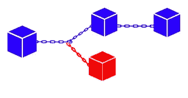

# 区块链的绿色未来

> 原文：<https://medium.com/coinmonks/a-greener-future-for-blockchains-7f99db60690a?source=collection_archive---------6----------------------->

## **对于加密而言，绿色政策带来更好的回报**

Ecological is Profitable

随着比特币、以太坊和其他货币被越来越多的人采用，它们正在迅速走向一场生存危机，如果加密货币要实现其主流采用的承诺，就需要解决这场危机。

这种生存危机是加密货币开采的生态影响。越来越多的能源被用于开采比特币，随着气候变化日益成为迫在眉睫的政治问题，找到生态可持续的解决方案不仅是道德的，也是必要的。

这种影响已经减缓了加密货币的采用。埃隆·马斯克在拒绝比特币支付时引用了“疯狂的”能源消耗。[ [src](https://twitter.com/elonmusk/status/1392602041025843203?s=20) 中国在打击采矿时也是如此。[ [src](https://www.aljazeera.com/economy/2021/5/26/bbchinas-latest-crackdown-on-crypto-caused-by-surge-in-coal-mini) ]即使是利好消息也受到这个问题的影响，比如世界银行拒绝帮助萨尔瓦多接受比特币作为法定货币，原因是“环境和透明度方面的缺陷”。[ [src](https://www.bbc.com/news/business-57507386) ]

幸运的是，并非所有的区块链都面临同样的问题。更好的前景存在于其他区块链网络中，如即将推出的以太坊 2、Algorand、Solana 和其他现代加密货币。这些区块链可以支持相同级别的交易，但能源成本却很低。

## 采矿是为了什么？为什么它要消耗这么多能量

Block Forking

为了理解采矿的目的，人们必须理解它解决什么问题。任何分布式系统都需要找到同步状态的方法，以便所有参与者都知道系统的“真实”状态。这就是所谓的共识。

对区块链来说，这意味着网络上的所有矿工都需要知道区块链上的最新区块。没有这种意识，事情可能会失去同步，系统可能会以从一个块分支出两个链而告终。这种不同步被称为分叉。

为了达成共识，分布式系统必须有一种机制来决定什么数据是“最新的”数据，并确认系统中的所有参与者都收到了最新的数据。

像加密货币这样的分散系统还有一个额外的问题，就是必须考虑到“坏人”的可能性。这些“坏演员”可能会意外或恶意地提供不良数据。当试图在“诚实的”参与者之间达成共识时，分散式系统需要考虑这种可能性。

工作证明(PoW)机制，如比特币挖矿，就是为了处理这个问题而存在的。它通过迫使矿工解决一个非常困难的数学问题来做到这一点。这给了所有好演员足够的时间来接收最新的块并达成共识。它还通过使挖掘“错误”链的计算非常昂贵来阻止不良行为者恶意分叉链。

参与者被激励去解决这个数学问题(也就是我的问题)，因为获胜的参与者可以添加下一个方块并获得与之相关的所有奖励。这导致了更多机器和更强大硬件的军备竞赛，以比其他人更快地解决这个数学问题，并催生了我们今天的加密货币能源危机。

# 工作证明:强行阻塞

比特币、以太坊、莱特币、Dogecoin、Monero 等比较老的加密货币。使用工作验证机制。这些加密货币中的大部分还没有在他们的网络上被大量采用，但比特币和以太坊已经被采用，我们可以衡量它们在大规模使用时对环境的影响。

Digiconomist 追踪了这两种加密货币的生态足迹，估计数字相当惊人。比特币采矿每年消耗 130.78 太瓦时，大约相当于阿根廷的能源消耗。每笔交易要消耗 1，585 千瓦时的能源！这相当于一个普通美国家庭两个月消耗的能量。

以太坊消耗较少的能量，但仍然是一个过高的数量。整个网络每年消耗 59.94 太瓦时，相当于葡萄牙消耗的能源。每笔交易相当于 119 千瓦时，相当于普通美国家庭 4 天的用电量。

难怪加密货币开采面临如此强烈的反对。从规模上看，这是一种完全不可持续的做法。

# 利害关系的证据:拯救的新卫士

A greener option

较新的硬币，如 Algorand、Polkadot 和 Cardano，以及即将推出的以太坊 2.0 升级版(eth2)使用了一种不同的共识机制，称为利益证明。利害关系的证明依赖于经济激励，而不是依靠一个困难的数学问题。每个网络实现证明的方式不同，但它们本质上都有一个系统，让拥有更多硬币的参与者获得更多投票权。

所有这些系统都比 PoW 好一个数量级，因为它们可以在普通计算机上运行相对简单的任务。200k Eth2 验证器节点可以轻松地在 40k 100W 机器上运行。相比 60TWh，新版本每年只会使用 0.035 TWh。Cardano 希望在成熟时有类似数量的验证器，并有类似的能量性能。

Polkadot 似乎提供了一个更节能的解决方案，但这样做的代价是失去了分散性。Polkadot 预计，成熟时大约有 1000 个验证器可以在标准 PC 上运行。这估计约为 0.001 TWh，因为涉及的机器很少。

# Algorand 如何脱颖而出

像 Eth2 一样，Algorand 也使用了桩的证据，并且非常节能。Algorand 从同类竞争对手中脱颖而出的一个原因是其纯粹的股权证明机制。纯粹的利害关系证明允许所有工作在非常低能耗的处理器上运行(例如，Raspberry Pi)。这些机器消耗大约 3 瓦特，因此运行相同数量的验证器一年只需要 0.007 TWh。这比 Eth2 或 Cardano 的共识机制好 5 倍。

此外，与 Polkadot 不同，Algorand 可以更加分散，因为投票分布在成千上万的验证器上，而不是一千个众所周知的验证器上。

简而言之，尽管比特币可能正在接近一场生态危机，但阿尔格兰德等最新加密货币正在为一个更加环保的可持续未来铺平道路。

免责声明:

我不是财务顾问，本文中表达的观点不是财务建议。加密货币和智能合约是复杂的工具，具有很高的亏损风险。你应该仔细考虑你是否了解这些工具是如何工作的，你是否能够承担失去你的钱的高风险。我鼓励你在做出任何投资决定之前进行自己的研究，避免投资任何你不完全了解其运作方式和所涉及风险的金融工具。

> 加入 Coinmonks [电报频道](https://t.me/coincodecap)和 [Youtube 频道](https://www.youtube.com/c/coinmonks/videos)了解加密交易和投资

## 也阅读

 [## 杠杆代币[多头代币]终极指南

### 杠杆化令牌是具有杠杆化风险敞口的 ERC20 令牌，不考虑保证金、要求、管理…

medium.com](/coinmonks/leveraged-token-3f5257808b22)  [## 最佳加密交易所| 2021 年十大加密货币交易所

### 编辑描述

blog.coincodecap.com](https://blog.coincodecap.com/crypto-exchange)  [## 2021 年最佳加密交换平台| CoinCodeCap

### 编辑描述

blog.coincodecap.com](https://blog.coincodecap.com/best-swap-platforms)  [## 2021 年最佳加密借贷平台| 6 大比特币借贷平台

### 获得比特币和其他加密货币的最佳贷款利率

medium.com](/coinmonks/top-5-crypto-lending-platforms-in-2020-that-you-need-to-know-a1b675cec3fa)  [## 2021 年 6 大最佳硬件钱包|顶级加密硬件钱包[更新]

### 最好的加密货币硬件钱包是绝对必要的。我们将在 NGRAVE、Ledger Nano X 和…

medium.com](/coinmonks/the-best-cryptocurrency-hardware-wallets-of-2020-e28b1c124069)  [## 2021 年最佳免费加密交易机器人

### 2021 年币安、比特币基地、库币和其他密码交易所的最佳密码交易机器人。四进制，位间隙…

medium.com](/coinmonks/crypto-trading-bot-c2ffce8acb2a)  [## 最佳 4 个加密交易信号电报通道

### 这是乏味的找到正确的加密交易信号提供商。因此，在本文中，我们将讨论最好的…

medium.com](/coinmonks/best-crypto-signals-telegram-5785cdbc4b2b)