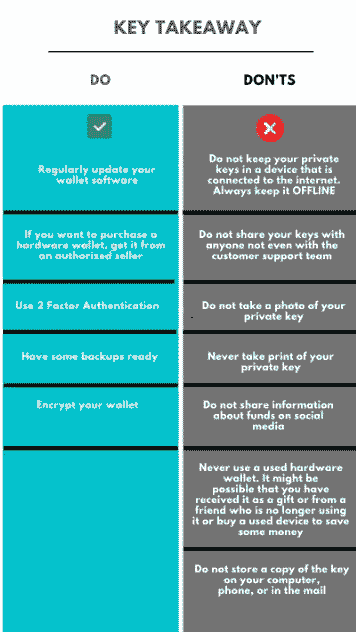

# 私钥指南

> 原文：<https://medium.com/coinmonks/a-guide-on-private-keys-254a95cf3037?source=collection_archive---------5----------------------->

用户需要钱包来保存他们的数字资产。这些钱包提供私人密钥，允许用户拥有给定地址的资金。

私钥是一个随机数，它将所有权授予给定地址的资金用户。当用户提交区块链交易时，它会生成一个签名。这个签名有助于确定用户的真实身份。

区块链技术的主要目标是提供一个没有任何中介的安全传输通道。因此，为了实现安全性，公共密码术或加密技术是强制性的。这将利用用户使用安全的网络发送/接收数据，而没有任何顾虑。

网络增加了另一层安全来验证和批准交易。

密码术支持两对密钥:

*   **公钥:**用于身份识别，对网络中所有用户可见。
*   **私钥:**用于认证和加密。用户需要保证它的安全。

在本文中，我们将重点关注以下几点:

*为什么私钥对用户保护其资产非常重要。*

*有哪些方法可以帮助您安全保管您的私钥？*

一份该做和不该做的清单。

## **什么是私钥？**

*   私钥是一个长的、唯一的、随机生成的数字。
*   向给定地址的资金用户提供所有权。
*   用于生成用户提交的区块链事务签名。签名有助于确定进行交易的用户的身份。它防止交易一旦广播就被任何人改变。

***重要:*** *私钥是加密的，即不公开可见。密钥在后台授权交易，并且交易处理中的任何参与用户都不能看到私钥。*

## **为什么保管好你的私人钥匙很重要**

我们总是听到关于保管好你的私人钥匙的警告。为什么这么说？

*   私钥允许用户访问钱包。
*   它有助于管理钱包中的资金。
*   没有第三方可以帮你找回你的私钥。

## **私钥来源**

为了保存您的数字资产，您需要钱包。你将从所有保存你的资产的钱包(除了集中交换)中得到私人钥匙。目前，不同类型的加密钱包是可用的。

*   软件钱包:这些允许访问多个区块链。这些钱包不提供交换设施(除了互换)。

热门软件钱包:[原子钱包](https://atomicwallet.io/)，[信任钱包](https://trustwallet.com/)

*   **硬件钱包:**这些是用来离线存放你的资金的物理设备。目前，硬件钱包被认为是最安全的选择。

热门硬件钱包:[账本](https://www.ledger.com/)， [Trezor](https://trezor.io/) ， [KeepKey](https://shapeshift.com/keepkey)

*   Web3 钱包:Web3 钱包是许多浏览器的延伸。它允许你管理你的以太坊钱包发送/接收资金。

流行的 Web3 钱包: [Metamask](https://metamask.io/)

*   **纸质钱包:**钥匙以二维码形式印刷，交易时可扫描。

热门服务提供商平台: [Bitaddress](https://www.bitaddress.org/)

*   交换钱包:一旦连接到互联网，用户可以从任何浏览器访问他们的资金。

热门兑换钱包:[币安](https://www.binance.com/)， [CoinBase](https://www.coinbase.com/) 。

在 exchange 钱包中，用户无法控制自己的私钥。这些平台持有并控制用户的密钥。

**存储私钥**

1.  [**CRYPTOTAG**](https://cryptotag.io/)**–**CRYPTOTAG 如今越来越引人注目。这是一个钛板，用户在其中雕刻硬件钱包的种子短语。

钛板是坚不可摧的，因此有助于保持种子阶段的安全。

缺点:

*   这是不可重复使用的，也就是说，如果您在雕刻时出错或钱包地址有任何变化，您必须购买新的模板。
*   这很容易识别。

**2。记在纸上:**你可以把你的钥匙写在一张纸上。保护文件安全是你的责任。

缺点:

*   纸张可能会损坏或丢失。
*   其他人可以访问它并看到您的私钥。
*   为了更长时间地保留它，你可以把它层压起来，放在你的银行储物柜里。但是，这种方法不能永远保护纸张。此外，放在银行的储物柜里是有风险的。

## **该做和不该做的事情**

## **12 字备份短语和私钥一样吗？**

钱包设置会生成一个 12 个字的备份短语，称为种子短语。这与私钥不同，因为它将私钥封装成人类可以理解的格式。这意味着它将一串字母数字转换成一串 12 个随机字典单词。

备份短语恢复您的资产。因此，如果您丢失了备份短语，您也将无法访问您的私钥和数字资产。

## **结论**

私人钥匙让你可以使用钱包和资金。无论你使用什么类型的钱包，如果你持有资产，你必须负责保管好钥匙。否则，你将无法获得你所有的资金。私钥不由任何第三方维护，如果丢失，您可以打电话寻求帮助。保护它的安全是用户的首要责任。

**阅读更多:** [保险丝网络概述(FUSE)](/coinmonks/an-overview-of-the-fuse-network-fuse-679c1ff3422d)

***注:*** *本帖首发* [*此处*](https://www.altcoinbuzz.io/reviews/crypto-education/a-guide-on-private-keys/) *上*[***altcoinbuzz . io***](http://www.altcoinbuzz.io/)*。*

**通过我的推荐加入**

[Crypto.com](https://binance.com/en/register?ref=E8PCD3AF)——[币安](https://platinum.crypto.com/r/sut3pd9bzn)

跟我来吧

**👉** [推特](https://twitter.com/rumadas123)

**👉** [领英](https://www.linkedin.com/in/ruma-das-a1439320/)

> 包括附属链接