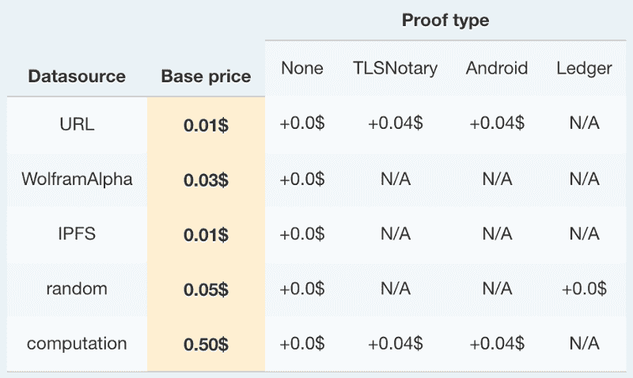

# 在 DAPP 中执行 web 查询的指南(第 1 部分)

> 原文：<https://medium.com/coinmonks/a-guide-to-perform-web-queries-in-dapp-35683a386044?source=collection_archive---------5----------------------->

## 智能合约本身不提供 [web 查询功能](https://ethereum.stackexchange.com/questions/301/why-cant-contracts-make-api-calls)。

***“以太坊区块链被设计成完全决定论的。****这意味着，如果我把整个网络的历史，然后在我的电脑上重放，我应该总是以正确的状态结束。*

*由于* ***互联网是不确定的，会随着时间而变化，那么每次我重放网络上的所有事务时，都会收到不同的答案。***

*确定性很重要，这样节点才能达成共识。如果有一个合同要求在这个问题上的投票数，这个值可能会随时间或甚至随地点的不同而不同，导致将来的节点或无法访问这个站点的节点对网络的状态得出不同的结论，从而打破共识。*

***通过要求每一个数据输入都是通过外部事务发起的，我们可以确定区块链本身包含了验证自身所需的所有信息*** *。* ***通过使用单个契约级 Oracle(***[***https://oraclize . it***](https://oraclize.it)***)而不是网络或共识级特征，我们确保只有一个规范结果。***

相反，我们可以使用 oraclize。

它可以发出 HTTP GET 和 HTTP POST 请求，检索 IPFS 数据，并利用 aws 实例在区块链上进行计算

大多数信息都包含在文档中，但我将在这里做一个总结。

# 它是如何工作的？

[https://docs.oraclize.it/#background](https://docs.oraclize.it/#background)
一种解决方案是**接受来自不止一个不可信或部分可信方**和**的数据输入，然后仅在他们中的许多人已经提供了相同的答案或在某些约束条件下的答案**之后才执行数据相关动作。这种类型的系统可以被认为是一个分散的 oracle 系统。不幸的是，这种方法有严重的局限性:

*   它**需要一个关于数据格式的预定义标准**
*   它本质上是低效的:所有参与方都需要付费，而且对于每一个请求，在得到足够多的答案之前都需要时间。

Oraclize 开发的解决方案是**证明从原始数据源获取的数据是真实的，未经篡改的**。这是通过将返回的数据与一个称为真实性证明的文档一起提供来实现的。真实性证明可以建立在不同的技术之上，例如可审计的虚拟机和可信的执行环境。

本文档的[真实性证明](https://docs.oraclize.it/#ethereum-quick-start-authenticity-proofs)部分提供了对 Oraclize 真实性证明的更详细概述。

该解决方案很好地解决了 Oracle 问题:

*   **区块链应用的开发者和这类应用的用户不必信任 Oraclize 安全模型得到维护。**
*   数据提供商不必为了与区块链协议兼容而修改他们的服务。智能合约可以直接从网站或 API 访问数据。

Oraclize 引擎可以很容易地与不同区块链协议的私有和公共实例集成。

在构建服务时，Oraclize 团队已经意识到真实性证明的概念比最初预想的具有更广泛的适用性。例如，Oraclize 随机数据源甚至可以被传统的赌博应用程序使用，以确保用户操作的持续公平性

# 一般概念

# 数据源类型

[http://docs.oraclize.it/#general-concepts-data-source-types](http://docs.oraclize.it/#general-concepts-data-source-types)

*   **URL** :允许访问任何网页或 HTTP API 端点
*   **WolframAlpha** :支持对 WolframAlpha 计算引擎的本地访问
*   **IPFS** :提供对存储在 IPFS 文件中的任何内容的访问
*   **random** :提供来自运行在 Ledger Nano S 上的安全应用程序的未经篡改的随机字节。
*   **计算**:提供任意计算的结果

此外，还有一些元数据源，如:

*   **嵌套**:支持不同类型的数据源或使用同一数据源的多个请求的组合，返回唯一的结果
*   **身份**:返回查询
*   **decrypt** :它解密一个加密成 Oraclize 私钥的字符串

## 统一资源定位器

URL 数据源类型允许访问 Internet 上的任何 API 或网页。它**支持 HTTP GET 和 HTTP POST 请求**。

**如果查询中只指定了一个参数，服务将默认执行 HTTP GET 请求**。

**如果指定了第二个参数，那么服务将执行 HTTP POST 请求，将第二个参数作为数据**发布。

注意，如果第二个参数是有效的 JSON，那么它将被这样发布。

URL 数据源类型支持 TLSNotary 证明和 Android 证明。

通过利用计算数据源类型，可以构建更高级的 HTTP 功能，如基本身份验证或 OAuth。

## IPFS

IPFS 数据源类型可用于检索 IPFS 网络上的文件内容。

**该数据源期望查询中的 IPFS 多重散列作为唯一参数。**

例如，文件 qmt 78 zsubmus 4 z 925 wzfrqq 1 qhaj 56 dqatfymuf 7 f 8 ff 5 o 将返回“hello world\n”。

**如果 Oraclize 未能在 *20* 秒内获取 IPFS 内容，请求将失败。**

## 计算

**计算数据源通过利用沙盒亚马逊 Web 服务虚拟机，支持应用程序或脚本的可审计执行。**

应用程序必须在标准输出上打印计算结果，作为退出前的最后一行。结果可以是**最长 2500 个字符**。

执行上下文必须由一个 [Dockerfile](https://docs.docker.com/engine/reference/builder/) 来描述，其中构建和运行它应该直接启动主应用程序。

**目前 Oraclize 只提供一种类型的可审计实例:t2.micro 实例**。

Dockerfile 初始化和应用程序执行应尽快终止，因为**执行时间上限为 5 分钟**。(用于计算 ds 的当前 Docker 版本是 1.12.1)

开发人员可以通过创建一个归档文件并将其上传到 IPFS，将应用程序二进制文件或脚本、其依赖关系和 docker 文件发送到 Oraclize。

该查询期望将该档案的 IPFS 多重散列作为第一个参数，而下面的参数将作为环境变量传递给执行环境，使应用程序可以访问它们。

# 解析助手

 [## 组织文档

### 在区块链空间中，oracle 是提供数据的一方。需要这样的数字是因为…

docs.oraclize.it](http://docs.oraclize.it/#general-concepts-query) 

Oraclize 提供了 XML、JSON、XHTML 和一个二进制解析器助手。示例:

*   **JSON 解析**:从北海巨妖 API 中提取 last-price 字段，查询 JSON(https://API . kraken . com/0/public/Ticker？pair = ETHUSD). result . xethzusd . c . 0
*   **XML 解析器:**只需从您选择的 API 调用中传递 XML 字符串
*   **HTML 解析器** : helper 对于 HTML 抓取很有用。所需的 [XPATH](https://en.wikipedia.org/wiki/XPath) 可以指定为 XPATH 的参数(..)如例所示:html(https://Twitter . com/oraclizeit/status/671316655893561344)。XPath(//*[包含(@class，' tweet-text '))]/text())。
*   **二进制助手**:使用 slice(offset，length)操作符来提取二进制中间结果的一部分会很有用。第一个参数是预期的偏移量，而第二个参数是返回切片的长度。比如二进制(https://www . sk . ee/crls/este id/este id 2015 . CRL)。slice(0，300)返回链接证书吊销列表中第一个证书的原始字节。

# 连接到区块链

公共链

*   Oraclize 与最广泛使用的公共区块链协议进行了本机集成，如**以太坊**、**比特币**、**根茎网**主网和测试网。

基于以太坊的私有链

*   基于以太坊的私有连锁店目前可以通过使用**以太坊桥**与 Oraclize 集成。包括 Monax 等以太坊的叉子。关于如何使用以太坊桥的更多信息将在[开发工具](http://docs.oraclize.it/#development-tools)部分提供，或者参考描述如何与 testrpc 一起使用的 [StackExchange 答案](https://ethereum.stackexchange.com/a/11389/5819)。

# 例子

使用 oraclize 运行 ipfs 的 dockerfile:

[https://docs.oraclize.it/#data-sources-computation](https://docs.oraclize.it/#data-sources-computation)

查询 kraken ticker:

[https://github.com/oraclize/ethereum-](https://github.com/oraclize/ethereum-examples/blob/master/solidity/KrakenPriceTicker.sol)

[examples/blob/master/solidity/krakenpriceticker . sol](https://github.com/oraclize/ethereum-examples/blob/master/solidity/KrakenPriceTicker.sol)

# [加密查询](http://docs.oraclize.it/#ethereum-advanced-topics-encrypted-queries)

某些情况下，如公共区块链上的智能合同，可能需要一定程度的隐私来保护数据免受公众审查。

开发人员可以通过用 Oraclize 公钥加密查询的一部分(或全部)来进行加密的 Oraclize 查询。

希望在公共网络中部署区块链应用程序的开发人员可能会对加密查询功能感兴趣。

例如，如果一个应用程序利用来自一个经过身份验证的 API 的数据，那么将 API 密钥透露给监控公共链的任何人都是危险的。

Oraclize 因此提供了**加密包含在对 Oraclize 的公钥的查询中的参数的可能性:**044992 e 9473 b 7d 90 ca 54d 2886 c 7 addd 14 a 61109 af 202 f1 c 95 e 218 b 0c 99 EB 060 c 7134 c 4 AE 46345d 0383 AC 996185762 f 04997 D6 FD 6 c 393 c 86 e 4325 c 469741 e 66 e 6。

**只有 Oraclize 能够使用配对的私有密钥**解密请求。

# 费用

最新[价格](http://docs.oraclize.it/#pricing):

为了简化开发，Oraclize **对使用默认 gas 参数**完成的第一次数据请求不收取合同费用。**连续的请求将要求合同支付 Oraclize 费用和支付回调交易所需的其他费用**。[解析助手](http://docs.oraclize.it/#general-concepts-query)

两者都自动从合同余额中扣除。如果合同在他的余额中没有足够的资金，请求将失败，Oraclize 不会返回任何数据。

[在 DAPP 中执行 web 查询的指南(第 2 部分)](/@thebestchef/a-guide-to-perform-web-queries-in-dapp-part-2-98a519399d57)
[在 DAPP 中执行 web 查询的指南(第 3 部分)](/@thebestchef/a-guide-to-perform-web-queries-in-dapp-part-3-de27ceb5343a)