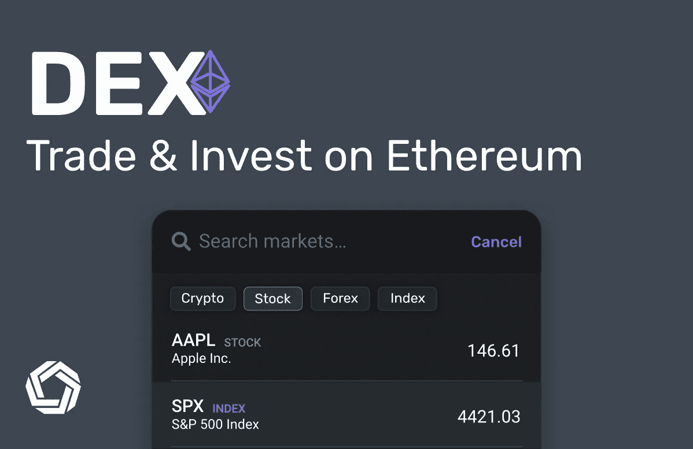
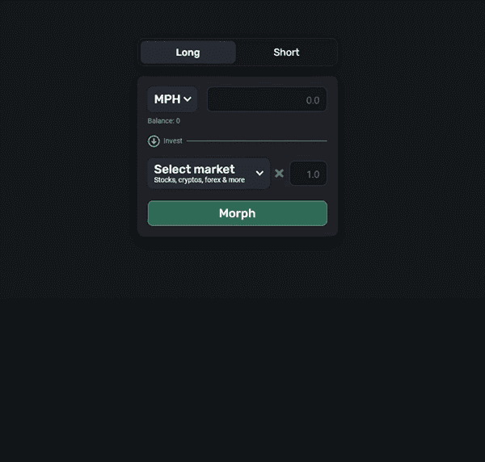
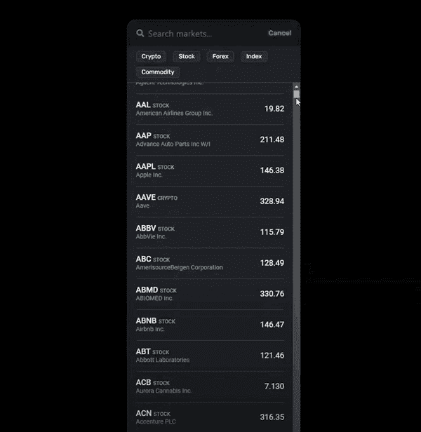
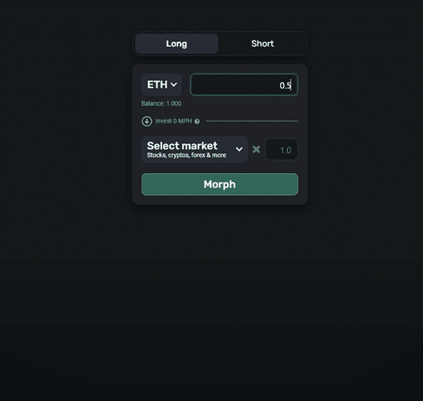
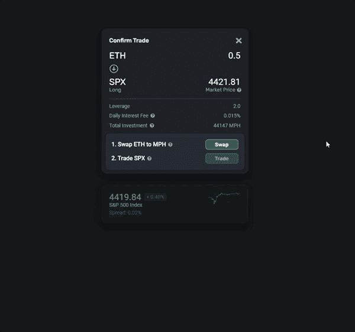
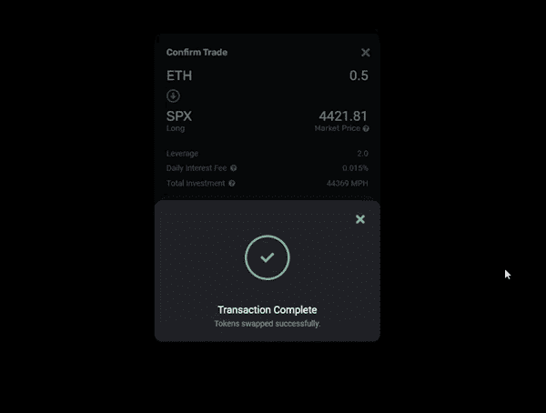
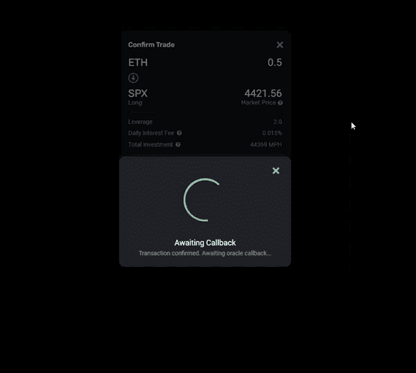
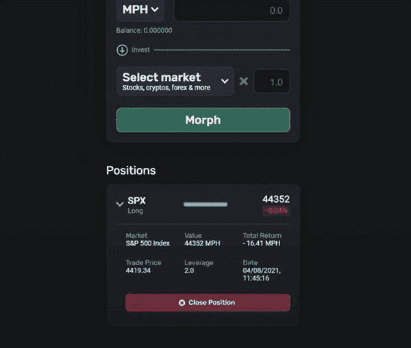

# 使用密码交易股票的指南

> 原文：<https://medium.com/coinmonks/a-guide-to-trading-stocks-using-crypto-1fdd245a53ef?source=collection_archive---------8----------------------->

与传统资产相比，在 DeFi 中可以获得的回报令人兴奋，但如果你可以将两者结合起来以实现回报最大化，会怎么样呢？潜力是巨大的。苹果股票在过去 12 个月上涨了 29%，特斯拉上涨了 76%。由于合成资产协议提供的市场非常少，并且难以实现更复杂的交易功能，如做空和使用杠杆， [Morpher DEX](https://www.morpher.com/dex) 对于寻求最大化收益的 DeFi 社区来说是一个很好的选择。

这个策略将教你如何使用 Morpher DEX 在以太坊区块链交易超过 700 种资产，包括股票、商品、货币和其他加密。

*   目标:用密码交易传统资产
*   技能:基础/中级
*   努力:10-15 分钟
*   投资回报率:每年超过 20%，具体取决于性能

# **Morpher DEX 背景**

Morpher DEX 为用户提供了不同资产的风险敞口，而无需持有或拥有基础资产。例如，在 Morpher DEX 上交易苹果股票的人可以从该股票的价格变化中获利，而不必实际拥有该股票。用户可以利用高达 10 倍的杠杆做多或做空，并且只需支付以太币气费。与其他合成资产协议不同，Morpher 不需要抵押品。以下是它的一些主要特性:

*   完美的流动性
*   无限的市场
*   没有对手

Morpher DEX 由 [Morpher Labs](https://www.morpher.com) 创建，该公司寻求交易和投资民主化，并得到美国亿万富翁蒂姆·德雷珀[的支持。其协议始于 2018 年，在全球范围内拥有超过 4 万名月活跃用户，每天执行数千笔交易。你可以在白皮书](https://en.wikipedia.org/wiki/Tim_Draper)[中了解更多关于 Morpher 协议的信息。](https://www.morpher.com/docs/morpher_whitepaper.pdf)

# Morpher 如何工作

Morpher 由一套建立在以太坊上的智能合约提供动力。这些智能合约充当所有交易的对手方，而 MPH 令牌充当结算货币。首先，用户选择一个他们希望投入代币的市场。如果他们的头寸获利，智能合约会铸造一定比例的代币作为回报。如果用户意识到损失，合同会销毁一定比例的赌注代币。因此，如果你购买 100 英里/小时的代币并投资苹果股票，如果苹果的价格上涨 10%，你将获得 110 托币的回报。如果苹果股票价格下跌 10%，你将获得 90 英里每小时的回报。

Morpher 协议的独特之处在于，当你交易时，你并不是真的在向另一个人买或卖。你所做的是与智能合约进行交互。这就像直接与中央银行交易，中央银行根据你交易的市场表现增加或减少货币供应。有超过 700 种不同的资产可供用户选择，包括股票、商品、货币和其他密码。

# **永远固定交易和投资**

有两个因素阻碍了交易:对交易对手的需求和拥有标的资产的需求。这些特征导致流动性问题，使做空市场过于复杂，并导致滑点(资产价格与预期不同)。集中式和分散式交换都受到这些限制的困扰，合成资产协议也是如此。

通过给用户一份智能合约作为交易对手，Morpher 永远固定了交易和投资。Morpher DEX 拥有完美的流动性，所以每一笔交易都会立即成交，无论其规模或方向如何。不需要等待交易对手，滑点为零。你以当前的市场价格获得任何资产，不管你想买或卖多少。这也使得利用杠杆和做空变得极其容易。这些关键的交易特征只是 Morpher 智能合约中的参数。

智能合同也给了 Morpher 无限市场的可能性，因为该协议只需要一个可靠的数据馈送来创建一个市场。这就是 Morpher 已经提供了 700 多个市场并不断增加的原因(这比其他合成资产协议提供的市场多 10 到 20 倍)。Morpher 在技术上能够支持的市场种类繁多，从杂草现货价格到纽约房地产，甚至是公司基本面。该平台尚未开始探索支持传统金融中无法存在的市场的能力，但未来将会探索。

# 如何用 Morpher DEX 开始交易

## **一步一步引导**

让我们来看看你需要采取的步骤，这样你就可以在 Morpher DEX 上交易。

首先去 morpher.com/dex，在那里你可以找到与以太坊主网上的 Morpher 协议交互的接口。同意隐私政策和使用条款，然后连接您的钱包。

现在你可以开始交易了。从 700 多个可以交易的市场中选择一个。假设你想投资标准普尔 500，它是美国 500 家最大的上市公司的市值指数。你所要做的就是在列表中选择它，如下图所示。

然后选择你想下注的密码量。假设你想用 2 的杠杆将 0.5 的 ETH 换成 S&P500，如下图所示。然后，你需要做的就是点击“变形”按钮。

这将打开“确认交易”界面，您需要采取两个步骤来完成交易。第一种是把你的 ETH 换成 MPH 令牌。点击“交换”将调出您的钱包，并要求您确认交易。

然后点击“交易”并在您的钱包中确认交易，您将能够在 [Etherscan](https://etherscan.io/) 上找到交易的链接。以太扫描作为以太坊区块链上所有交易的公共目录。

一旦订单完成，oracle(获取资产价格的软件)的回调结束，持仓将出现在屏幕上。在那里，您将能够看到该职位的所有详细信息，还可以关闭它。

要平仓，请单击“平仓”，然后单击“立即解除”，并在您的钱包中确认交易。

就是这样！现在交易已经完成，您将从交易中获得 MPH 代币。如果你想把它们换回 ETH 或其他任何货币，你所要做的就是去 Uniswap 这样的交易所。

# **Morpher DEX 也提供赌注**

赌注是一种在没有投入市场的 MPH 代币上赚取保证回报的方式。这就像一个虚拟储蓄账户，用密码支付。在 Morpher DEX 上，所有押下的 MPH 每天都会多获得 0.015%的代币。收益是非复利的，因此年收益为 5.48%。赌注奖励每天都在创造，这是 Morpher 通货膨胀象征经济学的一部分。

当您下注您的 MPH 代币时，您必须在下注后等待 30 天才能撤回。每次您下注时，30 天锁定期将再次应用于您的资金。奖励不会增加你的初始赌注(非复利)。当你拆股和赎回时，收益以每小时多少钱支付。

> 加入 [Coinmonks 电报频道](https://t.me/coincodecap)，了解加密交易和投资

## 另外，阅读

*   [什么是融资融券交易](https://blog.coincodecap.com/margin-trading) | [成本平均法](https://blog.coincodecap.com/dca)
*   [BigONE 交易所评论](/coinmonks/bigone-exchange-review-64705d85a1d4) | [电网交易机器人](https://blog.coincodecap.com/grid-trading)
*   [3 商业评论](/coinmonks/3commas-review-an-excellent-crypto-trading-bot-2020-1313a58bec92) | [Pionex 评论](/coinmonks/pionex-review-exchange-with-crypto-trading-bot-1e459d0191ea) | [Coinrule 评论](/coinmonks/coinrule-review-2021-a-beginner-friendly-crypto-trading-bot-daf0504848ba)
*   [莱杰 vs Ngrave](/coinmonks/ledger-vs-ngrave-zero-7e40f0c1d694) | [莱杰 nano s vs x](/coinmonks/ledger-nano-s-vs-x-battery-hardware-price-storage-59a6663fe3b0) | [币安评论](/coinmonks/binance-review-ee10d3bf3b6e)
*   [Bybit Exchange 审查](/coinmonks/bybit-exchange-review-dbd570019b71) | [Bityard 审查](https://blog.coincodecap.com/bityard-reivew) | [CoinSpot 审查](https://blog.coincodecap.com/coinspot-review)
*   [3 commas vs crypto hopper](/coinmonks/3commas-vs-pionex-vs-cryptohopper-best-crypto-bot-6a98d2baa203)|[赚取加密利息](/coinmonks/earn-crypto-interest-b10b810fdda3)
*   最好的比特币[硬件钱包](https://blog.coincodecap.com/best-hardware-wallet-bitcoin) | [BitBox02 回顾](/coinmonks/bitbox02-review-your-swiss-bitcoin-hardware-wallet-c36c88fff29)
*   [BlockFi vs 摄氏](/coinmonks/blockfi-vs-celsius-vs-hodlnaut-8a1cc8c26630) | [Hodlnaut 点评](/coinmonks/hodlnaut-review-best-way-to-hodl-is-to-earn-interest-on-your-bitcoin-6658a8c19edf) | [KuCoin 点评](https://blog.coincodecap.com/kucoin-review)
*   [Bitsgap 审查](/coinmonks/bitsgap-review-a-crypto-trading-bot-that-makes-easy-money-a5d88a336df2) | [Quadency 审查](/coinmonks/quadency-review-a-crypto-trading-automation-platform-3068eaa374e1) | [Bitbns 审查](/coinmonks/bitbns-review-38256a07e161)
*   [密码本交易平台](/coinmonks/top-10-crypto-copy-trading-platforms-for-beginners-d0c37c7d698c) | [Coinmama 审核](/coinmonks/coinmama-review-ace5641bde6e)
*   [印度的加密交易所](/coinmonks/bitcoin-exchange-in-india-7f1fe79715c9) | [比特币储蓄账户](/coinmonks/bitcoin-savings-account-e65b13f92451)
*   [OKEx vs KuCoin](https://blog.coincodecap.com/okex-kucoin) | [摄氏替代品](https://blog.coincodecap.com/celsius-alternatives) | [如何购买 VeChain](https://blog.coincodecap.com/buy-vechain)
*   [币安期货交易](https://blog.coincodecap.com/binance-futures-trading)|[3 commas vs Mudrex vs eToro](https://blog.coincodecap.com/mudrex-3commas-etoro)
*   [如何购买 Monero](https://blog.coincodecap.com/buy-monero) | [IDEX 评论](https://blog.coincodecap.com/idex-review) | [BitKan 交易机器人](https://blog.coincodecap.com/bitkan-trading-bot)
*   [CoinDCX 评论](/coinmonks/coindcx-review-8444db3621a2) | [加密保证金交易交易所](https://blog.coincodecap.com/crypto-margin-trading-exchanges)
*   [Bookmap 评论](https://blog.coincodecap.com/bookmap-review-2021-best-trading-software) | [美国 5 大最佳加密交易所](https://blog.coincodecap.com/crypto-exchange-usa)
*   [如何在 FTX 交易所交易期货](https://blog.coincodecap.com/ftx-futures-trading) | [OKEx vs 币安](https://blog.coincodecap.com/okex-vs-binance)
*   [CoinLoan 审查](https://blog.coincodecap.com/coinloan-review) | [YouHodler 审查](/coinmonks/youhodler-4-easy-ways-to-make-money-98969b9689f2) | [BlockFi 审查](https://blog.coincodecap.com/blockfi-review)
*   [CoinFLEX 评论](https://blog.coincodecap.com/coinflex-review) | [AEX 交易所评论](https://blog.coincodecap.com/aex-exchange-review) | [UPbit 评论](https://blog.coincodecap.com/upbit-review)
*   [AscendEx 保证金交易](https://blog.coincodecap.com/ascendex-margin-trading) | [Bitfinex 赌注](https://blog.coincodecap.com/bitfinex-staking) | [bitFlyer 审核](https://blog.coincodecap.com/bitflyer-review)
*   [AscendEx Staking](https://blog.coincodecap.com/ascendex-staking)|[Bot Ocean Review](https://blog.coincodecap.com/bot-ocean-review)|[最佳比特币钱包](https://blog.coincodecap.com/bitcoin-wallets-india)
*   [Bitget 回顾](https://blog.coincodecap.com/bitget-review)|[Gemini vs block fi](https://blog.coincodecap.com/gemini-vs-blockfi)|[OKEx 期货交易](https://blog.coincodecap.com/okex-futures-trading)
*   [霍比审核](https://blog.coincodecap.com/huobi-review) | [OKEx 保证金交易](https://blog.coincodecap.com/okex-margin-trading) | [期货交易](https://blog.coincodecap.com/futures-trading)
*   [麻雀交换评论](https://blog.coincodecap.com/sparrow-exchange-review) | [纳什交换评论](https://blog.coincodecap.com/nash-exchange-review)
*   最好的[加密税务软件](/coinmonks/best-crypto-tax-tool-for-my-money-72d4b430816b) | [硬币追踪评论](/coinmonks/cointracking-review-a-reliable-cryptocurrency-tax-software-5114e3eb5737)
*   [Stackedinvest 评论](https://blog.coincodecap.com/stackedinvest-review) | [北海巨妖评论](/coinmonks/kraken-review-6165fc1056ac) | [期货交易机器人](/coinmonks/futures-trading-bots-5a282ccee3f5)
*   最佳[加密借贷平台](/coinmonks/top-5-crypto-lending-platforms-in-2020-that-you-need-to-know-a1b675cec3fa) | [杠杆令牌](/coinmonks/leveraged-token-3f5257808b22) | [Stormgain 评论](https://blog.coincodecap.com/stormgain-review)
*   最佳[加密制图工具](/coinmonks/what-are-the-best-charting-platforms-for-cryptocurrency-trading-85aade584d80) | [最佳加密交易所](/coinmonks/crypto-exchange-dd2f9d6f3769) | [专家评论](https://blog.coincodecap.com/probit-review)
*   [比特币基地僵尸程序](/coinmonks/coinbase-bots-ac6359e897f3) | [AscendEX 审查](/coinmonks/ascendex-review-53e829cf75fa) | [OKEx 交易僵尸程序](/coinmonks/okex-trading-bots-234920f61e60) | [Bexplus 审查](https://blog.coincodecap.com/bexplus-review)
*   [如何在印度购买比特币？](/coinmonks/buy-bitcoin-in-india-feb50ddfef94) | [瓦济克斯评论](/coinmonks/wazirx-review-5c811b074f5b) | [俱吠罗评论](/coinmonks/coinswitch-kuber-review-1a8dc5c7a739)
*   [CryptoHopper 替代品](/coinmonks/cryptohopper-alternatives-d67287b16d27) | [HitBTC 审核](/coinmonks/hitbtc-review-c5143c5d53c2) | [Kucoin 交易机器人](/coinmonks/kucoin-trading-bot-automate-your-trades-8cf0ca2138e0)
*   [WazirX vs coin dcx vs bit bns](/coinmonks/wazirx-vs-coindcx-vs-bitbns-149f4f19a2f1)|[block fi vs coin loan vs Nexo](/coinmonks/blockfi-vs-coinloan-vs-nexo-cb624635230d)
*   [本地比特币评论](/coinmonks/localbitcoins-review-6cc001c6ed56) | [加密货币储蓄账户](https://blog.coincodecap.com/cryptocurrency-savings-accounts)
*   [比特币基地评论](/coinmonks/coinbase-review-6ef4e0f56064) | [德里比特评论](/coinmonks/deribit-review-options-fees-apis-and-testnet-2ca16c4bbdb2) | [FTX 评论](/coinmonks/ftx-crypto-exchange-review-53664ac1198f) | [StealthEX 评论](/coinmonks/stealthex-review-396c67309988)
*   [n rave ZERO Review](/coinmonks/ngrave-zero-review-c465cf8307fc)|[phe MEX Review](/coinmonks/phemex-review-4cfba0b49e28)|[PrimeXBT Review](/coinmonks/primexbt-review-88e0815be858)
*   最佳[区块链分析](https://bitquery.io/blog/best-blockchain-analysis-tools-and-software)工具| [赚比特币](/coinmonks/earn-bitcoin-6e8bd3c592d9) | [Swapzone 评论](/coinmonks/swapzone-review-crypto-exchange-data-aggregator-e0ad78e55ed7)
*   [加密套利](/coinmonks/crypto-arbitrage-guide-how-to-make-money-as-a-beginner-62bfe5c868f6)指南| [如何做空比特币](/coinmonks/how-to-short-bitcoin-568a2d0b4ae5)
*   [币安交易机器人](/coinmonks/binance-trading-bots-d0d57bb62c4c) | [OKEx 评论](/coinmonks/okex-review-6b369304110f) | [阿塔尼评论](https://blog.coincodecap.com/atani-review)
*   [最佳加密交易信号电报](/coinmonks/best-crypto-signals-telegram-5785cdbc4b2b) | [MoonXBT 评论](/coinmonks/moonxbt-review-6e4ab26d037)
*   [Godex.io 审核](/coinmonks/godex-io-review-7366086519fb) | [邀请审核](/coinmonks/invity-review-70f3030c0502) | [BitForex 审核](https://blog.coincodecap.com/bitforex-review)