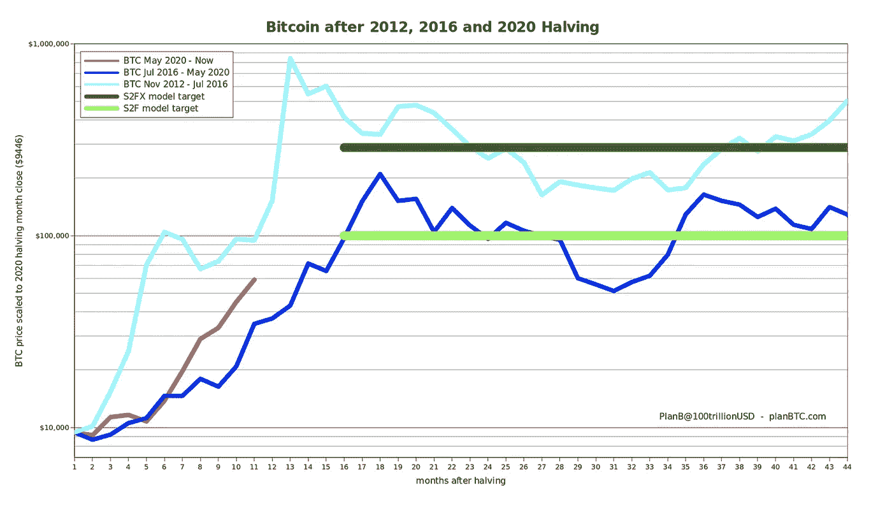
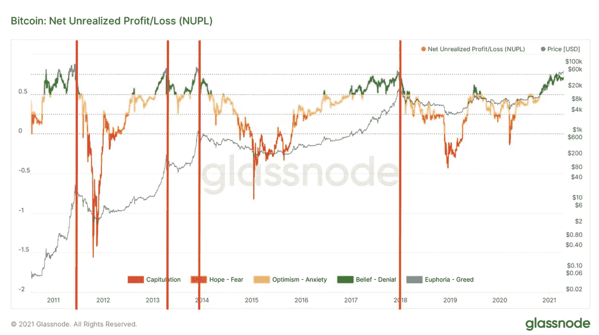
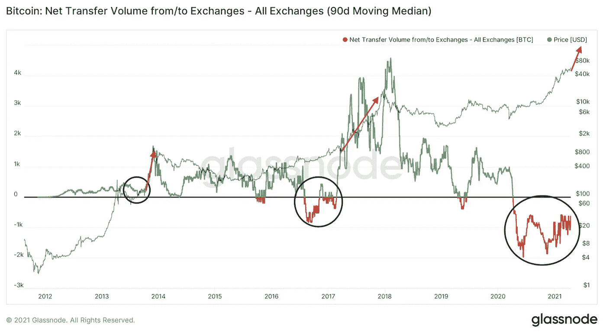
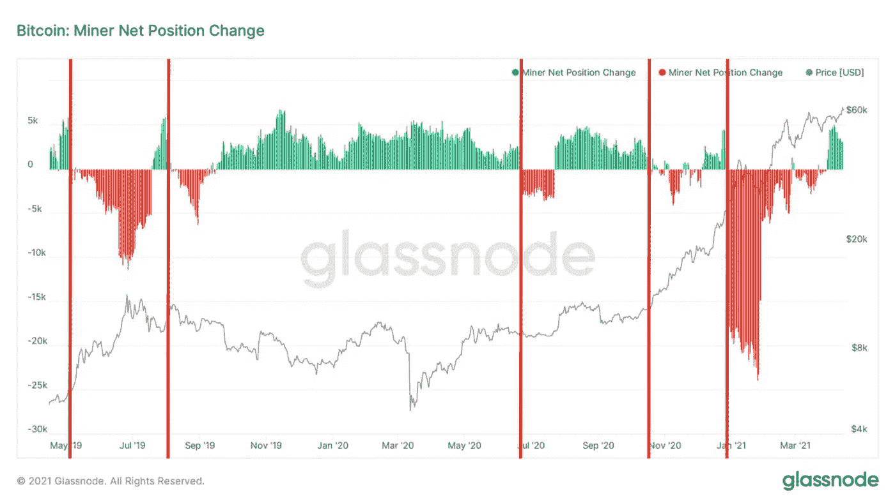
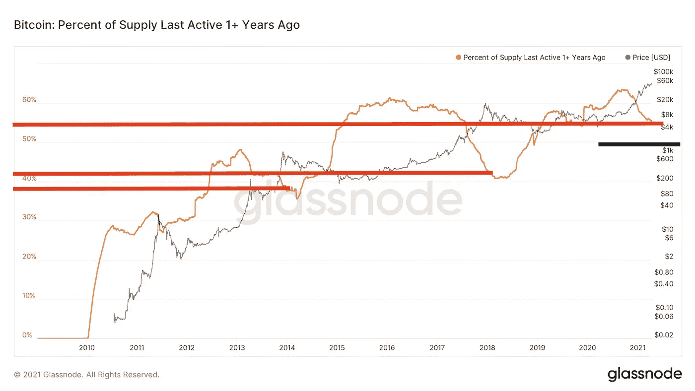

# 更高的轨迹——宏观链上分析

> 原文：<https://medium.com/coinmonks/a-higher-trajectory-ahead-for-bitcoin-efc1edace02d?source=collection_archive---------1----------------------->

我要迟到了。

这种事情发生的比我愿意承认的还要频繁。

我倾向于责怪我妈妈说我晚出生了五分钟。而事实上，我往往会被当时正在做的事情所吸引。

在这特殊的一天，我在读完关于印第安部落的一章后写下了一些笔记。这是一个看似随意的话题……但实际上我在研究分散化的结构。

在意识到时间后，我匆忙出门，忘记了下一个交易日的卖出指令。

第二天，当我继续我的晨间例行公事时，一条新闻专线穿过彭博，提醒了我这个被遗忘的任务。因此，那天晚些时候，我没有登录我的经纪账户并设置这些订单，而是决定花五分钟时间回顾一下公司的一些情况。

我找到一根绳子，拉了一下。

接下来几个小时的研究揭示了一个 180 度大转弯的决定。加倍我的初始投资。不卖。

我的想法很简单。市场正朝着对我有利的方向发展。基本面没有让我觉得它被高估了。图表显示没有立即放缓的迹象。

我为什么要偷我的赢家？

结果是，通过从容不迫，不急于卖出我的盈利头寸，我赚的钱是那天早上卖出的两倍。

我的教训是——紧紧抓住赢家。

当谈到今天的比特币和加密时，这是一个很好地服务于我的教训。这是我一直依赖这些宏观链上图的主要原因之一。他们帮我坐稳，让大趋势顺其自然，让赚钱的交易比年轻时的我运行得更久。

这就是为什么我把今天的问题献给这一点。宏观地看一下链上数据在说什么，以便我们更好地理解整体趋势在说什么，以及我们何时可以开始削减一些头寸。

让我们开始吧。

# 它在中间的某个地方

首先，让我们从 PlanB 中调出一个图表。

这是一张对比过去三次价格减半事件后的价格走势的图表。立即跳出来的是，2012 年的减半是如何比 2016 年的减半周期早一个月达到峰值的(浅蓝色对深蓝色线)。

当前的减半周期(红线)在两者之间。

理解这一点很重要，因为 2013 年的井喷要比 2017 年快得多。正如你马上会看到的，理解一个顶部是如何产生的有助于我们后面的分析。

# 链上图表

*PnL*

我们今天要看的第一个环比图表是未实现净损益或 NUPL。

这是一种查看网络盈利或亏损程度的方法。由于价格往往会随着时间的推移而上涨，网络往往会高于零，除非是在加密的冬天。

为了区分网络盈利的多少，Glassnode 团队对图表进行了颜色编码。我们现在关心的是蓝色区域。这是欣快感阶段。

看看下面的图表，我们可以看到，如果 NUPL 是蓝色的，这不是一个立即卖出的信号。

事实上，我们有时会看到长时间的蓝色阶段。这种延长的蓝色时间对应于接近峰值时更快的价格动作。2017 年，我们有一个短暂的忧郁时刻(提示一些蓝人乐队的音乐)，可能是因为到达顶峰的速度没有那么快。

根据 PlanB 今天发布的第一张图表，我们可以看到我们正在为介于两者之间的东西做准备。我们应该有足够的时间在为时已晚之前开始调整投资组合。

*交易所*

当天的第二张图显示了交易所的净交易量。

我使用 90 天移动中值来剔除一些噪音。当我们像今天这样看大图分析时，这是没问题的。

这样，一个有趣的模式出现了。

现在，如果你忽略绿色和红色一分钟，只看黑色圆圈…我们看到下图中的指标倾向于大幅下降，巩固片刻，然后垂直上升。

类似于技术分析中描述的反向头肩底形态。

当模式出现，指标形成一半高时，价格不仅上涨，而且以更垂直的轨迹上涨。

迄今为止，价格上涨的速度已经超过了前一个周期。

请记住，当净转让量形成新的周期高点时，我们在 2013 年见顶前一个月和 2017 年见顶前八个月见过。

回到今天的第一张图表，我们在两者之间。当指标形成一个新的周期高点时，我们可能离顶部还有几个月的时间。

*矿工*

今天的第三张图关注矿工。

特别是矿工网位置的变化。

这张图表有点不言自明。当图表显示红色时，矿工在卖，绿色时，他们在卖。

目前，矿工正在霍德林。回顾过去两年，当矿商从持有转向出售时，我们往往会看到看涨的活动。

将这张图表与今天的其他图表结合起来，这也暗示了一些积极向上的举动。

矿商持币观望，这在历史上是一个好迹象，尤其是在牛市中转为负值的时候。

*霍德勒*

今天的最后一个图表是我们在这里碰到的一个图表，它是一年多前最后一次活动的供应百分比。

这是一种观察霍德勒现在是否卖出以锁定其一半周期利润的方式。

现在我们正在下跌，这是牛市中的典型现象。这并不奇怪。为了了解它还能走多远，让我们快速浏览一下价格见顶时最后活跃的供应百分比。我把它放在下面。

*   2011: 30%
*   2013: 39%
*   2017: 44%
*   现在:55.5%

基于这里的趋势，让我们做一个相对安全的假设…假设如果这个指标下降到 50%以下，就值得我们关注。

我把下面图表中的黑线放在 50%以下一点，作为参考。我们有一些房间。

我们的宏观链视图正在塑造我们在贾维斯实验室的思维过程。价格似乎正接近快速上行，并有运行空间。但与此同时，未来几周并不急于退出。

随着 price 继续做它的事情，我们将继续利用这些图表以及我们在 Espresso 报道的其他图表。

让趋势发挥它的作用。

你的脉搏在加密，

本·莉莉

[分享](https://jarvislabs.substack.com/p/a-higher-trajectory?token=eyJ1c2VyX2lkIjoyNjk5MTg5MiwicG9zdF9pZCI6MzUxNjcxMTgsImlhdCI6MTYxODQ5MzAwMSwiaXNzIjoicHViLTI3OTM1NyIsInN1YiI6InBvc3QtcmVhY3Rpb24ifQ.fD2Y4w1_8W4hcrZTlVjVmBBEBBuOdjqLm50X75VMDMs&utm_source=substack&utm_medium=email&utm_content=share&action=share)

附注——我们周一至周五在 Espresso 上发布这样的内容。[点击此处](https://jarvislabs.substack.com/welcome)进行订阅，免费将它发送到您的收件箱。

> 加入 Coinmonks [电报集团](https://t.me/joinchat/JaY3hVVw2WhiNmFl)，了解加密交易和投资

## 另外，阅读

*   最好的[加密交易机器人](/coinmonks/crypto-trading-bot-c2ffce8acb2a) | [网格交易机器人](https://blog.coincodecap.com/grid-trading)
*   [加密复制交易平台](/coinmonks/top-10-crypto-copy-trading-platforms-for-beginners-d0c37c7d698c) | [如何在 WazirX 上购买比特币](/coinmonks/buy-bitcoin-on-wazirx-2d12b7989af1)
*   [CoinLoan 审核](/coinmonks/coinloan-review-18128b9badc4)|[Crypto.com 审核](/coinmonks/crypto-com-review-f143dca1f74c) | [火币保证金交易](/coinmonks/huobi-margin-trading-b3b06cdc1519)
*   [尤霍德勒 vs 考尼洛 vs 霍德诺特](/coinmonks/youhodler-vs-coinloan-vs-hodlnaut-b1050acde55a) | [Cryptohopper vs 哈斯博特](https://blog.coincodecap.com/cryptohopper-vs-haasbot)
*   [杠杆代币](/coinmonks/leveraged-token-3f5257808b22) | [最佳密码交易所](/coinmonks/crypto-exchange-dd2f9d6f3769) | [Paxful 点评](/coinmonks/paxful-review-4daf2354ab70)
*   [加密套利](/coinmonks/crypto-arbitrage-guide-how-to-make-money-as-a-beginner-62bfe5c868f6)指南| [如何做空比特币](/coinmonks/how-to-short-bitcoin-568a2d0b4ae5) | [1xBit 回顾](https://blog.coincodecap.com/1xbit-review)
*   [如何在印度购买比特币？](/coinmonks/buy-bitcoin-in-india-feb50ddfef94) | [WazirX 评论](/coinmonks/wazirx-review-5c811b074f5b) | [BitMEX 评论](https://blog.coincodecap.com/bitmex-review)
*   [印度比特币交易所](/coinmonks/bitcoin-exchange-in-india-7f1fe79715c9) | [比特币储蓄账户](/coinmonks/bitcoin-savings-account-e65b13f92451)
*   [币安收费](/coinmonks/binance-fees-8588ec17965) | [Botcrypto 审查](/coinmonks/botcrypto-review-2021-build-your-own-trading-bot-coincodecap-6b8332d736c7) | [Hotbit 审查](/coinmonks/hotbit-review-cd5bec41dafb) | [KuCoin 审查](https://blog.coincodecap.com/kucoin-review)
*   [我的密码交易经验](/coinmonks/my-experience-with-crypto-copy-trading-d6feb2ce3ac5) | [购买硬币评论](https://blog.coincodecap.com/buycoins-review)
*   [逐位融资融券交易](/coinmonks/bybit-margin-trading-e5071676244e) | [币安融资融券交易](/coinmonks/binance-margin-trading-c9eb5e9d2116) | [超位审核](/coinmonks/overbit-review-9446ed4f2188)
*   [加密货币储蓄账户](/coinmonks/cryptocurrency-savings-accounts-be3bc0feffbf) | [YoBit 审核](/coinmonks/yobit-review-175464162c62) | [Bitbns 审核](/coinmonks/bitbns-review-38256a07e161)
*   [Botsfolio vs nap bots vs Mudrex](/coinmonks/botsfolio-vs-napbots-vs-mudrex-c81344970c02)|[gate . io 交流回顾](/coinmonks/gate-io-exchange-review-61bf87b7078f)
*   [最佳比特币保证金交易](/coinmonks/bitcoin-margin-trading-exchange-bcbfcbf7b8e3) | [萝莉点评](/coinmonks/lolli-review-e6ddc7895ad8) | [比特币保证金交易](https://blog.coincodecap.com/bityard-margin-trading)
*   [创造并出售你的第一个 NFT](https://blog.coincodecap.com/create-nft) | [本地比特币评论](/coinmonks/localbitcoins-review-6cc001c6ed56)
*   [加密保证金交易交易所](/coinmonks/crypto-margin-trading-exchanges-428b1f7ad108) | [赚取比特币](/coinmonks/earn-bitcoin-6e8bd3c592d9) | [Mudrex 投资](https://blog.coincodecap.com/mudrex-invest-review-the-best-way-to-invest-in-crypto)
*   [如何在印度购买以太坊？](https://blog.coincodecap.com/buy-ethereum-in-india) | [如何在币安购买比特币](https://blog.coincodecap.com/buy-bitcoin-binance)
*   [顶级付费加密货币和区块链课程](https://blog.coincodecap.com/blockchain-courses) | [币安评论](/coinmonks/binance-review-ee10d3bf3b6e)
*   [MXC 交易所评论](/coinmonks/mxc-exchange-review-3af0ec1cba8c) | [Pionex vs 币安](https://blog.coincodecap.com/pionex-vs-binance) | [Pionex 套利机器人](https://blog.coincodecap.com/pionex-arbitrage-bot)
*   [在美国如何使用 BitMEX？](https://blog.coincodecap.com/use-bitmex-in-usa) | [BitMEX 评论](https://blog.coincodecap.com/bitmex-review)