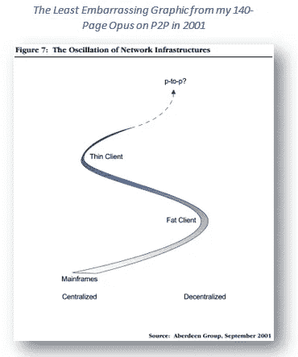
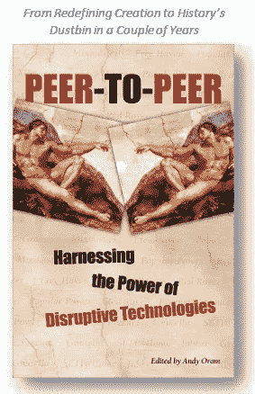

# 区块链的历史透视

> 原文：<https://medium.com/coinmonks/a-historical-perspective-on-blockchain-c28ab92db0f1?source=collection_archive---------3----------------------->

封锁链不是第一次权力下放运动。它能从它最直接的前身——P2P 学到什么？

虽然区块链革命的一切看起来都是革命性的，但这不是第一波权力下放。在半个世纪前的计算中，有一个钟摆在集权和分权之间摇摆不定。在 70 年代，拥有哑终端的大型机的主导地位在 80 年代随着服务器-客户端架构变得更加分散，随着个人电脑主导 90 年代，更进一步的是强大的桌面应用。在 00 年代和青少年早期，随着云服务、SaaS，甚至由注重安全的首席信息官实施的虚拟终端，钟摆又回到了集中化。现在，区块链正在充当一场新运动的先锋，在这场运动中，权力下放是一种核心精神。

# 被遗忘的革命:后纳普斯特 P2P

但并不是所有的波浪都会变成海啸。在最近一次向云的大规模集中化浪潮之前不久，大约在 2000-2002 年有一个短暂的时刻，当时一种新的分散化形式——P2P(或者像我的编辑坚持使用的 P-到-P)计算——似乎将会扭转局面。在 Napster、Limewire 和其他“信息想要自由”理念的倡导者的大力支持下；除了像 SETI@home 和各种蛋白质折叠分布式计算应用这样更具社会意识的追求之外，P2P 还承诺将权力带回外围。从企业角度来看，一些最有希望的项目——如 Groove Networks——也旨在重塑协作。

作为阿伯丁的一名市场分析师，我坐在第一把交椅上，与有远见的初创公司创始人开会，承诺通过分散的技术改变世界；无政府主义者准备用它来摧毁既定的秩序；像[拉里·莱西格](https://en.wikipedia.org/wiki/Lawrence_Lessig)、[雷·奥茨](https://en.wikipedia.org/wiki/Ray_Ozzie)、[克莱·舍基](https://en.wikipedia.org/wiki/Clay_Shirky)这样的聪明人正在为如何重塑我们在这个新世界中的知识产权和合作观发展一个意识形态框架；也是我在区块链之前见过的最有活力的社区。这使得这一被遗忘的浪潮的教训与今天相关。

就像区块链一样，P2P 不仅仅是一项技术。这是一场期待权力下放改变世界的运动。许多创造性的能量来自于一种感觉，即信息希望是免费的——随着互联网世界的精彩，围绕谁可以创建、控制、转换和分发内容和数据的旧保护变得可悲地过时了。就像今天一样，人们正在努力解决如何在不破坏其核心精神的情况下为这场运动带来秩序和治理的问题。

# 没有荣耀的死亡

揭示大部分 P2P 运动都失败了，这并不算太大的剧透。Groove 被微软收购，主要是为了招募雷·奥茨，然后慢慢被纳入 Sharepoint，几乎没有留下 P2P 的痕迹。Seti@home 继续发展，尽管声望下降了很多。Limewire、Kazaa、Grokster 等在一场诉讼风暴中逐渐消失，盗版者转向 bittorrent，合法用户转向 iTunes 和亚马逊。

不像网络时代，没有从废墟中崛起的亚马逊；在各种著名的 LinkedIn 个人资料上只有一句俏皮话。一些概念有更光明的未来——例如，博客在去中心化的浪潮中有其哲学根源——“任何人都可以发表”的人民精神的力量仍然是新的和令人兴奋的。然而，即使这样，最终还是被集中的社交媒体平台抢先了，分散访问全球肥皂盒的遗产可能最终成为关于真相的共识的[损失。](https://goo.gl/AMJC5x)

事后回想那次不光彩的崩盘，甚至我在这个问题上的保守和怀疑的[出版物](https://web.archive.org/web/20040528044133/http:/www.aberdeen.com:80/ab_company/hottopics/p2p/)看起来都乐观得令人尴尬。我将省略令人尴尬的曲棍球棒市场增长预测。但报告中的一句话仍然是正确的:“在炒作平息后，将不会再有公司声称自己是点对点公司。相反，将会出现使用点对点技术的内容交付、高端处理、协作和信息基础设施公司。”

用“区块链”代替“点对点”，这在今天仍然适用— **你不可能是一家区块链公司。你需要成为一家使用区块链的解决方案公司。**

# 这次有什么不同

2001 年和 2018 年的环境之间的主要区别是金融方面的。P2P 晚于网络时代的投资疯狂，并在一场可怕的技术崩溃中成熟，当时预算大幅减少，风险投资资金枯竭。我对当时最可行的 P2P 风险投资进行了全面统计，得出的风险投资总额为 3.8 亿美元。截至本文撰写之时，前 100 种加密货币的总市值为[$ 3700 亿](https://coinmarketcap.com/)。这是 10 亿美元，几乎是 P2P 市场的 1000 倍。其中一些是短暂的，受比特币涨跌的影响。但即使是 50%或 75%的崩盘也不会让这个行业屈服。

风投也不同于区块链投资者。虽然 P2P 有其理想主义的支持者，但他们中没有一个人准备向法律地位可疑的新企业投入大量资金；不确定的收入模式；和非常规的目标，尤其是在互联网泡沫破灭后。区块链有一个比特币亿万富翁的小圈子，可以打破这种模式。一些人公开支持这项技术的革命性潜力，比如波多黎各[的加密乌托邦](https://goo.gl/s5pkAQ)人群。有些人更喜欢保持匿名。但是不要搞错，区块链游戏的目标不是赚钱，而是改变世界。

最后，一个更微妙的区别在于这种理想主义的目标。P2P 革命与知识共享的理念紧密交织在一起，即所有的创造力都基于以前的东西，过于严格的知识产权制度保护了经济租金，同时扼杀了未来的创新。这一次的口号是“信息想要免费”。这种免费给予的精神反映在这段时间激增的维基和博客中。区块链革命保留了许多基本原则，但认识到创作共用有自己的悲剧——货币化仍然发生，但利润进入平台，而不是创作者。许多以创造力为中心的最受欢迎的倡议的目的不是让信息免费，而是将奖励重新导向创造者。

这种理想主义并没有改变区块链需要为用户创造价值的基本理念，而不仅仅是重新发明轮子。但它确实为这个时代的企业创造了一个不同的时间表和一系列期望。

> [在您的收件箱中直接获得最佳软件交易](https://coincodecap.com/?utm_source=coinmonks)

# 接下来:如何应对区块链的幸运开端？

现在我们该如何利用这种力量呢？区块链社区如何集中精力开展正确的活动以产生真正的影响？这是下一篇文章的主题。