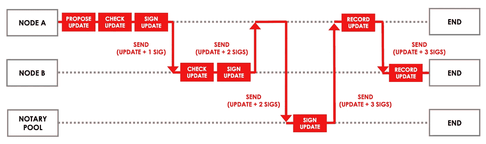
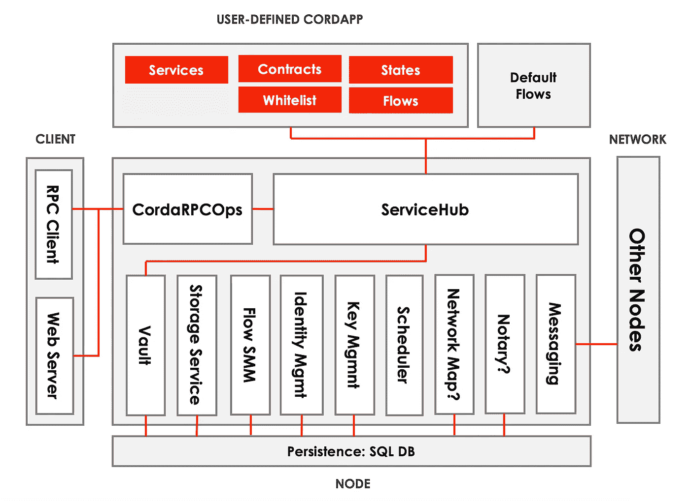
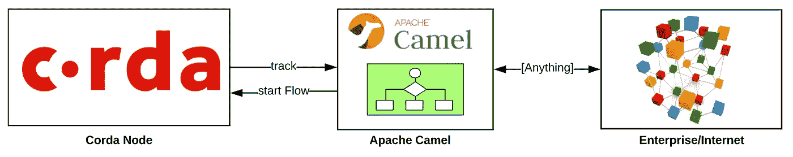

# 一个 Java 开发人员对 Corda 的第一印象

> 原文：<https://medium.com/coinmonks/a-java-developers-first-impressions-from-corda-a5e3d6ce6e44?source=collection_archive---------3----------------------->

最近，我有机会玩了一会儿基于 JVM 的开源区块链平台 [Corda](https://www.corda.net/) 。我惊讶地发现它是如何将区块链思想与商用中间件技术融合在一起，并创建了一个新的分散式企业集成概要。下面是我对它的第一印象，以及一个 [Apache Camel](http://camel.apache.org/) 连接器的贡献。

# 什么是 Corda？

Corda 是一个分散的数据库和业务流程平台，其设计和构建完全是为了在可识别的各方之间实施法律协议。这是一个 DLT 实现，受比特币的 [UTXO](https://bitcoin.org/en/glossary/unspent-transaction-output) 模型的影响很大，并受到金融行业“企业化”要求的推动。Corda 是用 Kotlin 编写的，运行在 JVM 上，使用了许多成熟的中间件技术。因此，与其他区块链平台相比，Corda 为具有集成、消息传递和业务流程管理经验的 Java 开发人员提供了一个低门槛。

# 设计原则

*   有权限的(而不是无权限的网络，如比特币、以太坊等)——这并不奇怪，因为企业区块链用例主要关注可识别方之间的业务集成挑战的自动化。
*   点对点(而不是像比特币等那样的全球交易广播)——这使得数据只能在需要知道它的节点之间共享，这也提高了隐私性和可扩展性。
*   类似于比特币的 UTXO 模型(而不是以太坊的账户模型)——这是使 Corda 成为 DLT/区块链而不是分布式业务流程管理平台的部分。
*   重用(而不是从头开始构建一切)——这是我最喜欢的 Corda 部分。Java 生态系统的重用、关系数据库的重用、消息传递系统的重用等等。

这些设计原则的结合使 Corda 成为竞争对手中非常独特的 DLT 平台。它具有比特币 UTXO 模型、以太坊智能合约功能、结构私有通道的元素，最重要的是，它尽可能重用和构建在现有的经过战斗考验的中间件技术之上。

# 主要概念

*   由点对点通信节点组成的许可网络。
*   一种分类帐，其中每个节点维护其唯一的数据库，而不是单个存储。
*   防止双重花费和验证交易的公证节点。
*   仅在包含的事实为真时才签署事务的 Oracle 服务(与典型的 Oracle 略有不同)。
*   状态对象是不可变的，代表分类帐上的事实。状态通过事务修改，并且只存储在拥有节点上。
*   契约是基于 JVM 的确定性函数，用于验证事务。
*   交易是对分类账的候选更新，必须在合同上有效并签字确认。
*   流封装了业务流程，并抽象了所有的网络、I/O、存储和并发性。所有智能合约活动都发生在可以通过 RPC 调用或其他流调用启动的流范围内。流不像契约那样在沙盒中运行，而是作为常规的 Java 代码执行。

*A Corda Flow that interacts with Node A, Node B, and the Notary Pool*

在以太坊中，智能契约的概念将业务逻辑和状态封装为一体。在 Corda 中，状态和契约对象是不同的概念:状态是持久的，而契约是确定性函数(意味着所有事务验证都是由契约在不同节点上执行的，并且应该产生相同的结果)。

此外，Corda 引入了流的概念(一种分布式编排引擎)，这在以太坊世界中类似于相互调用的契约(一种编排)。但是 Corda 流并没有部署到所有节点中，它们不是共享状态的一部分，而是代表特定于单个节点的标准 JVM 代码。

# 技术栈

在“重用”原则的驱动下，Corda 正在重用现有的存储、消息和 Java 解决方案。而 [Quorum](https://www.jpmorgan.com/global/Quorum) 等区块链平台则采取以太坊等无许可 PoW 框架，通过取代共识机制、取消燃气费、引入私下交易等方式使其“企业化”。，Corda 采取了相反的方法。Corda 采用现有的中间件技术，并应用 UTXO 的比特币概念，创建了一类新的软件，可以将其描述为“分布式业务流程和状态管理系统”。Corda 通过使用商用技术来实现这一点，例如用于存储的关系数据库，以及用于状态复制和分布式业务流程协调的消息传递。

*Main components of Corda*

高级技术堆栈:

*   它使用 Gradle 构建，需要 Oracle JDK 8，在 T2 Docker T3 上运行(Linux 用于生产)。
*   Corda 节点是一个平面类路径 JVM 应用程序(不需要 Spring Boot、应用服务器或 OSGI 容器)。
*   存储:关系数据库— H2、PostgreSQL、SQL Server、OracleDB。
*   对象关系映射:JPA — [JBoss Hibernate](http://hibernate.org/) 。
*   消息传递:基于 AMQP 的 [— Apache ActiveMQ /Artemis](https://activemq.apache.org/artemis/) 。
*   度量:Jolokia
*   其他:Quasar，Kryo，Shiro，Jackson 等，

# Apache Camel 与 Corda 的集成

由于我在企业集成方面的背景和对区块链的兴趣，最近我为以太坊和 Quorum 创建并撰写了关于 [Apache Camel connector 的文章。](/@bibryam/enterprise-integration-for-ethereum-fa67a1577d43)本着探索区块链企业的精神，我为 Corda 创建了一个 Apache Camel 连接器[。连接器使用 Corda-RPC 库，并提供 Camel 生产者/消费者端点来与 Corda 节点交互。该组件提供了用于注册和接收来自 Corda 节点的事件的消费者，以及用于向节点发送命令的生产者。以下是支持的全套操作:](https://github.com/apache/camel/blob/master/components/camel-corda/src/main/docs/corda-component.adoc)

Apache Camel connector for Corda

**消费者** : vaultTrack，vaultTrackBy，vaultTrackByCriteria，vaultTrackByWithPagingSpec，vaultTrackByWithSorting，stateMachinesFeed，networkMapFeed，statemachinedtransactionmappingfeed，startTrackedFlowDynamic。

**Producer** :当前节点时间、获取协议版本、网络地图快照、状态机器快照、状态机器记录的 TransactionMappingSnapshot、注册流、清除网络地图缓存、isFlowsDrainingModeEnabled、setFlowsDrainingModeEnabled、notaryIdentities、节点信息、addVaultTransactionNote、获取 VaultTransactionNotes、上传附件、attachmentExists、openAttachment、queryAttachments、节点信息 FromParty、notaryPartyFromX500Name、partiesFromName

要了解关于 Camel 的更多信息，以及它如何补充 Corda 解决方案，请阅读上面链接的 Camel Ethereum 连接器文章。

# 结论

无公共许可的区块链正面临严峻的技术挑战，包括规模、治理、能源浪费，以及投机、监管、一般用途和适用性方面的非技术挑战。他们有分散一切的崇高想法，但尚未证明技术和经济模式有能力实现这一愿景。

另一方面，私人许可的区块链，如 Corda、Fabric、Quorum 不受这些技术挑战的影响，因为它们的目标使用案例是受监管市场中数量较少的可识别方。他们的目标是改进和自动化企业现有的商业模式，而不是发现全新的经济模式。在某种意义上，许可的区块链代表了下一代跨组织的业务流程和数据集成系统。这些系统是否符合“blockcian”的标准，或者是否将这个术语用作营销术语，都无关紧要。在私人和许可的世界里，去中心化是理想的属性，而区块链是一个实施细节。

在这个领域，Corda 不是革命性的，而是一个建立在成熟的存储和中间件技术生态系统之上的进化平台。区块链技术仍然需要证明自己，而建立在成熟技术之上是第一步。

我探索区块链企业的下一站将是 [Hyperledger Fabric](https://www.hyperledger.org/projects/fabric) 。保重。

> [在您的收件箱中直接获得最佳软件交易](https://coincodecap.com/?utm_source=coinmonks)

[**Click to read today’s top story**](http://bit.ly/2G71Sp7)