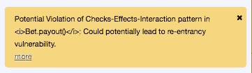

# 绝地指南:坚固的再入攻击

> 原文：<https://medium.com/coinmonks/a-jedis-guide-to-solidity-reentrancy-attacks-f5ebfa6405c9?source=collection_archive---------3----------------------->

写一份可靠的合同是一回事，但确保参与者的资金安全是另一回事。Solidity 试图通过它的编译过程尽可能多地执行，但它取决于创作者是否能带它穿过终点线。

在我们的前一篇文章中，我们为我们的赌博 dApp 创建了一个 UI，欧比万和尤达大师用它来解决赌博问题。在本文中，我们将研究智能合约中隐藏的安全漏洞或攻击媒介。

## 安全性

每个人都同意，安全是一个问题，是绝对关键的成功大规模区块链采用。我们将使用以下方法来检查我们的智能合约的安全缺陷:

*   [Remix](https://remix.ethereum.org) —我们已经在[之前的一篇文章](/@cipherz/a-jedis-guide-to-ethereum-part-3b-remix-1b8d98d909d4)中广泛使用了这个工具，但是还没有利用它的分析选项卡。

## 再搅拌

在 remix 中打开我们的 [Bet.sol](https://github.com/cipherzzz/JediBetDapp/blob/master/contracts/Bet.sol) 智能合约，我们可以在分析选项卡中看到几个问题。在这一点上，我们感兴趣的是潜在的再入脆弱性。

一个*重入*条件是当一个参与者可以调用你的契约的函数，并且可能在之前的调用完成一次或多次之前*重入*契约。这对于我们这里的可支付函数来说尤其是灾难性的。

**Bet.sol —易受攻击的代码**

我们的代码在第 4 行检查执行地址是赌注接受者还是发起者，这很好。我们已经淘汰了这里大多数的坏演员。*然而，如果其中一个玩家是一个坏演员，他看到了合同中的漏洞，并且只是作为利用该漏洞的一种手段而参与进来，那该怎么办？*我们在*线路 7、8、11、13、15 和 16* 上的传递函数调用容易受到这样的攻击。如果你注意到我写的转账金额是基于这样的逻辑，即底池或总赢款大约等于玩家的下注金额乘以 2。我跟不上支付给每个玩家的金额。因此，在玩家得到支付的情况下，他们可以再次递归调用合同，并且没有检查他们是否已经得到支付。他们基本上可以这样做，直到他们耗尽汽油或合同耗尽。这将是您与另一个与 Bet.sol 交互的智能合约所做的事情，其中您将有一个默认的回退应付款函数，该函数将在原始调用返回之前再次调用*支出*函数。

**Bet.sol —已修复**

我们要做的是所谓的，*乐观会计，*在我们发送转移函数之前，我们从玩家的资金中扣除支付金额。这将防止可重入的行为，并且仍然允许在异常情况下还原演绎。我们希望在一般情况下用可靠性契约状态来实现这一点，以防止重入攻击。请注意，我将 *resetGame()* 和 *getBetOutcome()* 方法放在转移奖金的调用之前。这是安全的，因为传递函数的任何错误都会恢复我们的契约状态。

> [直接在您的收件箱中获得最佳软件交易](https://coincodecap.com/?utm_source=coinmonks)

其他资源:

 [## remix 中的重入攻击测试

### 以太坊栈交换是一个针对以太坊用户的问答网站，是一个去中心化的应用平台和…

ethereum.stackexchange.com](https://ethereum.stackexchange.com/questions/28945/testing-for-reentrancy-attacks-in-remix)  [## 智能合约上的“可重入攻击”

### Solidity 中的错误代价很高，会让你和其他人处于危险之中，所以当…

medium.com](/@JusDev1988/reentrancy-attack-on-a-smart-contract-677eae1300f2)  [## 智能契约上的可重入攻击:如何识别可利用的和攻击的例子…

### 编写智能合同当然不是一件轻松的事情。代码中引入的一个 bug 需要花钱，而且很可能不需要…

medium.com](/@gus_tavo_guim/reentrancy-attack-on-smart-contracts-how-to-identify-the-exploitable-and-an-example-of-an-attack-4470a2d8dfe4)