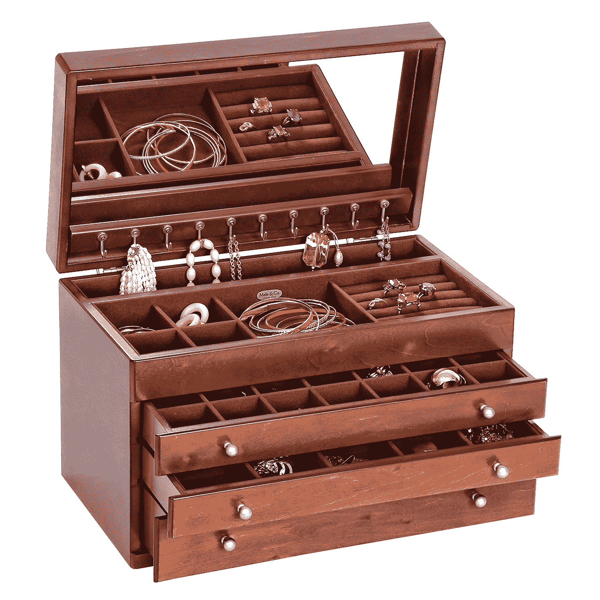

# 首饰盒和数据隐私

> 原文：<https://medium.com/coinmonks/a-jewellery-box-and-data-privacy-9632c3ab943?source=collection_archive---------15----------------------->

## 本文中涉及的方法的一个演示是[这里的](https://asecuritysite.com/encryption/hom_adder)。

## 使用宝石

同态加密是由 Craig Gentry 在 2010 年定义的[ [这里是](https://crypto.stanford.edu/craig/craig-thesis.pdf) ]，我们可以在不解密的情况下操作数据。Craig 定义了一个场景，Alice 有一个首饰盒，她用钥匙锁了起来，而她的员工无法打开它…