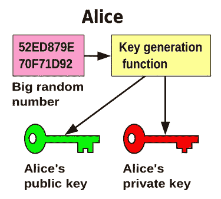
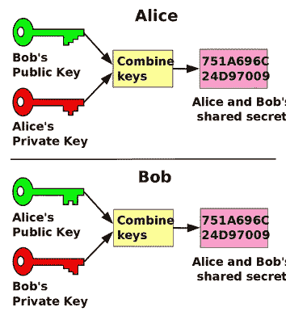

# 公钥加密和数字签名

> 原文：<https://medium.com/coinmonks/a-laymans-explanation-of-public-key-cryptography-and-digital-signatures-1090d4bd072e?source=collection_archive---------0----------------------->

## …简单解释

**公钥密码:** 公钥密码是一种使用私钥/公钥的密码系统。这种方法的优点在于不需要某种安全通道来进行通信者之间的初始密钥交换。这使得在开放网络中与陌生人进行安全通信成为可能。

**私钥**是一个随机的十六进制数，必须由账户持有人保密。

一个**公钥**是另一个可以公开共享的十六进制数。

Pick a number, any number

在大多数常见的加密系统中，公钥和私钥是同时生成的。在其他情况下，公钥是从私钥生成的。公钥和私钥通过数学关系相互关联。**然而，没有办法使用公钥来计算出私钥。**这是因为这些系统基于数学问题，没有有效的解决方案，可以获取输出并反向工作以获得原始输入。

**RSA 和素数:**
为加密系统提供安全性的数学难题的一个例子见于流行的 RSA 密码系统。RSA 使用质数来确保安全性。**公钥密码系统需要一套算法，在一个方向上很容易做到，但很难撤销。** RSA 使用一种简单的算法将两个素数相乘。

如果乘法很容易，那么困难的部分是分解这两个素数相乘的乘积。

一个**质数**是一个大于 1 的自然数(计数时也叫整数)，只能被 1 和它自己整除。质数的例子有 3、5、7、11、13、17 等。

一个**乘积**是两个因子相乘的结果。例:A * B = C.
因子为 A 和 B，乘积为 c。

**合数**是两个或两个以上的正整数相乘而成的正整数。因此，合数可以被大于 1 的数和它本身整除。当两个素数(或任意多个正整数)相乘时，我们得到一个合数。

**分解出一个数字**就是找到组成合数的数字。

分解出组成 RSA 的 232 位数的两个质数需要很长时间。然而，生成和检查这两个素数相对容易。

具有这种性质的算法，在一个方向容易，在另一个方向困难，被称为陷门函数。其他算法使用其他类型的具有这种单向属性的数学难题来为他们的系统提供安全性。以太坊使用一种叫做椭圆曲线加密的东西，这将在以后的文章中描述。

**数字签名:** 简单来说，**数字签名**是一种验证任何数据真实性和完整性的方式。为了创建数字签名，签名软件创建要签名的数据的单向散列。然后，私钥用于加密哈希。这个加密的散列加上其他信息，如使用的散列算法，就是数字签名。

**带有数字签名的公钥加密:** 采用公钥加密保护消息的数字签名按以下方式创建。首先，如上所述，对消息进行数字签名。然后，这个包用发送者的私钥加密，再用接收者的公钥加密

从假设的函数调用来看，它可能是这样的:

> public _ key _ of _ recipient(private _ key(消息散列(消息)+消息+散列算法类型))

Keep this a secret

**用数字签名解密安全消息:** 当接收者收到信息时，接收者可以用自己的私钥解密外层。这确保了只有接收者可以读取信息。然后，接收者可以用发送者的公钥解密内层。这保证了发送者确实是预期的人。这是可能的，因为私钥和公钥在数学上是联系在一起的。

解密后，接收方可以通过使用与发送方相同的哈希算法来运行消息，从而验证消息在途中没有被篡改。如果它们匹配，我们有一个有效的消息。

> 加入 Coinmonks [电报频道](https://t.me/coincodecap)和 [Youtube 频道](https://www.youtube.com/c/coinmonks/videos)获取每日[加密新闻](http://coincodecap.com/)

## 另外，阅读

*   [密码电报信号](http://Top 4 Telegram Channels for Crypto Traders) | [密码交易机器人](/coinmonks/crypto-trading-bot-c2ffce8acb2a)
*   [复制交易](/coinmonks/top-10-crypto-copy-trading-platforms-for-beginners-d0c37c7d698c) | [加密税务软件](/coinmonks/crypto-tax-software-ed4b4810e338)
*   [电网交易](https://coincodecap.com/grid-trading) | [加密硬件钱包](/coinmonks/the-best-cryptocurrency-hardware-wallets-of-2020-e28b1c124069)
*   [最佳加密交易所](/coinmonks/crypto-exchange-dd2f9d6f3769) | [印度最佳加密交易所](/coinmonks/bitcoin-exchange-in-india-7f1fe79715c9)
*   [面向开发人员的最佳加密 API](/coinmonks/best-crypto-apis-for-developers-5efe3a597a9f)
*   最佳[密码借贷平台](/coinmonks/top-5-crypto-lending-platforms-in-2020-that-you-need-to-know-a1b675cec3fa)
*   杠杆代币的终极指南
*   [加密交易的最佳 VPN](https://coincodecap.com/best-vpns-for-crypto-trading)
*   [最佳加密分析或链上数据](https://coincodecap.com/blockchain-analytics) | [Bexplus 评论](https://coincodecap.com/bexplus-review)
*   [NFT 十大市场造币集锦](https://coincodecap.com/nft-marketplaces)
*   [AscendEx Staking](https://coincodecap.com/ascendex-staking)|[Bot Ocean Review](https://coincodecap.com/bot-ocean-review)|[最佳比特币钱包](https://coincodecap.com/bitcoin-wallets-india)
*   [Bitget 回顾](https://coincodecap.com/bitget-review)|[Gemini vs block fi](https://coincodecap.com/gemini-vs-blockfi)|[OKEx 期货交易](https://coincodecap.com/okex-futures-trading)