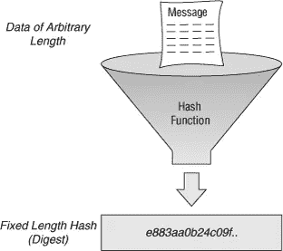
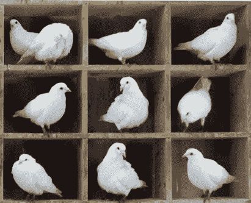

# 什么是哈希？

> 原文：<https://medium.com/coinmonks/a-laymans-explanation-to-what-is-a-hash-a45c680edd41?source=collection_archive---------7----------------------->

## …简单解释

**什么是哈希？**
一个**散列**是接受任意一组数据/比特(可以是单个字符、一段视频或整个国会图书馆)并使用算法将输入转换成固定大小的数据/比特输出的结果，通常是十六进制数。

因此，不管放入散列的信息量有多少，您总是会得到相同长度的唯一散列。

Anything goes in and fixed-length hash comes out.

更深入地说，这种算法是单向函数，它在一个方向接收数据，在另一个方向输出非常独特的十六进制数字符串。输入数据中的一个变化会导致非常不同的输出字符串。

您很难从 hash 的输入中猜出它的输出。更不可能从固定大小的输出中猜出输入。

相同的数据将总是具有相同的唯一散列。然而，在处理大型数据集时，冲突是不可避免的。当两个输入具有相同的散列时，这将导致**冲突**。

Not enough room for all the pigeons.

为什么会发生碰撞？这是由 [**鸽巢原理**](https://io9.gizmodo.com/why-the-pigeonhole-principle-is-one-of-maths-most-power-1601025172) **解释的。**简单解释，鸽笼原理定义为试图将n + 1 个物品(或鸽子)放入 n 个空间(鸽笼)。从逻辑上讲，至少会有一个实例，其中两个项目(或鸽子)在同一个空间。试着用 3 张碎纸(n + 1)和 2 个废纸篓(n)来做这件事。你会发现至少有一个废纸篓里有两张纸。

所以，每个哈希都有串通。然而，良好的散列算法使得很难发现这种冲突，也称为**冲突阻力**。**抗合谋**不代表没有碰撞，只是说它们很难被发现。

有些人试图用 [**蛮力攻击**](https://en.wikipedia.org/wiki/Brute-force_attack) 破解哈希算法，这基本上是计算机做出真正快速的猜测。这种类型的攻击称为 [**哈希碰撞攻击**](https://learncryptography.com/hash-functions/hash-collision-attack) 。随着计算变得越来越快，越来越便宜，旧哈希被成功攻击的风险变得越来越大，就像[谷歌研究人员在 2017 年为 SHA-1 哈希算法发现的那样](https://www.theregister.co.uk/2017/02/23/google_first_sha1_collision/)。