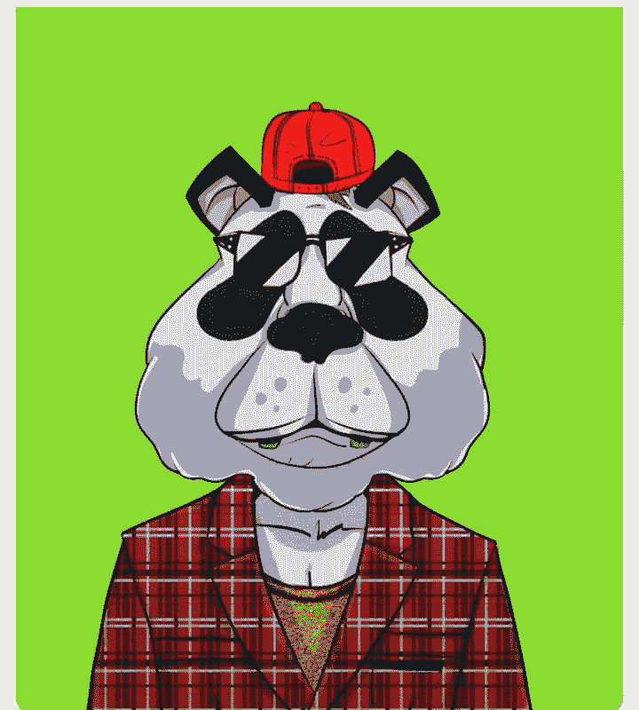

# 投资 NFT 的外行指南

> 原文：<https://medium.com/coinmonks/a-laymans-guide-to-investing-in-nft-16a82cdc1b38?source=collection_archive---------5----------------------->

## 购买 NFT 前你应该知道的一切

几个月前，我偶然发现了 NFT 的一篇文章，但当时它对我来说毫无意义。我是说，我一点也不明白。

我正和一个密友谈论这件事。作为一名摄影师，我了解到 NFT 可能是从她的艺术中赚钱的另一种方式。我进入了我的“研究模式”，试图得到我能得到的所有视频和文章。

但在一个受欢迎的 NFT 市场上挂牌出售一件艺术品，汽油费是如此之贵，这让我感到沮丧。虽然现在我知道得更多了，我知道这比列出你的作品要多得多(即使你付得起油费和所有费用)

不知道如何前进，我做了任何一个懒人都会做的事。我忘记了 NFTS，专注于我职业生涯的其他方面。

快进到三个月后，我拥有不少于 7 个 NFT。我可以担保所有的优质项目。在写这篇文章的时候，其中一个值 1 BNB。

*什么变了？*

好吧。很多事情。

我意识到最好在不太拥挤的时候跳上一辆火车。

如果你知道比特币会值这么多钱，你难道不会想尽一切办法去买一个、两个甚至三个吗😜？

这正是我对 NFTs 的感觉。

不仅仅是 NFT。

整个区块链现在是一个热门话题，为即将到来的事情做好准备是唯一明智的做法。

NFTs| Defi | Dao| Web3。它会引爆互联网，这只是时间问题。

这些东西对第三世界国家来说还是非常新的，但在世界其他地方它们正在成为主流。

当我说定位自己时，我不是说学习区块链开发(虽然，如果你有技能，那将是一个额外的优势)，而是说所有这些是如何相互联系的基础知识。它是如何工作的。

很难相信，在现阶段，一些人仍然不知道如何操作加密货币平台。*(我在戳你吗？是的，我是！)*

世界正朝着分散金融的方向发展，而你仍然对基本的加密知识漠不关心。

最近有几个人对 NFTs 表现出兴趣，主要是因为人们从中获得的证词。但是当你不熟悉一些平台是如何工作的时候，很难让你通过。

是啊！我可以分享 NFT 赠品的链接，但你知道如何获得你的钱包地址吗？

YouTube 上有大量关于如何使用这些平台的视频。请观看他们。熟悉 them🥴

是的，我已经明白了加密是如何工作的，但是我不知道如何或者在哪里购买 NFT？

让你的马冷静下来

## NFT 到底是什么？

NFT 是数字资产。或者以一种更简单的形式，它们是你购买或拥有的任何数字资产的所有权证书，它在区块链上受到保护。

NFT 意味着不可替代的代币。

这没什么帮助，对吧？

嗯，这意味着:**非功能性测试是不可互换的。**

如果我有一张 1000 美元的钞票，你有两张 500 美元的钞票，我们都可以交换它，它仍然是一样的。

比特币也是如此。比特币可以兑换

因此，NFT 实际上是一种可以交易的数字资产——但它是不可替代的:10 种不同的 NFT 将有 10 种不同的价值。

人们使用的另一幅插图是广受欢迎的蒙娜丽莎。

The famous Lisa

蒙娜丽莎是一幅吹制的画！大家都知道。你要么把它看作一个迷因，要么它随机出现在某个地方。

但有趣的是，原画现在就在法国的某个地方，价值超过 8 亿美元。

想象一下，现在得到这些信息，去谷歌上保存一幅蒙娜丽莎的图像，打印出来，然后决定以 100 万美元出售。

但是你显然不能这么做，因为你没有所有权证书，这是证明这幅画是达芬奇真迹的唯一途径。

作为一个初学者，很容易认为 NFT 都是互联网上定价过高的图像或艺术。

但是 NFT 不仅仅是艺术，NFT 可以是任何东西。还记得关于产权证的解释吗？

只要你付了钱，NFT 就是唯一的象征。你的所有权要求你得到的任何资产。

可以是一张图片，或音乐，一张音乐会的门票，甚至是一个数字课程！

任何事！

## 人们为什么收集 NFT？

就其核心而言，围绕收藏的许多心理与人类多年来寻求收藏的原因相似。

心理学家马克·麦金利列举了几个我不得不同意的理由:

**投资**:寻找会升值的资产的欲望

对我们中的一些人来说，NFT 更多的是一种投资。我以 15 美元买进，以 600 美元卖出
，或者以 25 美元铸造一个 NFT，以 1500 美元卖出。

是啊，人们从 NFT 赚了那么多。

**社交拓展**:渴望拓展社交生活和社交信号。

**自我意识**:渴望创造并保持一种认同感。

对一些人来说，这就像拥有最新的 iPhone。他们获得的是一种认同感。对他们来说，这是一种社会货币。一种归属感

重获控制权:渴望通过安全的财产建立一个舒适区。

对一些人来说，这是长期的。对他们来说，这就像购买一处房产，帮助他们以后获得财务自由。

现在你知道为什么要买了。

## 你在哪里购买它？

最受欢迎的 NFT 市场有:

Opensea 是一个在以太坊上运行的 NFTs 的市场。用户可以与网络交互，用不可替代的代币交换加密货币。

**SuperRare:** 是 NFTs 的社交网络。平台上的每一件作品都是独一无二的，用户可以在其网站上买卖这些原创作品。

## 你如何购买？

1.购买以太坊
由于大多数 NFT 是基于以太坊的代币，这些收藏品的大多数市场只接受以太坊代币作为支付方式。如果您已经有一个加密货币交易所的帐户，您可以在上面购买以太坊，并将您的加密发送到您的 MetaMask 钱包。

页（page 的缩写）我用以太坊是因为大多数 NFT 都是建立在以太坊区块链上的。但是有索拉纳 NFTs，聪明

2.MetaMask 是一款以太坊钱包，可通过 chrome 扩展和移动应用程序使用。要登录 OpenSea(和其他 NFT 平台),你需要一个以太坊钱包。只需下载 MetaMask，设置一个钱包，然后发送您刚刚从币安或任何其他加密平台购买的 ETH。

3.购买你的 NFT
一旦你为你的账户注入资金，购买 NFT 是一个简单的过程。大多数市场都是拍卖形式，所以你需要为你想要购买的 NFT 提交一个出价。一些市场的运作更像一个交易所，对有几份拷贝的 NFT 采用最高出价和最低要价。

从一级市场购买 NFT 的一个好处是产品上市后的潜在转售价值。一些需求量很大的非功能性测试在发行后会以 5 到 10 倍的价格出售

现在你知道为什么你想买一个 NFT，你如何发现好的 NFT 项目？

[阅读这篇关于 5 种发现好的 NFT 项目的方法的文章](/coinmonks/7-ways-to-spot-a-good-nft-project-79ab51e48909)

NFT 隐藏的真相是:它是由需求驱动的

这就是为什么你想只买有驱动社区的 NFT。

> 加入 Coinmonks [电报频道](https://t.me/coincodecap)和 [Youtube 频道](https://www.youtube.com/c/coinmonks/videos)了解加密交易和投资

## 另外，阅读

*   [网格交易机器人](https://blog.coincodecap.com/grid-trading) | [Cryptohopper 审查](/coinmonks/cryptohopper-review-a388ff5bae88) | [Bexplus 审查](https://blog.coincodecap.com/bexplus-review)
*   [7 个最佳零费用加密交易平台](https://blog.coincodecap.com/zero-fee-crypto-exchanges)
*   [分散交易所](https://blog.coincodecap.com/what-are-decentralized-exchanges) | [比特 FIP](https://blog.coincodecap.com/bitbns-fip) | [Pionex 评论](https://blog.coincodecap.com/pionex-review-exchange-with-crypto-trading-bot)
*   [用信用卡购买密码的 10 个最佳地点](https://blog.coincodecap.com/buy-crypto-with-credit-card)
*   [百佳卡达诺钱包](https://blog.coincodecap.com/best-cardano-wallets) | [Bingbon 副本交易](https://blog.coincodecap.com/bingbon-copy-trading)
*   [印度最佳 P2P 加密交易所](https://blog.coincodecap.com/p2p-crypto-exchanges-in-india) | [柴犬钱包](https://blog.coincodecap.com/baby-shiba-inu-wallets)
*   [八大加密附属计划](https://blog.coincodecap.com/crypto-affiliate-programs) | [eToro vs 比特币基地](https://blog.coincodecap.com/etoro-vs-coinbase)
*   [最佳以太坊钱包](https://blog.coincodecap.com/best-ethereum-wallets) | [电报上的加密货币机器人](https://blog.coincodecap.com/telegram-crypto-bots)
*   [交易杠杆代币的最佳交易所](https://blog.coincodecap.com/leveraged-token-exchanges) | [购买弗洛基](https://blog.coincodecap.com/buy-floki-inu-token)
*   [3Commas 对 Pionex 对 Cryptohopper](https://blog.coincodecap.com/3commas-vs-pionex-vs-cryptohopper) | [Bingbon 评论](https://blog.coincodecap.com/bingbon-review)
*   [加密复制交易平台](/coinmonks/top-10-crypto-copy-trading-platforms-for-beginners-d0c37c7d698c) | [如何在 WazirX 上购买比特币](/coinmonks/buy-bitcoin-on-wazirx-2d12b7989af1)
*   [信用贷款审核](https://blog.coincodecap.com/coinloan-review)|[Crypto.com 审核](/coinmonks/crypto-com-review-f143dca1f74c) | [货币融资融券交易](/coinmonks/huobi-margin-trading-b3b06cdc1519)
*   [最佳网上赌场](https://blog.coincodecap.com/best-online-casinos) | [币安评论](/coinmonks/binance-review-ee10d3bf3b6e) | [BitMEX 评论](https://blog.coincodecap.com/bitmex-review)