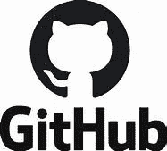
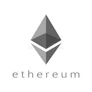
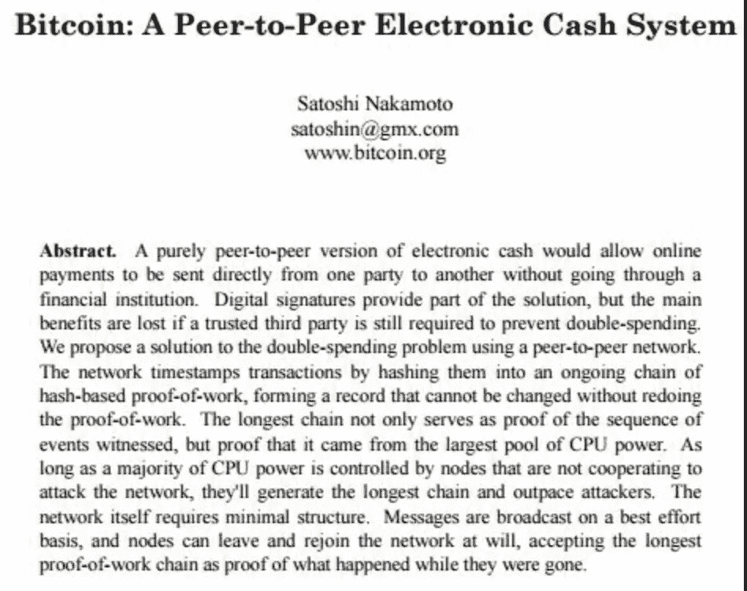
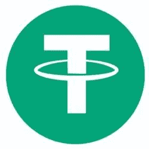
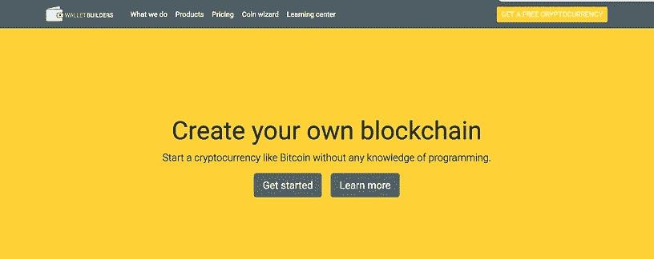
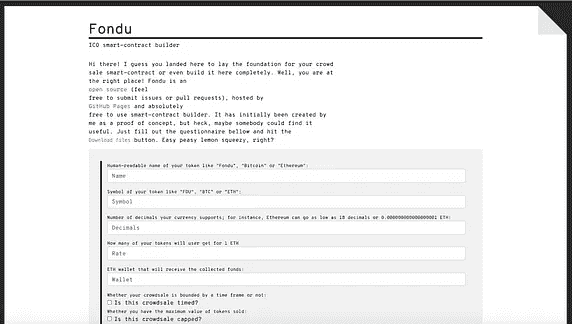
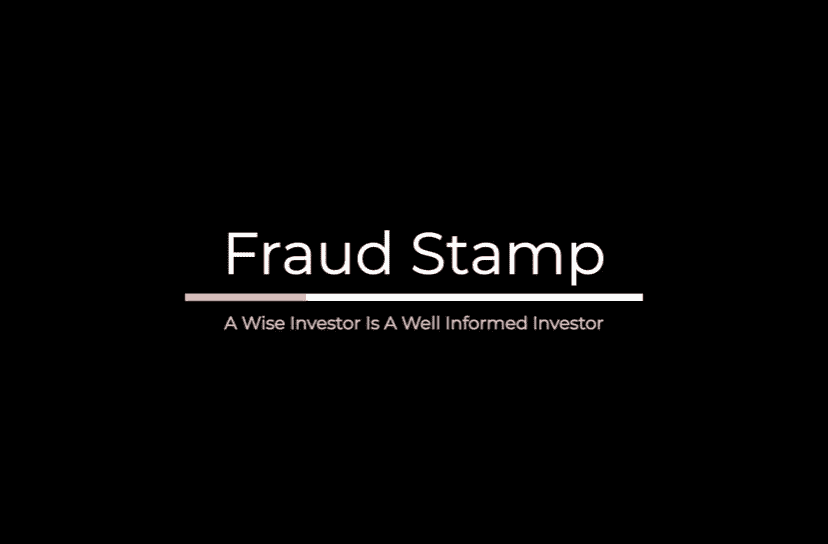

# 印制自己钞票的许可证

> 原文：<https://medium.com/coinmonks/a-licence-to-print-your-own-money-7ecda561362f?source=collection_archive---------1----------------------->

## 如何创建自己的加密货币

*探索加密货币发行机制的三篇系列文章中的第一篇*

**稍微介绍一下你的作者:诈骗戳**是一个小型的个人理财专家团队。你可以在推特上关注我们 [@FraudStamp](https://twitter.com/fraudstamp) 。

Image by [kalhh](https://pixabay.com/users/kalhh-86169/?utm_source=link-attribution&utm_medium=referral&utm_campaign=image&utm_content=1288438) from [Pixabay](https://pixabay.com/?utm_source=link-attribution&utm_medium=referral&utm_campaign=image&utm_content=1288438)

除了达赖喇嘛，每个人都想印自己的钱。唯一阻止他们的是一台印刷机和对美国特勤局来访的恐惧。但是你知道在五分钟之内你可以创造你自己的货币吗？

当然，我们正在谈论创造你自己的加密货币。你肯定会想，除非你是某种编码天才，否则不可能那么容易。嗯，几年前可能是这种情况，但现在随着许多区块链在 Github 等平台上分享他们的代码，以及自中本聪发布[比特币](https://blog.coincodecap.com/a-candid-explanation-of-bitcoin)以来编写的大量代码，这就像 1–2–3 一样简单。

如果真的那么简单，那么任何人都可以做到吗？如果任何人都可以做到这一点，那么这些加密货币又怎么会有价值呢？这是两个非常好的问题，我们将在这里进行研究，并探索如果你有这种倾向，你如何创造自己的货币。

# **代币和硬币的区别**

让我们先区分代币和硬币。如果你想了解加密货币的铸造过程，这是一个重要的区别。硬币是一种加密资产，它有自己的区块链。比特币就是一个最好的例子。另一方面，令牌使用另一个区块链，而不是自己的。最受欢迎的例子是使用以太坊区块链的 ERC20 代币。我们将在这里探讨 ERC20 令牌以及快速兴起的 SLP 令牌，后者是在比特币现金区块链上发行的令牌。

**您的货币将用于什么用途？**

你有没有一个好的商业想法，让一个平台从它自己的本地令牌或货币中受益？与任何商业想法一样，推出自己的加密货币也没什么不同。你必须首先弄清楚你的项目是否有必要，并遵循任何商业想法都必须经历的典型制衡机制来评估其可行性。

# **白皮书和法律考虑事项**

一旦你想出了自己的商业模式，下一步就是在所谓的白皮书中阐述你的想法。在这里看一下比特币白皮书[www.bitcoin.org/bitcoin.pdf](http://www.bitcoin.org/bitcoin.pdf)

需要记住的是，白皮书不是招股说明书或上市文件。它的目的是列出您正在解决的问题、解决方案以及解决方案背后的技术。如果你想让人们为你的代币付钱，那就完全是另一回事了。在早期，加密货币项目所有者仅使用白皮书向投资者出售他们的代币。项目所有者，或者更有可能是骗子，然后用这笔钱资助他们的项目或给自己买一艘船，或者两者兼而有之。项目所有者通过在项目启动后提供高额回报来吸引投资者。问题在于，向投资者提供资金回报，或者以低于代币最终上市价格的价格出售代币，使得代币成为证券并受到监管。当然，这些代币销售或 ico(首次发行硬币)都没有受到监管，大多数都受到了美国证券交易委员会(sec)的法律诉讼和赔偿令的打击，假设它们针对的是美国投资者大多数都是如此。

如果你想为你的项目筹集资金，最好的办法是获得很好的法律建议。在没有确保自己刀枪不入的情况下，你不会想从事任何秘密事业。在这方面值得注意的几点:

*   永远不要打折发行代币
*   永远不要谈论你的代币，好像它是一种投资——不要提及可能的回报等等。
*   不要用投资者这个词，他们不是投资者，他们是你服务的用户
*   建议您在项目完成后只向用户(而不是投资者)发放代币。如果代币销售的钱被用来资助项目的开发，你的代币可能会被视为一种证券。

# **选择**

有选择总是好的。在决定如何创建新的加密货币(即加密社区所称的“shitcoin ”)时，你有两条可能的途径。

**选择#1** :你可以建造自己的区块链，并创造一枚利用那个区块链的硬币。

**选择#2:** 你可以通过创造自己的 ERC20 代币在另一个区块链如以太坊铸造自己的硬币。

你决定采取哪种选择将取决于你的预算。也许你预算紧张，想先测试一下你的想法？也许你想尽快上市。或者也许你想发行自己的货币，和你的伙伴们一起开怀大笑。

第一种选择可能很昂贵。从头开始创建你自己的区块链需要一个开发团队。除非你很有钱或者是一个有经验的区块链开发者，否则这可能不适合你。有一个更便宜的选择。这叫叉，一个抄袭别人作品的专业术语。如果你想以较低的成本创建自己的区块链，你可以复制一个现有的区块链，比如 Litecoin，它的代码是开源的，也许可以做一些调整，使其符合你的独特要求。第二个选择是最便宜的，但是除非你是一个专业的程序员，否则你需要一些帮助。

印刷自己的钱最便宜的方法是代币。在这里，你只要在一个定制的程序中输入一些细节，嘿，很快你就有了自己的令牌。维护代币可能需要开发者的帮助，但这对于拥有自己的货币来说是很小的代价。

# **这些容易创造的代币有价值吗？**

这是一个价值十亿美元的问题！比方说，你想创造一个系绳的稳定硬币克隆。他们的令牌(虽然它被称为稳定硬币技术上它是一个稳定的令牌)被称为系绳。这些在以太坊(以及其他一些区块链，如 EOS、Tron 和 BCH)上作为 ERC20 代币发行，据称与美元的比例为 1:1。因为这些代币是由法定货币支持的，它们显然是有价值的。机会主义者可以在 5 分钟内复制系绳，额外的步骤是必须开设一个银行账户，以存入可能流向你的数十亿美元(这并不像听起来那么容易，因为许多银行拒绝与加密货币相关的项目开展业务)。

也许你的代币代表一种真实的资产，比如黄金或一份房地产。同样，代币具有内在价值。其他人使用代币在他们的平台上交易商品或服务，这些代币被称为效用代币，由于没有有形资产的支持，很难估价。它们的价值取决于许多因素，这些因素超出了本文的范围，但包括:平台的受欢迎程度、重复用户的数量以及商品或服务的受欢迎程度等。在购买这些代币作为投资之前，你最好自己做一下研究(DYOR)。

# **如何创建自己的加密货币**

在这里，我们将专注于铸造你自己的令牌。这是创造你自己的货币的最快的过程，一个对我们大多数人开放的机会。

有几个平台可以让这项工作变得简单。虽然简单这个词是相对的！

您可以使用这些平台之一在几分钟内创建自己的 ERC20 令牌[www.walletbuilders.com](https://www.walletbuilders.com/)和 [www.fondu.io](http://www.fondu.io) 只需点击几下鼠标，您就可以在几秒钟内设置好自己的令牌，无需任何帮助。当然，如果你需要一些帮助，你可以向开发人员支付几个小时的费用。你可以在 [www.codementor.io](http://www.codementor.io) 等网站上找到开发者

正如我前面提到的，有许多替代 ERC20 令牌的方法。大多数区块链都有替代品(其他受欢迎的是 EOS 和 Tron)。SLP 代币现在很受欢迎。这些是原生于比特币现金，顾名思义，是从最初的比特币区块链派生出来的。您可以使用[www.simpleledger.cash/project/electron-cash-slp-edition](https://simpleledger.cash/project/electron-cash-slp-edition/)快速设置自己的 SLP 令牌

当然，欺诈性加密货币 OneCoin 的投资者发现，如果不能交易，代币或硬币就没有价值。这是你在加密货币之旅中的下一份工作。让你的代币在一个或多个交易所上市，然后疯狂推销。这些主题将是我们接下来两篇文章的主题。

# **结论**

那么创造自己的加密货币真的像印钞票吗？在过去确实是这样。但现在，随着 SEC 对 ico 的严厉打击，情况发生了变化。继续印钞的精明经营者，是稳定的币童。他们的商业模式是投资者用一张代币换一张 1 美元的钞票，然后用这 1 美元赚取项目发起人有权保留的回报。当你有 160 亿美元，只赚 1%的时候，那就是一大笔钱了！

**在 Twitter 上关注我们:@**[**fraud stamp**](https://twitter.com/fraudstamp)

**没有理财建议**

本文不以任何方式构成财务建议。这篇文章应该作为补充信息添加到您现有的知识库中。

## 另外，阅读

*   最好的[密码交易机器人](/coinmonks/crypto-trading-bot-c2ffce8acb2a)
*   [密码本交易平台](/coinmonks/top-10-crypto-copy-trading-platforms-for-beginners-d0c37c7d698c)
*   最好的[加密税务软件](/coinmonks/best-crypto-tax-tool-for-my-money-72d4b430816b)
*   [最佳加密交易平台](/coinmonks/the-best-crypto-trading-platforms-in-2020-the-definitive-guide-updated-c72f8b874555)
*   最佳[密码借贷平台](/coinmonks/top-5-crypto-lending-platforms-in-2020-that-you-need-to-know-a1b675cec3fa)
*   [最佳区块链分析工具](https://bitquery.io/blog/best-blockchain-analysis-tools-and-software)
*   [加密套利](/coinmonks/crypto-arbitrage-guide-how-to-make-money-as-a-beginner-62bfe5c868f6)指南:新手如何赚钱
*   最佳[加密制图工具](/coinmonks/what-are-the-best-charting-platforms-for-cryptocurrency-trading-85aade584d80)
*   [莱杰 vs 特雷佐](/coinmonks/ledger-vs-trezor-best-hardware-wallet-to-secure-cryptocurrency-22c7a3fd391e)
*   了解比特币的[最佳书籍有哪些？](/coinmonks/what-are-the-best-books-to-learn-bitcoin-409aeb9aff4b)
*   [3 商业评论](/coinmonks/3commas-review-an-excellent-crypto-trading-bot-2020-1313a58bec92)
*   [AAX 交易所评论](/coinmonks/aax-exchange-review-2021-67c5ea09330c) |推荐代码、交易费用、利弊
*   [Deribit 审查](/coinmonks/deribit-review-options-fees-apis-and-testnet-2ca16c4bbdb2) |选项、费用、API 和 Testnet
*   FTX 密码交易所评论
*   [n 零审核](/coinmonks/ngrave-zero-review-c465cf8307fc)
*   [Bybit 交换审查](/coinmonks/bybit-exchange-review-dbd570019b71)
*   [3Commas vs Cryptohopper](/coinmonks/cryptohopper-vs-3commas-vs-shrimpy-a2c16095b8fe)
*   最好的比特币[硬件钱包](/coinmonks/the-best-cryptocurrency-hardware-wallets-of-2020-e28b1c124069?source=friends_link&sk=324dd9ff8556ab578d71e7ad7658ad7c)
*   最佳 [monero 钱包](https://blog.coincodecap.com/best-monero-wallets)
*   [莱杰 nano s vs x](https://blog.coincodecap.com/ledger-nano-s-vs-x)
*   [bits gap vs 3 commas vs quad ency](https://blog.coincodecap.com/bitsgap-3commas-quadency)
*   [莱杰纳米 S vs 特雷佐 one vs 特雷佐 T vs 莱杰纳米 X](https://blog.coincodecap.com/ledger-nano-s-vs-trezor-one-ledger-nano-x-trezor-t)
*   [block fi vs Celsius](/coinmonks/blockfi-vs-celsius-vs-hodlnaut-8a1cc8c26630)vs Hodlnaut
*   [Bitsgap 评论](/coinmonks/bitsgap-review-a-crypto-trading-bot-that-makes-easy-money-a5d88a336df2)——一个轻松赚钱的加密交易机器人
*   [Quadency Review](/coinmonks/quadency-review-a-crypto-trading-automation-platform-3068eaa374e1) -专为专业人士打造的加密交易机器人
*   [PrimeXBT 审查](/coinmonks/primexbt-review-88e0815be858) |杠杆交易、费用和交易
*   [埃利帕尔泰坦评论](/coinmonks/ellipal-titan-review-85e9071dd029)
*   [SecuX Stone 评论](https://blog.coincodecap.com/secux-stone-hardware-wallet-review)
*   [BlockFi 评论](/coinmonks/blockfi-review-53096053c097) |赚取高达 8.6%的加密利息