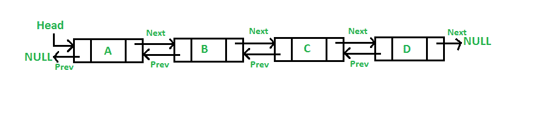
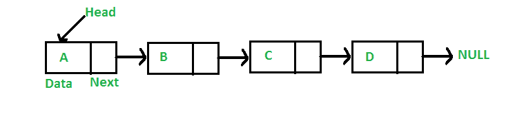
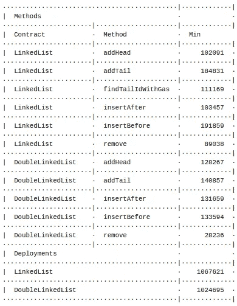

# 以太坊的链表实现

> 原文：<https://medium.com/coinmonks/a-linked-list-implementation-for-ethereum-a2915bf8122f?source=collection_archive---------1----------------------->

## 在 Solidity 中编写数据结构既奇怪又漂亮。


几个月前，我为一个客户在 [Solidity](https://medium.com/coinmonks/solidity/home) 中实现了一个[链表](https://en.wikipedia.org/wiki/Linked_list)。最近，我决定在 Solidity 中实现一个[快速限价订单簿](https://gist.github.com/halfelf/db1ae032dc34278968f8bf31ee999a25),作为一个宠物项目(书呆子不是很有趣吗！)和链表又出现了。

正如我最近在一篇关于何时使用不同数据结构的文章中所写的:

当你需要保持插入顺序时，或者当你想在任意位置插入时，链表是你的数据结构的选择。

我喜欢编写基本的构建模块，似乎没有人做过这一项，所以我很乐意去做。

在本文中，我将介绍单向和双向链表的实现，您可以根据自己的目的重用或修改它。所有的[代码都可以在 GitHub](https://github.com/HQ20/contracts/tree/master/contracts/lists) 中获得，或者作为一个 npm 包。



*免责声明:在写这篇文章的时候，在对合同进行编码之后，我发现了来自 [chriseth](https://github.com/chriseth) 的这个[早期实现](https://github.com/ethereum/dapp-bin/blob/master/library/linkedList.sol)。和他一样，我也考虑过用数组。与使用映射相比，它简化了新项目的创建，但也增加了删除的难度。

# 履行

在这篇文章中，我将忽略 [Solidity 是一种面向对象的编程语言](/coinmonks/solidity-and-object-oriented-programming-oop-191f8deb8316),并在单个契约中编码列表。这样做可以让我专注于基础工作，比如数据使用。一个 [OOP 的实现是可能的](https://github.com/HQ20/contracts/blob/new/lists/oop/contracts/drafts/lists/LinkedListOOP.sol)，但是它的权衡值得一篇独立的文章。

在单一契约实体中实现一个链表并不是一件显而易见的事情。这段代码会非常方便，但是在可靠性上不可行，因为你不能使用递归`structs`。

```
contract ImpossibleLinkedList {
   struct Item {
      Item next;
      address data;
   }Item public head;
```

实体中存在的唯一动态契约变量是映射。甚至数组也是幕后的映射。考虑到这个限制，我能想到的 Solidity 中链表的最佳实现是基于这个:

```
contract LinkedList {
  struct Item {
    uint256 id;
    uint256 next;
    address data;
}
mapping (uint256 => Item) public items;
uint256 public head;
uint256 public idCounter;
```

链表由`Item`组成。`Item`有一个惟一的 id，另一个`Item`的 id 的成员，以及一个作为数据有效载荷的地址。然后，所有创建的项目都存储在由`Item` id 索引的映射中。

如果您知道任何`Item`的 id，只需在映射中查找它，就可以以 O(1)的代价检索它。如果您正在查看列表中的一个`Item`，并且想要继续下一个，您必须检索 item.next，这是一个`Item` id，然后在映射中查找下一个`Item`。

如果这让你感到困惑，不要难过。我也很困惑。我的第一个问题是“如果你可以任意地从一个链表中检索任何一个`Item`，那么这个链表还有意义吗？”。

问题是，是的，有一个点，但范围非常有限。当您需要保持插入顺序时，以及当您想要在任意位置插入时，链表是您的数据结构的选择。事实上，你可以迭代列表，这在一定程度上是有用的，如果你必须在一个事务中这样做，列表不能无限增长。

**当一个契约需要频繁使用有序列表中的几个项目时，您可以使用这种数据结构，您可以假设这些项目的大小有限。**

例如，如果您需要一份合同来始终了解令牌的 100 个最大持有者，以便给他们一些额外津贴。

与以前的文章不同，这次我不打算在这里粘贴整个代码。相反，我将把你引向[完全实现](https://github.com/HQ20/contracts/contracts/lists)。有一个单向链表的实现和另一个双向链表的实现，每一个都有大约 200 行代码，这是我为了最大程度的清晰而精心制作的。

在这种情况下，我认为更重要的是讨论单链表和双向链表之间的权衡，特别是考虑到[以太坊](https://blog.coincodecap.com/tag/ethereum/)区块链在你可以[安全执行的算法方面非常有限](https://hackernoon.com/how-much-can-i-do-in-a-block-163q3xp2)。

# 使用

当我开始实现链表时，我认为做双向链表会比单向链表更复杂。有趣的是，实现前者稍微容易一些。在每个项目中添加前一个项目的链接可以让您消除这种低效的方法:

```
/**
 * @dev Given an Item, denoted by `_id`, returns the id of the Item
 * that points to it, or 0 if `_id` refers to the Head.
 */
function findPrevId(uint256 _id) public view returns (uint256) {
  if (_id == head) return 0;
  Item memory prevItem = items[head];
  **while (prevItem.next != _id) {
    prevItem = items[prevItem.next];
  }** return prevItem.id;
}
```

那种说法是邪恶的。

当您知道一个项目并且想要在它之前插入另一个项目时，您可以随时使用这个方法。相当常见的用例。

LinkedList.sol 和 DoubleLinkedList.sol 之间的 gas 比较更能说明这个问题。对于这些测试，我使用了一个包含 100 个项目的列表。



`addHead`和`insertAfter`与链表的运算都是 O(1)，开销约 100K gas。没有描述数据检索，但是假设我们使用映射，成本将是 O(1)。

问题是我们什么时候需要遍历列表。我们循环的每一个项目看起来花费了大约 1K gas，如在`findTailIdWithGas`中所见(这是一个将`findTailId`包含在事务中的模拟函数，浪费了一些 gas)。

也许我们可以不在尾部添加项目或在已知项目前插入项目，但`remove`功能更成问题。在链表中，你必须从头开始遍历列表来删除条目。在智能合同中，需要非常小心地使用成本为 O(N)的方法，或者最好避免使用。

双向链表更容易实现，也更实用，即使使用起来有点贵。

在这种特定的情况下，气体阻塞限制大约为一千万，这意味着您不能删除距离头部超过 10，000 个位置的项目。这可能非常危险。

另一方面，对于 DoubleLinkedList，所有方法都是 O(1)。`addHead`和`insertAfter`比 LinkedList 中的开销更大，因为我们需要更新一个额外的指针。如果您需要在列表的末尾插入，在两个方向上查找相邻的项目，或者删除项目，您将受益于 O(1)成本。我没有包括循环列表的气体成本，但它们应该与 LinkedList 相同。

正如我之前所说，有趣的是，对于相同的功能，DoubleLinkedList 的部署成本比 LinkedList 低。没那么重要但是很有趣。

和其他事情一样，你的里程会有所不同。也许你可以用一个单向链表，也许你需要一个双向链表。也许你应该使用一个数组。至少现在你都知道了。

# 其他实现

上面讨论的实现并不是唯一的实现，我只是认为它们很容易理解。还有其他有趣的实现可能更适合您的用例:

*   您想要节省一些时间，那么从`Item`结构中移除`id`字段。你实际上并不需要它，真有趣。
*   你不喜欢结构，他们用一个映射代替每个结构变量作为状态变量，它会完全一样。
*   你很乐意在末尾添加一些项目，也许这些项目会在一段时间后过期:你可以使用[renovable queue . sol](https://github.com/HQ20/contracts/blob/master/contracts/drafts/lists/RenounceableQueue.sol)。对于传统的快速限价订单簿来说，这将非常有用。
*   如果列表中的所有项目都是唯一的，那么您可以使用 [OrderedSet.sol](https://github.com/HQ20/contracts/blob/master/contracts/drafts/lists/OrderedSet.sol) 。我喜欢它的简洁和优雅。
*   如果你的列表中的所有项目都是唯一的，但你不在乎顺序，那么你在一个规范的[集合](https://en.wikipedia.org/wiki/Set_(abstract_data_type))之后，从 [OpenZeppelin](https://github.com/OpenZeppelin/openzeppelin-contracts/blob/master/contracts/utils/EnumerableSet.sol) 中获取它。

# 结论

[链表](https://en.wikipedia.org/wiki/Linked_list)是智能合约中考虑的第一个复杂数据结构。鉴于智能契约中的约束迫使我们尽可能简单地编码，有必要了解不同链表实现之间的权衡。

在本文中，我展示了单向链表和双向链表，指向准备重用的[代码](https://github.com/HQ20/contracts/tree/master/contracts/lists)。还提供了天然气成本分析以及安全使用指南。

有机会编写基本的数据结构代码，我感到非常荣幸。有时候，编写智能合约就像回到了很多年前，那时编程意味着非常接近硬件，非常接近数学。我喜欢这样。

如果你正在考虑在一个项目中使用这个代码，想要做出贡献，或者有想法去探索，请[给我写信](http://www.albertocuesta.es)！与阅读我的人交谈总是一种乐趣:)

> [直接在您的收件箱中获得最佳软件交易](https://coincodecap.com/?utm_source=coinmonks)

[](https://coincodecap.com/?utm_source=coinmonks)[](https://coincodecap.com)