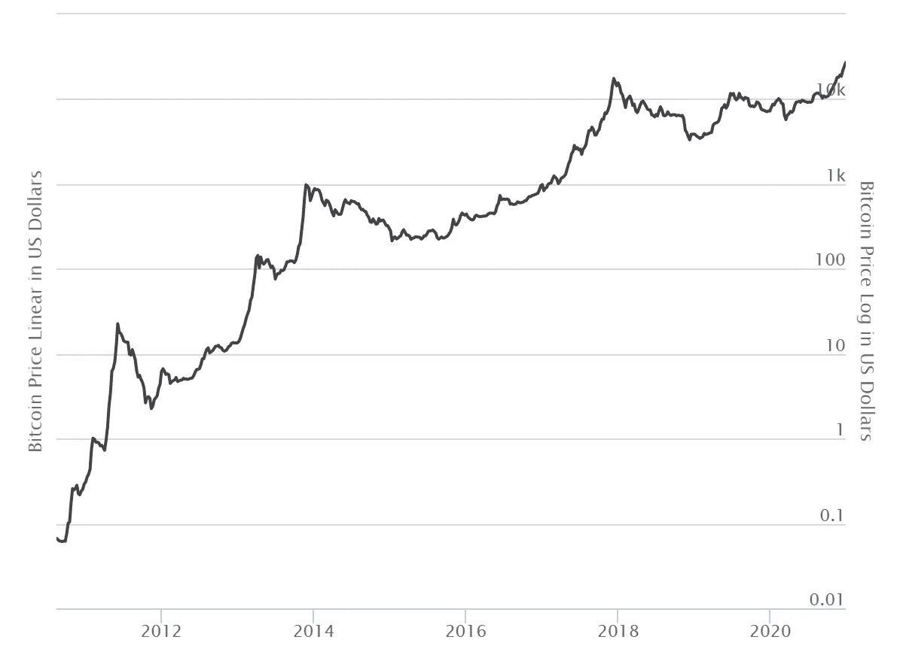
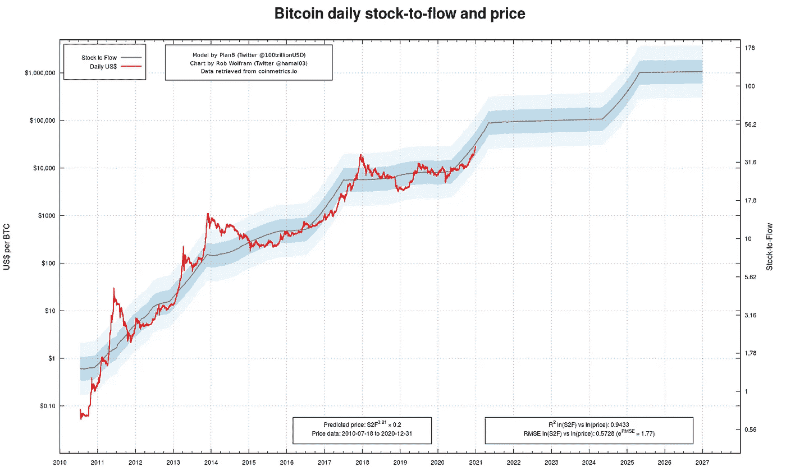
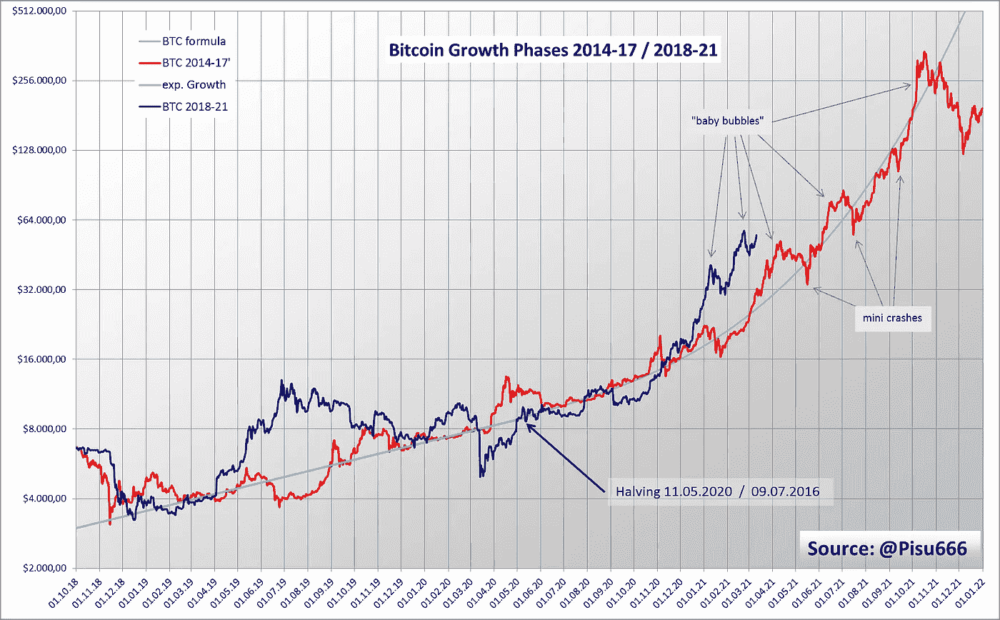
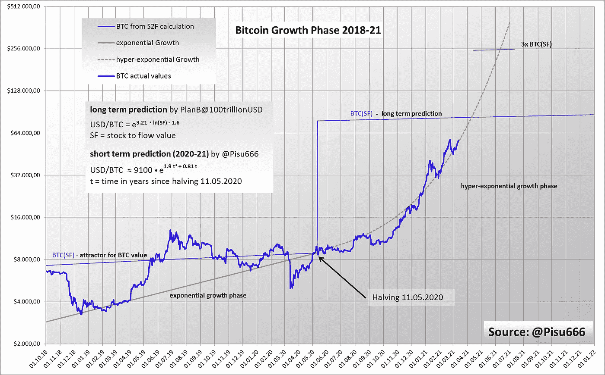

# 一点数学和比特币预测

> 原文：<https://medium.com/coinmonks/a-little-math-and-a-bitcoin-forecast-bcaddc17d252?source=collection_archive---------0----------------------->

## 或者为什么你可以非常准确地预测比特币的价值

# 介绍

任何认真研究比特币的人，问它为什么如此成功，接下来会发生什么，都很难越过 PlanB@100trillionUSD [1]的股票到流量理论。

如果你还不知道这个理论，你应该在这里仔细看看:[PlanBTC.com](http://PlanBTC.com)。

这个理论用简单的数学公式解释了比特币的内在价值。比特币在这里被视为一种稀缺商品，与黄金一样受到高度追捧，遵循市场规律，但除了货币投资之外几乎没有其他用途。

这个理论回答了我很久以来一直在问自己的一个问题。我曾在一篇文章中看到一张图表，是关于比特币价值多年来的变化。这张图表的特别之处在于，它没有像往常一样从 2014 年开始，而是从 2009 年的第一块开始，一直到现在的时间[2]。该图配有数值的对数 Y 轴。

chart by [www.buybitcoinworldwide.com](http://www.buybitcoinworldwide.com)

假设你面前有这样一张图表。在这种情况下，您会立即认识到值级数遵循一条曲线，看起来好像它本身是对数(实际上，它不是对数，它将以这种格式接近线性结束)。

这样规则的形状背后几乎总有一个数学公式，用它可以外推未来的值。你只需要找到它并证明它是正确的。正是 S2F 理论使这成为可能。
如果你看看 S2F 理论的计算，这些值会神奇地与比特币在交易所交易的整个期间的实际价格相匹配。它也被反复调整和扩展，以增加其准确性。

> 交易新手尝试[加密交易机器人](/coinmonks/crypto-trading-bot-c2ffce8acb2a)或[复制交易](/coinmonks/top-10-crypto-copy-trading-platforms-for-beginners-d0c37c7d698c)

然而，人们应该记住，这些对数图看起来比实际更准确。即使是最轻微的偏差也会导致价格的巨大差异。如果你不熟悉对数图表，你应该非常小心。

比特币过程中也存在循环阶段，数值与计算值不符。在这里，高达 10 倍的偏差并不少见。

然而，总而言之，可能没有其他理论能够在如此多的数量级上做出可靠的预测。

S2F chart by Rob Wolfram (Twitter @hamal03)

PlanB 的最新比特币方程式如下:

**$/BTC = e ^(3.21 * ln(SF)—1.6)** 【planb @ 100 万亿美元的方程式】

与 PlanB 相反，我认为这个公式只是一个长期预测。他改变了 SF 值的计算，使之更加精确。因此，他现在使用更长的时间跨度来计算 SF，而不是每天的值。这导致图表中出现“斜坡”,而不是之前显示的步骤。一个更好的总体预测是结果，但他失去了他的论点，即比特币价值在 2013 年初立即跟随新的 SF 值。然而，在我看来，这个论点仍然有效。

我提出了一种不同的方法来预测比特币价格在减半后的增长阶段的短期进展。

我的目标是发展对比特币价格过程的理解，并检查解释价格波动和预测的新方法。

对比特币系统了解的越多；一个人在处理这件事时就越有信心。

# 成长阶段

有趣的是，比特币的内在价值并没有稳定变化，而是似乎在飞跃发展。然而，这些飞跃可以很容易地用减半来解释，减半会立即减少新生成的比特币数量，并强烈影响 S2F 计算中的价值。

问题就出现在这里，为什么比特币在减半后不立即改变价值，切换到新的内在价值。如果你观察减半后的几个月，你会发现这一过程似乎没有太大变化。然而，你必须仔细观察才能理解这些变化。

在 PlanB 的图表中，还有一种自相似性(因此是分形结构)，似乎每四年以不同的数量级重复一次。这是我计算的起点。事实上，必须有可能将 2013 年至 2017 年底的价格趋势与今天的价格趋势进行比较，从 2017 年开始，到 2021 年结束。

如果看价格走势，以最低值为参考点，可以分为增长阶段和衰退阶段。根据这一分类，我们目前正处于成长阶段，因此我暂时将注意力集中在这一阶段。我后面肯定会分析衰退阶段。

所以我得到了自 2014 年以来的所有历史比特币价值[3]，并查看了比特币价值增加的阶段。然后我从 2018 年开始寻找新的增长阶段的开始，并将这些值与 4 年前的值进行比较。旧值的系数为 17.5，偏移正好为 1399 天，两个值趋势可以很好地叠加。1399 天正好与发生在各自时期的两次减半的时间间隔相对应。

bitcoin growth phases in comparison, 2014–2017 and 2018–2021

这个结果让我自己都感到惊讶。两种进步的相似之处显而易见。虽然 2019 年的比特币价值几乎被极大地夸大了一整年。仿佛这是自然的，两个进步再次联合起来，仿佛他们知道通往共同目标的道路。然而，我想指出的是，课程的比较并不意味着等同。我只对找出相似之处感兴趣。

# 比特币公式

在上图中，您可以看到两个不同的阶段。在减半之前具有较平缓过程的阶段和在减半之后的阶段，其中值快速增加。

经过几次试验后，情况似乎明朗了。减半之前的阶段对应于常数指数增长。在对数图中，这会产生一条直线(图中的浅蓝色)。在这里，比特币的价值大约每年翻一番。你可以看到两个级数(红色和蓝色)中的值与这条直线平行，即使它们经常远离这条直线。

将二等分后的相位强制转换成数学公式要复杂得多。指数增长在这里是不够的。只有三倍的增长带来了预期的成功。为了理解这种增长，我们可以想象一个利率。单指数增长对应的是不变的利率，而多指数增长则是指数递增的利率。

通用等式具有以下形式:

**$/BTC = $/BTC(减半时)****e^(ln(a)t****(ln(b)t+1)**
其中
**a** 是减半时的增长因子(2020 年每月 1.07)
**b**是增长的增长因子 **t** 是减半后的时间

参数 **a** 是减半前的不变增长因子， **b** 与稀缺性和市场条件的变化有关。所以很可能和新的 S2F 值，交易量，市场上的欣快有关。

所以减半后的增长公式很容易用减半前已经存在的初始增长来解释。

如果你通过创造比特币的稀缺性来改变市场，你就创造了第二个指数增长函数，它“增加”了现有的指数增长函数。如果没有最初的增长，你会创造一个标准的指数增长，但现在你有一个双指数增长。

通过一点尝试和错误，我调整了参数以创建图表中的绿色曲线。令人印象深刻的是，2017 年，比特币的实际价值很好地遵循了这一公式。
所以比特币实际增长阶段的公式是:

美元/BTC≈9100 e^(0.81t(2.35t+1))
或
**美元/BTC≈9100 e^(0.81t+1.9t)**
其中 t =自 2020 年 5 月 10 日减半以来的年数

请大家自己检查一下这个公式。太神奇了！

# 泡沫

我最初使用 2017 年 12 月 17 日的最大值(当时约为 20000 美元)作为我的公式的目标。然而，这并没有奏效。最高值之前的值的斜率太大，并且这些值不适合任何公式。我意识到“真正的”比特币峰值仅在一个月后达到，之前的更高价值只是暂时的夸大。

短期的夸大并不罕见。对于苏黎世大学的 Didier Sornette 教授来说[5]，超过指数的增长通常是金融泡沫的明确信号[4]。

这样的增长阶段也被称为超指数增长。在这个阶段，你会看到许多“小泡沫”和迷你崩盘。

这些夸大和崩溃越来越快。这导致了泡沫的破裂，从而导致价值的大幅损失。

另见下文:[金融泡沫实验](https://www.myscience.de/news/2010/das_finanzblasen_experiment-ethz)(德语，见最后一段)

这个阶段的特点是投资者越来越兴奋。有趣的是，它直接在减半后开始，大多数时候，值并没有高于预期。

但如果比特币的价值变得比预测的 S2F 值更重要，这当然是一个迟早会破裂的泡沫。并且该值在一定时间后恢复正常。

幸运的是，由于 4 年的周期，比特币的这一时间很短。然而，正如 PlanB 已经提到的，该值可以暂时下降 80% [1]

我不确定这个包含所有参数的公式对于当前的比特币价值是否有效，或者是否存在差异。因此，我试图创建第二组参数，对应于当前的比特币曲线。这是下图中的虚线曲线。然而，我仍然没有足够的数据来证实这一进展。当然，我会随着时间的推移调整计算，并保持图表的更新。

Bitcoin forecast of the actual growth phase

如果你看看我图表中的比特币数值，你会发现 PlanB 用他更新的 S2FX 模型[6]所做的预测应该不会错得那么离谱。他假设比特币的目标价值为 28.8 万美元。我的计算至少表明，这些数值有可能不费吹灰之力就能达到。

# 结论

这个计算当然有很多问题。尽管如此，对许多其他比特币爱好者和我来说，最关键的问题是比特币的价值到底会在什么时候达到最大值。

根据 S2F 理论，到明年年底，比特币的内在价值约为 85 至 10 万美元。但是，在市场的下一次恐慌迫使比特币价格下跌之前，比特币的价格会持续上涨到多高呢？每一个投资者都应该意识到，超过一定数额的崩盘概率一天天地变得越来越大。

这里有一篇关于如何获得这些价值窥视信息的好文章:[📈丰富您的市场周期分析的 5 个固有指标](/paradigma-capital/5-crypto-native-indicators-to-enrich-your-market-cycle-analysis-205b8b8e7314) [7]

如果有人错过了这次崩盘，只有耐心等待下一个增长阶段才会有所帮助。大概会从 2023 年开始。

或者，人们可以等待我对比特币衰退的分析，并据此采取行动。然而，严格的 EMH 理论[8]的追随者不太可能对这里表现出太大的兴趣…

# 参考

[1] S2F 理论 by PlanB @ 100 trillion USD
[https://medium . com/@ 100 trillion USD/modeling-bit coins-value-with-稀缺性-91fa0fc03e25](/@100trillionUSD/modeling-bitcoins-value-with-scarcity-91fa0fc03e25)

[2]历史比特币图表
[https://www.buybitcoinworldwide.com/price/](https://www.buybitcoinworldwide.com/price/)

[3]雅虎财经数据
[https://finance.yahoo.com/quote/BTC-USD/history/](https://finance.yahoo.com/quote/BTC-USD/history/)

[4]李林和 Didier Sornette，具有随机均值回复终止时间的理性预期金融泡沫的诊断
[https://arxiv.org/abs/0911.1921](https://arxiv.org/abs/0911.1921)

[5]迪迪埃·索尔内特
[https://en.wikipedia.org/wiki/Didier_Sornette](https://en.wikipedia.org/wiki/Didier_Sornette)

[6] S2FX 模型 by PlanB @ 100 trillion USD
[https://medium . com/@ 100 trillion USD/bit coin-stock-to-flow-cross-asset-model-50d 260 feed 12](/@100trillionUSD/bitcoin-stock-to-flow-cross-asset-model-50d260feed12)

[7]菲利佩·g .，
[https://medium . com/paradigma-capital/5-crypto-native-indicators-to-enrich-your-market-cycle-analysis-205 b8b8e 7314](/paradigma-capital/5-crypto-native-indicators-to-enrich-your-market-cycle-analysis-205b8b8e7314)

[8] PlanB@100trillionUSD，有效市场假说与 S2F 模型
[https://medium . com/@ 100 trillion USD/Efficient-Market-Hypothesis-and-bit coin-stock-to-flow-model-db17f 40 e 6107](/@100trillionUSD/efficient-market-hypothesis-and-bitcoin-stock-to-flow-model-db17f40e6107)

> 加入 Coinmonks [电报频道](https://t.me/coincodecap)和 [Youtube 频道](https://www.youtube.com/c/coinmonks/videos)获取每日[加密新闻](http://coincodecap.com/)

## 另外，阅读

*   [复制交易](/coinmonks/top-10-crypto-copy-trading-platforms-for-beginners-d0c37c7d698c) | [加密税务软件](/coinmonks/crypto-tax-software-ed4b4810e338)
*   [网格交易](https://coincodecap.com/grid-trading) | [加密硬件钱包](/coinmonks/the-best-cryptocurrency-hardware-wallets-of-2020-e28b1c124069)
*   [密码电报信号](http://Top 4 Telegram Channels for Crypto Traders) | [密码交易机器人](/coinmonks/crypto-trading-bot-c2ffce8acb2a)
*   [从 WazirX 切换到 CoinDCX 的 5 个理由](https://coincodecap.com/reasons-to-switch-from-wazirx-to-coindcx)
*   [联合国硬币评论](https://coincodecap.com/unocoin-review) | [最佳加密赌注硬币](https://coincodecap.com/best-crypto-staking-coins)
*   [如何使用 MetaMask Wallet 获取 KCC 地址？](https://coincodecap.com/kcc-address-metamask)
*   [如何获得自己的。XYZ 领域？](https://coincodecap.com/xyz-domain)
*   [最佳加密交易所](/coinmonks/crypto-exchange-dd2f9d6f3769) | [印度最佳加密交易所](/coinmonks/bitcoin-exchange-in-india-7f1fe79715c9)
*   开发人员的最佳加密 API
*   最佳[密码借贷平台](/coinmonks/top-5-crypto-lending-platforms-in-2020-that-you-need-to-know-a1b675cec3fa)
*   [杠杆代币](/coinmonks/leveraged-token-3f5257808b22)终极指南