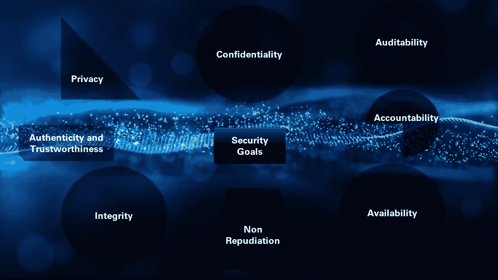

# 比中情局三合会还多一点！

> 原文：<https://medium.com/coinmonks/a-little-more-than-the-cia-triad-6c54d6263083?source=collection_archive---------2----------------------->

Photo by [Franck V.](https://unsplash.com/@franckinjapan?utm_source=medium&utm_medium=referral) on [Unsplash](https://unsplash.com?utm_source=medium&utm_medium=referral)

网络安全领域的任何学生或专业人士都很清楚中情局的三人组。*机密性、完整性和可用性被认为是网络安全宇宙的无限基石，组织应从信息安全设计、实施和保证的角度来考虑它们。在这个不断发展的领域，陷入了*上升-下降-上升(开发-被黑客攻击-升级*)的循环中，除了中情局三人组之外，很少有更多的事情值得关注。*

*我指的是由 Yulia Cherdantseva 和 Jeremy Hilton 提出的信息保证和安全(IA&S)模型之一，即信息保证和安全参考模型(T7)。这里有完整的 [**纸**](http://users.cs.cf.ac.uk/Y.V.Cherdantseva/RMIAS.pdf) 。*

*该模型将一个组织的完整安全架构分为四个主要块，分别是安全开发生命周期、信息分类、安全目标和安全对策。*

*是的，所有这些术语可能看起来很熟悉，对于网络安全领域的老手来说，可能没有什么新的印象。然而，我们在本文中的主要关注点将是这个模型提出的安全目标，并证明在网络安全宇宙中有 8 个而不是 3 个无限之石。*

**

*The Security Goals of the RMIAS Model*

*我强烈建议您在阅读本文之前或之后阅读 [**文章**](http://users.cs.cf.ac.uk/Y.V.Cherdantseva/RMIAS.pdf) ，因为它比我们将要讨论的安全目标有更多的内容。然而，我们将强调这些安全目标的整体参与和重要性，并将其纳入信息技术项目的任何开发阶段(作为最佳实践)。以下是 8 个安全目标，*

*   **保密**
*   **诚信**
*   **可用性**
*   **问责**
*   **隐私**
*   **真实性和可信度**
*   **不可否认性**
*   **可审核性**

## ***保密性***

*这意味着任何能够存储、访问和修改数据的信息系统都应该为消费者提供保密状态。对数据执行的每个操作都应该经过授权，不允许未经授权的访问。*

**信息系统中保密性的实现包括访问级别限制(ACL)、存储和传输信息时密码算法的使用等。**

## ***完整性***

*这一特性确保消费者访问的数据绝不会受到污染。无论是在储存期间还是在传输期间，任何未经授权的修改都是不可能的。它确保消费者存储或应用程序处理的数据是真实的，不会被任何未授权方篡改。*

*在存储应用程序和处理应用程序上使用异常检查和散列是很少的完整性实现。*

## ***可用性***

*可用性是指授权用户或所有者能够以最高效率、无中断地随时访问信息资产的程度。它还包括一个潜在的信息处理系统对于像拒绝服务和分布式拒绝服务这样的攻击是如何冗余的。在这个数字世界中，信息资产的可用性与组织功能的成功成正比。*

**像负载平衡、分布式资产存储和分散式架构这样的实现为强大的可用性做出了巨大贡献。**

## ***问责***

*信息系统有权成功审查一个实体的行动，并让他们对上述行动负责。*

*我们不要将这与机密性混淆，机密性确保有问题的数据不会被篡改，而一旦对信息进行了授权的更改，就有了责任。任何实体(无论是授权的参与者还是所有者本身)都不能否认所做的更改。*

**实施数字签名、使用非对称加密、数字证书是几个值得注意的问责机制。**

## ***隐私***

*该功能能够避免共享谁/什么拥有资产及其相关属性。依赖于信息系统实现的资产所有者应该能够决定访问和处理该信息的标准。*

**它还涉及遵守各种法律和政治问题，如 GDPR、NIST 的隐私框架等。**

## ***真实性和可信度***

*信息系统树中的任何系统都应该能够在根据交互的共同动机采取行动之前成功地建立信任和真实性，也就是说，在实现关键目的之前，参与通信的两个实体应该能够相互信任和认证。一旦实现了这一点，实际的交易就可以进行了。*

**例如，每次我们访问我们的银行页面时，我们都可以通过检查 SSL 密钥、证书和域名注册信息等来确保我们确实访问了银行的原始页面，而不是任何钓鱼网站。同样，银行也可以通过要求我们输入与我们的银行账户相关联的唯一 ID 来对我们进行身份验证，我们可以使用该 ID 登录、进行交易，在某些情况下还可以通过 S.M.S .或验证器(如果可用)进行 O.T.P。**

## ***不可抵赖***

*对特定信息对象进行操作的任何主体都应该能够确认所执行的操作，并且不得通过否认已经证明的更改而逃脱。*

**例如，当我的一个朋友给我发电子邮件时，我可以清楚地验证所使用的电子邮件地址、原始 IP 地址以及我的朋友和他的电子邮件服务提供商特有的数字签名。系统不能为用户提供不可否认性可能会导致严重的假冒攻击。**

## ***可审计性***

*对信息资产执行的每一项更改或操作都应该能够被审核。这是通过记录和验证对资产所做的每一个变更，并存储它们以备将来审计来实现的。这些变化应该包括由人类和信息处理系统完成的变化。外部和内部审计都应该是可能的，并且必须符合要求。它也应该适用于集中式和分散式信息系统树。*

**但是，可审计性、存储和适用法律的范围可能会因使用信息系统的行业而异。例如，与维护特定地铁站的每日代币计数的组织相比，处理客户支付信息的组织可能必须遵循更严格的规章遵循准则。**

*最初，知道这 8 个安全目标对我来说并没有太大的影响。但是，当我尝试将这些目标应用到不同项目的方法中时，我意识到我的思维过程已经变得多么成熟，并帮助我将分析师的视角转变为理想的安全架构师的视角。*

*这就把我们带到了文章的结尾。请考虑这一点，上面的文章是互联网上所有开源材料的合并和简化版本，我已经尽可能地简化了它。此外，我很乐意接受建议和任何必要的更正，使这成为每个人更好的资源！欢迎通过 [*LinkedIn*](https://www.linkedin.com/in/raja-s-35565157) *联系我，或者在*[*Twitter*](https://twitter.com/ratz66)*上关注我！**

## *另外，阅读*

*   *最好的[密码交易机器人](/coinmonks/crypto-trading-bot-c2ffce8acb2a)*
*   *[密码本交易平台](/coinmonks/top-10-crypto-copy-trading-platforms-for-beginners-d0c37c7d698c)*
*   *最好的[加密税务软件](/coinmonks/best-crypto-tax-tool-for-my-money-72d4b430816b)*
*   *[最佳加密交易平台](/coinmonks/the-best-crypto-trading-platforms-in-2020-the-definitive-guide-updated-c72f8b874555)*
*   *最佳[加密贷款平台](/coinmonks/top-5-crypto-lending-platforms-in-2020-that-you-need-to-know-a1b675cec3fa)*
*   *[最佳区块链分析工具](https://bitquery.io/blog/best-blockchain-analysis-tools-and-software)*
*   *[加密套利](/coinmonks/crypto-arbitrage-guide-how-to-make-money-as-a-beginner-62bfe5c868f6)指南:新手如何赚钱*
*   *最佳[加密制图工具](/coinmonks/what-are-the-best-charting-platforms-for-cryptocurrency-trading-85aade584d80)*
*   *[莱杰 vs 特雷佐](/coinmonks/ledger-vs-trezor-best-hardware-wallet-to-secure-cryptocurrency-22c7a3fd391e)*
*   *了解比特币最好的[书籍有哪些？](/coinmonks/what-are-the-best-books-to-learn-bitcoin-409aeb9aff4b)*
*   *[3 商业评论](/coinmonks/3commas-review-an-excellent-crypto-trading-bot-2020-1313a58bec92)*
*   *[AAX 交易所评论](/coinmonks/aax-exchange-review-2021-67c5ea09330c) |推荐代码、交易费用、利弊*
*   *[Deribit 审查](/coinmonks/deribit-review-options-fees-apis-and-testnet-2ca16c4bbdb2) |选项、费用、API 和 Testnet*
*   *[FTX 密码交易所评论](/coinmonks/ftx-crypto-exchange-review-53664ac1198f)*
*   *[n 零审核](/coinmonks/ngrave-zero-review-c465cf8307fc)*
*   *[逐位交换审查](/coinmonks/bybit-exchange-review-dbd570019b71)*
*   *[3Commas vs Cryptohopper](/coinmonks/cryptohopper-vs-3commas-vs-shrimpy-a2c16095b8fe)*
*   *最好的比特币[硬件钱包](/coinmonks/the-best-cryptocurrency-hardware-wallets-of-2020-e28b1c124069?source=friends_link&sk=324dd9ff8556ab578d71e7ad7658ad7c)*
*   *最佳 [monero 钱包](https://blog.coincodecap.com/best-monero-wallets)*
*   *[莱杰 nano s vs x](https://blog.coincodecap.com/ledger-nano-s-vs-x)*
*   *[bits gap vs 3 commas vs quad ency](https://blog.coincodecap.com/bitsgap-3commas-quadency)*
*   *[莱杰纳米 S vs 特雷佐 one vs 特雷佐 T vs 莱杰纳米 X](https://blog.coincodecap.com/ledger-nano-s-vs-trezor-one-ledger-nano-x-trezor-t)*
*   *[block fi vs Celsius](/coinmonks/blockfi-vs-celsius-vs-hodlnaut-8a1cc8c26630)vs Hodlnaut*
*   *[bits gap review](/coinmonks/bitsgap-review-a-crypto-trading-bot-that-makes-easy-money-a5d88a336df2)——一个轻松赚钱的加密交易机器人*
*   *为专业人士设计的加密交易机器人*
*   *[PrimeXBT 审查](/coinmonks/primexbt-review-88e0815be858) |杠杆交易、费用和交易*
*   *[埃利帕尔泰坦评论](/coinmonks/ellipal-titan-review-85e9071dd029)*
*   *[赛克斯石评论](https://blog.coincodecap.com/secux-stone-hardware-wallet-review)*
*   *[BlockFi 评论](/coinmonks/blockfi-review-53096053c097) |赚取高达 8.6%的加密利息*