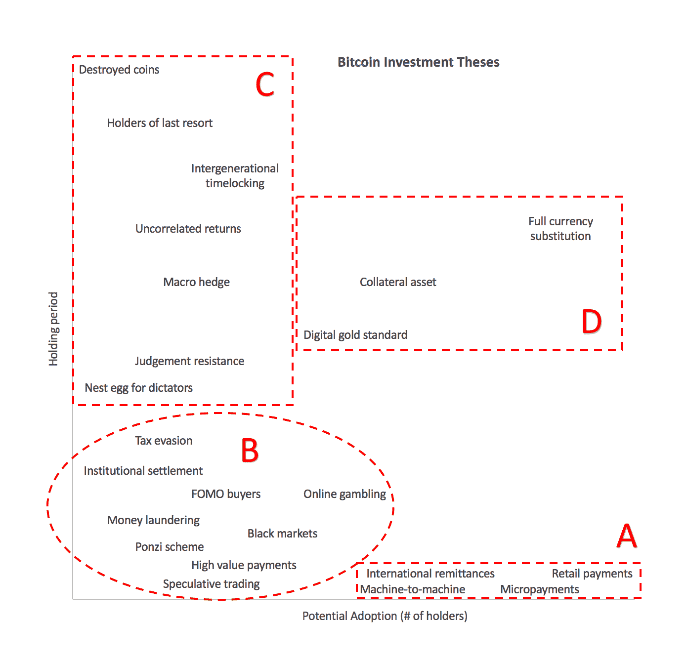
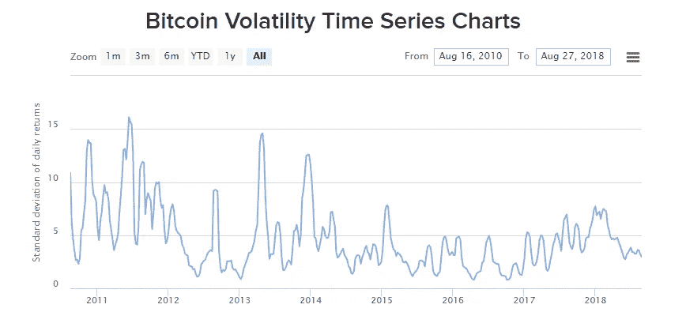

# 看看 2018 年加密资产的采用、激励和价值流

> 原文：<https://medium.com/coinmonks/a-look-at-adoption-of-cryptoassets-incentives-and-flows-of-value-in-2018-7ca470d24623?source=collection_archive---------5----------------------->

Following the herd

对影响 2018 年加密资产网络采用的因素进行漫无边际的探索，触及它们如何在此过程中创造、捕获和分配价值。

## 简介——比特币及其他

自中本聪最初发布比特币软件、启动整个行业以来，已经过去了近 10 年。在大卫·肖姆、戴伟、尼克·萨博、亚当·贝克、哈尔·芬尼等人的开创性工作的基础上，Satoshi 解决了重复消费问题，并利用一种分布式账本(我们现在称之为区块链)创建了世界上第一种去中心化的加密货币。

比特币网络使用一种工作验证机制来使其区块链不可改变，并通过不可伪造的高昂成本来引入稀缺性。
实际上，它将能量转化为加密哈希，这样一来，它就成为了第一个真正稀缺的数字产品。

这个网络从无到有，发展到今天的 1000 多亿美元的交易/结算/价值储存/投机网络。

在比特币之后，无数其他加密资产涌现出来。一些人试图实现类似的目标(加密货币)，一些人试图塑造一个去中心化服务、工人和用户的新世界(加密商品、公用事业令牌、dApps)，一些人试图重新定义数字所有权和证券(安全令牌、NFT)。

大量阴暗的计划也比比皆是。Bitconnect 有人吗？
在这样一个新的、快速增长的领域，这并不奇怪。部分原因是市场参与者普遍缺乏知识，大量资金流入该领域，炒作和老式的贪婪。再加上缺乏监管、(伪)匿名的诱惑和不可改变的全球转账网络，这对网络罪犯、骗子之类的邪恶类型来说是一个非常诱人的提议。

加密网络中的一个共同主题是，它们应该通过激励措施来调整网络参与者，以共同努力实现广泛的共同目标。

这个目标就是网络的发展和加密资产的增长。

为了扩大网络，增加价值，采用是关键。没有用户的网络没有多大用处或价值。

让我们看看这种关系…

## 梅特卡夫定律——网络价值和用户数量之间的关系

根据[梅特卡夫定律](https://en.wikipedia.org/wiki/Metcalfe%27s_law)，一个网络的价值与用户数量的平方成正比。

这可以用电话网络的例子来说明:现有的一部电话是无用的，与任何人都没有联系。然而，每部电话的价值随着网络中电话总数的增加而增加，因为每个用户可以联系的总人数增加了。

在社交网络中也可以看到同样的情况，随着服务用户数量的增加，服务对社区越有价值/越有用(对集中服务提供商(脸书、Twitter 等)也是如此，他们获取了自己创造的大部分价值)。

出于对数学的好奇，具有(n)个节点的网络中的连接数等式可以表示为 n(n1)/2。

现有的 1 部电话可以连接任何人，2 部电话可以建立 1 个连接，5 部电话可以建立 10 个连接，10 部电话可以建立 45 个连接，100 部电话可以建立 4500 个连接。

The power of network effects

随之而来的是，加密网络的价值和效用将随着采用和全球使用的增加而上升。

有多少价值将在堆栈中的不同层被捕获，这是一个激烈争论的问题，还有待观察。

将价值转移给用户的机制可以作为一种营销工具，进一步鼓励采用。

正如 Satoshi 在 2009 年谈到比特币时所说的，

> “从这个意义上说，它更典型的是一种贵金属。不是供应改变以保持价值不变，而是供应被预先确定并且价值改变。随着用户数量的增长，每枚硬币的价值也会增加。它有可能形成正反馈循环；随着用户的增加，价值也会上升，这可能会吸引更多的用户来利用不断增加的价值。”

让我们快速了解一下加密网络中的价值创造和获取…

## 网络中的价值获取—快速介绍

根据网络内代币经济政策的机制，一些代币可能难以获取价值。

对此提出的一个原因是所谓的“高速问题”。

简而言之，这与以下观点相反:如果代币供应固定，而需求增加，那么代币的价格也必须增加。
虽然有时是真的，但有人建议不一定总是这样，因为没有考虑令牌的速度。

速度被定义为总交易量/平均网络价值。

如果没有人有持有代币的动机(例如，对于专有支付代币)，那么代币的速度将与交易量成比例地增加，但是网络价值可以保持不变。因此，每个代币的价格没有变化。

如果在实施经济政策和激励机制时不考虑这一点，许多公用事业令牌可能会遭受这种命运。

然而，一些代币可能获得大量价值。即令牌价格随着网络用户数量的增加而增加。

根据用途、协议规则和网络参与者的构成，不同类型的加密资产将以不同的方式创造和获取价值。

密码资产和网络将如何创造、获取和分配价值是一个引人入胜的课题，其规模和重要性都是巨大的。
这个空间的发展值得关注。

一些关于这些事情如何发生以及价值如何流动的背景阅读:

*   关于金钱类型的密码资产，参见 [Arjun Balaji](https://medium.com/u/215d7482aa0c?source=post_page-----7ca470d24623--------------------------------) 撰写的[评估密码网络-令牌日报](https://www.tokendaily.co/blog/the-best-fundamental-indicator-new-inflows)(胖钱论文)。
*   对于效用型隐资产，参见[凯尔·萨马尼](https://medium.com/u/2e8de4ec5cc0?source=post_page-----7ca470d24623--------------------------------)的[理解令牌速度-多货币资本](https://multicoin.capital/2017/12/08/understanding-token-velocity/)和[效用令牌新模型-多货币资本](https://multicoin.capital/2018/02/13/new-models-utility-tokens/)以及[关于价值、速度和货币理论-亚历克斯·埃文斯](/blockchannel/on-value-velocity-and-monetary-theory-a-new-approach-to-cryptoasset-valuations-32c9b22e3b6f)的。这些文章给出了所有上述优点的背景:工作令牌，赌注函数，利润份额，烧钱均衡和其他可能捕捉价值的机制。
*   [王峤](https://medium.com/u/1be3b11ab869?source=post_page-----7ca470d24623--------------------------------)和[丹·麦克戴尔](https://twitter.com/robustus)、[的《价值的储存》论文](https://tokeneconomy.co/the-store-of-value-thesis-42d3cfde50a9)在这篇文章中探索了使密码资产成为一个好的价值储存的基础和更高阶的属性。
*   关于哪些加密资产将能够增值的话题，[亚历山大·利格尔](https://medium.com/u/7a46048108d6?source=post_page-----7ca470d24623--------------------------------)和[哈苏福尔](https://medium.com/u/90326a938400?source=post_page-----7ca470d24623--------------------------------)在[“加密货币的演绎估值框架”](/@alexander.liegl/a-deductive-valuation-framework-for-cryptocurrencies-a6bfa085a8b6)中提出了 12 个前提，从而得出一个逻辑结论。
*   关于加密资产的机遇和影响的两个主要思想流派的概述:[Money Crypto vs . Tech Crypto-Token Daily](https://www.tokendaily.co/blog/money-crypto-vs-tech-crypto)作者 [Erik Torenberg](https://medium.com/u/abcbbcac8a09?source=post_page-----7ca470d24623--------------------------------) 。
*   强烈推荐由克里斯·伯尼斯克[和杰克·塔塔尔](https://twitter.com/cburniske)所著的《加密资产——比特币及其他创新投资者指南》一书。该领域的坚实背景和概述，以及调查和评估加密资产的可行框架。

**当以批判的眼光看待一个加密网络时，重要的是要问:**

*   网络将如何创造价值(能创造多少价值)？*(服务、公用事业、货物配送等)*
*   加密资产将如何获取该价值(多少，由谁获取)？*(规定供应时间表的经济机制，允许权利要求、分配、使用公用设施、因供求关系引起的价格上涨、连锁现金流等)*
*   谁是网络生态系统中的代理，如何激励和协调他们实现共同目标(治理政策是什么)？*(协议规则、最终用户、服务提供商、矿工、验证者、开发者、第三方、企业家等)*

无论价值最终在何处被捕获，无论是在协议层、应用程序层，还是由具有最佳 SoV 属性的网络捕获，网络的发展仍需要提高采用率，这样才能有价值被捕获。

## 提高采用率—需要做什么以及如何做？

因此，采用率需要继续提高。

那是什么意思？需要更多地使用网络，特别是终端用户。

用户是谁？这将取决于加密资产的类型。

**以比特币为例，网络参与者为:**

*   比特币的所有者(网络中的持有者和消费者)
*   矿工(网络中的工人)。
*   开发人员和工程师(网络的创建者和维护者)
*   节点(网络的验证器)
*   在网络之上构建业务和服务的第三方(交易所、钱包、第二层产品、应用等)

这个例子中的关键用户是比特币的所有者。

由于供应固定(以及降低流通速度的霍德勒的存在)，想要比特币的人的需求增加将导致价格上涨。

这反过来吸引了更多的其他网络参与者——矿工、开发人员、工程师和第三方，他们构建并扩展了生态系统。这导致了一个正反馈循环，吸引了更多的网络终端用户(购买和使用比特币的人)。

[Vijay Boyapati](https://medium.com/u/9efdc740067f?source=post_page-----7ca470d24623--------------------------------) 的优秀文章[“比特币看涨案例”](/@vijayboyapati/the-bullish-case-for-bitcoin-part-3-of-4-2e2c002593f1)的第三部分讨论了货币的演变，并陈述了货币总是在以下 4 个阶段演变的案例:

> **1。可收藏的**。在货币进化的第一阶段，人们对货币的需求仅仅是基于它的特殊属性，通常是它的拥有者的异想天开。贝壳、珠子和黄金在后来转变为人们更熟悉的货币角色之前都是收藏品。
> 
> **2。价值储存:一旦足够多的人因其独特性而需要它，货币就会被认为是一种随着时间的推移保持和储存价值的手段。随着一种商品被越来越广泛地认为是一种合适的价值储存手段，它的购买力会随着更多的人出于这一目的对它的需求而上升。当人们广泛持有价值储存手段，并且希望将其作为价值储存手段的新人群减少时，价值储存手段的购买力最终会趋于平稳。**
> 
> **3。交易媒介**:当货币完全被确立为价值储存手段时，其购买力就会稳定下来。购买力稳定后，使用货币完成交易的机会成本将减少到适合作为交换媒介的水平。在比特币的早期，许多人没有意识到使用比特币作为交易媒介而不是作为初始价值储存手段的巨大机会成本。一名男子用 10，000 个比特币(在本文撰写时价值约 9400 万美元)换取两个披萨的著名故事[说明了这种困惑。](https://bitcointalk.org/index.php?topic=137.0)
> 
> **4。记账单位**。当货币被广泛用作交换媒介时，商品就会以货币来定价。也就是说，对货币的汇率将适用于大多数商品。一个常见的误解是，如今许多商品都有比特币价格。例如，虽然一杯咖啡可能可以用比特币购买，但上面列出的价格并不是真正的比特币价格；而是商家期望的美元价格，按照当前的美元/BTC 市场汇率转换成比特币。如果比特币的美元价格下跌，商家要求的比特币数量将相应增加。只有当商家愿意接受比特币进行支付，而不考虑比特币对法定货币的汇率时，我们才能真正认为比特币已经成为一种记账单位。

如果比特币的接受度和使用率增加，它可以经历货币进化的各个阶段，从收藏到价值储存，再到成为交易媒介。如果它普及的话，也许最终会成为一种记账单位。

比特币现在不仅仅是一个概念证明，也可以说不仅仅是一种新颖的数字收藏品。它似乎正在从收藏品转变为价值储存手段。这种说法当然越来越有分量。

随着价值存储用户群的增长，网络价值增加，比特币的价格也会上涨。

如果价格预计会上涨，直到用户群的增长变得平稳且更加稳定，那么现在花比特币是没有意义的，除非你当时真的需要钱。

当你有可能在未来卖出更多的东西时，为什么要在今天卖出呢？

因此，霍德勒是比特币生命周期这一阶段的一类用户。通过强化对比特币的信念，以及帮助降低代币的流通速度，他们正在帮助比特币成长为一种价值储存手段。
开发者激励和霍德勒的权力被[布伦丹·伯恩斯坦](https://medium.com/u/9f6cbc517a03?source=post_page-----7ca470d24623--------------------------------)在[加密货币是货币，而不是股权——代币经济](https://tokeneconomy.co/cryptocurrencies-are-money-not-equity-30ff8d0491bb)。

上一节说了很多如果。所有人都在关注一个关键问题:是什么导致了比特币需求的增长？

不同的人有不同的参与或使用理由。

Pierre Rochard 在这里保存了一份[比特币各种牛市和熊市的综合清单](https://github.com/PierreRochard/bitcoin-investment-theses)。以下是该网站的图片，以图形形式显示了该列表:

Image taken from [https://github.com/PierreRochard/bitcoin-investment-theses](https://github.com/PierreRochard/bitcoin-investment-theses)

**其他加密资产和网络可以通过提供以下服务来吸引用户和其他参与者:**

*   通过应用程序或服务的效用。
*   收入/现金流/散列流的潜在新方法。
*   其他有感知价值的东西*(股权、网络中的工作/投票权、未来折扣、稀有游戏物品、所有权/地位证明等)。*

正如本文前面提到的，用于访问实用程序的令牌的价格不一定会随着网络使用的增加而增加，甚至可能不是一个理想的属性。

公用事业本身可能足以吸引许多新用户，但网络中的其他参与者需要得到足够的激励和回报。如果不是这样，每个人都不会朝着网络的相同关键目标一致，也就没有足够的参与者来为系统提供动力。

这可以通过多种方式进行管理，例如使用双令牌系统，一个用于访问实用程序，另一个内部令牌用于系统的其他参与者。
这种实现的一个例子是使用内部的第二令牌来授予工作权限。该令牌可能表示允许您从网络上获取多少百分比的作业。随着对网络提供的公用事业的需求上升，持有这些工作令牌的工人可以完成更多的工作。现在，每一个代币都代表着比需求上升前承担更多工作的权利，因此对每一个代币的竞争——完成总工作数量%的权利——应该会增加。随着就业竞争的加剧，第二种代币的价格应该会上涨，假设在此期间供应不会增加太多。

**增加所有类型用户的三个一般因素是:**

*   **相信资产会增值。**认为获取、持有和使用安全、可靠且简单。
*   **由杀手级应用**提供的可靠实用程序的外观，具有出色的用户界面和 UX，与现有方法相比具有明显的优势。这可以通过与 Twitter、Whatsapp、脸书、亚马逊等成熟服务的合作来实现。
*   **时间。**熟悉度的提高、信任度的培养和使用率的上升都需要时间。设计、构建和部署所需的新基础架构需要时间。也就是说，我们仍处于这个行业的早期阶段，并且正在以极快的速度前进。过去十年发生了很多事情，毫无疑问，下一个十年还会发生更多事情。本文中讨论的对采用有积极影响的因素都需要时间。进步是渐进的，不是恒定的，也不总是朝着正确的方向。还有很多要学的。稳扎稳打赢得比赛。

**其他可能影响加密资产采用的因素:**

**人们需要一个采用这些技术的理由。**需要有与人们的愿望和需求产生共鸣的用例，这些用例相对容易理解并适合他们的生活。
一些可能的用例包括:杀手级应用(谁知道会以什么形式或提供什么工具)、抗审查的价值存储、交易媒介、数字版权管理、股权令牌化、结算、汇款、数字所有权、借贷、衍生品、预测市场、Dao、智能合同、审计、数字身份。

**公众对概念的熟悉程度**。随着相关技术渗透到我们的社会和文化结构中，它们变得不那么陌生，更正常，也更有可能被尝试。

**公众对网络的信心和认知。**人们喜欢分享故事的背后，而分享的故事就像模因一样，在范围和影响力上传播。
一般来说，人们通常更喜欢(被视为)做他们的社区或社会认可的事情。或者换句话说，如果没有非常诱人的回报，人们不想冒被社区排斥的风险。许多人可能需要看到他们的同伴和部落领袖积极地发出使用这种东西的信号，否则，他们将需要一个真正好的理由来说服他们使用或探索任何与它有关的东西。媒体报道在这方面也发挥了很大的作用。

**公众对以这种方式持有/转移的价值安全性的看法。**无论是系统整体的安全性，还是个人财富的安全性。

**我们可能会看到人们转向想要一种全球化、数字化、健全的货币。想要一种不受审查的货币，有固定的货币政策，不受任何中央银行或政府的控制或干预。**

**或者是希望控制自己数据的用户的转变，**远离集中的技术巨头。随着用户将自己的数据货币化，这可以更进一步。

**政府采纳、监管和合法性** *(法律指导、SEC 监管、期货市场、ETF、税收指导、对新业务/行业的开放等)。
在正常情况下，有理由认为大多数人不愿意违反他们国家的法律，除非他们认为绝对必要。例外情况是，当他们从根本上不同意法律或政府时，或者认为违反了法律，就好像这是一个轻微的违法行为。有点像合法版本的善意谎言。*

对许多人来说，他们的政府开绿灯是必不可少的。对其他人来说，需求超过了法律的潜在后果。这种需求的一个例子可能是保护财富免受恶性通货膨胀或腐败政府的影响。

**用户体验(UX)和用户界面。**能够使用加密资产/网络/应用程序实现其效用，而无需了解幕后发生的事情。

今天使用 crypto 感觉和以前使用 DOS 或其他 CLI 没有太大区别。

图形用户界面近年来有所改进，使得普通用户更容易使用加密技术，但是 UX 还有很长的路要走。

目前的情况是，仍然需要人工输入交易地址，一个失误就可能不可挽回地导致资金永久作废。轻易地把你的钱扔进空气中是一个很大的障碍，尤其是对不太懂技术的人来说。命名服务和数字身份的发展将有所帮助。

我们仍然处在这样一个阶段，如果不首先了解协议和网络工作方式，这项技术很难利用。这是新生协议的共同特征和挑战。想想人们如何使用早期的计算机和早期的互联网并与之互动。协议很复杂，但智能手机也是如此，然而数十亿人每天都在使用它们，却不关心它们有多复杂，也不知道它们是如何工作的。

**保管服务。**与希望防止意外输错您的财富的问题类似，将会有防止丢失私钥和第三方财富保护的需求。

虽然“成为你自己的银行”对加密领域的许多早期采用者很有吸引力，但对于大多数主流或大型机构投资者来说，这还没有吸引力，因为如果你丢失(或泄露)了你的私钥，你可能会失去所有的东西，而且几乎没有任何回报。能够提供托管或集成到现有框架中的安全备份系统的服务将有助于缓解这些担忧。比特币基地、巴克特和其它银行在这方面取得了显著进展，旨在让这一资产类别的投资更安全、更容易获得、更有吸引力。

**波动性。交易员和交易所所有者都喜欢波动。
这为他们提供了赚钱的机会。
散户一般不爱价格波动。
这(经常)给他们带来赔钱的机会。**

预计随着比特币用户数量的增长放缓，总数变得更加稳定，那么波动性就会下降，价格也会变得更加稳定。每个在系统中买入或套现的人，在庞大的总池中都会产生较小的水花。

这导致了一部分潜在市场参与者的第 22 条军规:
波动性很高，使得进入市场的吸引力降低。然而，如果更多的人进入市场，波动性将会降低…
这让人想起墨西哥僵局的画面，志同道合的潜在客户决定进入策略，遵循“你先请”的原则，每个人都在等待其他人先进入，除非有其他驱动力导致改变主意。

然而，在过去的十年中，采用率有所增加，波动性的大致趋势似乎是整体下降(大幅波动)。

下图显示了自 2010 年 8 月以来 BTC/美元的 30 天波动，摘自[比特币波动指数](https://www.buybitcoinworldwide.com/volatility-index/)网站:

30 day BTC/USD volatility, from [The Bitcoin Volatility Index](https://www.buybitcoinworldwide.com/volatility-index/)

尽管波动很大，但越来越多的人，除了交易者，还是选择了冒险。

风险和回报是一个硬币的两面。随着波动性的增加，风险通常也会增加，尤其是在短期内。随着风险的增加，损失增加和/或回报增加的可能性也越来越大。否则为什么要冒额外的风险呢？

霍德勒、“信徒”和其他早期采用者也不太介意波动性，主要是因为他们的时间偏好较低。这对这个群体来说是一个长期的游戏。如果它实现了自己的承诺，并如预期的那样获得了价值，未来的估值将远远高于目前的范围。

另一类可能不介意波动性的用户是投资者，他们希望在自己的投资组合中包含%的加密资产，以实现多样化。如果投资者认为加密资产与其投资组合中的其他资产类别具有低相关性或负相关性，就会发生这种情况，从而有可能降低整体投资组合风险。

被大公司(沃尔玛、亚马逊、麦当劳等)采用，或与现有的主要应用程序(Twitter、Whatsapp 等)整合。这显然会导致大量新用户通过集成获得曝光率，从而导致采用率大幅上升。此外，来自知名品牌的代言对刺激公众信心和接受度大有帮助。

**其他领域的行业采用(医疗保健、供应链管理、游戏行业等)**随着越来越多的行业调查和试验这项技术如何为他们带来好处，以及随着技术的成熟，好处越来越明显，越来越多的其他参与者也会参与进来。

**增加了便捷的平坦坡道。**这已经发生了。在过去的几年里，交易所、自动取款机、本地比特币兑换 ups 等的数量增加了很多。尽管如此，仍然有很大的改进和发展空间。

**物联网领域的发展带来了对机器对机器支付的需求。**用户不需要是人类！

**更好地实施和全面理解内部经济价值获取和激励机制。**这更多的是一个内部因素，即学习和开发最佳方法来鼓励网络参与者的成长，并适当地分配价值。我们在这方面仍然是新手，而且正在进行许多实验。钉住价值捕捉和激励机制将是采用的长期驱动力。

**黑天鹅事件**。像比特币被黑，量子计算机破解加密，成功的 51%攻击，不可预见的攻击向量被利用等等。所有这些事情对于采用的进程来说都是相当毁灭性的。根据定义，这些可能性不大，但仍有可能。

## **总结**

在本文中，我们研究了网络用户数量与其价值之间的关系，然后简要探讨了如何通过加密资产获取这一价值。
在这种背景下，我们接下来看看谁是网络参与者和用户，以及加密网络如何吸引和激励他们。

最后，我们探讨了可能影响采用率的各种因素。

太空每天都在快速发展。然而，时间在这里仍然是一个关键因素。

信任需要时间。建设基础设施需要时间。发展信任或基础设施没有多少捷径。反正不是耐用的。

该行业仍处于某种原始的工业阶段——全面充实和建设基础设施和生态系统。
因此，当谈到主流收养时，我们还没有准备好迎接从众的蜂拥而至。
这很好，因为主流也还没有准备好完全采用。

随着比特币稳步前进的每一个瞬间，它的价值主张得到了加强，积极的叙述得到了加强，生态系统得到了发展。

有很多事情要做。
我们有时间…

是时候建造了！

> [直接在您的收件箱中获取最佳软件交易](https://coincodecap.com/?utm_source=coinmonks)

