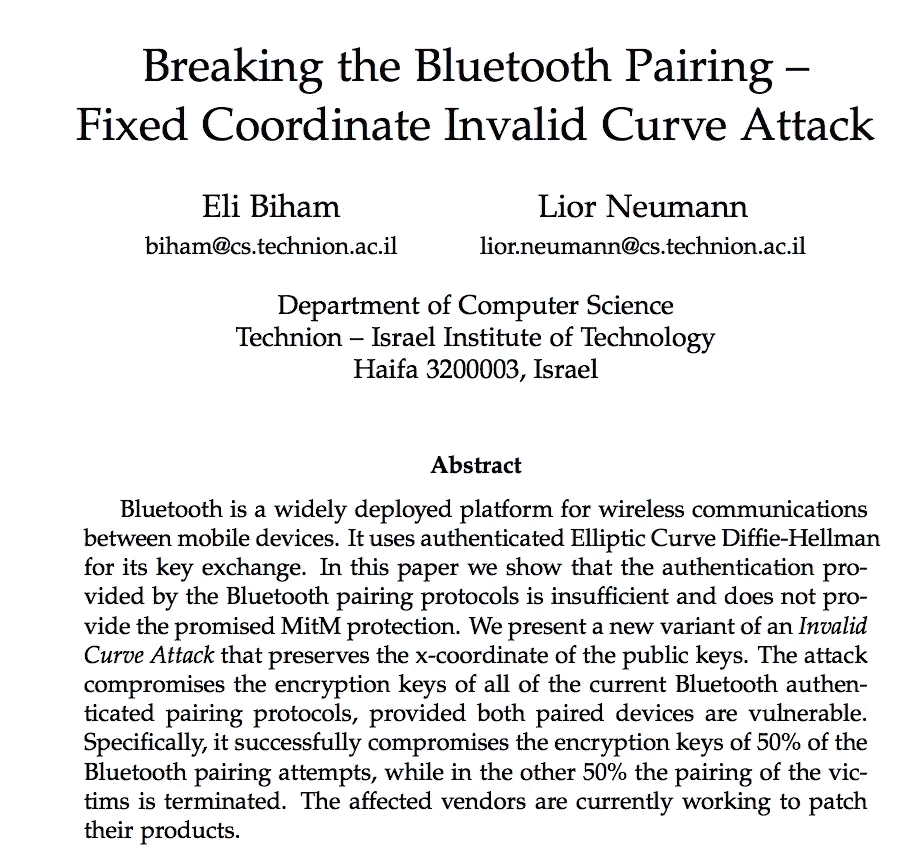

# BlueZero:一个主要的(也是草率的)蓝牙漏洞…马上打补丁！

> 原文：<https://medium.com/coinmonks/a-major-and-sloppy-bluetooth-vulnerability-patch-now-b584fddde860?source=collection_archive---------7----------------------->

## 介绍

过去，无线安全性一直受到低标准和弱实施的影响。例如，WEP 几乎破坏了安全手册中的每一条规则，而且它可以在几小时内被破解，并破解整个网络。但是现在是蓝牙显示出一些糟糕的实现标准，因为…