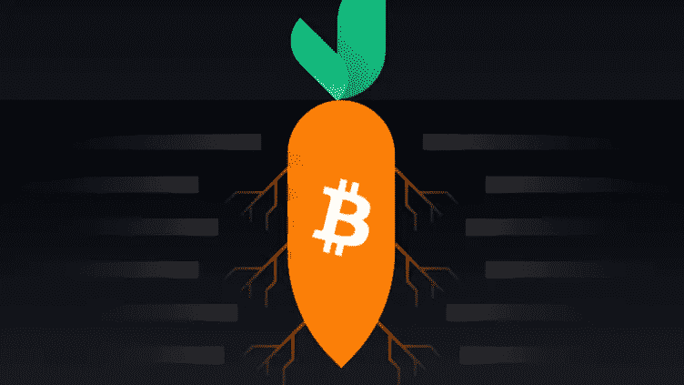
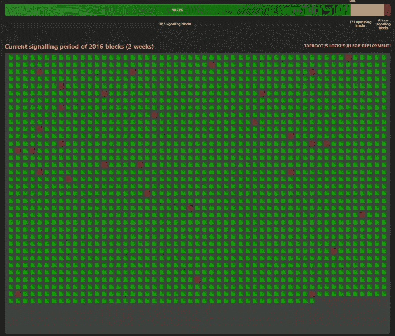
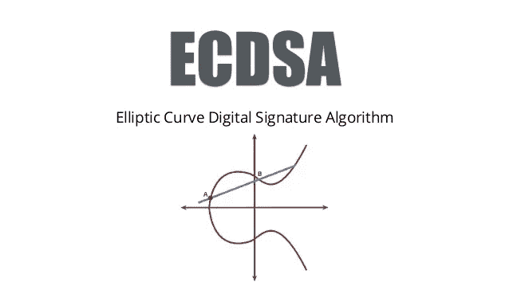
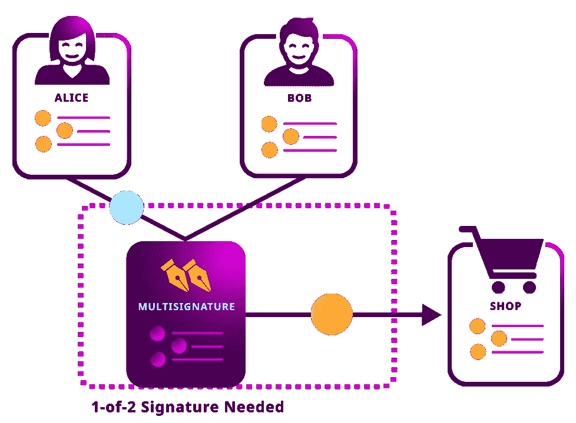
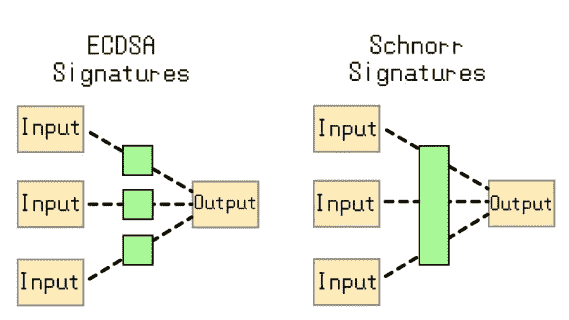
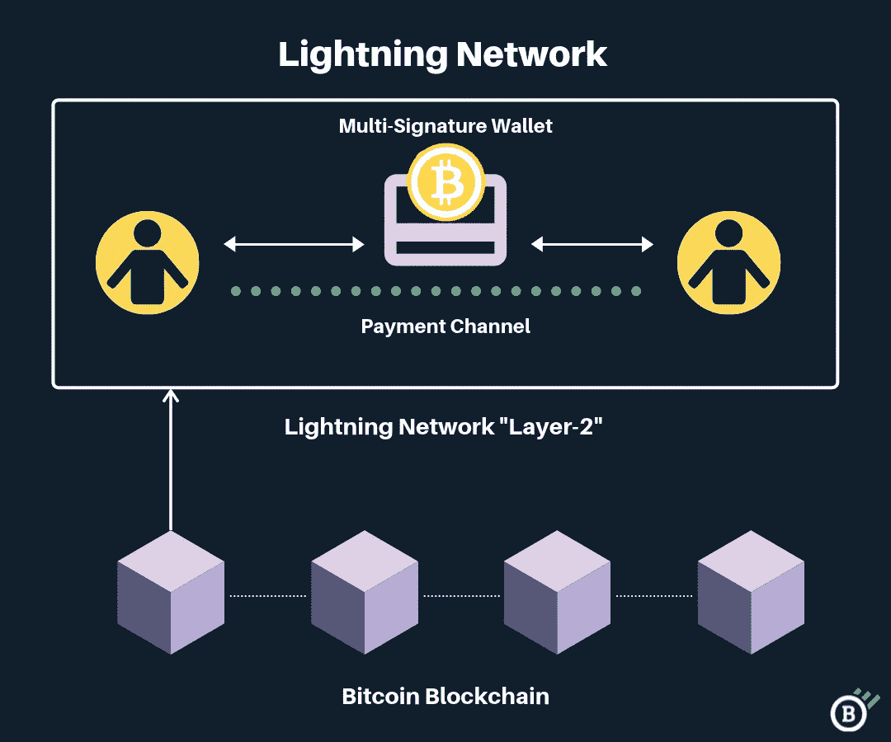

# 改变一切的改造:比特币主根更新

> 原文：<https://medium.com/coinmonks/a-makeover-that-changes-everything-the-bitcoin-taproot-update-e839cad853a0?source=collection_archive---------1----------------------->

Taproot. Source: [https://academy.binance.com/](https://academy.binance.com/)

我从来都不是比特币的狂热粉丝。

事实上，我其实不喜欢它。

虽然我真的很认同比特币最初被创造出来的去中心化和隐私的价值观，但它迄今为止根本无法实现这些价值观。

解决原像哈希难题所需的大量计算能力使得**比特币真正的去中心化将永远只是一个白日梦**。只有那些拥有大量非常强大和昂贵的 ASIC 矿机(用于解决所述难题)的人才能获得在网络中验证交易的能力。

我们今天非常清楚地看到这一点，大部分网络散列能力仅来自几个最大的矿池。简而言之，当涉及到比特币网络时，没有真正的权力分散。

此外，**比特币网络上的交易也永远不会真正匿名。**

当然，在比特币网络上交易时，你唯一会透露的信息是你的公共地址。因为这个地址已经被加密函数和数字签名算法(分别是 SHA-256 和 ECDSA)散列化，以防止逆向工程，它肯定提供完全匿名，对吗？

*错了。*

事实上，将数字比特币账户上的公共地址与现实世界的身份联系起来，比大多数人想象的要容易。你甚至不需要编程技能来做到这一点！许多组织——甚至个人——以前都成功地这样做过。

在这里，我们意识到，当我们在比特币网络上交易时，也没有真正的隐私。

**总之，比特币诞生于奇妙的原理，但由于理论思考和现实应用之间的差异，它未能实现这些原理。**

这就是为什么我从来没有真正喜欢过比特币，并一直希望它巨大的市场优势有一天会被以太坊这样更有用的项目颠覆。

比特币作为区块链和加密货币世界的“老大哥”的统治肯定会很快结束，因为它有许多局限性，并且无法遵守其创立原则。

至少我是这么认为的。

现在随着主根更新的进行，*一切都变了*。

***主根的背景故事***

在我深入研究它的具体细节之前，让我先给你一个关于主根更新背景的更好的想法。

Greg Maxwell. Source: [www.coindesk.com](http://www.coindesk.com)

2018 年 1 月，比特币核心开发者 Greg Maxwell 正式发布了 Taproot 更新提案。3.5 年后的 2021 年 6 月 12 日，Taproot 正式获得足够的挖矿支持，锁定激活。

具体来说，在最近指定的两周困难期(或最近的“投票”轮)内开采的 2016 个区块中，至少有 1815 个区块被发现包含指向矿工集体支持(90%或以上)主根升级的信息。

在这个特定的困难时期，并且在块 687284，这个 90%的阈值最终被满足。

事实上，当这个为期两周的困难期在周日结束时，很可能主根升级将锁定超过 99%的区块，明确表示对其有利。

这与比特币在 2017 年的最近一次升级形成鲜明对比，这次升级有时被称为“内战”，比特币社区内部的意识形态分裂导致了一次硬分叉，最终形成了两个截然不同的项目，比特币现金和比特币。

追随前者的人希望通过将最大块大小增加到 8mb 来提高事务速度，而后者部署了隔离见证(SegWit)升级，将数字签名与事务元数据分开，以减少存储负载。

然而，这一次，直根得到了几乎所有人的支持。这一罕见的集体共识时刻在很大程度上是因为拟议中的变化代表着对比特币协议的巨大改进，这将从根本上提高其推动几个关键功能的能力，这些功能对比特币的存在至关重要(我将在稍后讨论)。

The ‘voting’ results. A green block means that it signalled readiness for Taproot activation. A red block means that it did not. Transparent blocks represent upcoming blocks within this difficulty period. Source: Taproot.watch

## ***什么是直根，会带来哪些改进？***

Taproot 升级将为比特币网络带来两大改进:

1.  提高多签名交易的私密性
2.  智能合同的潜力(可扩展性)

然而，在我阐述这些改进之前，先看看比特币网络中现存的协议是有意义的，这样你才能更好地了解 Taproot 是如何对它们进行改进的。

*椭圆曲线数字签名算法*

ECDSA curve. Source: [https://metamug.com/](https://metamug.com/)

目前，比特币利用椭圆曲线数字签名算法(ECDSA)从随机生成的私钥中导出公钥(通过使用椭圆曲线点标量乘以 n)，并随后导出公共比特币地址(在使用抗量子 SHA-256 和 RIPEMD160 散列公钥之后)。

ECDSA 的特殊之处在于，它确保上述散列过程不能被逆向工程。也就是说，ECDSA 使得从他/她的比特币地址或公钥推导出某人的私钥在数学上是不可能的(因为比特币的椭圆曲线 secp256k1 确保了陷门或单向函数)。

这是为了保护和执行比特币网络内的所有权，因为你的私钥是你进入比特币网络的通行证。它允许你生成一个接收硬币的地址，并允许你以后消费它们。如果有人能够从你的地址中获取私钥，比特币网络甚至将无法运行。ECDSA(和 SHA-256)确保这种情况不会发生。

现在，假设一个人——爱丽丝，想要在比特币网络上与另一个人——鲍勃进行交易。她将不得不在她的消息上签名(口述交易；即。*‘我正在向您发送这些先前已经发送给我的硬币’*)以及她的 ECDSA 生成的私钥。这将生成一个唯一的数字签名，证明 Alice 按原样创建了邮件。

然后，她将自己的签名连同原始邮件一起发送给 Bob。这个想法是，消息是主要的有效载荷，数字签名用于证明 Alice 确实是创建该确切消息的人。

给定 Alice 的公钥和原始消息，Bob 就可以轻松地验证数字签名是否有效。如果签名有效，这意味着消息没有被篡改。

因此，这就是数字签名方案如何使消息显而易见地被篡改。另一个关键点是，Bob 或任何其他人都不应该能够猜出 Alice 的私钥，因为只有她的公钥。否则，鲍勃或其他任何人都可以重新创建爱丽丝的签名，从而伪造她的身份。这就是 ECDSA 对比特币网络交易至关重要的原因。

## *ECD sa 的缺点*

然而，即使 ECDSA 方案已经在网络中运行了十多年，它也有它的缺点。

首先，这对于*隐私、*来说并不是最好的方案，尤其是对于使用复杂功能如多重签名交易的用户来说。

另一方面，如果比特币网络想要扩展，这也不是最好的方案，因为对于使用上述复杂功能进行交易的用户来说，他们的交易将占用网络上大量的带宽和存储空间。

这就是 Taproot 的用武之地，特别是它带来的 Schnorr 签名方案。

## *施诺尔签名方案*

Schnorr 签名方案的操作类似于 ECDSA，因为它允许以安全可靠的方式生成私钥和公钥。然而，从各种意图和目的来看，前者远远优于后者。

所以现在你们所有人都应该思考的问题是——为什么中本聪不从一开始就使用施诺尔签名呢？

这主要是因为 Schnorr 签名的创造者 Claus P. Schnorr 实际上为它们申请了专利。因此，Schnorr 签名很少使用，如果有的话。因此，Satoshi 决定采用更成熟、更广泛接受和开放源代码(因此表面上更长寿)的 ECDSA 方案。

Claus-Peter Schnorr. Source: [https://owpdb.mfo.de/](https://owpdb.mfo.de/)

然而，现在随着 Taproot 的升级，假设所有节点都将采用软件升级，那么到 2021 年底，比特币网络上的每个用户都将从 ECDSA 方案切换到 Schnorr 签名方案。

在这个节骨眼上，你应该很清楚，Schnorr 签名是 Taproot 将给整个比特币网络带来的好处的核心——如果不是*已经*是核心的话。因此，如果有人问你什么是直根带来的，就告诉他们关于 Schnorr 签名！

## *schn orr 签名的好处*

如果你还记得，我在上面提到过，Taproot 升级将为比特币网络带来两个主要改进:

1.  提高多签名交易的私密性
2.  可扩展性的潜力

这两种改进都是因为 Schnorr 签名才有可能实现的。

## *提高多签名交易的私密性*

使用 ECDSA，每当一个 *m-of-m* 或 *m-of-n* Multisig 地址在网络上发起一个事务时，总是非常明显的，因为所有这样的地址都将以数字“3”开始。因此，来自任何给定多址的交易对于任何懒得看分类账的人来说都是清晰可辨的。

Visual representation of a m-of-n (1-of-2) Multisig transaction. Source: [https://docs.symbolplatform.com/](https://docs.symbolplatform.com/)

从隐私的角度来看，这一点也不好，尤其是因为多签名交易旨在为所有相关用户提供更高的安全性。

Schnorr 签名通过提供一个非常重要的功能— **签名聚合来解决这个问题。**该签名聚合功能允许将多个签名组合成一个单一签名，或称为“主”签名。对于观察者来说，这种主签名将使得确定在任何给定的 *m-on-m* 或 *m-of-n* 多签名交易中谁签名(或没有签名)变得更加困难，甚至是不可能的。

Signature Aggregation in Schnorr signatures. Source: [https://www.dcforecasts.com/](https://www.dcforecasts.com/)

虽然 Schnorr signatures 和 Taproot 不会为你的个人比特币地址提供任何更大的匿名性或隐私性，但它肯定会使简单的交易与更复杂的由多个签名组成的交易无法区分。

这将使后者在隐私方面受益无穷 ECDSA 方案目前对此没有帮助。

## *可扩展性潜力*

此外，使用 ECDSA，大规模 Multisig 交易将占用比特币网络的大量空间和带宽，因为参与此类交易的每个人都必须向网络提供他们的有效数字签名和公钥。

例如，如果一个 7/7 的多重签名地址想要进行交易，这将意味着必须为网络生成 7 对数字签名和公钥。

Schnorr signatures 的前述*签名聚合*功能因此能够显著节省空间，因为生成的主签名将与常规的单人签名具有相同的长度。

如果我们使用上面的 7-of-7 多签名地址事务类比，则不再需要在具有 Schnorr 签名方案的网络上存储 7 对数字签名和公钥。

**当谈到比特币网络的可扩展性时，这些更小更快的签名绝对是一个巨大的游戏规则改变者。**

由于 Schnorr signatures 实现了更加灵活和可访问的离散日志合同(DLC ),甚至有人谈论在比特币网络上实现复杂的[智能合同](https://derekklim.medium.com/a-beginners-guide-to-understanding-the-blockchain-part-3-smart-contracts-39166dbe7577)。

此外，Schnorr 签名也被理论化，以允许所谓的“批量验证”，其中**比特币完整节点将能够在验证一个 ECDSA 签名所需的几乎相同的时间内验证 1000 个 Taproot 签名。**

这种 Schnorr 签名支持的扩展解决方案将因此显著缩短节点验证块中所有签名的时间，潜在地以指数方式提高事务速度和吞吐量。

此外，Schnorr 签名也可能有助于扩展相关的第二层区块链平台，如闪电网络(建立在比特币网络之上的支付通道，实现即时交易)。

Bitcoin’s Lightning Network. Source: [https://blog.blockonomics.co/](https://blog.blockonomics.co/)

他们可以通过向 Lightning 引入[点时间锁定合同(PTLC)](https://bitcoinops.org/en/topics/ptlc/) 来实现这一点，作为对现存[散列时间锁定合同(HTLC)](https://www.investopedia.com/terms/h/hashed-timelock-contract.asp) 的显著升级。这将最终允许在 Lightning 上构建更加私有和高效的智能合同，从而有可能显著提高交易速度和吞吐量。

## ***关于主根的最终想法***

总的来说，主根升级是一个非常有前途的升级，这让我对比特币的看法有所改变；这可能正是让比特币回归核心原则的火花，而中本聪正是基于这些核心原则创建了比特币，我也爱上了它。

然而，和生活中的所有事情一样，理论和现实世界的应用是两个非常不同的东西。直根在纸上听起来很完美；如何实施还有待观察。

如果 Taproot 甚至可以实现其承诺的 50%，月亮(甚至更高)将成为比特币的字面极限。谁知道呢，它甚至可能会冒险进入传说中的 DeFi 空间，成为那里的主宰。

当该说的都说了，该做的都做了，升级终于在 2021 年 11 月推出，我可能会成为最大的比特币粉丝。

只有时间能证明一切。

> 加入 [Coinmonks 电报频道](https://t.me/coincodecap)，了解加密交易和投资

## 另外，阅读

*   [尤霍德勒 vs 科恩洛安 vs 霍德诺特](/coinmonks/youhodler-vs-coinloan-vs-hodlnaut-b1050acde55a) | [隐蝠 vs 哈斯博特](https://blog.coincodecap.com/cryptohopper-vs-haasbot)
*   [币安 vs 北海巨妖](https://blog.coincodecap.com/binance-vs-kraken) | [美元成本平均交易机器人](https://blog.coincodecap.com/pionex-dca-bot)
*   [如何在印度购买比特币？](/coinmonks/buy-bitcoin-in-india-feb50ddfef94) | [WazirX 审核](/coinmonks/wazirx-review-5c811b074f5b) | [BitMEX 审核](https://blog.coincodecap.com/bitmex-review)
*   [比特币主根](https://blog.coincodecap.com/bitcoin-taproot) | [Bitso 评论](https://blog.coincodecap.com/bitso-review) | [排名前 6 的比特币信用卡](/coinmonks/bitcoin-credit-card-bc8ab6f377c6)
*   [比特币基地跑马圈地](https://blog.coincodecap.com/coinbase-staking) | [Hotbit 点评](/coinmonks/hotbit-review-cd5bec41dafb) | [KuCoin 点评](https://blog.coincodecap.com/kucoin-review) | [期货交易机器人](/coinmonks/futures-trading-bots-5a282ccee3f5)
*   [最佳加密交易信号电报](/coinmonks/best-crypto-signals-telegram-5785cdbc4b2b) | [MoonXBT 评论](/coinmonks/moonxbt-review-6e4ab26d037)