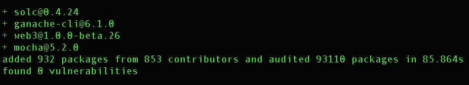
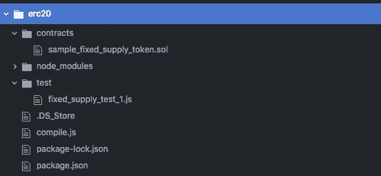
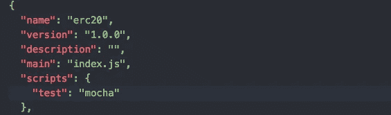
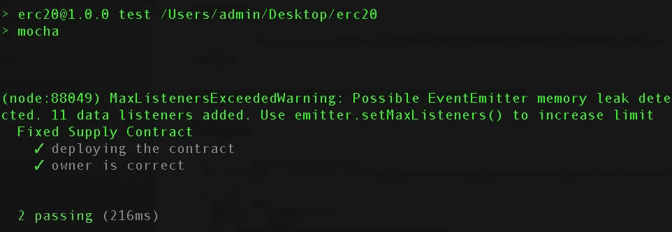

# 编写和测试智能合同的极简框架

> 原文：<https://medium.com/coinmonks/a-minimalist-framework-for-writing-and-testing-smart-contracts-f25d1941b2e6?source=collection_archive---------3----------------------->

> 开发您自己的环境来部署、运行和测试 Solidity 合同。


Frameworks are helpful in the long run. They hold the panes in place.

在 Solidity 中编写合同的挑战部分不是代码的实际逻辑，而是保证我们编写的合同是 ***没有错误******只做它必须做的事情*** *。后果可能是可怕的——损失数百万美元的价值，锁定投票决策等。更糟糕的是普通用户产生的恐惧和怀疑感。我相信我们都是以太坊这样的分散化技术的堡垒，作为贡献开发者(或“合同作者”)，确保我们所写合同的功能性和安全性是我们的职责。*

1.  正如我在开头提到的，写合同并不是最具挑战性的部分。事实上，当你访问在线 solidity IDE 时，你会看到一份相当复杂的合同。用户可以在不离开浏览器选项卡的情况下部署、运行合同并与之交互。与契约交互并以某种顺序运行某些功能不是测试。合同测试应该是严格的。
2.  坐在 Remix 中点击这里和那里对于初始测试(即当编写合同功能时)是很好的，但是严格的测试应该很快。
3.  当测试代码时，一个好的开发人员会尝试破解代码。手动模拟复杂的测试很无聊，但这并不排除测试用例应该是复杂的。

为了解决这一切，并在 Solidity 中增加更多的合同开发，诞生了[松露框架](http://truffleframework.com/)。这真的很神奇！

1.  对于经验丰富的开发人员来说，使用像 Truffle 这样的现有框架并不是一个不同的话题；但是那些进入 Solidity 开发的人讨厌使用框架的想法(甚至像 Truffle 一样好的东西，双关语)。正如我从自己的行为中了解到的那样，这可能是对走另一条“学习曲线”的最初犹豫。我们可以从头开始开发自己的产品来解决所有问题。学习好的实践变得容易多了。
2.  可靠性合同不像是为运行飞机而设计的庞大代码库；它们最多是与其他合同或外部拥有的帐户通信的多个类(但也不太多)。一个最小框架保持了清晰和简洁的精神。
3.  **学习。看到事情是如何干净利落地实现的，以及部署、运行和测试 Solidity contracts 是多么容易，而不需要额外的套件，这对初学者来说几乎是神秘的，这是非常有益的。**

***目标*** :我们将建立一个测试环境，通过简单地发出`npm run test`，我们可以为我们的 Solidity smart contracts 编写并运行一套测试。

***随身用品:***

1.  我安装了 npm (6.1.0)和 node (v8.9.0)。
2.  solc 是我们将要使用的 Solidity 编译器。
3.  我们将使用[摩卡](https://mochajs.org/)作为测试框架。
4.  [加纳切-cli](https://www.npmjs.com/package/ganache-cli) 【仿效】区块链和 EVM 当地的以太坊，我们可以在上面快速部署我们的合同，而不需要实际的以太来支付天然气费用。
5.  web3 是一个库集合，可以让你与区块链节点(本地或远程)交互。

***装置:***

1.  你可以在这里从[下载并安装 npm 和 NodeJs (也叫 node)。](https://www.npmjs.com/get-npm)
2.  创建并移入新目录，发出`**npm init**`命令，通过设置新的 npm 包来创建新的节点项目。会出现一个向导询问不同的参数，只需一直按回车键直到完成。
3.  现在，只需在终端发出以下命令，就可以安装所有的需求:

```
**npm install --save solc ganache-cli web3@1.0.0-beta.26 mocha**
```

**注意:Windows 用户**在安装 web3 之前需要安装 windows-tools。因此，在步骤 3 之前运行`npm install --global --production windows-build-tools`。

运行步骤 3 后，我可以看到以下安装是成功的:



***目录结构:***

目录结构对于确保我们在同一页上是至关重要的。具体来说，在主工作目录中，创建两个目录- `./contracts`和`./test`。这是我们最终的目录树的样子；先不要担心其他文件，我们马上就要到了。

`./contracts`将保存用 Solidity 编写的合同，而`./test`是我们用 JavaScript 编写的 mocha 风格测试的地方。



erc20 is the project main-directory.

在接下来的部分中，我们将完成并总结所有内容。

我正在使用来自以太坊维基页面的样本固定供应 [ERC20 令牌。继续将可靠性代码复制到新合同中，并保存在`./contracts`文件夹中。您可以查看上面的目录快照，我在那里调用了 sample_fixed_supply_token.sol。](https://theethereum.wiki/w/index.php/ERC20_Token_Standard#Sample_Fixed_Supply_Token_Contract)

为了编译这个契约，我们将使用已经安装的`sol`包。继续在主文件夹中创建一个文件，我们称之为 compile.js。

js——编译并生成字节码以及与契约交互的接口。

如果取消第 14 行的注释，运行命令`node compile.js`应该会输出一堆东西，包括字节码和接口，也叫做 ABI。

我们使用其他两个库(即 path 和 fs)的唯一原因是，它们是非常标准的库，并且在使用 Node 时提供了读取文件的标准方法。

好了，现在我们可以编译代码了。我们现在需要的是在区块链上部署它，然后运行它。

**区块链(以太坊节点)在哪里？**

更具体地说，我们在哪里运行合同？我们不需要一个以太坊节点来运行我们编译的代码吗？是的，为了解决这个问题，我们使用了 [**ganache-cli**](https://github.com/trufflesuite/ganache-cli) 。Ganache 过去被称为 TestRPC，当它运行时，它创建地址(我们可以访问)并模拟以太坊节点的行为。这保证了我们在这里测试的是我们在任何以太坊节点上部署契约时得到的。此外，还有另一个好处，即部署契约时没有任何挖掘的概念，因此速度要快得多。相反，在像 Rinkeby 这样成熟的测试网上部署契约会增加额外的两位数秒。

**测试，最后**

我们将以常规[摩卡](https://mochajs.org/)风格进行测试:)

转到 package.json 文件，将名为“test”的字段设置为“mocha”。Npm 需要知道你想要什么。



Open mocha style!!!

现在我们需要做的就是编写实际的测试用例。转到。/test 并添加一个测试文件。我正在编写一个最小的测试来展示我们的“框架”的运行。

。/test/fixed_supply_test_1.js-一个简单的测试。

请注意我是如何使用 ganache 在上部署和运行我的合同的；但更重要的是，从第 12 行开始，我们所遵循的并不是什么新东西。它非常类似于任何普通的 mocha 测试文件。现在，npm 知道我们想要使用 mocha，并且我们已经编写了测试文件；如果我转到终端和我的项目的主目录并键入`npm run test`，我应该看到我的测试正在运行。



Two very very simple tests passing (pun intended) by the terminal screen.

为合同写测试**是必须的**，它**也不难**。我想展示在没有任何额外框架的情况下开始编写测试是多么容易，并欣赏这个过程中所包含的简单性。另外，请记住，我并没有试图解释如何为可靠性契约编写测试，那是改天的话题。也许，一旦你完成了这里的工作，你会真正喜欢使用[松露框架](http://truffleframework.com/)。

*原载于 2018 年 6 月 10 日 medium.com*[](/coinmonks/a-minimalist-framework-for-writing-smart-contracts-e2f98bcd1046)**。**