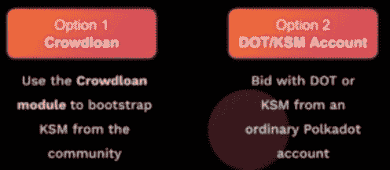
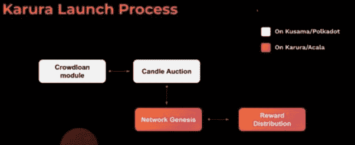

# 参加草间弥生拍卖的程序范本:加瑠罗大众贷款

> 原文：<https://medium.com/coinmonks/a-model-procedure-to-participate-in-kusama-parachain-auction-karura-crowd-loan-60937fedc471?source=collection_archive---------3----------------------->

在我的 [**上一篇文章**](https://tulip311bit.medium.com/why-kusama-is-one-of-the-most-undervalued-coins-right-now-4919b87db19a) **中，我已经解释了为什么草间弥生对波尔卡多特生态系统如此重要，为什么它的价格大幅上涨只是时间问题。一旦网络做好拍卖准备，parachain 拍卖将开始，并以大约 2 周的频率持续进行。在这篇文章中，我们将看到，项目如何使用群众贷款赢得拍卖，也激励他们的支持者。**

阿卡拉是波尔卡多特最重要的项目之一。它是波尔卡多特分散的金融中心。它也是一个稳定的货币平台，为整个区块链的流动性提供动力。加瑠罗是草间弥生区块链 Acala 的姊妹应用。Acala 将同时在波尔卡多特和草间弥生(加瑠罗)运营。一旦波尔卡多特和草间弥生被桥接，令牌将可互操作。

注意，一个项目不需要一直做众筹贷款才能参与副链拍卖。一个 KSM 鲸项目可以直接竞拍副链槽。此外，需要重申的是，该项目没有通过大众贷款获得任何资金。这只是赢得 parachain 拍卖的一种方式。

每个项目将支持它自己的模块。记得特别检查你正在参与的群众贷款的名字。crown loan 模块将在实际的 parachain 模块启动之前运行一段时间。

此外，请注意，保税令牌将无法参与众筹贷款。在参与之前，您需要解除令牌绑定。只有在解除绑定期结束后，您才能参与。在交换的情况下，您可能需要在指定的钱包中发送 KSM。关于这个的更多细节将很快被分享。

**白名单**

加瑠罗正计划竞标草间弥生拍卖公司。在加瑠罗的副链租赁期间或一个固定的时期内，KSM 将被绑定或“锁定”在草间弥生中继链中。锁定机制可以持续 3 个月、6 个月、12 个月、24 个月。KSM 持有者可以在任何标准时间段内锁定他们的令牌，以显示他们对加瑠罗的支持，并帮助他们租赁 parachain 插槽，还可以利用草间弥生的即插即用安全性。作为回报，加瑠罗将奖励支持者卡尔(加瑠罗的本土令牌)令牌。感兴趣的人需要加入众筹贷款等候名单，并填写申请表。申请表可在[网站](https://acala.network/kar-crowdloan)上获取。

**令牌分发**

该项目保证在锁定期结束后，他们会将 KSM 的本金返还给持有者。作为奖励，持有者还将获得原生 KAR 令牌。KAR 令牌的数量将取决于 KSM 的锁定期和其他一些因素。在网站的电报组注意，将有一个奖励计算器即将推出。已经提到奖励会和锁定时间成正比。例如，锁定 12 个月的人将获得 2 倍于锁定 6 个月相同数量 KSM 的人的 KAR 代币。KAR 将被 para 下放到持有人用来担保 KSM 以支持加瑠罗 parachain 租赁的同一个账户。

如果加瑠罗没有中标，KSM 的全部金额将返还给持有人。

需要注意的是，分布式 KAR 将在一段时间内被授予。然而，参与者可以将全部余额用于治理和其他活动。

**副链拍卖**

草间弥生是一个分片的多链网络，允许区块链连接互操作性、可扩展性和即插即用的网络安全。草间弥生是波尔卡多特的表亲网络。为了加入草间弥生的网络，所有的副链必须参加并赢得一个非许可的蜡烛拍卖，以确保在网络上的位置。Parachains 可以选择多种方式筹集 KSM，以便参与拍卖。

**阅读上一篇:** [如何玩黑暗森林，zkSNARK powered MMO 游戏—第一部分](https://tulip311bit.medium.com/how-to-play-dark-forest-the-zksnark-powered-mmo-game-part-1-7222e2c3ab4)

***注:*** *本帖最初发表于* [*此处*](https://www.voice.com/post/@tulip/a-model-procedure-to-participate-in-kusama-parachain-auction-karura-crowd-loan-1614493534-557834680) *为与 voice.com 联合的密码作者。*

**通过我的推荐加入**

[Crypto.com](https://binance.com/en/register?ref=E8PCD3AF)——[币安](https://platinum.crypto.com/r/sut3pd9bzn)

跟我来

**👉** [推特](https://twitter.com/rumadas123)

**👉**[**Linkedin**](https://www.linkedin.com/in/ruma-das-a1439320/)

***包含附属链接***

> **加入 Coinmonks [Telegram group](https://t.me/joinchat/EPmjKpNYwRMsBI4p) 并了解加密交易和投资**

## **另外，阅读**

*   **最好的[密码交易机器人](/coinmonks/crypto-trading-bot-c2ffce8acb2a)**
*   **[印度比特币交易所](/coinmonks/bitcoin-exchange-in-india-7f1fe79715c9)**
*   **[比特币储蓄账户](/coinmonks/bitcoin-savings-account-e65b13f92451)**
*   **最好的[加密税务软件](/coinmonks/best-crypto-tax-tool-for-my-money-72d4b430816b)**
*   **[电网交易](https://blog.coincodecap.com/grid-trading) | [区块链审核](/coinmonks/blockfi-review-53096053c097)**
*   **[最佳加密交易所](/coinmonks/crypto-exchange-dd2f9d6f3769)**