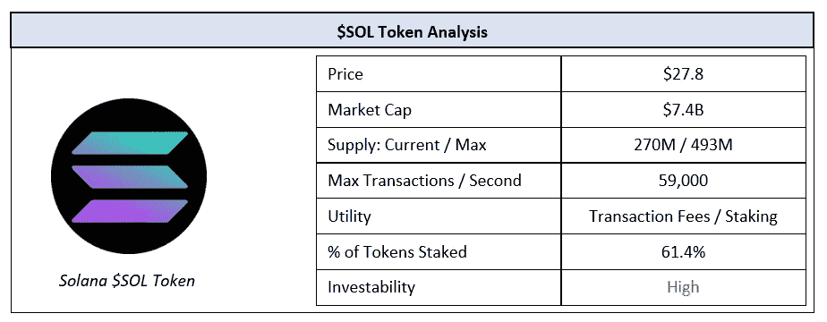
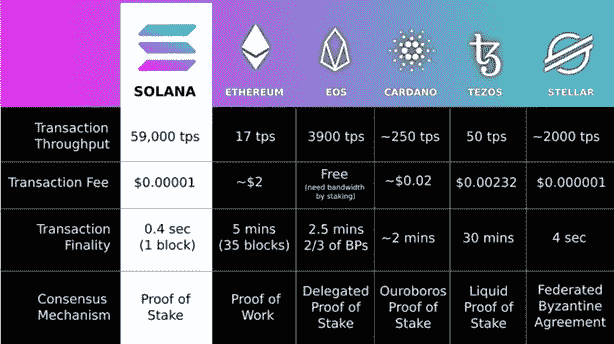
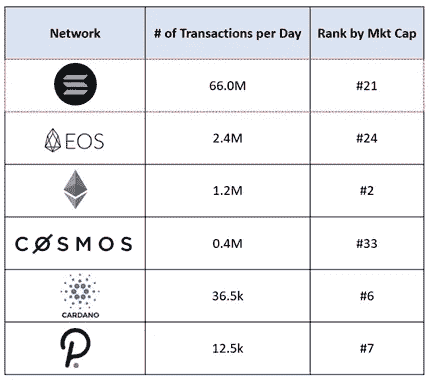
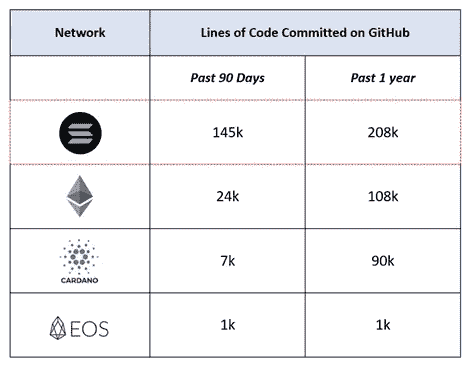
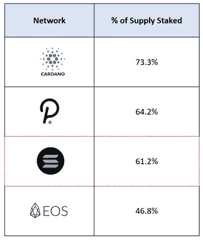

# 历史的一个瞬间:评价索拉纳

> 原文：<https://medium.com/coinmonks/a-moment-in-proof-of-history-evaluating-the-solana-ecosystem-d47b70dd44bf?source=collection_archive---------3----------------------->

**总结**

Solana 是一个强大的利益相关智能合同网络，可以处理 3，500 倍于以太坊 1.0 的容量，而不会对安全性或分散性产生有意义的影响。在网络中，$SOL 令牌的主要用例是下注和支付交易费用。Solana 目前在网络参与度(每天的交易量和建立在网络上的应用程序)方面领先于许多竞争对手。随着网络活动水平的提高，对$SOL 令牌的需求也将继续增加。由于目前超过 60%的代币供应都押在网络上，在不久的将来，大量的供应不太可能充斥市场。这些因素的结合意味着$SOL 令牌的未来价格在中长期内可能会继续上升。

**概述**

索拉纳是一个第 1 层的股权证明智能合同区块链类似于以太坊，波尔卡多特，卡尔达诺，EOS 和宇宙。过去几年，智能合约领域面临的最大挑战是可扩展性问题，即找到允许每秒更多交易而不牺牲去中心化和安全性的最佳方式。以太坊正试图通过分片来解决这个问题，通过副链来解决波尔卡多——索拉纳开发了他们所谓的历史证明(PoH)。PoH 允许在一个发展中的区块链上的交易打上时间戳，以便在不损害安全性的情况下更快地达成共识。

**索拉纳如何工作**

与其他智能合约平台不同，Solana 不要求验证器节点具有最小数量的令牌来参与。这意味着任何拥有$SOL 令牌的人都可以持有他们的令牌，并成为验证器节点。然而，在实践中，大多数利益相关者将他们的权利委托给更大的验证器节点。每 4 个块(或 1.6 秒)在这些验证器中以伪随机方式选择一个“领导者”。在此期间，领导者可以将事务添加到块中，然后这些块由网络上的其他验证者进行验证。恶意行为的验证者将被削减部分或全部令牌，而行为恰当的验证者将获得额外的$SOL 令牌作为奖励。leader 系统和 PoH 时间戳的结合优化了安全性、分散性和可伸缩性(通过减少每笔交易的时间)。与其他第 1 层智能合同协议相比，这已经产生了有利的结果。特别是，每秒最大事务数可以达到最接近的竞争对手的 30 倍，以及以太坊 1.0 的约 3，500 倍。这使得交易费用极低(约为以太坊的 0.0005%)。

**评估$SOL 令牌**

$SOL 令牌的主要用例是支付交易费用——这最终会产生需求。因此，网络上应用程序的数量和对这些应用程序的需求将产生对$SOL 令牌的需求。我们可以看到，在最近的 NFT 热潮中，类似的一系列事件如何在以太坊的 ETH 令牌上发生，因为客户纷纷涌向 OpenSea 等平台，在这些平台上，唯一的支付手段是 ETH。通过了解正在 Solana 上构建的项目以及该平台上日常交易的动向和势头，我们可以评估该网络的实力，并确定未来是否会有对$SOL 令牌的有意义的需求。类似地，通过了解与其他第 1 层智能合约平台相比的筹码数量，我们可以估计我们可能预期的可交易供应水平。

**交易量对比**

交易量是网络实力的一个指标。虽然交易的价值可能会有所不同，但高交易量表明网络的高参与度，这意味着更多的消费者会希望持有$SOL 令牌进行交易。在这方面，索拉纳把竞争对手打得落花流水。

目前，索拉纳的很大一部分交易都是与投票相关的微交易。然而，诸如 Solana-native DEX、Serum 和其他用例的应用继续加速发展。重要的是要记住，Solana 的每笔交易费用明显低于其他网络，但这被显著更高的交易量所抵消，交易量随着时间的推移继续增加。随着这一数量的持续增长，将会有更多的人想要持有$SOL 令牌以便在网络上进行交易。

**一段时间内的项目数量**

索拉纳网络上的项目数量也在增加。我们通过 GitHub 上承诺给 Solana 的项目数量来衡量这一点。在 Solana 上构建的应用程序越多，交易就会越多。提交的数量越来越多，这表明将来对$SOL 令牌的需求会越来越大。

**%的代币下注**

最后，50%的筹码是锁定供应的良好指标.这为我们在市场上可能找到的有机供应提供了一定的保证。持有的代币比例越高，我们对自然供应量的预期就越低，我们对像$SOL 这样的资产作为投资工具的信心就越大。总的来说，索拉纳与竞争对手相比有相当多的筹码。有了这些数据，我们可以相对肯定的是，短期内不会有大量供应涌入市场。

**结论**

总的来说，Solana 已经建立了一个网络，它可以在不显著降低安全性和分散性的情况下，比任何 L1 智能合同区块链每秒处理更多有意义的交易。虽然 Solana 还没有被主流采用，但是随着越来越多的开发人员开始在 Solana 上进行开发，我们可以预计对$SOL 令牌的需求将会继续增长。再加上目前超过 60%的$SOL 代币被下注，不太可能充斥市场(其他条件不变)，我们可以预计$SOL 代币的价格在中长期内将继续上涨。

在 Twitter 上关注我们 [@ClearChainCap](https://twitter.com/ClearChainCap)