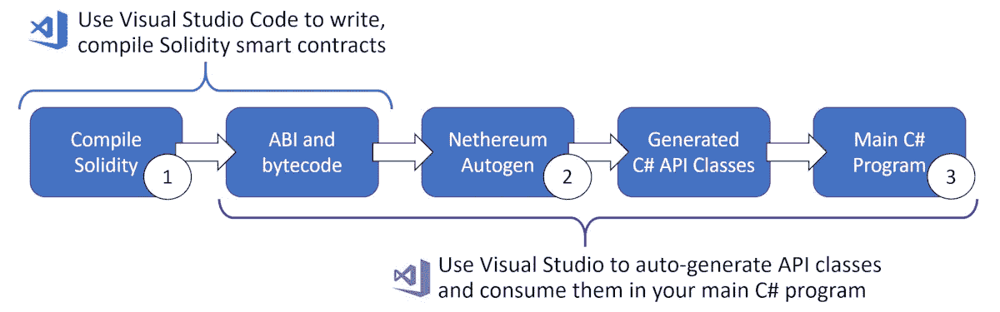
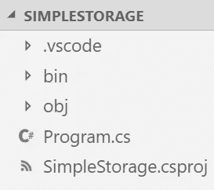
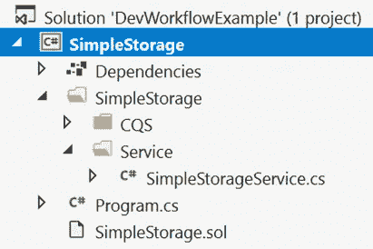
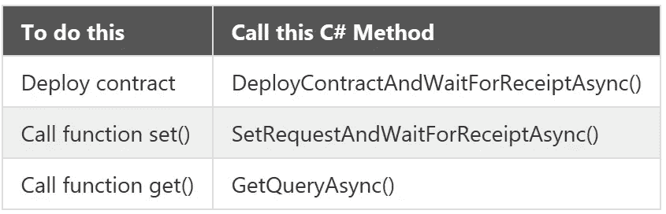

# 答。NET 开发人员创建和调用以太坊智能合约的工作流

> 原文：<https://medium.com/coinmonks/a-net-developers-workflow-for-creating-and-calling-ethereum-smart-contracts-44714f191db2?source=collection_archive---------0----------------------->

有[许多伟大的工具](https://github.com/ConsenSys/ethereum-developer-tools-list#developer-tools)可以用来创建以太坊智能合约。很难在它们之间做出选择。在本文中，您将学习一个简单的工作流，用于开发 Solidity smart contracts 并从 C#中调用它们的函数。这个工作流程非常适合。NET 开发人员，因为它将您需要了解的新工具的数量减到最少。通过使用优秀的[尼瑟姆。NET](https://nethereum.com) 库您可以继续使用您已经熟悉的 Visual Studio 工具集。

假设您的目标是从 Solidity 文档中获取名为 [SimpleStorage.sol](https://solidity.readthedocs.io/en/v0.5.7/introduction-to-smart-contracts.html#storage-example) 的契约，并从 C#项目中调用它的函数。您的首选是尽可能使用 Visual Studio。这篇文章是基于我自己在 Nethereum 项目中的工作经验，该项目将以太坊与 SAP 销售和分销业务流程集成在一起。

【2019 年 11 月更新:这个工作流非常适合智能合约经常变化的情况(可能因为你正在开发它们)。当智能合约不经常更改时(可能因为智能合约是由另一个团队开发的)，我发现我更喜欢本文结尾的第**节中详细介绍的工作流。这是因为 like 能够明确控制再生何时发生。两个工作流使用相同的 Nethereum 代码生成。**

# 工作流程概述

有许多可能的工作流程来实现你的目标，随着新版本的工具和插件的发布，其他选项将会出现。在撰写本文时，我们发现该工作流程简单快捷:



A .NET Developer’s Workflow: Write Solidity and Consume in C#

上图显示了这些步骤:

1.  编写 Solidity 智能合约，并用 Visual Studio 代码进行编译。编译过程的输出是一些代表合同的 ABI 和字节码的文件。
2.  使用 Nethereum Autogen 代码生成器自动构建 C# API 类，以提供对智能合约的访问。
3.  使用 Visual Studio 编写 C#来调用生成的 C# API 类中的方法。

在本文中，术语`function`指的是可靠性函数，而`method`指的是 C#方法。

# 初始设置

## 创建项目

在命令提示符下，您将创建一个新的。您将用来保存所有文件的. NET core 控制台项目:

```
dotnet new sln --name DevWorkflowExample
dotnet new console --name SimpleStorage
dotnet sln add .\SimpleStorage\SimpleStorage.csproj
cd SimpleStorage
dotnet add package Nethereum.Web3
dotnet add package Nethereum.Autogen.ContractApi
```

## 准备 Visual Studio 代码

1.  打开 Visual Studio 代码。
2.  打开延伸件并在此处安装[坚固延伸件](https://marketplace.visualstudio.com/items?itemName=JuanBlanco.solidity)。
3.  打开我们刚刚创建的 SimpleStorage 文件夹。您应该会看到类似这样的内容:



4.如果在任何时候，VS 代码询问“构建和调试所需的资产在‘简单存储’中缺失。加他们？”答应吧。

5.创建一个新文件(ctrl+N)。

6.将以下实体代码粘贴到文件中:

```
pragma solidity >=0.4.0 <0.7.0;

contract SimpleStorage {
    uint storedData;

    function set(uint x) public {
        storedData = x;
    }

    function get() public view returns (uint) {
        return storedData;
    }
}
```

7.将文件另存为 SimpleStorage 文件夹根目录下的`SimpleStorage.sol`。

合同来自[可靠性文档](https://solidity.readthedocs.io/en/v0.5.7/introduction-to-smart-contracts.html#storage-example)，你可以看到这是一个非常简单的合同，只有`set()`和`get()`功能。现在，您已经准备好开始主要的开发人员工作流了。以下步骤与上图中的数字相对应。

# 主开发人员工作流程

## 步骤 1 —在 Visual Studio 代码中编译智能协定

在 Visual Studio 代码中，按 Shift-Ctrl-P 并选择“实体:编译当前实体契约”或按 F5。你应该会看到一些新文件出现在`SimpleStorage\bin`文件夹中，最重要的是`SimpleStorage.abi`和`SimpleStorage.bin`。

## 步骤 2 —在 Visual Studio 中重新构建 C#项目

在 Visual Studio 中打开解决方案`DevWorkflowExample.sln`(非 Visual Studio 代码)。

右键单击 SimpleStorage 项目，然后选择“Rebuild”。重建项目的行为触发了`Nethereum.Autogen.ContractApi`包来构建 C# API 类，让您与`SimpleStorage.sol`契约进行交互。您应该会看到一个名为`SimpleStorage`的文件夹中添加到项目中的新文件集合，如下所示:



生成的`SimpleStorageService`类包含一些有用的方法:



注意 C#方法命名对于`set()`和`get()`函数调用是不同的。这是因为`set()`改变了区块链上的一个值，所以它消耗以太，所以它被使用以太坊交易调用，并将返回一个收据。`get()`函数不改变区块链上的任何值，所以它是一个简单的调用，并且是免费的(没有交易也没有收据)。

## 步骤 3 —在 Visual Studio 中从 C#调用智能合约函数

现在，您可以在。NET 核心控制台程序，方法是调用前面提到的生成的 C#类。例如，将下面的代码粘贴到`Program.cs`中，替换当前存在的所有内容。

构建项目。

工作流程完成了！现在，您可以在 Visual Studio 代码中进一步编辑智能协定，在那里编译它，并在 Visual Studio 中简单地重新构建项目，以便能够对修改后的 Solidity 函数进行 C#调用。

# 程序执行

当然，您希望检查程序是否成功运行。为了项目的运行，它需要与区块链对话，这里你需要一个新的工具。开发期间的一个好选择是运行本地区块链，如下所述:[https://github.com/Nethereum/TestChains#geth](https://github.com/Nethereum/TestChains#geth)。

运行本地区块链，从 Visual Studio 运行`SimpleStorage`控制台项目。您应该得到如下输出:

```
Contract Deployment Tx Status: 1
Contract Address: 0x243e72b69141f6af525a9a5fd939668ee9f2b354

Sending a transaction to the function set()...
Finished storing an int: Tx Hash: 0xe4c8e72bf18c391c3dd0d18aa4c2ec4672591b974383f7d02120657d766d1bf3
Finished storing an int: Tx Status: 1

Calling the function get()...
Int value: 42 (expecting value 42)

Finished
```

# 从这里去哪里

您开发过程的下一步可能是为您的 Solidity 契约添加一些测试。这是否意味着你一定要去学习松露或其他工具？答案是不，你没有。这里有一个[例子](https://github.com/Nethereum/Nethereum/tree/master/src/Nethereum.Contracts.IntegrationTests)在运行测试部署契约和调用函数之前，使用 XUnit 测试夹具启动一个本地链。

注意，你不必使用生成的`SimpleStorageService`类来调用你的智能合约的函数。不过，至少，看看这些调用在生成的代码中是如何工作的是有启发性的。

# 使用 VSCode 的替代工作流

【2019 年 11 月更新:如上所述，当智能合约经常发生变化，并且您希望 C#类经常反映这些变化时，我发现上面详述的工作流非常有用。这适合我同时开发智能合约和 C#的情况。

在智能契约稳定的情况下(例如，你已经被另一个开发团队发送了 ABI 和字节码)，我发现我更喜欢明确地控制重新生成发生的时间。这可以通过使用 VSCode 来实现，不仅可以编写智能合约，还可以生成必要的 C#代码。工作流程在尼瑟姆文档网站上有很好的解释[。](https://docs.nethereum.com/en/latest/nethereum-codegen-vscodesolidity/)

# 信用

感谢来自[尼瑟姆 Gitter](https://gitter.im/Nethereum/Nethereum) 的 [Vijay055](https://github.com/vijay055) 发布了一些类似的项目代码作为演示。感谢 [Juan Blanco](https://github.com/juanfranblanco) 创建了尼瑟姆项目， [Dave Whiffin](https://github.com/Dave-Whiffin) 提供了 Autogen 代码生成器包， [Gael Blanchemain](https://github.com/anegg0) 审阅并改进了文章内容。

> 加入 Coinmonks [电报频道](https://t.me/coincodecap)和 [Youtube 频道](https://www.youtube.com/c/coinmonks/videos)获取每日[加密新闻](http://coincodecap.com/)

## 另外，阅读

*   [复制交易](/coinmonks/top-10-crypto-copy-trading-platforms-for-beginners-d0c37c7d698c) | [加密税务软件](/coinmonks/crypto-tax-software-ed4b4810e338)
*   [电网交易](https://coincodecap.com/grid-trading) | [加密硬件钱包](/coinmonks/the-best-cryptocurrency-hardware-wallets-of-2020-e28b1c124069)
*   [密码电报信号](http://Top 4 Telegram Channels for Crypto Traders) | [密码交易机器人](/coinmonks/crypto-trading-bot-c2ffce8acb2a)
*   [最佳加密交易所](/coinmonks/crypto-exchange-dd2f9d6f3769) | [印度最佳加密交易所](/coinmonks/bitcoin-exchange-in-india-7f1fe79715c9)
*   [币安 vs 比特邮票](https://coincodecap.com/binance-vs-bitstamp) | [比特熊猫 vs 比特币基地 vs Coinsbit](https://coincodecap.com/bitpanda-coinbase-coinsbit)
*   [如何购买 Ripple (XRP)](https://coincodecap.com/buy-ripple-india) | [非洲最好的加密交易所](https://coincodecap.com/crypto-exchange-africa)
*   [非洲最佳加密交易所](https://coincodecap.com/crypto-exchange-africa) | [胡交易所评论](https://coincodecap.com/hoo-exchange-review)
*   [eToro vs 罗宾汉](https://coincodecap.com/etoro-robinhood)|[MoonXBT vs Bybit vs Bityard](https://coincodecap.com/bybit-bityard-moonxbt)
*   [面向开发人员的最佳加密 API](/coinmonks/best-crypto-apis-for-developers-5efe3a597a9f)
*   最佳[密码借贷平台](/coinmonks/top-5-crypto-lending-platforms-in-2020-that-you-need-to-know-a1b675cec3fa)
*   [免费加密信号](/coinmonks/free-crypto-signals-48b25e61a8da) | [加密交易机器人](/coinmonks/crypto-trading-bot-c2ffce8acb2a)
*   杠杆代币的终极指南