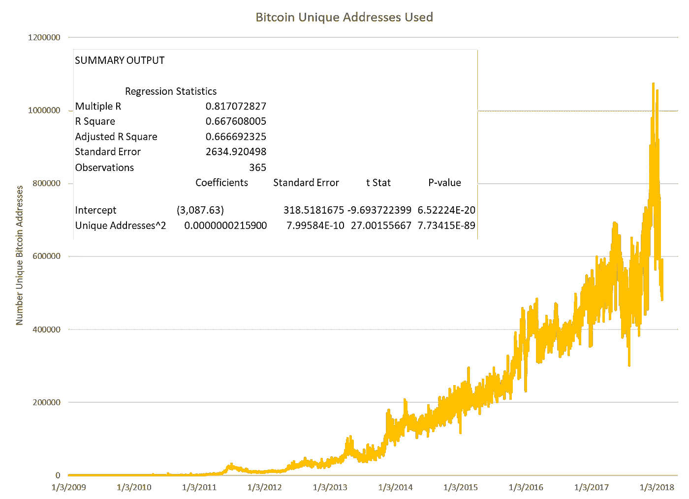
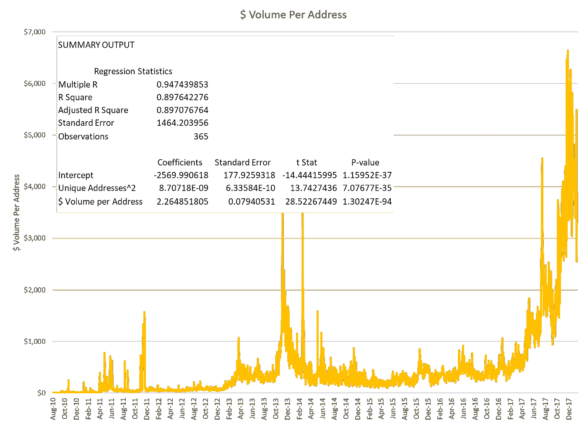
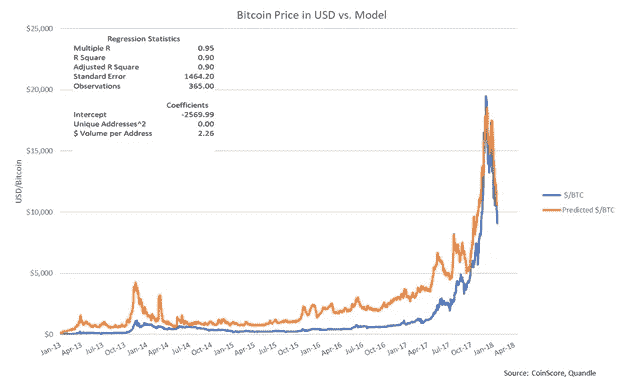
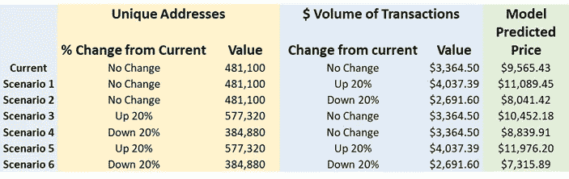
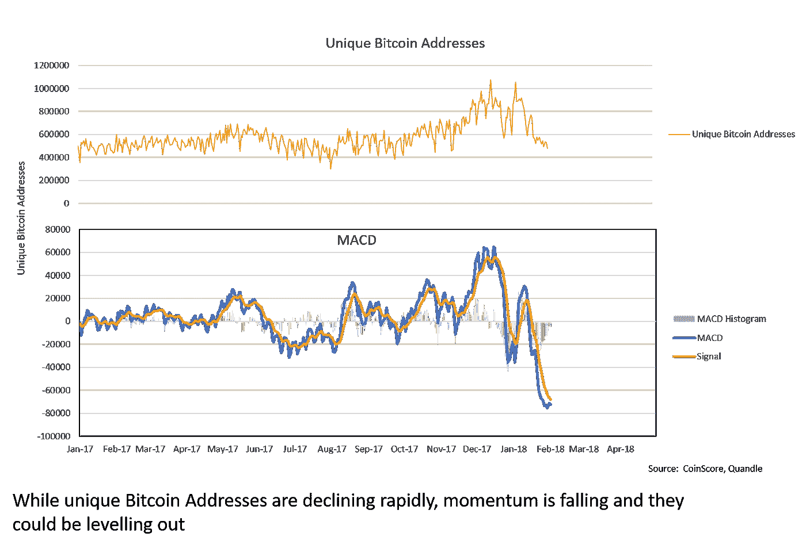
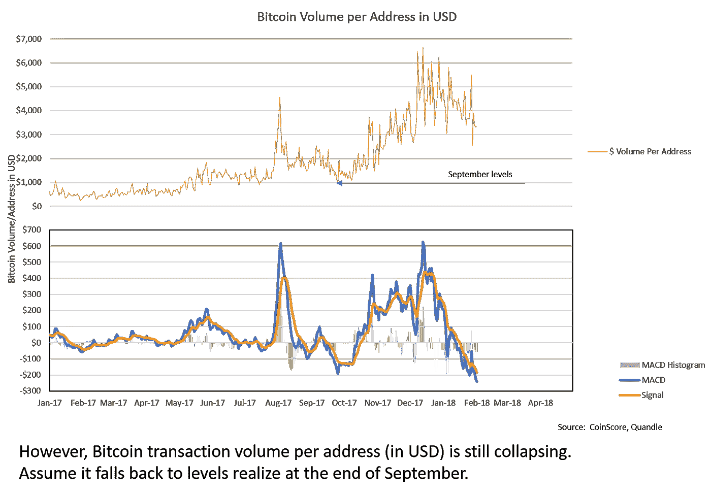
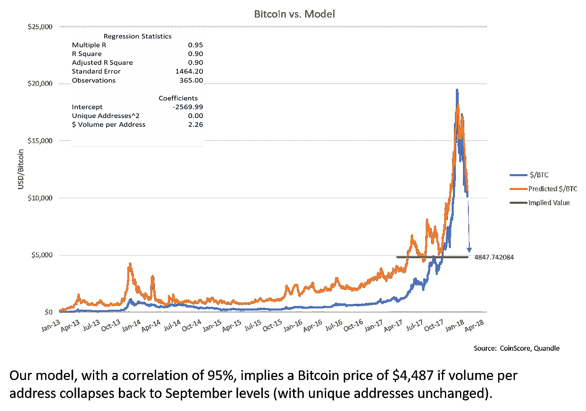

# 比特币价值模型的网络理论

> 原文：<https://medium.com/coinmonks/a-network-theory-of-value-model-for-bitcoin-427f78594aaf?source=collection_archive---------0----------------------->

## 灵感

去年 11 月，FundStrat 联合创始人汤姆·李(Tom Lee)公布了比特币的定价模型[【1】](#_ftn1)。该模型解释了比特币价格 94%的可变性，对变量的可信度很高。这是基于梅特卡夫定律，即网络的价值是网络用户数量的平方[【2】](#_ftn2)。随着互联网在过去三十年的发展，这条定律已经被应用到电信以外的许多领域，尤其是社交网络。

加密资产领域的许多人已经讨论了将网络估值技术应用于加密货币。毕竟，货币是一种社会建构，所以每个开始用比特币交易的人都会让网络呈指数级增长。此外，由于信息包含在区块链内，用于进行价值计算的许多相关数据在交易记录和地址中是明确的。

更进一步，我认为网络效应可以应用于任何货币。正如我在《 [*赚钱之道*](/coinscore/the-making-of-money-fbffeff9402d) 》中提到的，

> “当与沙特阿拉伯达成以美元出售石油的协议时，美元网络显著增长。随着其他石油生产国开始用美元出售他们的石油——有些愿意，有些不愿意——对美元的需求增长更多。没过多久，世界上大多数商品的贸易都是用美元进行的，对美元的需求开始激增。网络的增长成为一个自我强化的循环，需求呈指数级增长。”

不幸的是，将网络估值应用于传统货币的数据并不可用——或者至少我还没有弄清楚。

在 CoinScore，我们正在努力为我们的平台构建分析和决策框架。我们旨在帮助投资者在投资加密货币时做出明智的决策。Tom Lee 提供了他如何构建定价模型的大量细节，因此我使用他提供的信息作为基础，开始为我们的平台构建加密货币估值框架。结果是一个双因素模型，非常接近汤姆李的结果。在这篇文章中，我将向你介绍我们的模型，并提供具体的例子，说明如何应用它来预测比特币的价格。

## 对模型进行逆向工程

首先是回归变量，即模型中的变量。梅特卡夫定律的主要输入是用户数量，然后对其进行平方以确定值。在比特币区块链中，可以用来代理网络上用户数量的一个数据元素被称为唯一地址。

**Unique Addresses Squared has a correlation of 82% with the USD price of Bitcoin**

唯一地址是当天生成的区块在比特币交易中使用的比特币地址数量。使用来自 Quandle 的数据，标有“使用的比特币唯一地址”的图表显示了唯一地址随时间的增长，以及围绕回归该变量的相关“汇总输出”统计数据，再次比特币的价格。

通过对唯一地址求平方，并根据比特币的美元价格对其进行回归，您会得到一个相关统计为 82%的回归模型，在汇总输出表中称为倍数 R。请注意，唯一地址平方的 t-Stat 非常显著，这意味着该变量解释比特币价格的可信度很高。

这是一个非常适合的模型，但我们可以通过增加以美元计价的每个地址的平均比特币交易量来进一步改进它。如果一种货币有很多用户，平均而言，每个用户都进行高价值交易，这意味着该货币的价值更高。标有“$ Volume Per Address”的图表说明了这一变量随时间的变化。

**Adding $ Volume per Address to the regression yields a correlation of 95% with the USD price of Bitcoin**

通过将这一数据序列加入回归，我们得到了一个与比特币价格相关度为 95%的模型。同样，你会在模型中看到高度的统计显著性。

下一步是绘制比特币的美元价格，并将其与模型预测的价格进行比较。在标有“比特币美元价格与模型”的图表中，您可以看到模型预测的比特币美元价格与实际美元价格的对比情况。我们对模型做了一些专有的改进，但基本原理是一样的。

## 移动杠杆

有了模拟比特币价格的方法，人们就可以根据所使用的唯一比特币地址和每个地址的平均交易量的变化来估计比特币的价格。

**Model Predicted Price for Bitcoin under various scenarios**

在左边的表格中，我们根据我们的模型说明了比特币价格对唯一地址和/或美元交易量变化的敏感性。

我们从这些场景中学到的一件事是，根据该模型，比特币的价格对每个地址的平均交易规模的变化比对唯一地址的变化更敏感。您可以通过比较场景 1 和场景 3 来了解这一点，场景 1 保持唯一地址不变，并将每个地址的事务大小增加 20%，场景 3 则相反。在该模型中，当我们增加平均交易规模时，比特币的价格上涨 25%(从 9565 美元到 11089 美元)，而当我们增加唯一地址时，比特币的价格上涨 9%(从 9565 美元到 10452 美元)。

我们可以从情景分析中学到很多东西。一个好的模型可以揭示被建模事物的基本原理，以及模型的局限性。然而，要对比特币价格的未来走向做出结论，仍需要一个预测。我们需要预测唯一地址和每个地址的平均事务大小。

有很多方法可以解决这个问题，但我们将把 MACD 技术指标应用于这两个变量。请注意，我并不认为自己是一个技术分析师，可以随意批评我的解释。我的目的是说明，即使有一个模型，如果你想估计未来价格，你仍然必须对回归变量的未来路径进行预测。

我在这里举例说明的方法只是预测变量和得出模型预测价格的许多潜在方法之一。任何投资者都有责任制定自己的假设，进行自己的分析，以对自己的结论有信心。

MACD Applied to Unique Bitcoin Addresses

在标有“唯一比特币地址”的图表中，我们来看看这个变量。很明显，自 1 月初以来，独特的比特币地址一直在快速下降。然而，鉴于 MACD 和信号线的融合，这种下降趋势似乎正在失去势头。出于说明的目的，我们将假设唯一比特币地址的数量不会进一步减少，来对比特币的价格进行建模。

接下来，让我们对以美元为单位的每个地址的比特币交易量进行同样的分析。回想一下我们上面的场景分析，我们的模型表明，比特币的价格对每个地址的平均交易规模的敏感程度远高于对地址总数的敏感程度，接近 3:1。

这一变量经历了类似的快速下降(见“以美元计的每个地址的比特币交易量”图表)。然而，在我看来，这种势头似乎并没有减弱，因为 MACD 线在信号线的下方并与之偏离。如果我们假设这种下降会持续下去，那么它会下降到什么程度呢？为了对每个地址的比特币交易量下降做出估计，让我们参考一下我们最近对 Tether 的分析。

MACD Applied to Bitcoin Volume per Address in USD

在“[unsethed:Tether ' s Failed Promise](/coinscore/enough-tether-to-hang-yourself-4821ee161f1d)”中，我们列出了统计证据，有力地表明去年比特币价格的上涨在很大程度上可以归因于 USDT(即与美元挂钩的 Tether)的显著上涨。此外，我们提供了基于法务会计技术的证据，表明 USDT 的增长可能没有得到实际美元的支持。2017 年第四季度 USDT 发行量的增加尤为显著。

Tether 文章中的分析形成了一个似是而非的前提，以做出以下假设:

*   如果 9 月之后创造了大量的 USDT，这些 USDT 被用来购买比特币，那么这就可以解释每个比特币地址的平均比特币交易规模大幅增加
*   此外，如果 USDT 的增长是人为的，那么每个比特币地址的平均比特币交易规模也是人为的
*   因此，如果 USDT 停止发行，我们预计每个地址的平均交易规模将降至 9 月前的水平

基于上述假设，在我们的模型中，保持唯一地址不变，并将每个地址的比特币数量降至 9 月份的水平，我们得到的模型预测价格约为 4800 美元(在左侧的“比特币与模型”图表中，以标有“隐含价值”的绿线显示)。看看每个比特币地址的平均交易量是否会继续下降，以及比特币的价格是否会继续下跌，这将是一件有趣的事情。

## 模型不会取代大脑

模型是工具，不是拐杖。它们帮助我们理解基本原则，理清我们的思路，而不是取代它。本文的目标是展示一种基于网络价值理论的加密货币价格建模方法(h/t to Tom Lee，了解有关其方法的详细信息)。我们还提供了一个例子，说明如何使用一个流行的技术指标来预测这些价值驱动因素，尽管有许多方法可以实现这一点。

在 CoinScore，我们的团队正在构建一个平台，将各种估值模型和分析置于加密资产投资者的指尖。通过将区块链层面的数据与 CoinScore 系统固有的估值框架(如我们今天探讨的系统)相连接，投资者将拥有强大的工具来为其投资决策提供信息。一定要访问 coinscore.io，看看我们到目前为止构建了什么。

[【1】](#_ftnref1)[http://www . business insider . com/bit coin-price-movement-explain-by-one-equation-fund strat-Tom-lee-met calf-law-network-effect-2017-10](http://www.businessinsider.com/bitcoin-price-movement-explained-by-one-equation-fundstrat-tom-lee-metcalf-law-network-effect-2017-10)

【2】[【https://en.wikipedia.org/wiki/Metcalfe%27s_law】](https://en.wikipedia.org/wiki/Metcalfe%27s_law)

> [直接在您的收件箱中获得最佳软件交易](https://coincodecap.com/?utm_source=coinmonks)

