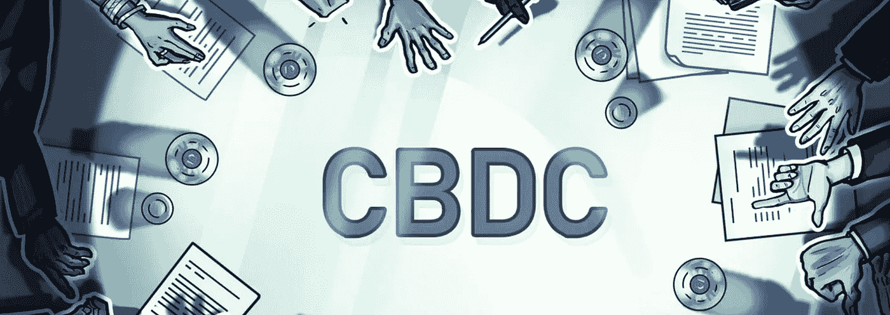
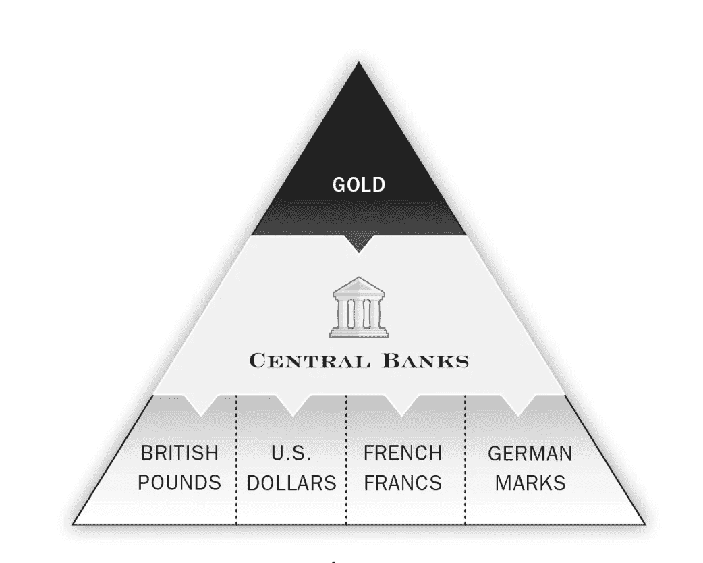
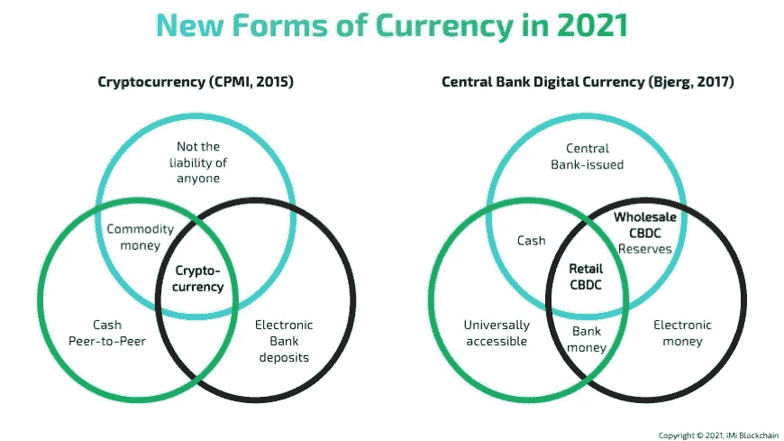
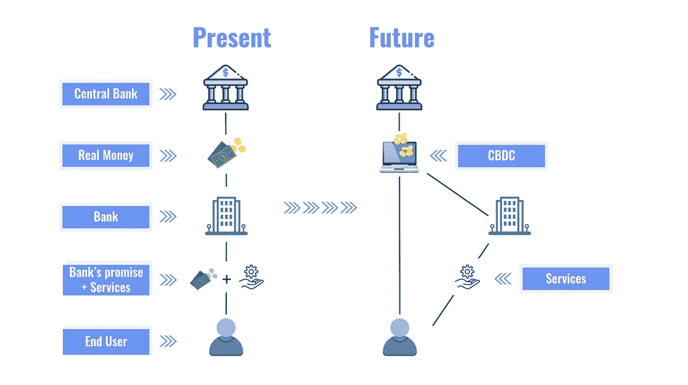
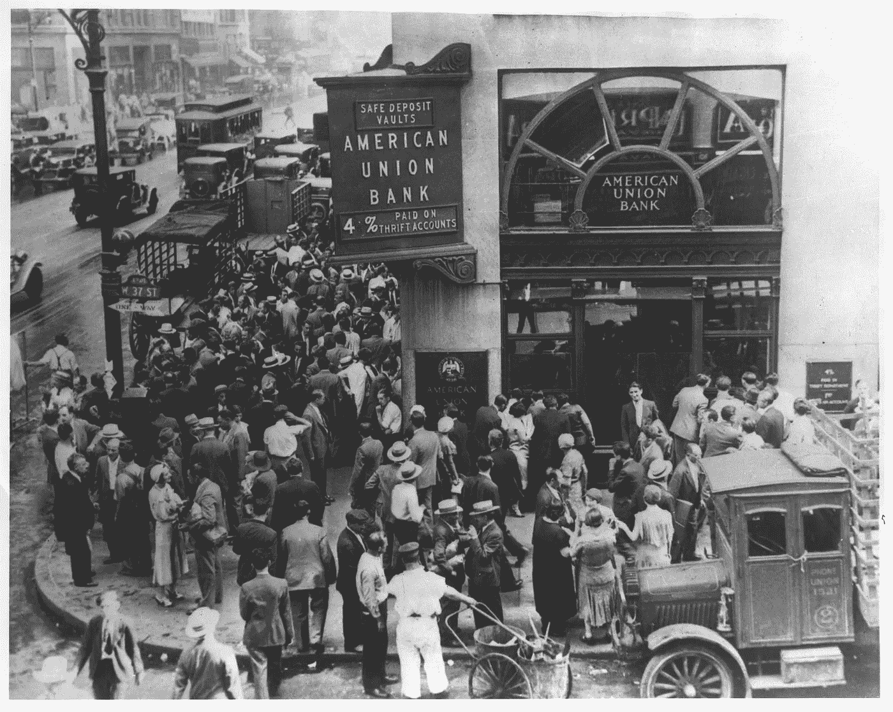
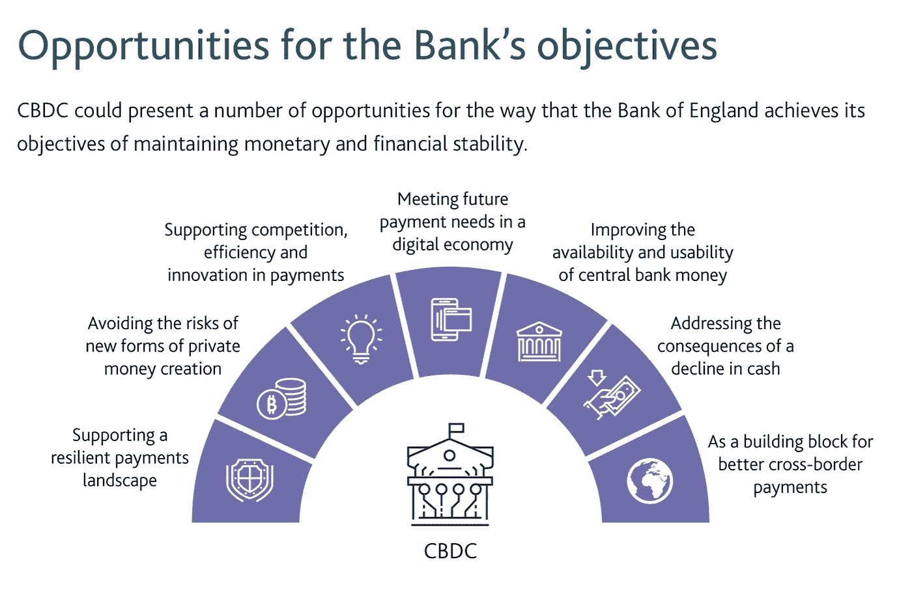
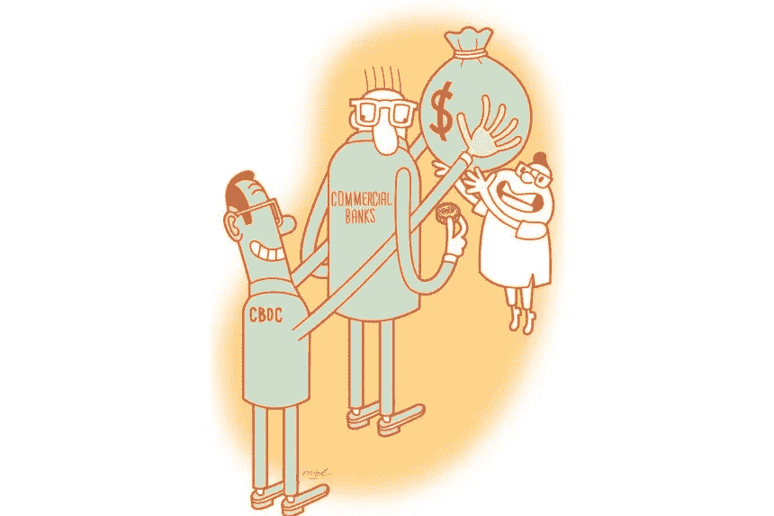
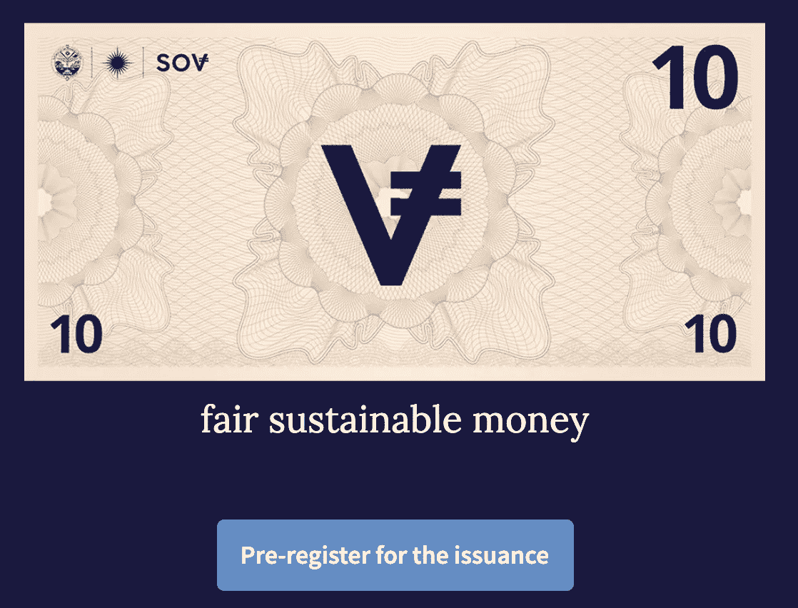
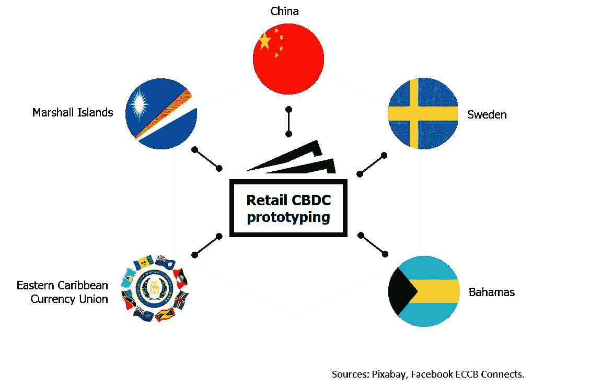
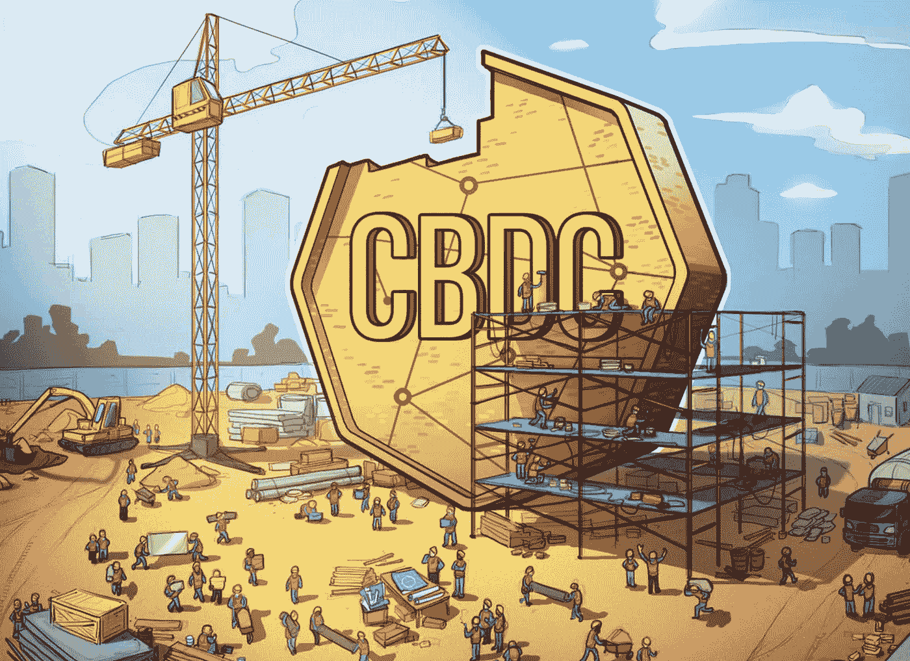

# 🚀央行数字货币的新时代

> 原文：<https://medium.com/coinmonks/a-new-era-of-central-bank-digital-currencies-a938dbfaca00?source=collection_archive---------6----------------------->

从买卖贝壳到铸造金币，人类文明已经走过了漫长的道路，我们用总部位于区块链的中央银行数字货币开启了货币的新篇章

**🚨大免责声明** : *让我从标准免责声明开始这篇文章。* ***这不是投资建议。我不是投资顾问。此信息旨在用于教育目的。在你决定投资你的血汗钱之前，请做好你自己的研究。如果你不确定，寻求专业理财顾问的帮助，他能理解你的全部财务需求，并就你应该做什么给你建议。***

# 💰1.什么是货币，它是如何演变的

金钱是日常生活中必不可少的一部分。我们一直用它来支付和获得报酬。但是你有没有想过，我们是如何相信纸片代表着对我们如此重要的东西？

从早期使用物品(如贝壳)进行交易，到最终使用金银等贵金属，货币有着漫长的演变历史。在某个时候，这些贵金属被罗马皇帝标准化并铸造成硬币。这有许多好处，包括易于运输，一致性，早期会计制度。随着社会的发展，人们不再随身携带沉重的硬币或金币，而是将它们存放在一个金库里，由信任的人给你期票(一张写有借据的纸)，上面标明当你拿着这张纸出现时，你可以拿回多少金币。这些中介被中央银行取代，它们发行自己的纸币作为法定货币，仍然由黄金储备支持。也就是说，纸币的任何持有者都可以要求用中央银行的适当数量的黄金来交换纸币。

然而，两次世界大战极大地消耗了世界各国政府的资源。为了履行战时义务，政府决定通过印刷比他们拥有的黄金更多的钱来挖掘出路。作为布雷顿森林协议的一部分，这一新体系得到了所有盟国的认可，正式放弃了金本位制，法定货币诞生了。

> 法定货币是政府发行的货币，它不是由实物商品，如黄金或白银支持的，而是由发行它的政府的信任支持的。

法定货币的价值来源于供求关系和发行政府的稳定性，而不是像商品货币那样支持它的商品的价值。法定货币给了中央银行对经济更大的控制权，因为他们可以控制印多少钱。

金钱服务于 **3 个关键功能**

1.  **交易媒介** —能够买卖&不同的商品
2.  **储值商店**——日后可以用它换成其他有价值的东西
3.  **记账单位** —用于评估商品&服务、记录债务和进行计算

大多数人关注的是前两种用途。第三个是同样重要的，因为它使我们能够建立公司的财务报表，衡量一个国家的 GDP，确定 P&L 等。

# 🥷 2.挑战者..加密货币

数百年来，中央银行被赋予了确保我们可以依赖我们每天使用的货币的工作。然而，2008 年的金融危机引发了对金融体系和央行的不信任，而央行被赋予了保护金融体系的任务。

这导致了 2009 年比特币的诞生。(在我关于比特币的另一篇文章[中阅读更多信息](https://cryptoage.substack.com/p/bitcoin-price-scam-or-real))它遵循了神秘笔名中本聪在白皮书中阐述的观点。**与传统的在线支付机制相比，比特币有望降低交易费用，而且与政府发行的货币不同，它是由一个分散的机构运营的。**与法定货币不同，比特币的创造、发行、交易和存储使用分散式分类账系统，即区块链。

底层的区块链技术已经导致许多不同的加密货币以不同的特征建立起来，货币政策，令牌经济学——以太坊(ETH)，美元系绳(USDT)，莱特币(LTC)，比特币现金(BCH)。 [10 种重要加密货币清单](https://www.investopedia.com/tech/most-important-cryptocurrencies-other-than-bitcoin/)。

> 加密货币是分散的，不受监管；一些人认为它们的崛起可能威胁到传统的银行体系，而传统的银行体系是在一个国家的监管机构(如中央银行)的权限和控制下运作的。

然而，这些加密货币仍处于早期阶段，其使用仍处于成熟期，并且**受到极高波动性的困扰&企业接受度有限。**

# 🌆 3.政府反应…央行数字货币取代法定货币

中央银行数字货币，通常称为 CBDCs，是由中央银行发行的数字货币，代表一种新的交换、结算和支付验证的数字媒介，具有重组全球金融系统和交易结算方式的潜力。

*   它是一种由中央银行发行并完全支持的数字支付令牌。被认为是法定货币，支付系统通常使用区块链
*   它利用技术以数字形式代表一个国家的官方货币
*   与比特币等分散的加密货币项目不同，CBDC 将由一个国家的货币当局集中管理。
*   中央银行发行由政府完全信任和信用支持的电子硬币或账户，而不是印刷货币。

> *与* **保护货币主权** *一起，CBDCs 被视为* **刺激技术创新、促进国家内部和全球经济融合的新手段。**
> 
> *全球近 20 亿人仍然没有银行账户，处于金融系统之外；几乎 25%的美国被认为至少是银行不足。*

乐观地说，CBDCs 提供了一个机会，在从根本上更新公共货币基础设施的同时，扩大这些人群获得金融服务的渠道。

# 💵相对💸 4.它与纸币或我银行账户里的钱有什么不同

***我们钱包里的纸币和网上银行账户里的数字美元余额有区别吗？有一个微妙的区别可能被大多数人忽略了。***

*   你携带的纸币是由中央银行印制的，是中央银行的负债。
*   但是，您银行账户中的数字余额是您选择开户的金融机构(花旗银行、摩根大通、美国联合银行)的负债。
*   它们都有同样的感觉，直到你遭遇[银行挤兑](https://www.investopedia.com/terms/b/bankrun.asp)并且你无法提取你的资金([银行挤兑清单](https://en.wikipedia.org/wiki/List_of_bank_runs))。

为了帮助保护个人，金融监管机构要求银行的每个客户都自动加入存款保险计划。但这些只是你账户的一部分

> 新加坡存款保险有限公司(SDIC)——如果存款保险(DI)计划成员银行或金融公司倒闭，您在该成员银行的所有受保存款将由 SDIC 汇总并投保高达 75，000 新元的金额。

**中央银行是中央银行的负债，**这意味着政府必须维持准备金和存款来支持它，而不是一家私人银行。他们**利用新的区块链技术**，带来加密验证&保护、可追踪、可编程货币、可分割等额外好处。

# 🏆 5.为什么全世界对 CBDC 的兴趣突然增加了

## 🥇5.1 .提高资金各方面的效率

当前的支付基础设施并不高效——尽管作为消费者，我们不得不觉得它是高效的。 ***当你刷信用卡并立即为咖啡付款时，实际的商家和后台结算并不是即时的。*** 国际支付系统基于日终净额结算(所有入&出净额被抵消)和净金额交换。你能想象管理汇款的成本吗，尤其是在新兴市场的非大都市？

转移到区块链的 CBDC 将使我们在财务生活的各个方面都有巨大的效率，例如国际支付的实时支付结算、商家的即时资金存取减少营运资金需求、向员工支付每日或每小时的工资减少弱势群体的发薪日贷款需求

## 🏙5.2 .面向无银行账户和银行服务不足人群的金融包容性

商业银行的低效率和利润要求引入了提供银行服务的基本成本。这意味着那些需要获得金融服务但不能产生大额交易来支付费用需求的人往往被排除在金融服务之外。大约有 20 亿人没有银行账户，或者银行存款极其不足。对于像美国这样的经济巨人来说，估计大约有 7000 万到 1 亿人。

CBDC 有潜力将这些没有银行账户的人群纳入金融体系，他们所需要的只是一部智能手机&互联网。

## ⛑5.3.Create 或保护货币主权

一个国家拥有自己的货币是建立其主权身份的一部分。1979 年成为民主国家的马绍尔群岛使用美元作为货币。发行自己的货币是宣示主权的一种方式，这也是他们的 CBDC 背后的主要动力之一。

在缺乏法定货币的加密替代品的情况下，许多私营公司创造了标记为美元或 facebook 的 DIEM 的稳定硬币。一些央行可以将 CBDC 视为减轻这种威胁的一种方式。

## 🛠5.4.货币和财政政策工具

*   **价格稳定:**中央银行的一个关键职能是保持一篮子商品和服务的价格稳定。目前，该公司专注于现实世界的商品服务。在日益数字化/虚拟化的经济中，很难追踪虚拟活动的价格。数字货币允许你包含更大比例的经济活动，从而覆盖更广泛的经济领域
*   **金融稳定:**我们在 2008 年看到，最大的问题之一是金融中介机构之间缺乏信任**。**为什么会出现这种情况？我们的资产是不透明的，不能公开审计。区块链可以通过充当透明金融的承诺工具来帮助解决所有这些问题。这反过来会让金融体系更加稳定。这意味着，如果你只关心央行关心的事情，那么你使用 CBDC 会更好。
*   安全性:央行的数字货币将限制部分准备金银行的做法，并可能使存款担保计划变得不那么必要，这意味着对实际使用这种新货币交易的人提供更多保护

## 🙅‍♀️5.5.打击犯罪

打击犯罪使发现犯罪活动变得更加容易，在犯罪活动已经发生的情况下，由于跟踪，洗钱几乎是不可能的

## 👩🏼‍💻5.6.利用可编程资金

***从现金或数字货币转移到可编程货币就像从屠刀转移到外科医生的手术刀*** 。中央银行可以给货币编程，让它像我们使用软件一样执行动作或激活。这将使货币&财政政策工具从影响大量人群的笼统计划转变为驱动目标个人行为的个性化触发器。

**一些例子**

*   美国的 Covid payouts 可以将这笔钱规划为仅用于食品、公用事业、教育等，并将在 60 天后到期
*   给小企业主直接支付刺激资金，同时他们将能够对在银行存款的人收取负利率
*   税收被编码到货币中，根据活动的性质，税收可以自动扣除并支付给政府，使其很难隐藏在税收政策漏洞的背后

它将把基于大数据和实时活动数据的行为经济学推向前沿。通过完全控制实体经济中的货币，他们将能够直接创造奖励或惩罚的激励机制

> 在一个数字世界里，钱到达得更远，也更快，但我们受这些看门人机构的支配——钱只以银行的速度移动。

*https://medium.com/@neha/the-future-of-money-6da60497c79*

# 🏳6.哪些国家正在研究 CBDC？

全球约 80%的央行已经开始探索 CBDCs，40%已经在测试概念验证。

*将在随后的帖子中提供更多相关信息*

## 👨‍🎨6.1.一个设计良好的 CBDC 会涵盖什么

*   注重隐私
*   公平分配
*   对操纵提供阻力
*   建立在分散的公共基础设施上
*   快速、便宜、安全的交易
*   匿名交易可以作为一种选择
*   然而，在遵循规定的同时

# 🙋‍♂️7.开放式问题和挑战

## 交易隐私是最大的担忧之一

这是一种隐私悖论。一方面，央行行长喜欢现金，因为它可以保护隐私，有利于抵御政府。另一方面，对于更大的支付金额存在监管，这涉及到 KYC 和反洗钱。将这两种看似对立的观点结合起来的一种方法是，对低于某个阈值的交易进行隐私保护，并对更高价值的交易进行审计。这种技术能否在分散的 CBDC 账本中实现，完全是另一个问题。的确，有很多保护隐私的区块链，比如 Monero 或 ZCash。

# 其他考虑

*   中央分类账将继续由政府控制。虽然它是安全的，但是它确实具有更高的被操纵的可能性&由于有限的去中心化而带来了安全风险
*   中央银行根据自己的判断增加或减少货币供应量的能力。这可能会影响货币作为价值储存手段的使用。
*   可用性考虑。并非所有新兴市场的用户都能使用智能手机或互联网。他们如何使用这种基础设施？
*   防止政府接管你的钱或阻止你使用它
*   CBDC 账户将存放在哪里&负债将如何管理？如果在央行，交易的隐私将如何保护？
*   这对于作为部分银行体系关键参与者的银行来说意味着什么？

**渴望听到你的想法&观点。欢迎在下方留下您的评论&反馈。**

# 我以前的一些帖子，如果你还没有看过的话

*   [比特币价格——骗局还是真实？](https://cryptoage.substack.com/p/bitcoin-price-scam-or-real)
*   [我学到的 10 条投资经验](https://cryptoage.substack.com/p/10-investing-lessons-i-learned-part)
*   [我从建立数字企业中学到的 12 件事](https://cryptoage.substack.com/p/12-things-i-learned)

如果你喜欢这篇文章，请**订阅我的免费每周简讯**(【https://cryptoage.substack.com】)**与你的朋友分享**，并**给我反馈** &评论。你可以在社交媒体 [Twitter 上找到我— @sauravbhats](https://twitter.com/sauravbhats) 或[中链接的](https://www.linkedin.com/in/sauravbhatia0/)。

> 加入 [Coinmonks 电报频道](https://t.me/coincodecap)，了解加密交易和投资