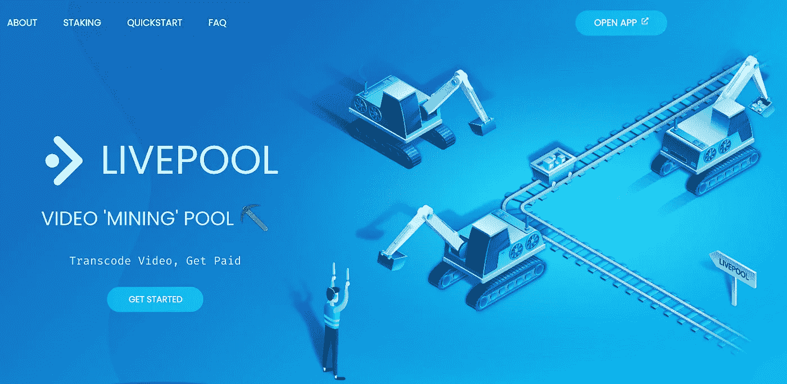

# 我如何建立一个 Livepeer 节点，并在一个月内赚了 1000 多美元

> 原文：<https://medium.com/coinmonks/a-new-livepeer-video-mining-rig-is-born-46919de23eae?source=collection_archive---------0----------------------->

在本文中，我将从头到尾指导您设置一个 Livepeer 节点，让您知道需要什么类型的硬件，并让您知道可以赚多少钱。

## 什么是 Livepeer

[Livepeer](https://livepeer.org) 是一个开源的分散式协议，用于提供视频和直播流基础设施，运行在[以太坊](https://ethereum.org)区块链上。

作为一个希望提供视频基础设施服务的硬件提供商，您可以连接到 Livepeer 网络，该网络作为一个不可信的中介，允许您与需要它的人交换服务，例如直播应用程序(例如 [PlayDJ.tv](https://playdj.tv) )。

目前，Livepeer 网络提供**视频转码**的服务。它以特定的分辨率和比特率接收输入视频，并将其转换为其他分辨率和比特率，以便每个最终用户都可以欣赏这些内容，而不管他们的连接速度如何。这个过程使你能够在 YouTube 或 Twitch.tv 等网站上选择不同的视频质量。


## 什么是视频挖掘

视频挖掘是视频转码的替代术语，在区块链领域更直观。

当转码或视频挖掘时，您从广播公司获取小块的源视频，例如 1080p 分辨率，并将它们转换为广播公司要求的任何分辨率。最常见的是 720 便士、480 便士和 360 便士。


就像加密货币挖掘一样，这个过程可以由 CPU 和 GPU 来执行，后者通常优于前者。在 Nvidia 显卡上，视频转码发生在特定的芯片上(NVENC 用于编码，NVDEC 用于解码)，而不是用于一般计算的 CUDA 内核上(视频内存是一种共享资源)。这意味着在您进行视频挖掘时，您的机器仍然可以执行各种其他任务。这很有趣，因为它允许 Livepeer 网络**接入已经运行的现有硬件**。因此，如果你有一个 Nvidia 的 GPU，这是值得一试。

## 视频挖掘池

目前，有一个名为 Livepool 的视频挖掘池，由 yours truly 创建。它的工作原理类似于加密货币矿池。您将您的节点连接到池中，向它提供一个您想要接收奖金的地址，然后您就可以开始比赛了！

查看 [https://livepool.io](https://livepool.io) 获取说明。



## 硬件要求

*在本文中，我们将只考虑 GPU 设置。*

你需要至少一个 Nvidia GPU，目前 Livepeer 不支持 AMD 卡。兼容卡列表可在[这里](https://developer.nvidia.com/video-encode-and-decode-gpu-support-matrix-new)找到。一般来说，你会想要至少一个 Nvidia Geforce GTX 1050 或更好。新一代显卡拥有更好的 NVENC 和 NVDEC 芯片，可以产生质量更好的视频。

你的机器的其他硬件由你决定，只要确保你订购的所有东西都是兼容的，不要犯我犯的同样的错误(后面会详细说明)。一般来说，你想要一个像样的处理器，至少 8 GB 的内存，最好是固态硬盘。

## 其他要求

如果您打算在内部运行一切，首先您需要从 ISP 处获得一个静态 IP、良好的带宽接入和无限制的数据(您可以预期每月有几 TB 的数据交换)。

如果您在一个轻量级 GPU 节点(或多个)内部部署和一个从数据中心运行的“业务逻辑”节点之间进行设置，则不需要静态 IP。

第二，你需要进入以太坊区块链。你既可以运行自己的节点，也可以在 [https://infura.io](https://infura.io) 或 [https://alchemy.io](https://alchemy.io) 上创建一个免费账户(我只测试了免费层的 infura 限制)。

由于 Livepeer 在以太坊区块链上运行，你需要一些以太坊来支付交易费用。你还需要一些 Livepeer 令牌作为安全保证金，表明你已经开始工作了。你可以在大多数加密货币交易所买到以太坊。然后，您可以通过 uni WAP 获得一些 Livepeer 令牌，单击 [Livepeer Network Explorer](https://explorer.livepeer.org/) 左下角的“Get LPT”打开 uni WAP 小部件。


## 我的设置

去年，我花了大约 400 欧元从一个游戏团队那里买了两张几乎没用过的 Nvidia Geforce GTX 1070 卡。直到现在它们还在收集灰尘，但是我决定随着 Livepeer 网络上需求的巨大增长，我终于把它们用好了。


对于我的 CPU，我得到了一个 AMD 锐龙 53600 3.6 Ghz，这是一个体面的中档 CPU，可以很好地完成工作，甚至可以让你运行其他一些东西。起初我订购了一台锐龙 5 2600，但它与我的主板不兼容，这使我推迟了一周等待新 CPU 的到来。

其他部件:
-主板:Asro B550 Phantom Gaming 4，带 2 个 PCIe 16x 插槽和 1 个 PCIe 1x 插槽。因此，如果您为 1x 插槽使用 riser 卡，您可以拥有多达 3 个 GPU。
-白金额定 1200W 电源
-Corsair 16 GB DDR 4–3200 RAM
-1tb m . 2 SSD

我有一个 250 Mbps 的连接，如果需要的话可以升级到千兆位，我也有一个来自我的 ISP 的静态 IP，每月 25 欧元，但我目前没有在我的 Livepeer 设置中使用它。

我从家里运行我的 2 个 GPU，从数据中心(例如 AWS、DigitalOcean、Azure 等)运行我的“业务逻辑”节点，也称为 Orchestrator。

自从我造了一台电脑以来，已经有近 5 年的时间了，所以在经历了一些障碍之后，比如订购了错误的 CPU，不知道已经使用了散热膏，在我知道自己在这方面很糟糕，但在电缆管理方面可能更糟糕的情况下获得了电源。看来我不会很快用钢化玻璃把这宝贝关上。


## 设置我们的 Livepeer 节点

这将是一个粗略的纲要，我不会在这里进入每一个细节，因为你可以遵循[官方文件](https://livepeer.readthedocs.io/en/latest/transcoding.html)。

1.  下载软件【https://github.com/livepeer/go-livepeer/releases】你可以从 Github 的发布页面下载一个压缩的可执行文件:
2.  在 windows 上解压你的下载文件
    你可以使用 WinRAR 或 WinZip 之类的文件，否则使用下面的命令解压压缩包:

```
tar -zxvf livepeer-linux-amd64.tar.gz
```

3.将解压缩的 Livepeer 二进制文件移动到您的可执行路径中，或者您也可以从该目录运行它。

4.如果您完全在内部运行您的设置，您将需要在公共互联网上打开一个端口，并将其转发到您机器上的端口 8935(默认)。

5.我们现在可以第一次启动我们的节点，并用 Livepeer 协议注册它。第一次启动时，它会自动为你创建一个以太坊账户，并要求你选择一个密码。默认情况下，您可以在~/中找到该帐户的加密私钥。lpData/mainnet/keystore。

```
livepeer -network mainnet -orchestrator -transcoder -ethUrl <your_infura_url> -pricePerUnit 1 -serviceAddr <your public IP>:8935
```

6.接下来启动 Livepeer CLI: `livepeer_cli`

在“节点统计”下找到你的“ETH 账户”,并把你之前购买的 ETH 和 Livepeer 令牌发送给它。


7.一旦你的 LPT 和 ETH 到达，选择`12\. Invoke multi-step "become an orchestrator".`

首先输入您的奖励削减，这将是您的 Livepeer 代币佣金，这些代币由其他用户委托给您的节点，这些用户将获得膨胀的 Livepeer 代币。

然后输入您希望与将 Livepeer 令牌委托给您的用户分享的视频挖掘费用的百分比。

之后，您将不得不设置您的公共可访问的服务 URL，这将是您的公共 IP 端口 8935。

接下来，您将被要求绑定 Livepeer 令牌，绑定您之前发送给自己的所有 LPT。

完成此步骤后，您必须等待下一轮协议开始，直到您的节点变为活动状态。查房不到一天。

## 收入和测试结果

该节点已经运行了一个多月，目前为止已经赚了 0.87 ETH，按当前价格计算大约 1200 美元，这几乎足以让我收回我的硬件成本，尽管我可能应该为最近相当高的交易费打折大约 300 美元。因为我已经向我的 ISP 付费了，所以唯一的额外费用是电费，这比采矿费用低得多(目前每 GPU 消耗 10-60 瓦)，我的数据中心费用大约是每月 100 美元。


GPU usage

我尝试了大约一周的完整现场设置，这大大提高了我在 [Livepeer 排行榜](https://explorer.livepeer.org/?orchestratorTable=performance)上的成绩，但由于我远离大多数需求来自的广播节点，所以收到的实际工作要少得多。


## 有问题吗？

请访问 [Livepeer Discord 服务器](https://discord.gg/FfER5HeG)，我们很乐意为您提供帮助！

> 加入 Coinmonks [电报频道](https://t.me/coincodecap)和 [Youtube 频道](https://www.youtube.com/c/coinmonks/videos)获取每日[加密新闻](http://coincodecap.com/)

## 另外，阅读

*   [复制交易](/coinmonks/top-10-crypto-copy-trading-platforms-for-beginners-d0c37c7d698c) | [加密税务软件](/coinmonks/crypto-tax-software-ed4b4810e338)
*   [网格交易](https://coincodecap.com/grid-trading) | [加密硬件钱包](/coinmonks/the-best-cryptocurrency-hardware-wallets-of-2020-e28b1c124069)
*   [密码电报信号](http://Top 4 Telegram Channels for Crypto Traders) | [密码交易机器人](/coinmonks/crypto-trading-bot-c2ffce8acb2a)
*   [有哪些交易信号？](https://coincodecap.com/trading-signal) | [比特斯坦普 vs 比特币基地](https://coincodecap.com/bitstamp-coinbase)
*   [ProfitFarmers 回顾](https://coincodecap.com/profitfarmers-review) | [如何使用 Cornix Trading Bot](https://coincodecap.com/cornix-trading-bot)
*   [如何在势不可挡的域名上购买域名？](https://coincodecap.com/buy-domain-on-unstoppable-domains)
*   [印度的秘密税](https://coincodecap.com/crypto-tax-india) | [altFINS 审查](https://coincodecap.com/altfins-review) | [Prokey 审查](/coinmonks/prokey-review-26611173c13c)
*   [最佳加密交易所](/coinmonks/crypto-exchange-dd2f9d6f3769) | [印度最佳加密交易所](/coinmonks/bitcoin-exchange-in-india-7f1fe79715c9)
*   [面向开发人员的最佳加密 API](/coinmonks/best-crypto-apis-for-developers-5efe3a597a9f)
*   最佳[密码借贷平台](/coinmonks/top-5-crypto-lending-platforms-in-2020-that-you-need-to-know-a1b675cec3fa)
*   杠杆代币的终极指南