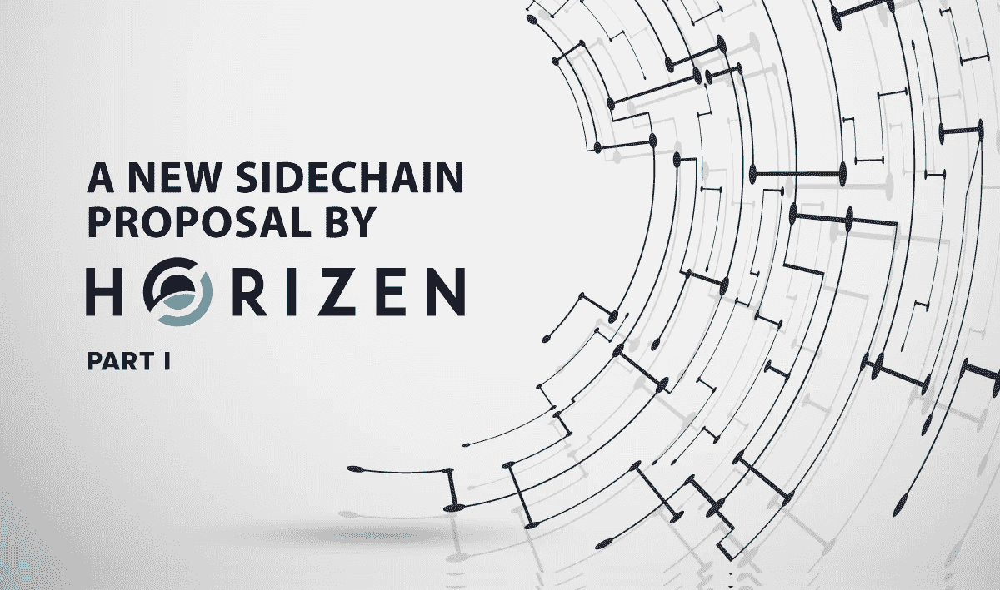

# Horizen 的新侧链提案—第 1 部分

> 原文：<https://medium.com/coinmonks/a-new-sidechain-proposal-by-horizen-part-1-45610d791a05?source=collection_archive---------0----------------------->

## 在现有第一层协议基础上构建的一种有前途的方法——白皮书摘要，供对区块链技术有总体了解的读者使用。

*水平侧链结构已修改，* [*包含在*](/coinmonks/sidechains-interoperable-blockchains-in-the-zendoo-protocol-fbde17fafd2d?source=friends_link&sk=bf045bfcc445bebd39ebea3e37342011) *的新文章中。*