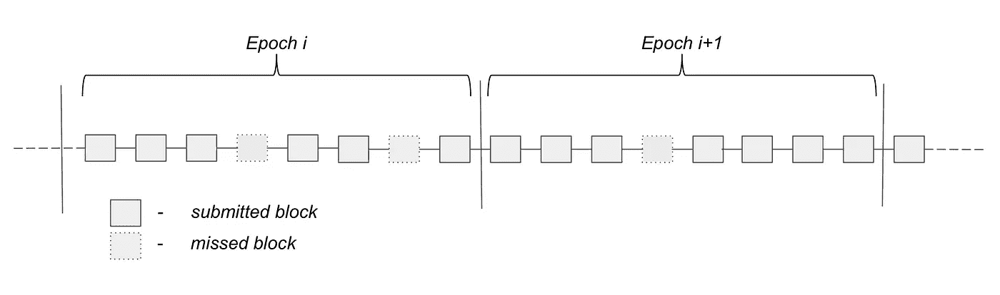

# Horizen 的新侧链提案(二)

> 原文：<https://medium.com/coinmonks/a-new-sidechain-proposal-by-horizen-part-2-8e08e6513a16?source=collection_archive---------3----------------------->

## 一种在现有第一层协议基础上构建的有前途的方法——白皮书摘要，供对区块链技术有总体了解的读者使用。

你可以在这里找到这篇文章的第一部分。

许多人没有必要的时间或动机来阅读白皮书，但仍然希望跟上区块链领域的最新发展，并对该技术有一个大致的了解。对于这些，我想提供什么是侧链的概述，为什么许多团队正在研究它们([第 1 部分](/coinmonks/a-new-sidechain-proposal-by-horizen-part-1-45610d791a05?source=friends_link&sk=eaa4554cb4b9f27da48eaae66a54ff78))以及 Horizen 提出的侧链实现是如何工作的(第 2 部分)。

**TL；DR:** 由 [Alberto Garoffolo](https://www.linkedin.com/in/alberto-garoffolo-576554/) 领导的 [Horizen](https://www.horizen.global/) 工程团队在最近的[白皮书](https://www.horizen.global/assets/files/Horizen-Sidechains-Decoupled-Consensus-Between-Chains.pdf)中提出了一种基于证据原则的新侧链结构。主要的创新是一个新的反向传输协议，它允许事务从许多侧链中的一个返回到主链，而主链不必跟踪侧链，也不用引入一个集中的验证器联盟。虽然将提供侧链共识方案的参考实现，但是大范围的侧链共识方案将是可能的。

## 之前发生了什么

在本文的第一部分，我谈到了为什么侧链是克服当前区块链生态系统中关于可伸缩性和治理的限制的一种很好的方式。

拥有部署侧链的能力将极大地增强在现有公共区块链之上进行建设的可能性。Horizen 项目的侧链的第一个用例很可能是财政部([白皮书](https://iohk.io/research/library/#a-treasury-system-for-cryptocurrencies-enabling-better-collaborative-intelligence)，[摘要](/coinmonks/about-a-treasury-system-for-cryptocurrencies-ecd9913fe0cc))，使组织向其成为分散自治组织的目标更近了一步。

最后，我介绍了侧链实现的两个主要部分:

1.  侧链共识协议(SCP)
2.  跨链传输协议或双向 peg-CCT

## 先决条件

对于本文的第二部分，我将假设对一般的区块链技术概念有一个基本的了解，比如

*   块结构(头、块散列、Merkle 树……)
*   权力/位置概念
*   侧链的概念一般([第 1 部分](/coinmonks/a-new-sidechain-proposal-by-horizen-part-1-45610d791a05)会有帮助)

尽管如此，我还是会尽量让非技术人员也能读懂。

[Source](https://www.farhanadhalla.com/this-is-why-antique-pewter-chandelier-chain-is-so-famous-antique-pewter-chandelier-chain/103562/plated-and-coated-steel-chains-for-chandeliers-highland-lighting-antique-pewter-chandelier-chain/)

# 侧链共识协议

提议的 SCP 基于由 [IOHK](https://iohk.io/) 为 [Cardano](https://www.cardano.org/en/home/) 项目开发的 [Ouroboros](https://eprint.iacr.org/2016/889.pdf) 协议，做了一些细微的修改。这是一个基于利害关系的共识协议的证明，它利用了委托的概念，通常是这样工作的:

*   时间被分成 k 个槽的时期。还没有具体说明，但是为了便于讨论，让我们假设 k*将是 8(并与下图匹配)。*
*   每个槽代表在一定时间内产生侧链嵌段的机会。[研究表明](https://www.youtube.com/watch?v=Nlmv4fg4NQk) 20 秒是允许全球网络同步的合理时间。在达到 *k 的时期内*块将被*锻造*。
*   对于每个*槽，*都有一个*槽头*，它被授权在这个时间段内产生一个块。
*   在一个*时期*开始之前，有一个*槽头选择程序*，它为下一个时期的的每个*槽*分配一个*槽头*(在我们的例子中，每个选择程序/时期将选择 8 个槽头)。
*   如果一个*槽头*错过了他的槽来伪造一个块，下一个*槽头*将包括先前没有包括的事务。

A general scheme of an epoch. Note that even though there is an assigned slot leader for each slot, the leader may skip generating the block and in this case, the slot remains empty.

## 大毒蛇协议的修改

软件的安全性通常是在一定的假设下进行评估的。共识协议也不例外。

POW 共识基于散列权力中诚实多数的假设，而 Ouroboros POS 协议安全性所基于的核心假设是真正随机的*槽头选择程序*。任何一方都不应该能够预测，在给定的时间段内，谁将是被分配的*时隙领导者*。

为了实现这个目标，需要一个随机的来源，而创造真正的随机比人们想象的要困难。最初的 Ouroboros POS 协议引入了基于[可验证秘密共享](https://en.wikipedia.org/wiki/Verifiable_secret_sharing)的抛硬币协议来产生随机性。建议的(修改的)解决方案为此利用了 POW 主链。这是一个简单而有效的解决方案。

随机性来源于给定时间段内主链上的最小块哈希。为此，在随机数生成周期开始之前，合格认证者的集合将被固定。为了破坏这种机制，需要很大一部分散列能力。在诚实的多数人拥有权力的假设下，这应该是不可行的，在经济上也是无利可图的。对这种攻击的正式分析将单独进行。

对原始 Ouroboros 实现的另一个修改是关于侧链块中包含的主链的引用。当介绍*完全引用*的概念时，我将在*跨链传输协议*的背景下谈论这一点。

## 活性和持久性

Garay，Kiayias & Leonardos 说证明区块链共识协议安全性的标准过程需要证明协议满足分布式账本的两个基本性质的能力:*活性*和*持久性*。

**持久性**表示，一旦一个交易“深入”一个诚实玩家的区块链超过 *k 个区块，那么它将以压倒性的概率被包括在每个诚实玩家的区块链中，并且它将在分类帐中被分配一个永久的位置—[2014 年](https://eprint.iacr.org/2014/765)加里·基亚斯&莱昂纳多斯*

持久性与**不变性**的属性密切相关，实际上可能是相同的，但是我不太喜欢这样说。

“[……]**活跃度**表示，所有源自诚实账户持有人的交易最终将在诚实玩家的区块链中深度超过 *k* 块的地方结束，因此对手无法对诚实账户持有人进行选择性拒绝服务攻击。”—[2014 年](https://eprint.iacr.org/2014/765)加里·基亚斯&莱昂纳多斯

这与抵制审查的特性密切相关，但和以前一样，我不会说它们是一样的。

(注意，这是不同于描述每个时期的块数的 *k* 。)

像软件的整体安全性一样，像活性和持久性这样的属性也是在一组假设下被证明的，比如参与者中诚实的大多数。这些假设及其定义的详尽列表可以在[原创的大毒蛇论文](https://eprint.iacr.org/2016/889.pdf)中找到。

## 启用不同的 SCP

分别开发 SCP 和 CCT 的动机是为了支持各种可能的 SCP。尽管以下对跨链传输协议的描述采用了上述改编的 Ouroboros 协议的一些概念，但是它可以与许多其他共识机制相结合。Horizen 目前正在研究一种 Block-DAG(有向无环图)结构，这种结构很可能被部署为侧链。另一个 POW 侧链或 Block-DAG 侧链与 CCT 协议之间的互操作性将接受额外的研究。

[Source](https://www.videoblocks.com/video/web-of-twistingmoving-rusty-chains-for-industrialgrungehorror-composite-effects-on-transparent-background-v3a2mzlseil07sob3)

# 跨链传输协议

> CCT 协议是侧链结构中最重要的部分，因为它定义了 MC 和 SC 之间通信的整体结构。
> 
> 侧链白皮书—garofolo，Viglione

在[第 1 部分](/coinmonks/a-new-sidechain-proposal-by-horizen-part-1-45610d791a05?source=friends_link&sk=eaa4554cb4b9f27da48eaae66a54ff78)中，我定义了 CCT 的两个子协议:

第一个子协议处理*转发事务*，即从主链到侧链的事务。

第二子协议处理*反向事务*，即从侧链到主链的事务。

## 远期交易和*完全参照*

我们的目标是实现跨链传输，因此链之间需要某种形式的通信。首先，侧链需要知道主链上将资产发送到侧链上的地址的所有事务(转发)。其次，主链需要一种机制来验证传入的*反向事务*。

前一个功能，启用*正向交易*，是通过一个叫做*全引用*的概念实现的。它同时解决了两个问题:以一种直接的方式(不是双关语)实现从主链到侧链的转移，以及处理*终结*(或者没有终结)。

Example of missing mainchain (MC) block references and following sidechain (SC) blocks catching up by referencing multiple blocks.

> 完全引用意味着侧链块包含主链块引用的完整链。即使一些块伪造者错过了包括对新生成的 MC [mainchain]块的引用的机会，下面的一些块伪造者也会包括错过的主链引用。
> 
> Horizen 侧链白皮书

**那么*全引用*是如何实现上述目标的呢？**

引用可以是以下两种情况之一:

*   如果主链块包含**,则不考虑对侧链**的事务，仅使用*块散列*作为参考。
*   如果在最后一个块中有**一个或多个*前向事务*** ，则整个*块头*、前向事务*(*s*)和事务的 [*Merkle 路径*](https://www.damiencosset.com/blockchain-what-is-in-a-block/) 被用作参考。*

*通过包含*正向事务*的*块头*和 *Merkle 路径*，侧链节点可以很容易地验证传输。你可以把侧链和主链这两个分类账看作是两个独立的账簿。由于侧链簿记员不断监控主(链)书，他们可以很容易地将跨链交易添加到他们的书。通过将事务与它们的 *Merkle 路径*和相应的*块头*包括在一起，侧链上的每个其他实体将能够自己验证事务是否有效，而不必与主链核对。*

**

*Forward transaction (TX) syncing from mainchain (MC) to sidechain (SC) and resulting block structure in the sidechain.*

*启用转发传输协议意味着对当前主链逻辑进行更改。需要引入一种新的交易类型，即燃烧硬币并提供一组元数据，允许用户在侧链上要求新创建的硬币的相同金额(减去 TX 费用)。反向交易也是如此:侧链上的硬币被烧掉，主链上产生等量的减去 TX 费用的硬币。具有锁定和解锁程序的结构也是可行的。*

*解决的另一个问题涉及使用 Nakamoto 共识的电源链的终结性问题。一个有效的转发事务最初可能包含在一个主链块中，但是包含该事务的块很快就会被分叉出去，变成孤立的。如果交易已经添加到侧链分类账中，这可能会创造双重消费的机会(一次在主链上，一次在侧链上)。绑定消除了这种情况。在主链中出现分叉的情况下，引用分叉出的主链块的侧链块也将被还原。*

## *反向交易和证明人*

*现在让我们进入有趣的部分:如果主链不跟踪侧链，它如何验证传入的反向事务。使用之前的簿记员类比，必须解决以下问题:主链簿记员需要将来自侧链的传入交易添加到他们的账簿中，但永远不能查看他们周围的其他账簿。*

*在这里，我想回到我之前提到的侧链和*传动链*的差异化因素。对于*钉住的侧链*结构，有两种操作模式，涉及*反向事务* : *同步*和*异步*的执行。*

> *同步模式意味着主链和侧链都知道对方，并且可以直接验证传输事务，而异步模式则依靠验证器来处理传输。*
> 
> *Horizen 侧链白皮书*

*正如我前面提到的，Horizen 团队决定独立开发 SCP 和 CCP。由于它的既定目标是启用各种不同的 SCP，所以主链跟踪每个侧链是不可行的，因为它必须知道每个单独的共识协议。这意味着，严格地说，所提出的实现符合驱动链而不是侧链的条件，因为它的操作模式是*异步*:主链不跟踪侧链。*

## *从副链到主链获取交易数据*

*从数据的角度来看，要完成所有这些工作，需要有一个在侧链上启动的传输机制，通知主链传入的反向事务。这是通过引入一种叫做 ***交叉链证书*** ( *CCCert 的*)的新型数据容器来实现的。*

**

*The Basic structure of a Cross-Chain Certificate.*

**CCCert* 包含基本信息，例如侧链标识符( *SCid* )和作为报头的 *CCCert ID* 。所有跨链交易都收集在*反向转移列表*中。最后三个数据字段与 ***认证者*** 有关，它们完成了上面引用中提到的验证者的角色。*

*主链簿记员不能看其他的书(侧链),但必须知道与他们的书相关的事情何时发生。需要有人告诉他们，告诉他们的方式需要标准化。*认证者*是告知主链簿记员关于传入交易的人，他们被告知的标准化方式是通过*跨链证书*。*

*认证者通过特殊类型的交易在主链上注册，这包括他们注册的链的侧链 ID 和锁定的存款。这种股份有防止欺诈的作用，但稍后会有更多的内容。主链上的每个利益相关者都有资格成为*认证者*。所有*认证者*的子集验证侧链上的后向事务，将它们收集在*后向转移列表中，*用*聚合签名*对结果 *CCCert* 进行签名，并将其发送到主链。*

*促进反向交易是一种工作形式。需要有做这项工作的动机。此外，必须设计激励机制，以鼓励诚实的行为，恶意的行为不能获利。其中一个主要目标是以分散跨链验证过程的方式设计协议。*

*认证者通过收取他们正在处理的所有交易的交易费而受到激励。如果他们提交虚假证书，他们将无法解锁他们的股份。一组在主链上锁定了组合存款 *X* 的认证机构只允许签署一个组合总额为 *0.5X* 的 *CCCert* 。这就是所谓的最大证书金额( *MAX_CERT_AMOUNT* )。*

*如果每张证书的金额没有上限，就有可能锁定一笔存款，签署一份价值超过存款本身的欺诈性 *CCCert* ，将其发送到主链上的一个自控地址，然后在失去股份的情况下快乐地生活。*

## *举报欺诈*

*强制执行这一措施是基于诚实多数的假设。您可能已经注意到在 *CCCert* 中有一个名为*欺诈报告列表*的数据字段。如果发生欺诈，该字段将按以下方式使用:*

*   *欺诈性证书 *CCCert(i)* 是由群组中的大多数证明者( *i)* 私下创建并签名的。*
*   *然后，它被发送到主链，并被包含到一个块中( *i* )，因为主链不能验证证书*和检测欺诈本身。**
*   *欺诈证书现已同步回侧链(参见*完整参考*)。*
*   *下一组*证明者* ( *i+1* )验证侧链上先前的 *CCCert* ( *i* )，检测欺诈，并在其证书 *CCCert(i+1)* 中包含一个*欺诈报告*。*
*   *一旦主链接收到包含欺诈报告的 *CCCert* ( *i+1* )，该组恶意认证者( *i* )将无法解锁他们的存款。*
*   *如果组( *i+1* )不包括欺诈报告，则在他们之后的组( *i+2* )将会丢失他们的存款，并且之前的两个欺诈组( *i* 和 *i+1)* 将会丢失他们的存款。*

*由于没有报告检测到的欺诈，一个团体以及最初的恶意团体将面临失去存款的风险。同样需要注意的是，根据协议设计，在一个*认证者组*中不可能有一个*认证者*。*

*反向转移的实际内部工作稍微复杂一点，但是如果你想更详细地了解它们，我建议你看一看原始资料。([白皮书](https://www.horizen.global/assets/files/Horizen-Sidechains-Decoupled-Consensus-Between-Chains.pdf))*

*最后，为了保护主链免受通货膨胀的影响，如果其他方面都出现问题，还有最后一道防线。*安全措施*是主链上的一个机制，它跟踪已经转移到每个独立侧链的资产总量。从一个侧链中取出的硬币数量不可能超过最初移动到那里的数量，因此可以防止通货膨胀。*

# *结论*

*我希望我能让大家明白，为什么侧链是克服当前区块链生态系统在可扩展性和治理方面的限制的一种优雅方式。本文的主要贡献是提供了一种新的反向传输协议，它不依赖于一组集中的验证者。每个利益相关者都有资格成为认证者，如果他喜欢的话，将分散化引入跨链验证的过程。*

*从安全的角度来看，最重要的事情是以这样一种方式设计实现，即任何侧链都不可能损害主链。*

*关于 SCP，必须保证*槽头*、*活跃度*和*持久性*的真正随机分配。*

*关于 CCT 安全性，通过在每个块中添加对主链的引用(*完全引用)*，引入一组认证者可以签署的总金额上限( *MAX_CERT_AMOUNT* )以及跟踪已经转移到给定侧链并可以撤回的总金额的*安全措施*来实施。*

*拥有部署侧链的能力将极大地增强在现有公共区块链之上进行建设的可能性。从这里开始，将有很多工作要做，实际上在 Horizen 主网上部署第一个侧链。这包括严格的安全性测试和对侧链共识协议的进一步评估。*

*正如我之前提到的，Horizen 项目侧链的第一个用例很可能是促进[财政](/coinmonks/about-a-treasury-system-for-cryptocurrencies-ecd9913fe0cc)的侧链，使项目更接近成为一个真正分散的自治组织。如果你想知道 Horizen 项目是关于什么的，你可以去看看他们的网站[这里](https://www.horizen.global/)。*

*由于我只是刚刚开始写区块链领域的技术创新，请随时留下任何反馈或批评。如果你喜欢你在这里发现的东西，并希望我涵盖你感兴趣的另一个主题，请留下评论，甚至鼓掌一两下。我感谢 Medium 和 [Twitter](https://twitter.com/SLebur) 上的每一个新粉丝。*

*我要感谢 [Coinmonks](https://medium.com/coinmonks) 出版物为我提供了一个增加曝光率的平台，并感谢 [Alberto](https://www.linkedin.com/in/alberto-garoffolo-576554/) 团队为我提供了访问白皮书预发布版的机会。*

*再见了伙计们，*

*乔纳斯·鲁贝尔*

> *[直接在您的收件箱中获得最佳软件交易](https://coincodecap.com/?utm_source=coinmonks)*

**