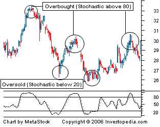
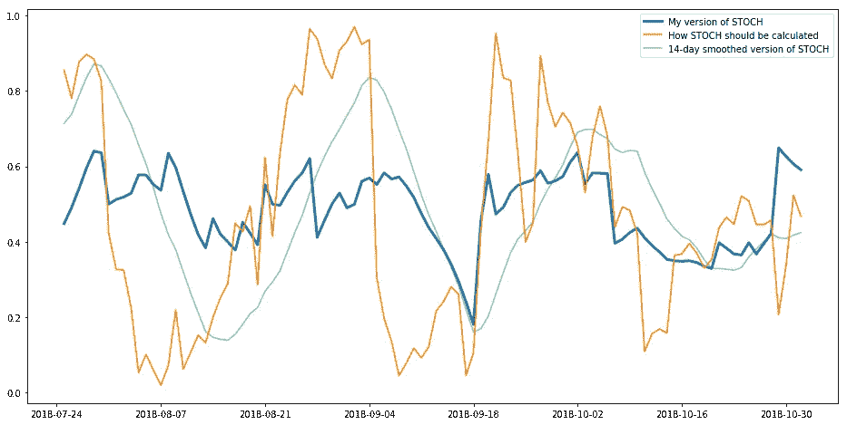

# 一个新的随机振荡器？

> 原文：<https://medium.com/coinmonks/a-new-stochastic-oscillator-36429caaf2f?source=collection_archive---------2----------------------->


“turned on flat screen monitor” by [Chris Liverani](https://unsplash.com/@chrisliverani?utm_source=medium&utm_medium=referral) on [Unsplash](https://unsplash.com?utm_source=medium&utm_medium=referral)

***免责声明:*** *以下内容均非实际交易建议。它旨在教育和与社区分享我的学习经验，不应用于对任何市场资产的未来方向做出假设。永远做自己的研究！*

在大多数科学领域(我敢认为市场技术分析是应用统计学/数据科学的一种形式)，运气扮演着巨大的角色。就在几天前，我还在玩[随机振荡器](https://www.investopedia.com/terms/s/stochasticoscillator.asp)——一个众所周知的 TA 指标，试图创造一个超越[美元成本平均(DCA)](https://www.investopedia.com/terms/d/dollarcostaveraging.asp) 的 ML 驱动交易策略。

有一种流行的观点认为，在较长的时间内定期投入少量资金(也称为平均成本投资)是一种相对低风险的战胜市场的方式。我决定尝试使用机器学习来击败 DCA，方法是随着时间的推移保持同样的小额投资方式。

# 随机振荡器

随机振荡器(STOCH)是一个动量指标，它将资产的当前价格与同一资产在一段时间内(通常为 14 或 30 天)的最低和最高价格进行比较。计算 STOCH 的公式非常简单:

```
current_price - min_price / max_price - min_price
```



source: [Investopedia](https://www.investopedia.com/terms/s/stochasticoscillator.asp)

通过给出一个介于 0 和 100 之间的比率(或者 0 和 1，取决于你如何构建它)，STOCH 是一种简单的方法来识别市场是否已经*超卖*(也许是买入的时候了)，或者*超买*(也许是卖出的时候了)。有很多人认为超卖阈值应该是 20，超买阈值应该在 80 左右。

当然，单独使用 STOCH 指标很少会给你带来显著的交易业绩。事实在于创造性地将不同时期的股票和其他指标结合在一个模型中，这个模型可以抵御市场波动。我通常会使用由多个浅层[决策树](https://en.wikipedia.org/wiki/Decision_tree_learning)组成的[随机森林](https://en.wikipedia.org/wiki/Random_forest)，每个决策树仅使用一两个指标来对可用数据进行分类。

原来在计算 STOCH 的时候，我留了一个错误。上面的公式改为:

```
mean_of_price_across_period - min_price / max_price - min_price
```

我计算了 3 个月内比特币/欧元的价格。我的版本(蓝线)看起来像是 STOCH(橙线)奇怪的平滑版本。有人会说，我所创造的只是一个简单的平滑橙色线。为了比较，我添加了一个 14 天简单平滑版本的 STOCH 指标(绿线)。事实上，蓝线和绿线趋向于会聚，但并不总是如此。蓝色的更加有趣，不像完全平滑的版本，它保留了一定程度的细节，没有像纯 STOCH 那样走向极端。



Comparing my version of STOCH with what should be its correct calculation

# 交易绩效

如果不是我从这个所谓“错误”的股票指标中获得了有趣的交易表现，我不会开始写这个。让我们客观地看待这件事。从 2018 年 1 月 1 日开始，我测试了比特币/欧元价格的四种不同策略。所有的策略都包括在每月初投资 50 欧元，除了 DCA(蓝线)，所有其他策略都包括在不同的时间点以不同的幅度卖出比特币。这是我得到的:


Comparing trading strategy performance: Jan 2018 — Nov 2018

使用老的斯托奇经验法则——在 20 点以下买入，在 80 点以上卖出(橙色线),确实比简单地定期买入并持有要好得多。事实上，它的表现甚至比随机森林 ML 模型还要好一点，随机森林 ML 模型的特征之一就是 STOCH(绿线)。然而，仅仅在这短短 11 个月的熊市期间。有趣的是，真正的“赢家”似乎是随机森林策略的同一个版本，它使用了“错误”计算的随机森林。在所有的策略中，这是唯一一个能够达到收支平衡(超过紫色阶梯线)的策略，尽管只是一点点。

仅仅 6 个月前，在疯狂的加密市场兴起的中期，拖动起点，显示了一个完全不同的画面。用经验法则买卖远非易事。它基本上保持在盈亏平衡线以下。其他三个策略基本上跟随市场波动，但真正突出的一个是随机森林模型，它使用了 STOCH 的变化，我认为我计算错了。


Comparing trading strategy performance: Jun 2017 — Nov 2018

巧合吗？然而，将交易时段的开始时间延长至 2016 年初，将会产生大致相同的结果。通过使用修改后的 STOCH 作为我的 ML 模型的一部分，该策略以某种方式成功利用了 2018 年 2 月/3 月期间比特币的第二次下跌浪潮，在顶部卖出，在底部再次买入。


Comparing trading strategy performance: Jan 2016 — Nov 2018

# 结论

这是不是一个好的策略，我很难判断，仅仅基于我使用的有限数据。坦率地说，正如文章开头提到的，它的目标是与社区分享我的一些学习，而不是给出任何类型的交易建议。

似乎我会在我的策略的未来迭代中继续看到对 STOCH 的这种解释。意外之喜在我的研究中发挥了巨大的作用，我会试着*打破*一些技术分析机构的规则，希望我能发现更多隐藏在岩石下的宝石。

> [在您的收件箱中直接获得最佳软件交易](https://coincodecap.com/?utm_source=coinmonks)

[](https://coincodecap.com/?utm_source=coinmonks)