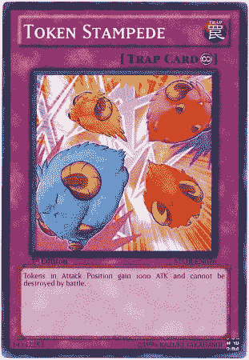

# 一场不可避免的象征性踩踏即将到来

> 原文：<https://medium.com/coinmonks/a-nonfungible-token-stampede-is-coming-224fe44a9d3b?source=collection_archive---------2----------------------->

## 我看到了未来。ERC721 市场即将爆发。

> ERC-721 是一个免费的开放标准，描述了如何在以太坊区块链上构建不可替换的或唯一的令牌。虽然大多数令牌都是可替换的(每个令牌都是相同的)，但 ERC-721 令牌都是唯一的。把它们想象成稀有的、独一无二的收藏品。(来源:[http://erc721.org](http://erc721.org))

在我的帖子下面，我将通过引用几十个链接、博客、视频和我研究的其他资源来解释“**什么是**”ERC 721。对于现在我认为重要的是你要把握好“ ***为什么*** ”。

## 我对摆在我们面前的未来有一个宏伟的愿景，我想称之为“**令牌踩踏事件**”我可能是错的，但我发现未来的景象如此清晰，以至于我觉得有必要与你分享。

> “如果你最初生产的东西被其他人视为玩具，不要气馁。事实上，这是一个好迹象。这可能就是为什么其他人都忽略了这个想法。”~ [保罗·格拉厄姆，谈创业思路](http://www.paulgraham.com/organic.html)

对隐猫来说，这远比看上去要复杂得多。世界即将经历数字资产的新一轮经济繁荣，它们将被称为 NFT(不可替代的代币)和 DAR。(数字资产注册)。 [**【隐猫】不是关于猫的(提示:ERC-721)**](https://thebitcoin.pub/t/cryptokitties-isn-t-about-the-cats-hint-erc-721/23883) **。**

> [发现并回顾最佳加密软件](https://coincodecap.com)

去年 12 月，CryptoKitties 占据了以太坊网络 15%的份额。最近有报道称，这些长相滑稽的猫背后的公司，以太坊网络的“玩笑”，筹集了超过 1200 万美元。这让我意识到这不仅仅是关于猫的。它是关于建立交换数字资产和独特资产的数字表示的市场。尽管 ERC20 代表了可以在应用程序的生态系统中作为货币使用的可替换令牌，但 **ERC721** 标准的引入标志着一种新趋势，即 ***数字记录所有权*** *和* ***去中心化*** ***贸易*** *，*在实际铸造或创造记录的公司消亡后，令牌的所有权仍可以长期存在这两个标准实际上是相辅相成的。分散和混合集中/分散模式将开始出现，企业将为您可以用 ERC20 令牌、以太网或其某种组合购买的东西创建数字资产注册。

I share the same sentiments as [Balaji S. Srinivasan](https://medium.com/u/f5a2e83d6d8f?source=post_page-----224fe44a9d3b--------------------------------) in his tweet back in December 2017.

如果你在过去几年里一直在关注加密货币和代币市场，你就会体验到群体心理的影响，并在图表中看到市场中恐惧和贪婪的影响。毫无疑问，ERC20 token 标准对散户和基金经理的投机方式产生了持久的影响，也对公司获得替代融资方式产生了影响。几十年来，风险资本家第一次不得不重新思考他们的商业模式，因为这种新形式的资本竞争不要求企业放弃大量股权作为回报。

由于美国证券交易委员会和 CFTC 在如何对 ERC20 令牌进行分类和监管方面给出了有些矛盾的指导，这使得公众争相自治，因此我们进入了一个“*等待和观望*的时期，对于许多试图用公用事业令牌建立系统的公司来说，公用事业令牌可能会被追溯视为不受监管的证券。2018 年的气候肯定发生了变化，与 2017 年极端狂野的西部天有着非常不同的感觉。提供代币的合法企业不想被当作一个例子，所以许多企业开始尽可能远离雷达。

我全心全意地认为，当前的不确定性氛围正在扼杀创新。对即将到来的安全令牌浪潮有一种新的推动，如 Polymath ST20 标准是下一个要寻找的大目标——但我认为，在这个领域航行可能会遇到来自现有权力和已经掌握权力的遗留系统和交易所的许多阻力。我还认为，我们必须小心不要引入一个排他性的体系；仅仅因为一个人的银行账户里没有一百万美元，并不意味着他们应该被归类为“*不老练的*”，从而被禁止投资和他们完全了解的机会。我们都不应该有这样的目标:用一种新的、闪亮的、智能合约驱动的金门形式，取代旧的、破损的精英金融市场体系。 ***我进入比特币、以太坊和区块链空间，是为了帮助赋予个人权力，而不是禁止它们。***

> G 食品新闻！有一个领域尚未开发，这个领域的创新即将爆发。监管机构对看起来像证券和货币的投资过于谨慎，但当涉及收藏品和数字资产登记时，机会就在眼前。来帮助建造明天的铁路。

进入 ERC721 标准，即不可替换令牌标准。什么开始作为一个"*加密收藏品"*席卷以太坊网络。人性的一部分似乎与寻找和收集稀有物品有着密切的关系:无论是棒球卡、稀有艺术品、数码口袋妖怪、视频游戏中的物品，甚至是虚拟的土地。在疯狂的高峰期，我实际上推出了一份象征性的 Loci.io 销售合同。销售的贡献者不得不在其他网络参与者之间竞争，在 12 月期间将他们的天然气费用提高到高达 60 千兆瓦。

许多人认为那次经历和低吞吐量是以太坊网络的过错，但它帮助我更充分地理解了对这个我们称之为世界计算机的东西的巨大需求。获得一个公开的、开放的、全球性的、不受审查的全球资源确实是有成本的。事实证明，没有以最有效的方式确认交易是可以的，事实上这是设计好的。它是网络的哈希力量，确保数据得到验证和安全。事实证明，世界各地的人们对这种“无信任”交易也有巨大的需求。它们不一定要很快，只要你可以相信这样一个事实，即网络将处理它，而不管你是谁，你为什么要传输数据。抵制审查的贸易。

现在可能需要一点想象力，但是看看你的周围。想象一下你看到的所有独特的东西:你的车——它可能是这个星球上许多蹩脚的 2003 开拓者中的一辆，但它是你的**蹩脚的 2003 开拓者*，有自己独特的 VIN。或许，那辆车的所有权不再需要通过车管所转让，而是通过一个更加顺畅的市场。同样的道理也适用于房地产契约、位于卢浮宫的极其罕见的艺术品，甚至是那些该死的数字豆豆娃。*

> *对我来说更明显的事实是，公司和个人开发者都将受益于这一标准的结果，受益于由不断增长的社区设计和开发的市场上的互操作性。我们将会看到商品市场的出现，这将使个人能够互相交易商品，而这些商品甚至不是由网站所有者创建的。*

*即使你是创建 ERC721 令牌特定实例的公司，市场也会像 [OpenSea](https://medium.com/u/b7346f3882bb?source=post_page-----224fe44a9d3b--------------------------------) 一样弹出，列出你的 NFT / DAR，仅仅因为你做出了符合该标准的明智选择。他们甚至为开发者提供了一个[教程](https://opensea.io/developers)，教他们如何符合标准以更好地集成！没有任何东西强迫你遵守标准的每一个细节，事实上，像@KnownOrigin_io 这样的公司已经开始问这个问题，[“我们能增强数字资产所有权吗？”](/knownorigin/knownorigin-can-we-enhance-digital-asset-ownership-6a7d78d85fae)经由[詹姆斯·摩根](https://medium.com/u/6bb848438230?source=post_page-----224fe44a9d3b--------------------------------)。*

*此外，你的公司可以通过提供额外的*服务*使你的公司与众不同，从而使你与“一般的”市场区分开来；当客户寻求更愉快的用户体验时，他们喜欢这种“神奇的感觉”。我认为这种分散/集中竞争的混合方式将创造一种我们从未见过的经济繁荣，我很高兴看到它的结束。*

*我积累了一份主要的资源清单，我强烈建议你去看看。这些资料来源广泛，从对各种标准提案的高度理解，到简短的视频，甚至还有一些更深入的、多部分的系列文章，我觉得读起来很有趣。我欠那些写下这些文章的人一份感激之情。没有他们的努力，我不会真正掌握未来。我想分享这些资源，并确保我引用了作者，这样你就可以感谢他们并向他们学习。*

*[ERC 假人代币标准
ERC 20，ERC 223，ERC 827，ERC 721](https://www.techracers.com/erc-token-standards)*

*原[ERC721.org](https://github.com/ethereum/EIPs/issues/721)原&原[EIP](http://erc721.org)*

*[区块链 WTF](https://medium.com/u/fca0a7e1a365?source=post_page-----224fe44a9d3b--------------------------------) 是 ERC721*

*[https://blockchain.wtf/2018/05/series/wtf-is/erc-721/](https://blockchain.wtf/2018/05/series/wtf-is/erc-721/)*

# *ERC721 的剖析*

*[了解不可替代的以太币](/crypto-currently/the-anatomy-of-erc721-e9db77abfc24) [杰拉·纳什·⚡️](https://medium.com/u/22bbbf10758e?source=post_page-----224fe44a9d3b--------------------------------)*

*[浏览 ERC721 全面实施
深入了解管理 ERC721 资产](/blockchannel/walking-through-the-erc721-full-implementation-72ad72735f3c) [区块通道](https://medium.com/u/211d5b924366?source=post_page-----224fe44a9d3b--------------------------------)*

*[齐柏林](https://medium.com/u/4e5199c3ee0a?source=post_page-----224fe44a9d3b--------------------------------)号 [ERC721 标准示例](https://github.com/OpenZeppelin/openzeppelin-solidity/blob/master/contracts/token/ERC721/ERC721Token.sol)*

## *跃入坚实——ERC 721(多部分系列)[安德鲁·帕克](https://medium.com/u/f0a453891087?source=post_page-----224fe44a9d3b--------------------------------)*

*[Part 1](/coinmonks/jumping-into-solidity-the-erc721-standard-part-1-e25b67fc91f3)|[Part 2](/coinmonks/jumping-into-solidity-the-erc721-standard-part-1-e25b67fc91f3)|[Part 3](/coinmonks/jumping-into-solidity-the-erc721-standard-part-3-5f38e012248b)|[Part 4](/coinmonks/jumping-into-solidity-the-erc721-standard-part-4-ad21e3a5d9c)|[Part 5](/coinmonks/jumping-into-solidity-the-erc721-standard-part-5-3b91f39fc1ee)|[Part 6](/coinmonks/jumping-into-solidity-the-erc721-standard-part-6-7ea4af3366fd)  
[以太坊开发演练(Part 4:token 和 ERC)](https://hackernoon.com/ethereum-development-walkthrough-part-4-tokens-and-ercs-68645cf2f73e)[dev _ ZL](https://medium.com/u/40b255e3932e?source=post_page-----224fe44a9d3b--------------------------------)
和[对应 Github Repo“以太坊开发演练”。](https://github.com/devzl/ethereum-walkthrough-4)*

*隐猫在 20 分钟内克隆。NFT 教程[马克西姆伊万诺夫](https://medium.com/u/55682d5d488a?source=post_page-----224fe44a9d3b--------------------------------)
第一部分 | [第二部分](https://maksimivanov.com/posts/gradient-coin-tutorial-part-2/) | [第三部分](https://maksimivanov.com/posts/gradient-coin-tutorial-part-3/)*

*另一个作者写的很棒的教程，关于 ERC20
[第一部分](https://maksimivanov.com/posts/ethereum-react-dapp-tutorial) | [第二部分](https://maksimivanov.com/posts/ethereum-react-dapp-tutorial-part-2)*

***例题和推理***

*[数字收藏品&数字的怪异未来](/@jjmstark/digital-collectibles-and-the-weird-future-of-digibles-f75f4bf0f9aa) [乔希斯塔克](https://medium.com/u/d2400e27a419?source=post_page-----224fe44a9d3b--------------------------------)
[加密收藏品文章](https://www.coindesk.com/crypto-collectables-ethereums-next-killer-app-is-on-its-way/)关于 [CoinDesk](https://medium.com/u/f2fa6f2d51a6?source=post_page-----224fe44a9d3b--------------------------------)
具体的开源例子:[分散软件许可所有权](https://github.com/cryppadotta/dotta-license)
[软件许可的替代实现](https://atchai.com/blog/2018-04-11-software-licence-token-ethereum-erc721-fungible/)如 NFT*

***不可替代市场——符合标准并被发现** [https://opensea.io/developers](https://opensea.io/developers)[OpenSea](https://medium.com/u/b7346f3882bb?source=post_page-----224fe44a9d3b--------------------------------)
https://nonfungible.com @不可替代
https://www.etheremon.com/#/market[ether emon](https://medium.com/u/dd9db332265a?source=post_page-----224fe44a9d3b--------------------------------)[https://opensea.io/category/etheremon](https://opensea.io/category/etheremon)
**@稀有动物** [**拍卖**](https://rarebits.io)[隐型僵尸教育工具](https://cryptozombies.io) [织机网](https://medium.com/u/9f7a25569a7c?source=post_page-----224fe44a9d3b--------------------------------)* 

***更多文章** [不可替代代币概述](http://fintechranking.com/2018/04/10/an-overview-of-non-fungible-tokens/)
[Crypto FinalFour —可交易的三月疯狂括号](https://news.ycombinator.com/item?id=16593787)
[外太空入侵 ERC-721 代币！](https://cryptobriefing.com/crypto-kitties-were-just-the-beginning/)
[DARs、NFTs 和新的 ERC-721](https://blog.decentraland.org/dars-nfts-and-the-new-erc-721-132a705eab42)
[Toshi](https://medium.com/u/32a7eeb3e4cf?source=post_page-----224fe44a9d3b--------------------------------)[钱包支持 ERC20 代币& ERC721](https://blog.toshi.org/toshi-wallet-now-supports-erc20-tokens-and-erc721-collectibles-e718775895aa)
[代币化将扰乱博彩业](https://themerkle.com/tokenizing-virtual-assets-using-blockchain-tech-will-disrupt-the-billion-dollar-gaming-industry/) [厚积薄发](https://medium.com/u/ef5326fcc7fa?source=post_page-----224fe44a9d3b--------------------------------)*

*[**分散土地**](https://medium.com/u/98348dd48afe?source=post_page-----224fe44a9d3b--------------------------------) **— ERC721 土地可以用 ERC20 法力** [站点](https://decentraland.org) | [市场](https://market.decentraland.org) | [博客](https://blog.decentraland.org/introducing-the-decentraland-marketplace-d8b4c7d509f8) | [ERC721 GitHub 回购](https://github.com/decentraland/erc721) | [市场 GitHub 回购](https://github.com/decentraland/marketplace-contracts)*

***NFT 实施和其他项目** CryptoKitties。[https://www.cryptokitties.co](https://www.cryptokitties.co/)0x cert ERC-721 令牌。
苏方格。[https://tenthousandsu.com](https://tenthousandsu.com/)
放权。[https://decentraland.org](https://decentraland.org/)
隐朋克。[https://www.larvalabs.com/cryptopunks](https://www.larvalabs.com/cryptopunks)市场。[https://www . dmarket . io](https://www.dmarket.io/)
金恩币。[https://enjincoin . io](https://enjincoin.io/)
ubit quity。[https://www . ubit quity . io](https://www.ubitquity.io/)Propy。[https://tokensale.propy.com](https://tokensale.propy.com/)
隐猫部署合同。[https://ethers can . io/address/0x 06012 c8 cf 97 bead 5 deae 237070 f 9587 F8 e7a 266d # code](https://etherscan.io/address/0x06012c8cf97bead5deae237070f9587f8e7a266d#code)
苏方块 Bug 赏金计划。https://github.com/fulldecent/su-squares-bounty
xxxx ERC 721。https://github.com/fulldecent/erc721-example[https://github.com/nastassiasachs/ERC721ExampleDeed](https://github.com/nastassiasachs/ERC721ExampleDeed)古玩卡片。【https://mycuriocards.com[罕见的佩佩
。](https://mycuriocards.com/)[https://rarepepewallet.com](https://rarepepewallet.com/)
拍卖行资产接口。[https://github . com/DOB/auction house/blob/master/contracts/asset . sol](https://github.com/dob/auctionhouse/blob/master/contracts/Asset.sol)
open zeppelin safe ERC 20 . sol 实现。[https://github . com/open zeppelin/zeppelin-solidity/blob/master/contracts/token/er C20/safe ERC 20 . sol](https://github.com/OpenZeppelin/zeppelin-solidity/blob/master/contracts/token/ERC20/SafeERC20.sol)*

*[*丹埃蒙斯*](https://linkedin.com/in/dan-emmons) *是* [*Loci.io*](https://loci.io) *的区块链开发者、* [*埃蒙斯皮雷德 LLC*](http://www.emmonspired.com/) *、a* [*认证比特币专业人士*](http://cryptoconsortium.org/lookup/6f0d14) *、认证以太坊开发者、全栈开发者、加密货币项目顾问。他还是一个名为*[*# ByteSizeBlockchain*](https://www.youtube.com/watch?v=SVBZ7mdgGcA)*的 Youtube 频道和 iTunes 播客的创作者。**

**