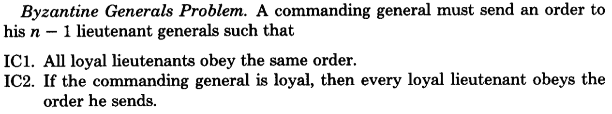

# 理解拜占庭将军的问题(以及它如何影响你)

> 原文：<https://medium.com/coinmonks/a-note-from-anthony-if-you-havent-already-please-read-the-article-gaining-clarity-on-key-787989107969?source=collection_archive---------0----------------------->

Anthony 的一个提示:如果你还没有，请阅读文章“[弄清楚关键术语:比特币对区块链对分布式账本技术](https://hackernoon.com/gaining-clarity-on-key-terminology-bitcoin-versus-blockchain-versus-distributed-ledger-technology-7b43978a64f2)”和“[共识解释](https://hackernoon.com/distributed-ledger-consensus-explained-b0968d1ba087)”。如果您是这个领域的新手，这些文章将提供一些有用的背景。

我儿子快 10 岁了。几天前，我和他分享了拜占庭将军的问题。在睡觉前的近一个小时里，他一直在纠结这个问题以及如何解决它——不出所料！这是一个虚构的问题，但却是有史以来最困难的问题之一。它第一次被引用在 1982 年发表的题为“[拜占庭将军的问题](https://people.eecs.berkeley.edu/~luca/cs174/byzantine.pdf)”的论文中。

我儿子还不知道或不理解的(除了答案)！)是这个问题的深远影响和解决方案的实际应用，参考了中本聪 2008 年发表的题为“[比特币:一个点对点的电子现金系统](https://bitcoin.org/bitcoin.pdf)”的论文。

正如迈克·马洛尼在他最近的纪录片中解释的那样，拜占庭将军的问题可以概括为一个问题:你如何确保相距遥远的多个实体在采取行动之前完全一致？

换句话说，个别政党如何能够找到一种方法来保证充分的共识？

在考虑该问题的可能解决方案之前，请允许我更详细地概述该问题，并解释它与您和您的业务有何关系。

# 剖析拜占庭将军的问题

想象一下拜占庭军队的几个师，攻击一个被完全包围的城市。为了继续作战，分散在城市外围的每个师的将军们必须就作战计划达成一致。然而，当一些将军想要进攻时，另一些将军可能想要撤退。

在官方对拜占庭将军问题的描述中(你可以在前述论文的第三页找到)，有一个领导者-追随者的设置。为了达成共识，指挥官和每个中尉都必须同意同一个决定。

条件描述如下:

第 3 页，[拜占庭将军问题](https://people.eecs.berkeley.edu/~luca/cs174/byzantine.pdf)

让事情变得复杂的是，将军们彼此相距如此之远，以至于需要信使来让将军们交流。此外，一个或多个中尉可能是叛徒，意图破坏局势。

那么，给定这些条件和指挥官-中尉的设置，陆军能执行战略吗？

该问题的解决方案依赖于一种算法，该算法可以保证:

1.  所有忠诚的中将决定相同的行动计划，和
2.  少数叛徒不能导致忠诚的中尉们采纳一个糟糕的计划。

忠诚的中尉们都会做算法说他们应该做的事情，但是叛徒们可能会做他们想做的任何事情。不管叛徒做什么，算法必须保证第一个条件。忠诚的副手们不仅应该达成一致，还应该商定一个合理的计划。

 [## 2021 年 9 大最佳加密借贷平台

### 当谈到加密货币贷款时，大量因素等同于良好的收入状况。此外，借款的一部分…

blog.coincodecap.com](https://blog.coincodecap.com/crypto-lending) 

# 为什么拜占庭将军的问题也可能是你的问题

拜占庭将军的问题是最常用来说明分布式账本技术的一致性要求的类比(DLT)。

分布式系统中的节点必须都同意某一组规则，并且能够在事务被添加到数据库之前，通过同意对事务的特定评估而向前移动。

这并不容易，尤其是在存在成千上万个节点的情况下。除此之外，每个人都必须对要添加的新信息的有效性达成一致，从而防止坏人破坏账本和重写历史。

必须采用特定类型的共识算法来实现这一点，使节点能够协同工作，安全地更新分类帐。

# 了解拜占庭容错

拜占庭故障是系统中的任何故障，它向不同的观察者呈现不同的症状。它没有任何限制，也没有对节点可能具有的行为类型做出任何假设(例如，一个节点可以生成任何类型的任意数据，同时伪装成诚实的参与者)。

拜占庭式断层在不同系统中的实际发生和分类是一个复杂而广泛的课题。然而，它的定义方式导致了拜占庭容错(BFT)的正式定义。

请注意，拜占庭故障是最严重和最难处理的。飞机引擎系统、核电站以及几乎所有其行为依赖于大量传感器结果的系统都需要拜占庭容错。

# 这完全取决于共识

在本文中，我们讨论了与分布式系统中的一致性问题相关的一些背景信息。

在以后的文章中，我将探讨共识的类型以及相关的比较。敬请期待！

# 参考

*   [拜占庭将军的问题](/all-things-ledger/the-byzantine-generals-problem-168553f31480)
*   [拜占庭容错](https://en.wikipedia.org/wiki/Byzantine_fault_tolerance)
*   [了解区块链基础知识，第 1 部分:拜占庭容错](https://en.wikipedia.org/wiki/Byzantine_fault_tolerance)

> 加入 Coinmonks [电报频道](https://t.me/coincodecap)和 [Youtube 频道](https://www.youtube.com/c/coinmonks/videos)获取每日[加密新闻](http://coincodecap.com/)

## 另外，阅读

*   [密码电报信号](http://Top 4 Telegram Channels for Crypto Traders) | [密码交易机器人](/coinmonks/crypto-trading-bot-c2ffce8acb2a)
*   [复制交易](/coinmonks/top-10-crypto-copy-trading-platforms-for-beginners-d0c37c7d698c) | [加密税务软件](/coinmonks/crypto-tax-software-ed4b4810e338)
*   [网格交易](https://coincodecap.com/grid-trading) | [加密硬件钱包](/coinmonks/the-best-cryptocurrency-hardware-wallets-of-2020-e28b1c124069)
*   [加密交换](/coinmonks/crypto-exchange-dd2f9d6f3769) | [印度的加密应用](/coinmonks/buy-bitcoin-in-india-feb50ddfef94)
*   开发人员的最佳加密 API
*   最佳[加密贷款平台](/coinmonks/top-5-crypto-lending-platforms-in-2020-that-you-need-to-know-a1b675cec3fa)
*   [杠杆代币](/coinmonks/leveraged-token-3f5257808b22)终极指南
*   [8 大加密附属计划](https://coincodecap.com/crypto-affiliate-programs) | [eToro vs 比特币基地](https://coincodecap.com/etoro-vs-coinbase)
*   [币安期货交易](https://coincodecap.com/binance-futures-trading)|[3 commas vs Mudrex vs eToro](https://coincodecap.com/mudrex-3commas-etoro)
*   [如何购买 Monero](https://coincodecap.com/buy-monero) | [IDEX 评论](https://coincodecap.com/idex-review) | [BitKan 交易机器人](https://coincodecap.com/bitkan-trading-bot)
*   [尤霍德勒 vs 科恩洛 vs 霍德诺特](/coinmonks/youhodler-vs-coinloan-vs-hodlnaut-b1050acde55a) | [Cryptohopper vs 哈斯博特](https://coincodecap.com/cryptohopper-vs-haasbot)