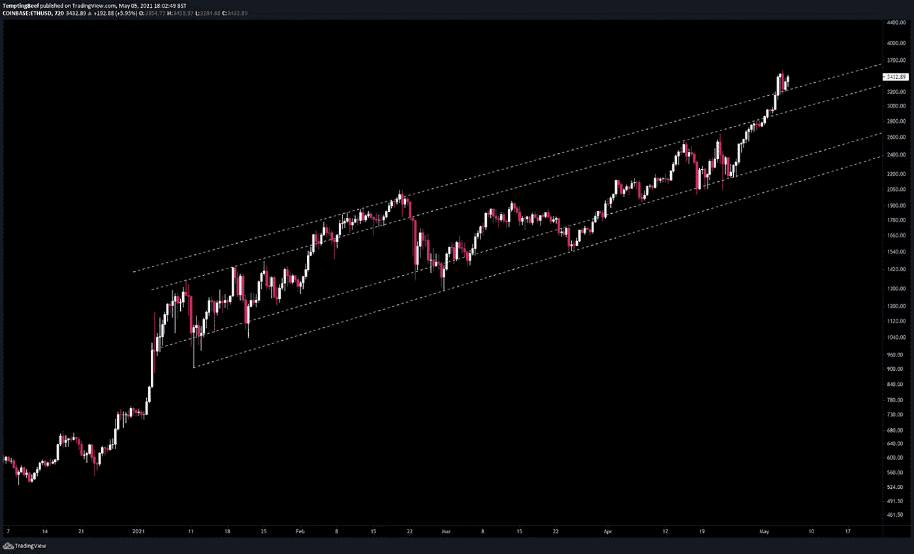
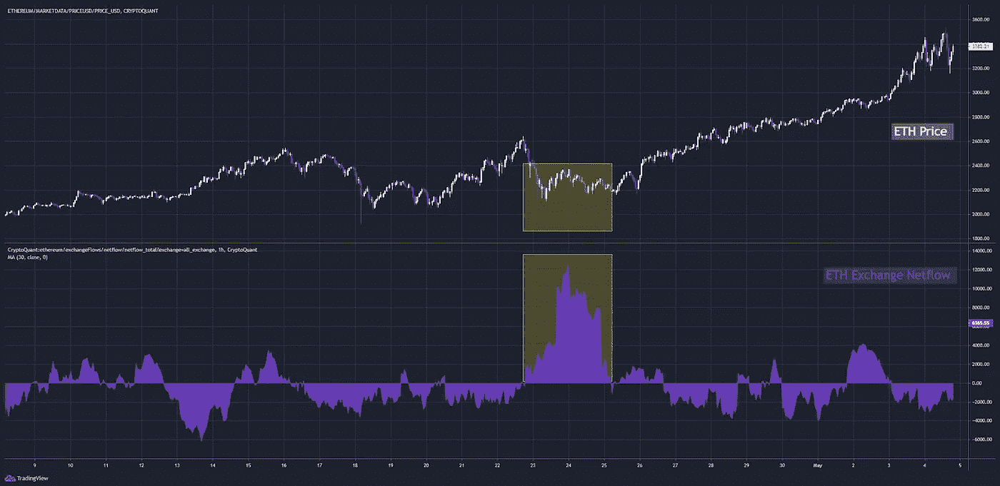
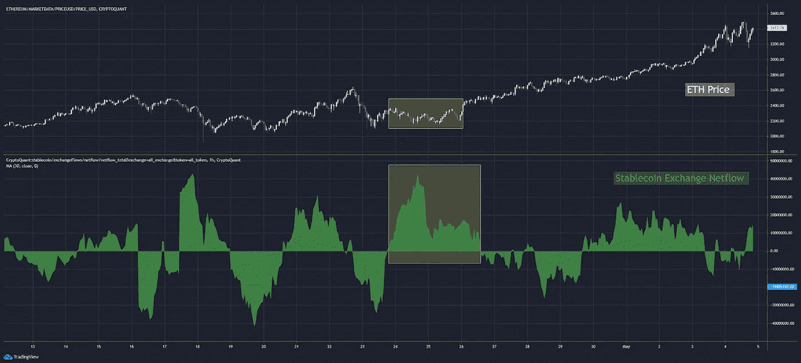
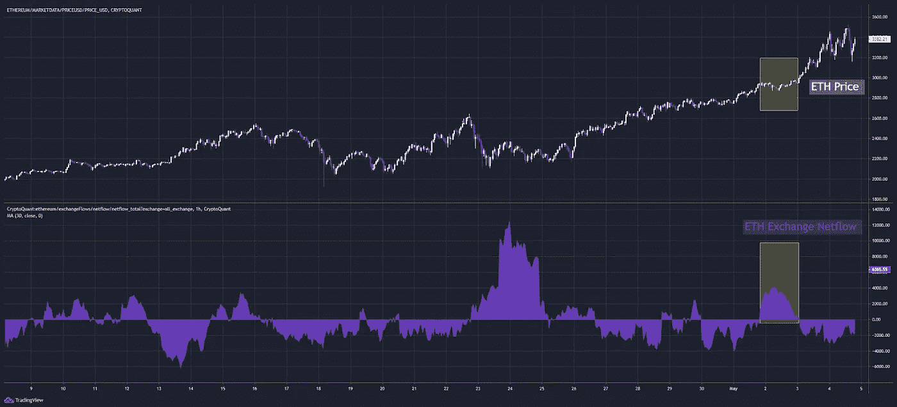
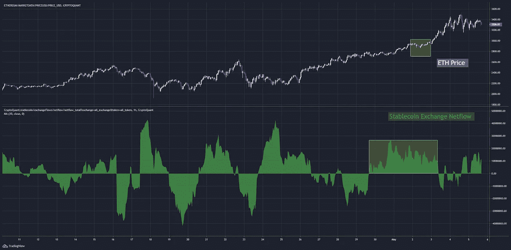
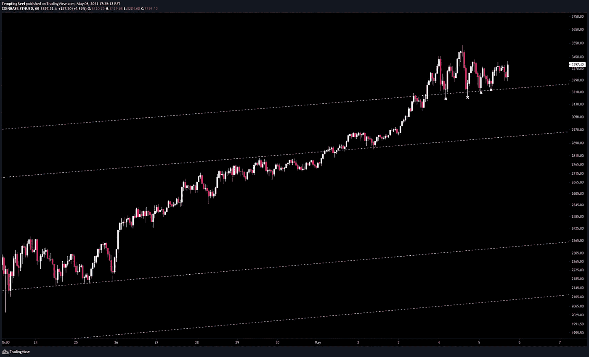
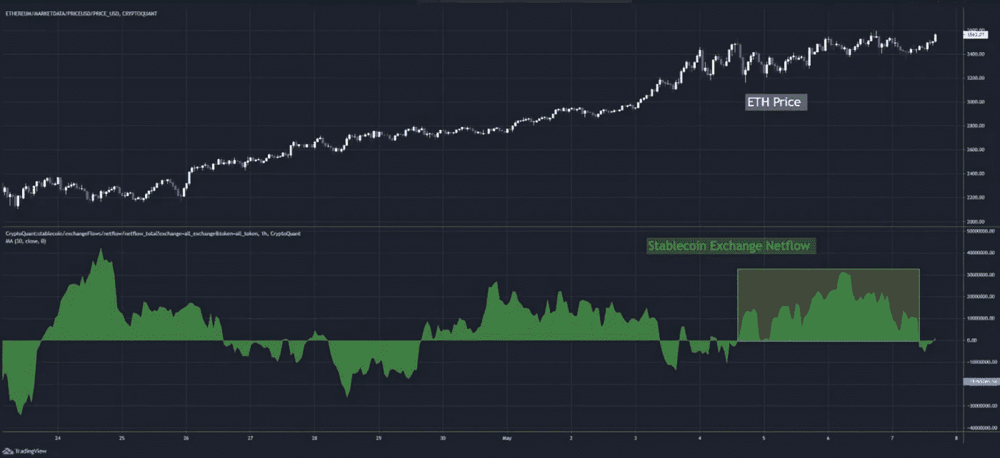
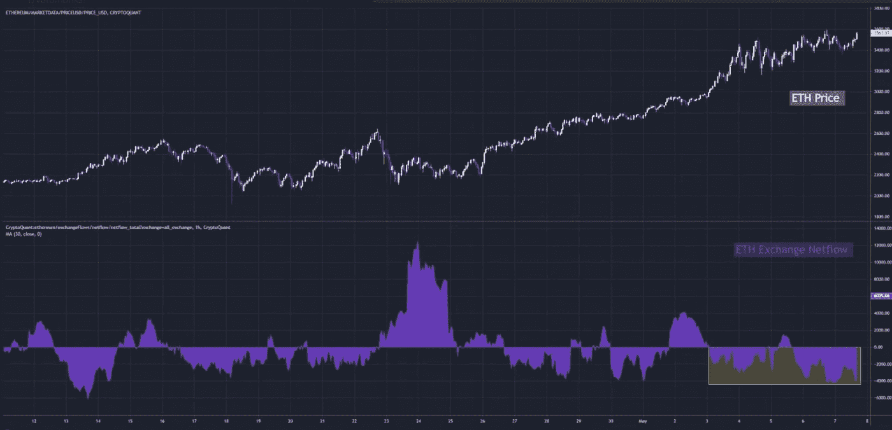
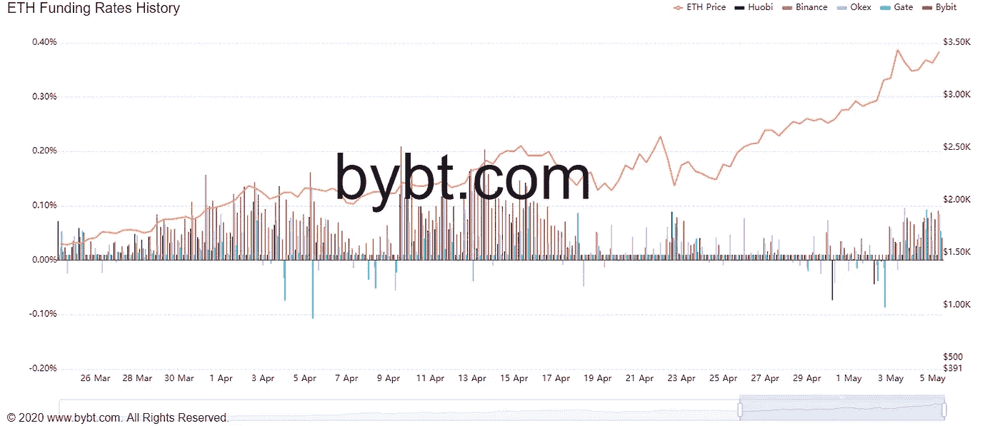
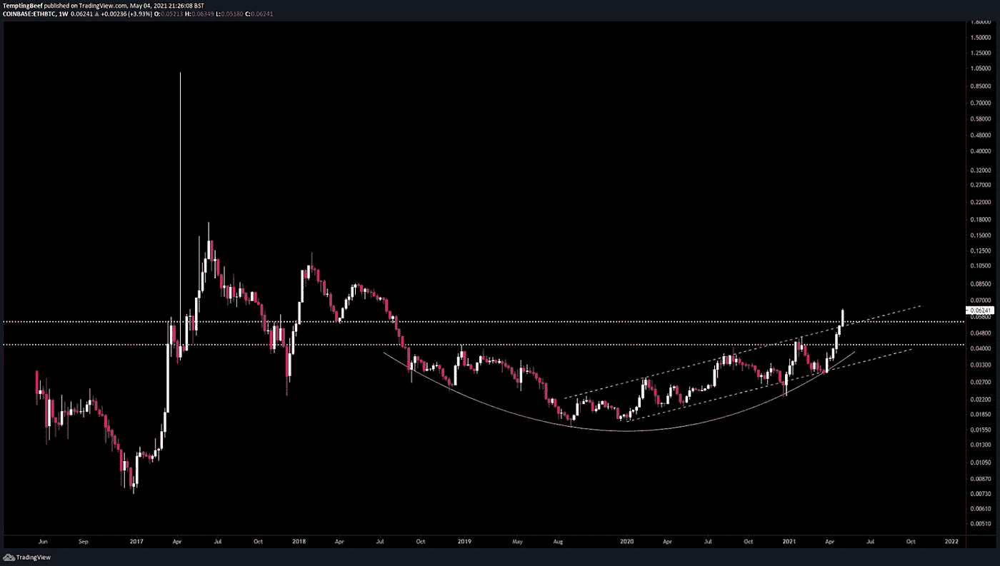

# 一种完美的混合物:ETH

> 原文：<https://medium.com/coinmonks/a-perfect-concoction-eth-5d41c14fa934?source=collection_archive---------3----------------------->

这里有一篇来自@诱人 _ 牛肉的客文。他给了我们他使用交换流和 TA 对 ETH 的分析。尽情享受吧！

-本·莉莉

我有足够的盒子再订购八次。

在我的网站上，我可以告诉一些顾客他们的购物车里有商品。其他一些购物者正在点击一些商品，并在琢磨正确的尺寸和颜色。

但是我没有耐心。我想结束这一天，早点结束。所以我决定激活限时 25%的折扣来结束这一天…“直到供应结束”。

当我发送促销代码时，我坐在椅子上对自己说，聪明。

(乒乒乒)

50… 100… 200…

这是怎么回事？我的访客数量每分钟都在翻倍。25%的折扣不可能引起这种反应！

我不是亚马逊…更别说在谷歌搜索结果的第一页附近了！

结果是我的竞争对手的服务器坏了。

突然间我有了很多买家。我立即取消折扣，促销利润更高的商品。

我的小网站上的市场变得炙手可热，我突然能够决定价格。

这正是我们本周早些时候在以太坊看到的。唯一不同的是，我们有买家，而不是网站访客。

让我告诉你我的意思…

# 崩溃

5 月 2 日，ETH 开始测试 3k 美元。从心理学的角度来看，这是一个很大的阻力，因为它是一个整数。

当它开始接近这个有点历史意义的数字时，外汇流动是单向的…只是在几分钟内逆转。

> 在我开始之前，我先来点“诱人的牛肉”。我写的是如何利用链上数据和技术分析来获得市场优势。在我上一篇关于 Espresso 标题的客座博文《比特币交易秘籍**》中，我对比特币的这两种形式进行了分析。**
> 
> *本周我关注以太坊。自从我在 Espresso 上发表上一期以来，ETH 已经上涨了 65%，成为今天的一个很好的话题。*
> 
> **回到 3k 美元阻力…**

*自今年 1 月以来，ETH 一直在这个上升通道中运行。*

**

*在过去的几周里，瑞士联邦理工学院进出交易所的净流量主要是负值。但是，我想提请您注意关于 netflows 的两个有趣的问题。第一个是在我们突破 3k 美元之前…我想先谈谈这个，因为它有助于形成突破 3k 美元的案例。*

*首先，图表 A:我在下面强调的一段时间内，netflow 对 ETH 呈阳性。*

**

*这是我们看到的最后一次价格大幅下跌。ETH 从 2.5k 降到了 2.1k。*

*就在这次下跌之后，一大批 ETH 进入交易所出售。价格继续横向移动。*

*通常情况下，我们预计净流量会在下跌前转为正值，表明卖家已经出现，价格即将下跌。*

*但是这一次我们看到 ETH 在下降后出现…*

*记住，这发生在比特币基地上市之后，有点让人失望。而比特币刚刚贴出了更低的低点。此外，我们还从美国得到消息，拜登政府试图通过征收高额资本利得税来打击美国人。*

*交易员们有点紧张。这是 FOMO 的典型反应，事后才做出反应。*

*但你可能会问自己，那信号在哪里？*

*我们开始看到大量稳定的硬币进入交易所:*

**

*这就是为什么我们看到价格横盘整理。所有这些稳定的细胞都在吸收过多的 ETH。*

*这是一场过度供应和过度需求之间的战斗，但依靠暗示未来更高高点的宏观分析，买盘可能会胜出。*

*现在，图表 B —回到网流图，只是这次接近 3k 美元:*

**

*第二个有趣的点是 netflow 再次变为正值的时间，就在我们达到 3k 之前。这是有道理的，因为 3k 是许多交易者的一个大目标，一个心理阻力区。*

*再次依靠 stablecoin 图表，我们可以看到 netflow 在这段时间内一直保持正值。这是一个不间断的需求激增。*

*就在我们触及这一阻力区时，买家正争相抢购任何进入市场的新 ETH。*

**

*我们都知道接下来发生了什么，因为 ETH 一直运行超过了 3.5k 美元。*

# *下一步是什么？*

*那么接下来的一周左右会发生什么呢…*

*随着 ETH 在渠道上方的整合，我们看到了一些令人难以置信的价格波动。*

*我们已经看到了一个干净的 S/R 翻转和四个令人信服的重新测试，如下图中的 x 所示。*

**

*在此期间，稳定的货币净流量告诉我们，需求仍然很高，当过剩的 ETH 进入市场时，它会吸收过剩的 ETH。它可能会稍微减弱，因为正如你在下一张图中看到的…*

**

*没有出现过多的资金流入。*

**

*自 5 月 3 日以来，净流量一直为负。*

*此外，由于融资利率仍然非常低，3.5 的上涨主要是由现货购买推动的。*

*这意味着衍生品交易员不会平仓，因为他们还没有锁定利润。*

*然而，现在价格已经突破了，我们只是注意到随着价格下跌 35000 美元，融资利率有所上升。还没有什么值得担心的。*

**

*最后，当我们将它与每周的 ETH/BTC 图表结合起来时，我们可以看到 ETH 处于完全突破模式:*

**

*需求高，供给低，价格出清阻力大，资金面上涨空间更大。*

*对于以太坊来说，这是一个令人兴奋和动荡的周末的完美组合。*

*提供链上切割，*

*@诱人 _ 牛肉*

> *加入 [Coinmonks Telegram group](https://t.me/joinchat/uiLERCQL1fQ5ZjA1) 并了解加密交易和投资*

## *另外，阅读*

*   *最好的[密码交易机器人](/coinmonks/crypto-trading-bot-c2ffce8acb2a) | [电网交易机器人](https://blog.coincodecap.com/grid-trading)*
*   *[加密复制交易平台](/coinmonks/top-10-crypto-copy-trading-platforms-for-beginners-d0c37c7d698c) | [五大 BlockFi 替代品](https://blog.coincodecap.com/blockfi-alternatives)*
*   *[CoinLoan 点评](/coinmonks/coinloan-review-18128b9badc4)|[Crypto.com 点评](/coinmonks/crypto-com-review-f143dca1f74c) | [火币保证金交易](/coinmonks/huobi-margin-trading-b3b06cdc1519)*
*   *[尤霍德勒 vs 科恩洛 vs 霍德诺特](/coinmonks/youhodler-vs-coinloan-vs-hodlnaut-b1050acde55a) | [Cryptohopper vs 哈斯博特](https://blog.coincodecap.com/cryptohopper-vs-haasbot)*
*   *[杠杆代币](/coinmonks/leveraged-token-3f5257808b22) | [最佳密码交易所](/coinmonks/crypto-exchange-dd2f9d6f3769) | [Paxful 点评](/coinmonks/paxful-review-4daf2354ab70)*
*   *[如何在印度购买比特币？](/coinmonks/buy-bitcoin-in-india-feb50ddfef94) | [WazirX 评论](/coinmonks/wazirx-review-5c811b074f5b) | [BitMEX 评论](https://blog.coincodecap.com/bitmex-review)*
*   *[双子座 vs 比特币基地](https://blog.coincodecap.com/gemini-vs-coinbase) | [比特币基地 vs 北海巨妖](https://blog.coincodecap.com/kraken-vs-coinbase)|[coin jar vs coin spot](https://blog.coincodecap.com/coinspot-vs-coinjar)*
*   *[币安 vs 北海巨妖](https://blog.coincodecap.com/binance-vs-kraken) | [美元成本平均交易机器人](https://blog.coincodecap.com/pionex-dca-bot)*
*   *[印度比特币交易所](/coinmonks/bitcoin-exchange-in-india-7f1fe79715c9) | [比特币储蓄账户](/coinmonks/bitcoin-savings-account-e65b13f92451)*
*   *[币安费用](/coinmonks/binance-fees-8588ec17965) | [Botcrypto 审核](/coinmonks/botcrypto-review-2021-build-your-own-trading-bot-coincodecap-6b8332d736c7) | [Hotbit 审核](/coinmonks/hotbit-review-cd5bec41dafb) | [KuCoin 审核](https://blog.coincodecap.com/kucoin-review)*
*   *[我的加密副本交易经验](/coinmonks/my-experience-with-crypto-copy-trading-d6feb2ce3ac5) | [《比特币基地评论》](/coinmonks/coinbase-review-6ef4e0f56064)*
*   *[加密货币储蓄账户](/coinmonks/cryptocurrency-savings-accounts-be3bc0feffbf) | [YoBit 审查](/coinmonks/yobit-review-175464162c62) | [Bitbns 审查](/coinmonks/bitbns-review-38256a07e161)*
*   *[最佳比特币保证金交易](/coinmonks/bitcoin-margin-trading-exchange-bcbfcbf7b8e3) | [比特币保证金交易](https://blog.coincodecap.com/bityard-margin-trading)*
*   *[加密保证金交易交易所](/coinmonks/crypto-margin-trading-exchanges-428b1f7ad108) | [赚取比特币](/coinmonks/earn-bitcoin-6e8bd3c592d9) | [Mudrex 投资](https://blog.coincodecap.com/mudrex-invest-review-the-best-way-to-invest-in-crypto)*
*   *[BlockFi 信用卡](https://blog.coincodecap.com/blockfi-credit-card) | [如何在币安购买比特币](https://blog.coincodecap.com/buy-bitcoin-binance)*
*   *[顶级付费加密货币和区块链课程](https://blog.coincodecap.com/blockchain-courses) | [币安评论](/coinmonks/binance-review-ee10d3bf3b6e)*
*   *[MXC 交易所评论](/coinmonks/mxc-exchange-review-3af0ec1cba8c) | [Pionex vs 币安](https://blog.coincodecap.com/pionex-vs-binance) | [Pionex 套利机器人](https://blog.coincodecap.com/pionex-arbitrage-bot)*
*   *[在美国如何使用 BitMEX？](https://blog.coincodecap.com/use-bitmex-in-usa) | [BitMEX 点评](https://blog.coincodecap.com/bitmex-review) | [币安 vs Bittrex](https://blog.coincodecap.com/binance-vs-bittrex)*