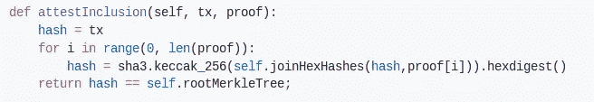

# 缩放区块链的等离子体实现

> 原文：<https://medium.com/coinmonks/a-plasma-implementation-to-scale-blockchain-96beef0f11b?source=collection_archive---------5----------------------->

我想介绍一个我正在构建的项目，以了解区块链如何以安全的方式扩展，以及如何通过支持任何商业活动成为主流:

[https://github.com/albpal/plasma-implementation](https://github.com/albpal/plasma-implementation)

**项目描述**

该项目旨在实现在 [https://plasma.io](https://plasma.io) 上描述的等离子体框架，有两个主要目标。按优先顺序排列:

1.了解等离子体框架

2.开发等离子体框架的实现

**动机**

InterLedger 协议是区块链生态系统的基石之一。公共区块链是一个值得信赖的品牌技术，但背后没有人。它如何成为一个可靠的平台超出了本文的描述范围。

也许是大的(GAFA 等。)有很大的声誉，大多数用户依赖于它们。但是一个小的/不知名的企业怎么能达到这样的声誉和可靠性水平呢？如今，它可能很昂贵:社区参与、营销、免费产品/活动、法律问题等。然而，现在他们可以将区块链作为一个值得信赖的平台，给用户带来信任和可靠性。区块链正在成为信任的标准。

尽管如上所述，公共区块链有其自身的局限性。首先，他们每秒的交易量非常有限。许多企业需要更高的吞吐量。其次，每笔交易的成本对于许多企业来说也是不可接受的([存储成本](/@albpalau/desarrollando-sobre-ethereum-tipos-de-almacenamientos-5b4bc0b63c3a))。那么，企业如何从区块链获益，同时保持其服务质量？

交织协议(ILP)试图解决上述问题。企业将使用另一个区块链来满足他们的需求，并将*最终订阅*一个公共区块链(或另一个信任者)。执行订阅的方式必须遵循足够可信的规则，以便用户知道:

1.他们可以以安全的方式将其资产交给儿童区块链

2.如果子区块链操作符被破坏或有恶意，他们可以从子区块链退出，而不会损失他们在父上的资金

Plasma 是实现协议的框架或指南，但是还有其他的:Polkadot、Cosmos、Drivechains、side chains 等。( [bc 可扩展性](/@albpalau/la-escalabilidad-en-blockchains-públicas-5ba5408622c9))

**要解决的常见问题**

根区块链(最受信任的)上的 ILP 实现**需要解决一些常见问题。我们将描述它们:**

1.证明在孩子区块链身上发生了交易

2.证明提交中包含的事务的所有权

3.解决争端

如果我们的协议能同时解决它们，我们可能用它来在不同的区块链之间进行交互。

**证明交易发生在孩子区块链身上**

正如我们前面提到的，子区块链将*订阅*到父区块链。订阅可以包括向父区块链提交一个 [Merkle 树](/@albpalau/tokenización-árbol-de-merkle-1276820a1d60)根哈希，这样我们就可以批量处理子节点上发生的事务，并有可能扩展到数百万个事务。

要证明事务已包含在子区块链的一个提交中，用户必须持有两条信息:

1.交易本身以明文格式(未散列或加密)

2.根哈希的证明路径

代码示例(Python):

**证明提交中包含的事务的所有权**

交易必须类似于:

所以它识别出谁是特定金额的新所有者。

如果您可以证明包含交易和所有权，您将能够从母公司区块链提取资金。

**解决纠纷**

当用户想要提取资金时，根区块链上的算法只检查前两个证明。然而，它并不检查块的所有历史，它只存储散列。用户(或服务)必须监控区块链。让我们假设:

> a 在特定块中有 1 个 ETH，在日期 X 提交
> 
> A 向 b 发送 1ETH。生成新的块，并在稍后的日期 Y 提交

如果 A 想在 X 日撤销根区块链上的第一个 ETH，会发生什么？该算法将接受这两种证明。b 必须检测到 A 想要提取已经花费的资金，并且他/她必须发送欺诈证明，即显示证明 A 已经在后面的块中花费了该值的交易。其实这个造假的证明谁都可以做。为了提供这些欺诈证据，想要提取价值的用户必须等待一段时间才能将资金返还给用户。

**项目范围**

除了等离子纸，我们将重点放在以太坊公共网络是根链和只有 1 级深度是可能的实现。我们不会指定区块链网络的类型(基于侧链 SPV、驱动链等)。)在它上面。我们将简单地引用 l1(一级或根链)、l2(区块链提交到 lv1)等。

任何贡献都将受到欢迎！

**参考文献:**

1.[https://plasma.io/plasma.pdf](https://plasma.io/plasma.pdf)

2.【https://ethresear.ch/t/minimal-viable-plasma 号

3.【https://github.com/omisego/plasma-mvp 