# 初学者数据清理实用指南

> 原文：<https://medium.com/coinmonks/a-practical-guide-to-data-cleaning-for-beginners-bd4f45967825?source=collection_archive---------2----------------------->

作为初学数据的科学家，我们都非常渴望在没有正确处理数据的情况下开始制作数据科学模型。这是一个导致糟糕模型的常见陷阱。为了提高模型的质量，需要进行数据清理。

## 我很感兴趣，但是你能提供一个数据清理的定义吗？

当然，我明白了。

根据维基百科，**数据清理**或**数据清理**是从记录集、表格或数据库中检测并纠正(或删除)损坏或不准确记录的过程，指的是识别数据中不完整、不正确、不准确或不相关的部分，然后替换、修改或删除脏的或粗糙的数据。

吓人吧？

现在，忘记那个很长的句子。让我用一句简单的话给你解释一下。

数据清理基本上是识别和纠正错误、不完整或不相关的数据部分的行为。

听起来好多了，是吗？

## 好吧，但是这种数据清理的重要性是什么？

根据福布斯杂志上的一篇文章，到 2020 年，地球上的每个人每秒将产生大约 1.7 兆字节的新信息。这意味着不同类型和来源的数据将会发挥作用，这可能会被证明是混乱的。

是的，通常有很多关于数据科学算法而不是数据清理的讨论。这仅仅是因为数据清理是数据科学中最无趣的部分。

如果数据科学是 21 世纪最性感的工作，那么数据清理就是数据科学中最不性感的部分。

数据清理在训练模型中的重要性怎么强调都不为过。不管你用什么算法——如果你的数据是坏的，你会得到坏的结果。专业数据科学家知道这一点，并透露数据清理需要花费数据科学项目 70%的时间。

更好更干净的数据胜过最好的算法。如果你在最干净的数据上使用一个非常简单的算法，你会得到非常令人印象深刻的结果。然而，如果你在杂乱的数据上使用最好的算法，你很可能得不到想要的结果。

*本质上是垃圾进，垃圾出。*

## 受够了这一切！我如何执行这个数据清理的事情？

天啊。冷静点。我们正要说到这一点。在我们开始之前，建议您打开这里的[代码示例](https://github.com/Kelechukwu1/Tutorials/tree/master/A%20Practical%20Guide%20to%20Data%20Cleaning%20for%20beginners)——这样您就可以很好地理解了。

**1。处理缺失值:**这或许是不干净数据最常见的特质。这些值通常采用 NaN 或 None 的形式。缺失值也会导致我们的模型预测 NaN 值，这是我们不希望的。那么，我们如何解决这些缺失的价值观呢？

代码示例中使用的数据包含从 2013 年 1 月 1 日到 2018 年 2 月 25 日在旧金山颁发的建筑许可证的相关信息。

读入数据后，首先需要确定数据集中是否有缺失值。

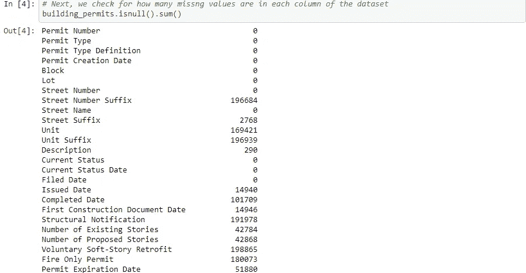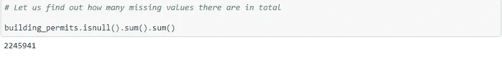

检查数据丢失的百分比也很重要。这将让您知道如何处理丢失的值。我们还可以直观地看到每列丢失了多少数据。

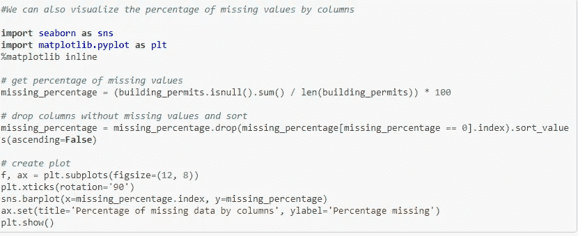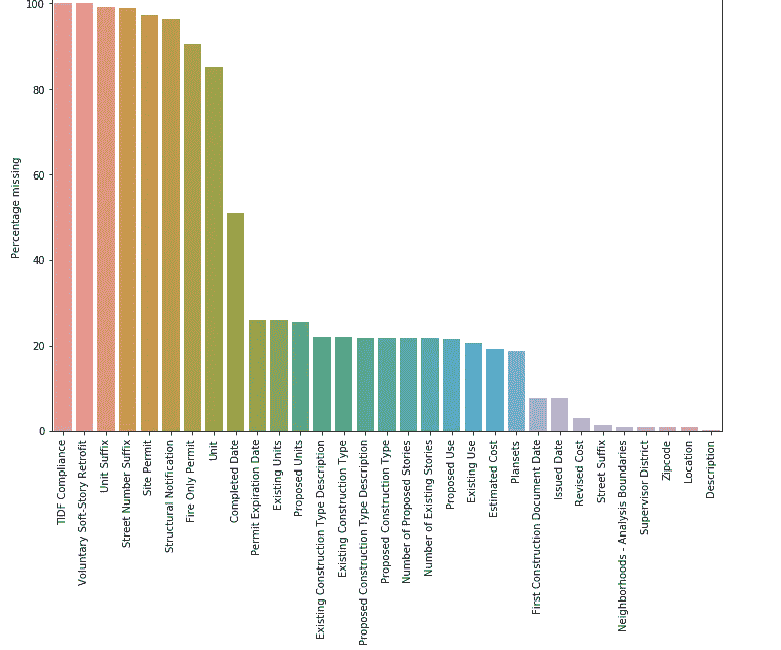

缺失的值太多了！

既然我们已经确定数据集中存在缺失值，那么我们如何处理它们呢？

为了处理丢失的数据，确定丢失数据的原因很重要。这将指导我们决定处理它们的最佳方式。

丢失数据值有多种原因。一些值可能因为不存在而丢失，其他值可能因为数据收集不当或数据输入不当而丢失。例如，如果某人是单身，而某个问题适用于已婚人士，则该问题将包含一个缺失值。在这种情况下，为该问题填写一个值是错误的。

例如，在我们的数据中，街道号码后缀并不总是存在，因此填充它并不理想。但是，缺少的地点、邮政编码和许可证到期日期可以补上。

有几种方法可以填充缺失值，我们将在这里探讨其中的一些方法。

我们可以决定删除缺少值的行或列。只有在行或列中缺失值的百分比很高，以至于保留该列或行没有意义时，才建议这样做。

例如，TDIF 合规栏和自愿软层改造有接近 100%的缺失值，因此删除它们是有意义的。我们还可以决定删除缺失值至少占数据 60%的列

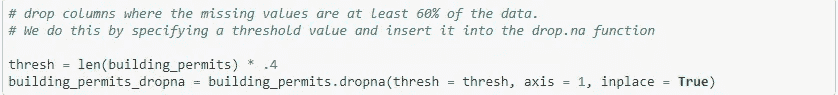

通过指定 axis = 0，也可以对任何数据集的行进行同样的操作

如果我们处理的是数值，我们可以决定用 0 填充所有的空变量。我们也可以决定用列中所有值的平均值或中值来填充所有 NA 值。所有这些决定都取决于数据的类型、您希望用数据完成的任务以及丢失值的原因。

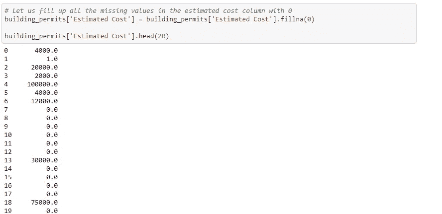

如您所见，缺失的值已被替换为 0

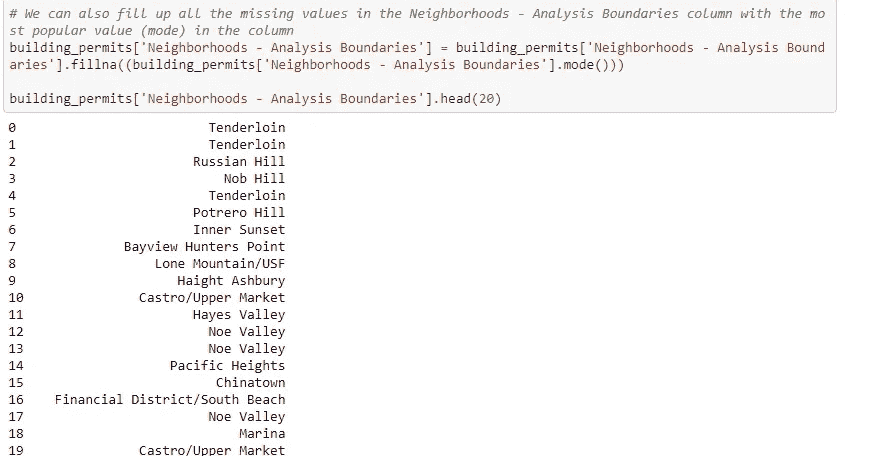

最后，我们还可以决定用同一列中紧随其后的值来填充缺失的值。我们还将指定任何缺少的值(其下没有任何直接值)将用 0 填充。

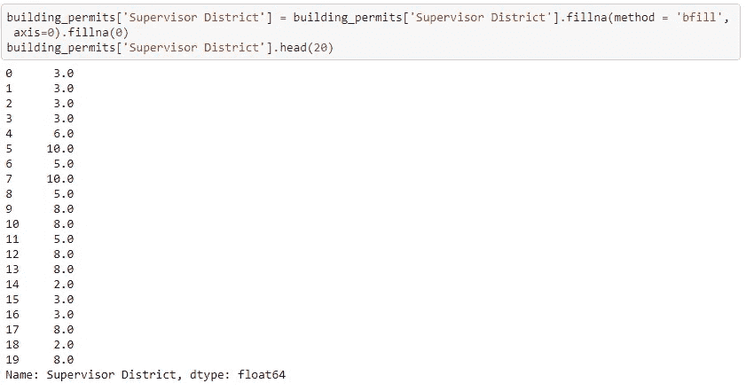

**2** 。**数据输入不一致:**当一列中有不同的唯一值，而这些值本应相同时，就会出现这种情况。还有其他类型的不一致数据条目，但这将是我们这里的重点。这里使用的数据集包含了 1995 年至 2016 年巴基斯坦自杀式袭击的信息。像往常一样，我们将首先导入所有相关的库并读入我们的数据。

我们将处理省列中不一致的条目。为了检查所有的唯一值，我们这样做:

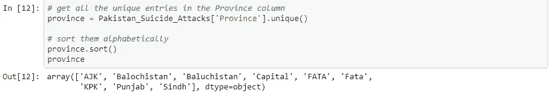

我们可以猜测，“俾路支斯坦”可能是指同一个“俾路支斯坦”。简单的谷歌搜索表明我们是对的。此外，“FATA”和“联邦直辖部落地区”很可能是同一个意思。

消除数据不一致的方法之一是删除条目名称前后的空格，并将所有大小写转换为小写。对于空白，如果我们有类似“fata”和“fata”的东西，它们将被视为两个唯一的值。

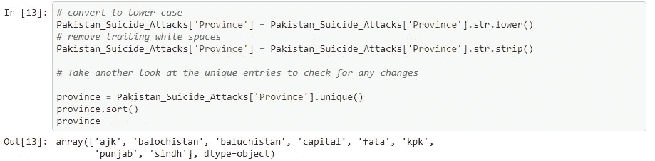

很好，我们可以看到联邦直辖部落地区和 fata 已经统一了

但是我们仍然有一个问题。我们需要统一“俾路支斯坦”和“俾路支斯坦”条目。

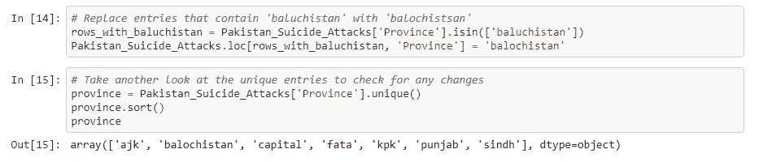

很好。似乎我们已经解决了所有问题。

注意:如果我们有大量不一致的唯一条目，我们不能像刚才那样用眼睛检查最接近的匹配。我们可以使用模糊匹配。这有助于识别哪些字符串最有可能是相同的。一个包装——[Fuzzy Wuzzy](https://github.com/seatgeek/fuzzywuzzy)——很好地做到了这一点。要使用的 FuzzyWuzzy 包接受两个字符串并返回一个比率。比率越接近 100，我们就越有可能统一字符串。

**3。处理日期和时间:**我们经常会在数据集中遇到日期。而且，作为初学者，这往往会令人望而生畏。当日期格式不一致时，情况会更糟。例如，同一列中的日/月/年和月/日/年。此外，我们的日期值可能不是正确的数据类型，这将不允许我们有效地执行操作并从中获得洞察力。不过不要害怕，因为我们将在这里解决所有这些问题。

像往常一样，我们将首先导入所有相关的库并读入我们的数据。

这里使用的数据包含自 1965 年以来每一次 5.5 级或更高级别的地震的日期、时间、位置、深度、震级和震源的记录信息。全部由国家地震信息中心(NEIC)编制。

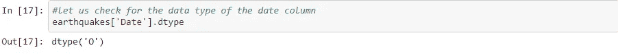

如果我们看一下 Numpy 文档，数据类型 O 与对象数据类型匹配，而对象数据类型不是日期时间数据类型

我们继续将日期数据类型转换为日期时间数据类型。我们需要导入 datetime 包来处理这个问题。

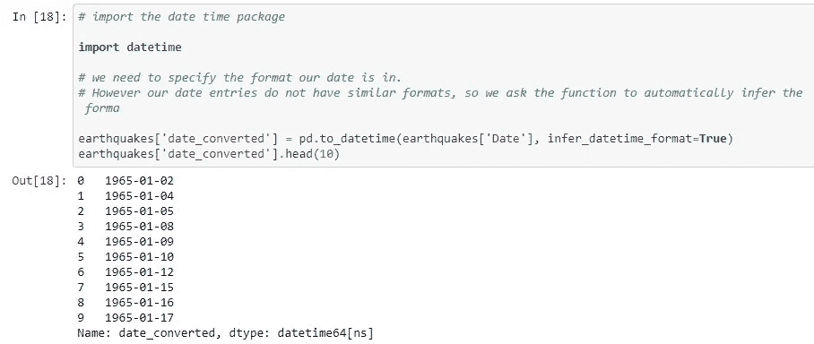

正如我们所看到的，数据类型已经正确地更改为 datetime 数据类型，现在我们可以根据该列的数据类型对其执行各种日期时间操作。

如果所有的日期都是特定的格式，那么在转换时可以很容易地将该格式输入到 datetime 中。然而，我们所有的日期都不是特定的格式，所以我们要求函数自动推断格式。

因此，我们需要确保所有的日期都转换好，因为我们要求函数推断格式。数据输入中的一个简单错误就可能导致错误的推断。

为此，我们将绘制月份条形图，并确保最高值为 12。

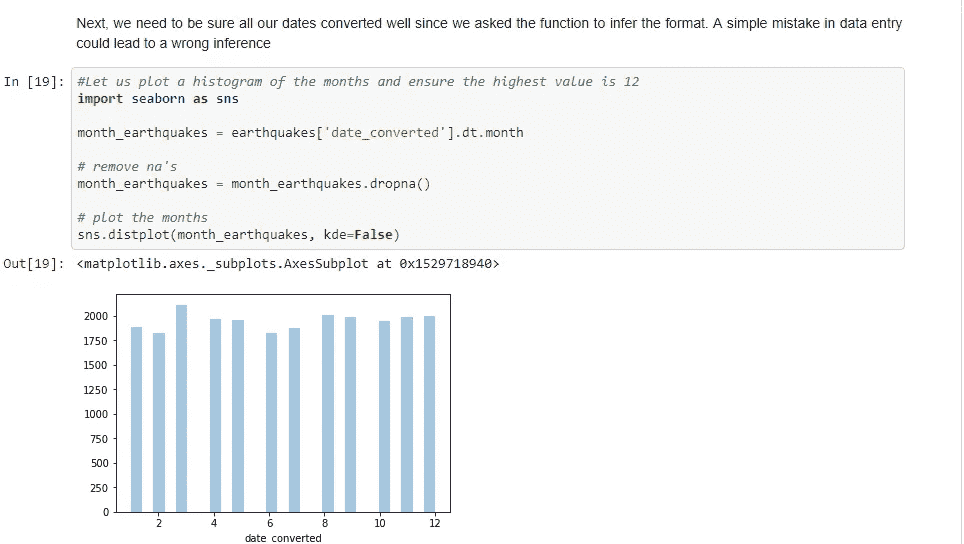

如你所见，最高的一天是 12，所以我们准备好了。

我们也可以对每个月的每一天做同样的事情。最高值应该是 31，并且应该有一个下降，因为不是一个月中的所有日子都有 31 天。

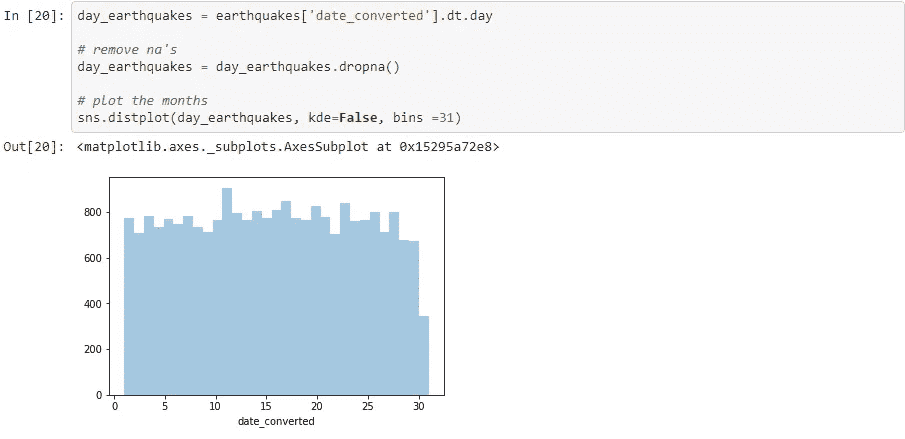

很好，我们的假设是正确的。看来我们这次是对的。

**4。缩放和归一化:**让我们一个一个来说:

如果想说明一个量的变化不等于另一个量的变化，标度是很重要的。如果您希望使用将一个数值特征的变化视为另一个数值特征的同等变化的算法，这将特别有用。缩放可确保不会因为某些要素很大就将其用作主要预测值。例如，如果在预测中使用一个人的年龄和工资，一些算法会更加关注工资，因为工资更大。此外，年龄增加 1，将被视为类似于工资增加 1。这没有意义，因此对数据进行缩放是有意义的。

规范化基本上包括将数据集转换或转化为正态分布。当您想要使用适用于正态分布的算法时，这很有用。像 SVM 这样的算法在归一化数据上收敛得更快，因此对数据进行归一化以获得更好的结果是有意义的。

我们将标准化数据，并在标准化前后对其进行可视化。

这里使用的数据包含超过 300，00 0 个 kickstarter 项目的信息。

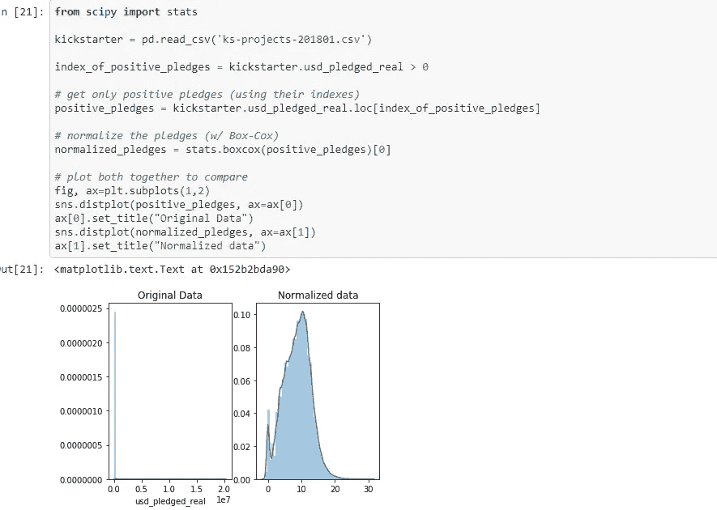

很好，我们可以看到我们的数据现在类似于正态分布

## 结论

可能需要对数据进行其他几种形式的数据清理。但是，对于绝对的初学者来说，这是一本很好的入门书。在制定任何模型之前，适当地安排和整理你的数据的需要不能被夸大。我希望这篇文章能激发你的兴趣！:)

在这个 [github repo](https://github.com/Kelechukwu1/Tutorials/tree/master/A%20Practical%20Guide%20to%20Data%20Cleaning%20for%20beginners) 中有很好解释的代码示例。

PS:关于处理缺失数据的进一步阅读——你可以阅读这篇[精彩的文章。](/ibm-data-science-experience/missing-data-conundrum-exploration-and-imputation-techniques-9f40abe0fd87)

> [在您的收件箱中直接获得最佳软件交易](https://coincodecap.com/?utm_source=coinmonks)

