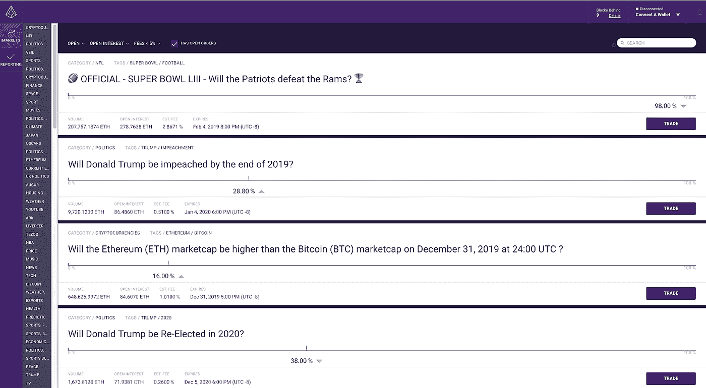
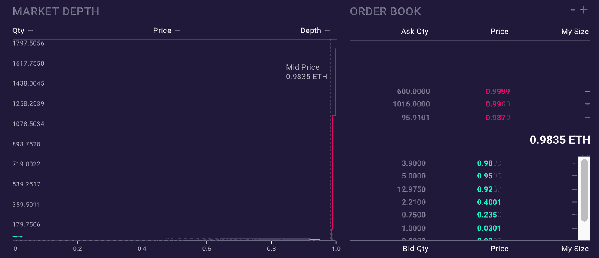
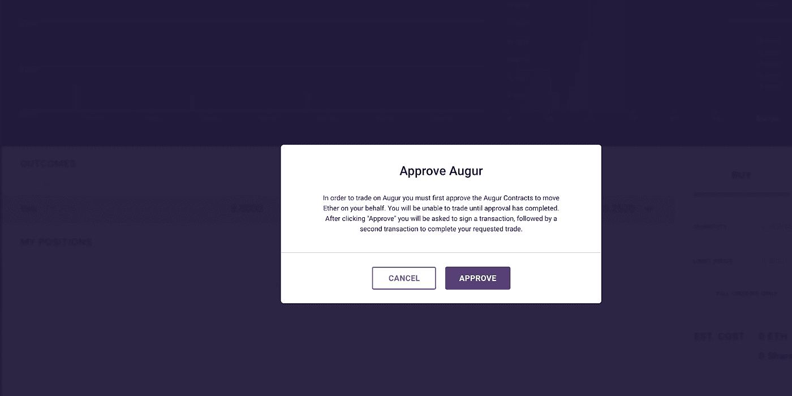
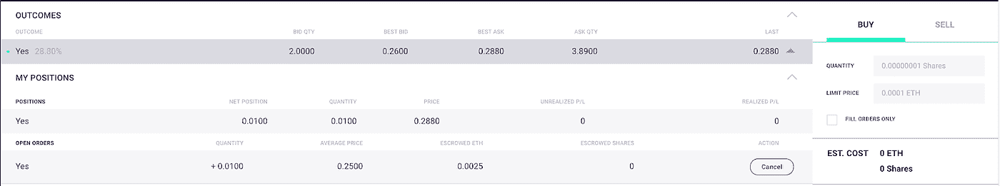
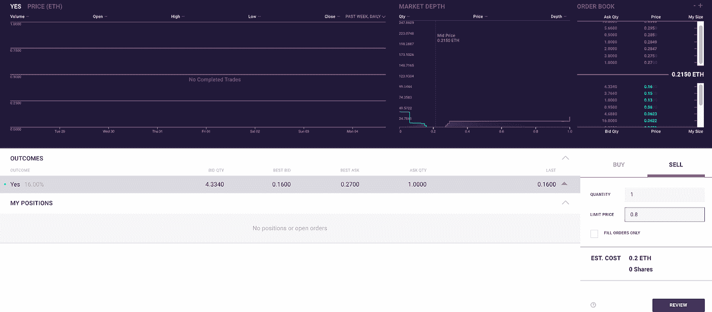
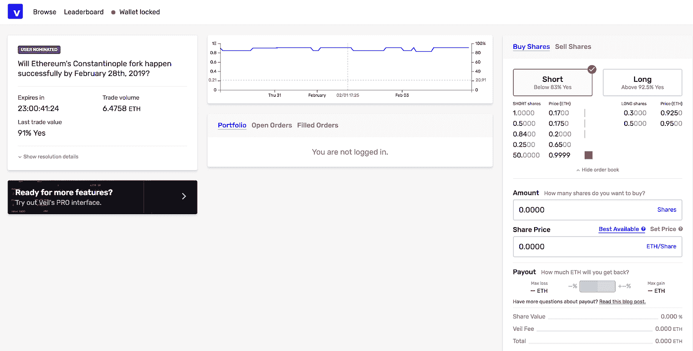
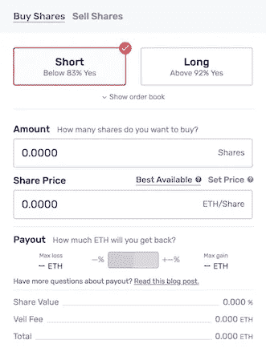
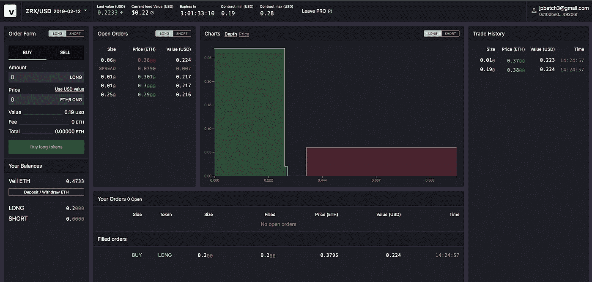
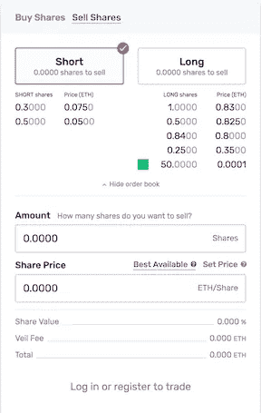

# 占卜和面纱入门

> 原文：<https://medium.com/coinmonks/a-primer-on-augur-and-veil-221994a69ebf?source=collection_archive---------4----------------------->

A photo of Augur’s Native UI

*本文特别关注二元市场，并假设对预测市场、0x 市场和预测市场的工作原理有基本的了解。*

一月将是一个重要的月份。第二层占卜应用[面纱](https://veil.co/)于 1 月 15 日推出，[猜测器](https://guesser.io/)于 1 月 29 日开始推出，以选择用户。虽然迄今为止，auger 已经在他们的平台上下注超过 120 万美元，但用户仍需要跨越多个障碍才能在 auger 预测市场上交易。通过使用户体验更容易使用，Veil 和 Guesser 的目标是增加这项技术的采用，并开辟全新的应用程序。举个例子，

在我解释如何使用 auger 之前，我想定义一些对理解 auger 如何工作很重要的概念。

# 卷

成交量是使用 auger 的原生交换来交换 auger 份额的价值的累积量。当一个占卜份额被购买时，交易量将增加为份额支付的数量。

Augur 上显示的交易量指标不是特定市场流动性的准确衡量标准，原因有两个。首先，用户可以很容易地在 Augur(与自己一起买卖股票)上进行交易，这人为地夸大了成交量。第二，占卜软件中有一个 [bug](https://github.com/AugurProject/augur/issues/904) 没有将体积除以适当的分母。

# 估计费用

有两种不同的费用是对奥格收费:创建费和报告费。任何人都可以在 Augur 上创建市场，但是，你需要支付大量的天然气费来创建智能合同，以运营预测市场。为了激励市场创造，市场创造者可以设定一笔支付给他们的费用——这叫做创造者费用。报料费用于支付奥格的甲骨文系统。该费用每七天动态计算一次，并基于 REP(占卜者的本地令牌)的价格和给定预测市场中的总未平仓权益。

这两项费用被称为结算费用，只对减少未平仓权益总额的交易收取。我相信费用会趋向平衡，补偿市场创建者的设置费用，但不会从交易者那里拿走大量利润。目前，Augur 上的市场结算费用范围很广，这是您在进行交易之前需要了解的事情。

# 未平仓利息

未平仓合约是在给定预测市场中被锁定的 ETH 总量。(每个预测市场都有自己的智能合约)。当新的 Augur 股票被铸造时，未平仓合约增加，支持原始订单的 ETH 被锁定在独特的预测市场智能合约中。

未平仓合约可能以两种不同的方式减少。未平仓合约减少的第一种方式是当一套完整的合约被平仓时，因为未平仓合约被用来根据两个卖单做市。取消成套时，将收取结算费用。在 Augur 的原生用户界面中，无法确定订单是由 ETH 支持还是由股票支持，这可能导致在发出由股票支持的卖出订单时产生意外的结算费用。

未平仓合约减少的第二种方式是当预测市场被报告时。一旦这一事件发生，正确的份额(多头或空头)将价值 1 ETH。个人可以赎回他们的奖金，这将减少未平仓利息。用户能够赎回其股份的金额将等于 1 ETH 减去结算费用。

# 期满

给定预测市场的报告期开始的日期。在这个日期之后，预测市场的结果应该是已知的。

# 占卜者的独特性质

如果你想使用 Augur 的原生 UI，理解这一部分是很重要的。如果你只是想使用面纱，你不需要阅读这一部分。

在占卜中，有两种方式可以完成订单。它既可以由支付 ETH 的交易对手来填充，就像在传统交易所一样，也可以通过创建或取消完整的预测集来填充。

当一方去购买 auger 上的股票，而另一方接受他们赌注的相反方时，就创建了一个 auger 集合。此外，这两个订单的总和必须等于 1 ETH。例如，我可以提交一个订单，以 0.7 ETH 的价格购买二元市场中的一个多头股票。如果有另一个订单以 0.3 ETH 的价格购买一个卖空股票，将形成一个完整的占卜集。当一个完整的占卜集形成时，新的多头和空头份额被铸造并发行给双方以交换他们的 ETH。

当组合总数为 1 个时，有两个相反的卖单时，一个完整的预测集被取消。这两个订单将被匹配，各自的份额将被烧毁。由预测市场智能合同托管的 ETH 将支付给订单的各个制造商。

这意味着订单可以在订单簿之间镜像，这使得 Augur 和随后的第二层 relayers 的流动性是具有相同订单量的传统交易所的两倍。

这里有一个例子，展示了 Augur 的独特属性如何允许在 0.3 ETH 的短股买入订单作为在 0.7 ETH 的长股卖出订单反映到长订单簿上。对于 0.3 ETH 的短股，可以通过 0.3 ETH 的短股卖出订单或 0.7 ETH 的长股买入订单来完成。这两个随后的订单都可以通过 0.7 ETH 的长仓卖出订单来完成。这意味着 0.7 ETH 的多头股票的卖单可以添加到多头订单簿中，即使没有人明确为此下单。

考虑这个问题的另一种方法是，在知道订单可以由股票或 ETH 支持的情况下，以多头股票命名所有订单。这里有一个例子来说明这个概念。

如果我们想以 0.3 ETH 的价格买入做空股票，我们可以以 0.3 ETH 的价格提交做空股票的买入指令，以 0.7 ETH 的价格提交做多股票的卖出指令。即使我们不拥有多头股票，我们仍然可以在 0.7 ETH 提交多头股票的卖出订单，订单将只是由 ETH 而不是股票支持。因为我们只使用长期订单簿，所以我们的长期股票卖出订单是唯一实际添加的订单。

想象一下，在我们提交了我们实际上并不拥有的长期股票的卖出订单后，0.7 ETH 的长期股票的买入订单被提交到订单簿。我们的订单将被匹配并发送到奥格的匹配引擎。匹配引擎将解析订单，以确定是否有 ETH 或 shares 支持订单。根据两个订单的支持因素，我们的订单有三种可能的执行方式:

*   如果有股票支持这两个订单，这不是我们假设的例子的情况，因为我们正在出售我们没有的股票，一个完整的集合被取消，因为 0.7 ETH 的长股票的买入订单相当于 0.3 ETH 的短股票的卖出订单。在 0.7 ETH 的长股卖单与在 0.3 ETH 的短股卖单相匹配，并被发送到 Augur 合同。这两个份额被烧掉，未平仓权益减少，合同中锁定的 ETH 减去结算费用后分配给两个卖方。
*   如果这两个订单背后都有 ETH，这是我们上面假设的例子中的情况，将创建一个新的集合，因为 0.7 ETH 的长股卖出订单相当于 0.3 ETH 的短股买入订单。在 0.7 ETH 的长股票的购买订单与在 0.3 ETH 的短股票的购买订单匹配，并被发送到铸造新集合的 Augur 合同。未平仓股票将会增加，新股票将会分配给订单的创建者。
*   如果一个订单后面有份额，另一个订单后面有 ETH，这不是我们上面例子中的情况，一个人得到 ETH，另一个人得到份额。在这种情况下，不会创建或销毁新的集合。

Augur 的二元市场订单簿的工作方式与上面的例子类似:所有订单都以多头股票计价，没有订单发送到空头订单簿。保存这些订单簿的智能合约存储信息，以区分订单是由 ETH 支持还是由股票支持。

订单也可以在没有发布或取消器械包的情况下完成。Augur 拥有自己的订单簿和匹配引擎，投资者可以在这里买卖股票，以换取 ETH。这两种方式，一个订单可以填补抽象远离终端用户对奥格。

# Augur 的原生用户界面

您可以选择使用 auger 应用程序和浏览器(如 Chrome)直接与 auger 交互。一旦 auger 已经被[下载](https://www.augur.net/#download)(这花了我大约 4.5 小时)，你将能够浏览所有曾经在 auger 上创建的预测市场。在浏览器中打开 Augur 应用程序时，您会遇到各种数字和术语。

# 做交易

当你点击一个预测市场，就会出现一个订单簿。绿色的订单是买入订单，红色的订单是卖出订单。记住，Augur 的原生 UI 只显示做多股的订单簿。

# 购买长期股票

当您因为认为预测市场的结果将会发生而想要购买多头股票时，您可以在相应的字段中输入您的数量和限价。如果你是一个“理性”的个体，你不会想要设定一个高于事件发生的预期概率的限价。比如设置 0.7 ETH 的限价，意味着你认为这个事件发生的几率最多是 70%。

选中“仅填写订单”框将扫描订单簿以查找匹配的订单，并且仅在订单簿上当前存在匹配订单时填写您的订单。您的订单将不会添加到占卜者的订单簿中。你可能不想在占卜者的订单簿上添加订单的原因是，如果预测市场的赔率可能会突然改变。在赔率发生显著变化的情况下，你必须记得取消订单，以防止自己被占便宜。

点击提交后，August 将要求您向 August 的交换合同发送批准交易，允许它代表您移动 ETH。由于每一个奥格预测市场都有自己的一套智能合约，所以当你想在一个新的预测市场出售股票时，你还需要向奥格的交易所合约发送一个批准交易。(你可以查看[这篇](https://blog.smartdec.net/erc20-approve-issue-in-simple-words-a41aaf47bca6)中型文章，了解更多关于 ERC-20 的批准功能。)

订单添加到订单簿后，您将在“Open Orders”选项卡下看到该订单。您可以点击“取消”按钮取消订单。取消订单会耗费汽油，但是会释放订单中被锁定的 ETH。

一旦您购买了您的多头股票，您将在“我的头寸”标签下看到您的股票。您可以通过点击“出售”选项卡并提交与您拥有的股票数量相同的订单来出售此股票。

# 购买卖空股票

当您想使用 Augur UI 购买卖空股票时，您可以单击 sell 选项卡。这是违反直觉的，因为你是在为一个你并不拥有的长期股票下一个卖出订单，然而，这是一个与上面解释的买入短期股票等价的订单类型。

当您切换到销售选项卡时，订单簿及其颜色将保持不变，因为 UI 仅显示长订单簿。你可以输入你想要的数量，并设定一个限价。你输入的价格实际上并不是你支付的价格。由于一切都以多头股票计价，你为空头股票支付的价格是 1 ETH 减去限价。

这里有一个例子，说明你卖空股票的实际成本是如何计算出来的。如果你通过以 0.8 ETH 的价格出售你不拥有的长股来购买短股，你将以 0.2 ETH 的价格购买短股。用更通俗易懂的话来说，这个价格意味着你认为这个事件不会发生的可能性大于 20%。在长期结果确实发生的情况下，你失去了 0.2 ETH。然而，在长期结果没有发生的情况下，你收到 1 ETH-结算费用，你的利润将等于 1 ETH-结算费用 0.2 ETH。

在预测市场报告出来之前，你可以卖出你的股票。如果一个事件发生，使得这种预测市场不太可能发生，短期股票的价格应该增加到比你最初购买股票时更高的价格。如果你选择在市场报告之前卖出你的空头股票，你的利润将等于当前市场价格——0.2 ETH。顺便说一句，这里不会向你收取结算费用，除非你交易的另一方是股票，而不是 ETH。

一旦您购买了卖空股票，您将在“我的头寸”标签下看到负值，而不是正值。如果你想取消你的头寸或卖出你的空头股票，你实际上需要买入同样数量的多头股票。

# 面纱

Veil 是 auger 之上的第二层应用程序，旨在增加 auger 上市场的流动性，并提供一种更简单的交互方式。只有在 Augur 上选择的预测市场可以在 Veil 上交易。我相信该团队在决定上市哪些预测市场时，会考虑结算费用、报告风险和法律责任。目前，美国或任何 OFAC 国家的居民都不能使用面纱。

# 面纱和占卜者界面的区别

Veil 和 Augur 的 UI 的主要区别之一是 Veil 在 0x 协议上运行一个匹配的模型中继器。这使得交易 auger 股票比使用 auger 的本地交易所更快更容易，但是，流动性不会在 auger 的订单簿和 Veil 的订单簿之间汇集。对于 Veil 提供的服务，他们对所有订单收取 1%的费用。

第二，面纱为预兆预测市场提供即时结算。Augur 上的市场可能需要 27 天才能完成报告，这意味着用户在报告过程完成之前无法获得他们的奖金。Veil 将允许用户在报告期结束前赎回获奖股票，只需支付 1%的费用。

最后，Veil 是一家在开曼群岛注册的公司，而 Augur 是一个开放源码项目，目前由非营利预测基金会维护。

我将在下面的交易界面中定义一些术语，并解释它们与占卜者界面中的术语有何不同。

# 卷

面纱上的体积表示与占卜者 UI 上相同的度量。Veil 的成交量指标通常会与 auger UI 报告的成交量指标有所不同，因为 Veil 运营自己的订单簿，并基于此计算成交量。

# 最后贸易值

对于二元市场，最后交易值显示买入多头股票的最近价格。如果最后的交易值是. 4 ETH，这意味着市场认为有 40%的机会发生该事件。

# 购买长期股票

要在 Veil 上进行交易，你必须创建一个账户，并将你的以太坊地址列入白名单。你还需要将你的以太包入[面纱以太](https://github.com/veilco/veil-contracts/blob/master/contracts/VeilEther.sol)。Veil Ether 有一个名为 depositAndApprove 的功能，它允许用户将他们的 ETH 封装到一个类似 WETH 的 ERC-20 令牌中，同时还批准 0x 交换合同以代表消息发送者传输 ETH。(这删除了我们在通过 Augur 的 UI 下订单时遇到的批准事务)。

要购买多头股票，您可以点击“多头”标签。与 Augur 的 UI 不同，Veil 显示多头和空头股票的订单簿。你会注意到，无论你买的是多头还是空头股票，多头和空头订单的卖出方都会显示出来。Veil 还提供了一个 pro UI，看起来像一个更传统的交换订单簿，带有深度图表。

Veil’s Pro UI

在“长”和“短”选项卡上，Veil 使当前的概率更易于阅读。对于上面的订单簿，如果您认为事件发生率低于 83%,您会想买一份空头股票；如果您认为事件发生率高于 92.5%,您会想买一份多头股票。

面纱还包括一个支出量表，显示了你在某笔交易中可能遇到的最大收益和损失。要了解更多关于占卜预测市场的经济学原理，请点击这里查看维尔团队的文章。

Veil 的用户体验和 Augur 的用户体验有一些重要的区别。Veil 正在使用匹配的 relayer 模型，这意味着他们使用的是离线订单簿。这意味着用户可以提交订单或取消订单，而不必支付天然气费用。(当您下单时，Metamask 会要求您在订单交易上签字，但不会向您收取任何气费。)Veil 还使用 0x 订单格式，这意味着投资者在提交交易时不会锁定他们的 ETH。

# 购买卖空股票

在 Veil 上购买短单比在 Augur 的 UI 上更直观。要购买卖空股票，您可以点击“卖空”标签。类似于购买长期股票的订单流，您可以输入每股价格，并查看您的交易的潜在支出。同样，在购买短期订单时，您不需要进行任何复杂的计算来确定您的成本。你输入的每股价格将是你最终支付的价格。这是因为 Veil 对多头和空头的订单都进行了命名。

当您想卖出您的卖空股票时，您可以通过切换到“卖出股票”选项卡轻松卖出您的卖空股票。

# 结论

对于那些希望能够自由提交和取消订单的用户来说，Veil 是一个比 auger 的 UI 好得多的选择，使用 auger 无需等待 4.5 小时即可下载应用程序并立即兑换他们的奖金。

我对 Augur 感到兴奋，因为它允许任何人为任何东西创建一个金融市场。我认为这很重要，原因有二。首先，金融市场是一项巧妙的发明，它激励个人朝着共同的目标努力，而这些传统上只适用于一小部分任务。我非常兴奋地看到，当金融市场被创造出来用于志愿者努力或预测等任务时，将会发生什么。其次，更加多样化的金融市场将允许个人以比目前更多的方式对冲风险。虽然主流消费者可能需要数年才能实现这些目标，但 Augur 生态系统正在积极发展，用户体验正在改善。

我要感谢来自占卜不和小组的@micah、@ aaaaaaaaaaaaa、@ryanb 和@joeykrug，来自 Veil 的 [Paul](https://twitter.com/pfletcherhill?lang=en) 和 [Graham](https://twitter.com/GrahamKaemmer) ，以及 CoinList 的 [Justin](https://twitter.com/jtgregorius) ，感谢他们回答了我的问题并审阅了本文的草稿。

如果我在这篇文章中犯了错误，请在下面评论。如果你仍然不清楚 Augur 是如何工作的，请在 Twitter 上给我发[消息或者在下面评论，我会尽力帮助你。](https://twitter.com/jeremy_p_batch)

> [直接在您的收件箱中获得最佳软件交易](https://coincodecap.com/?utm_source=coinmonks)

