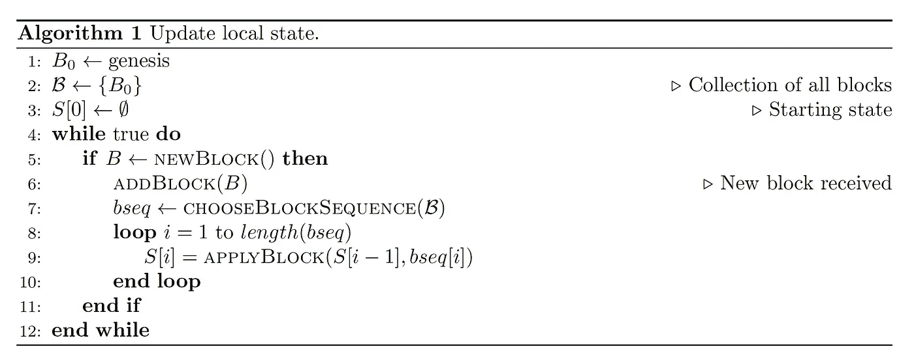
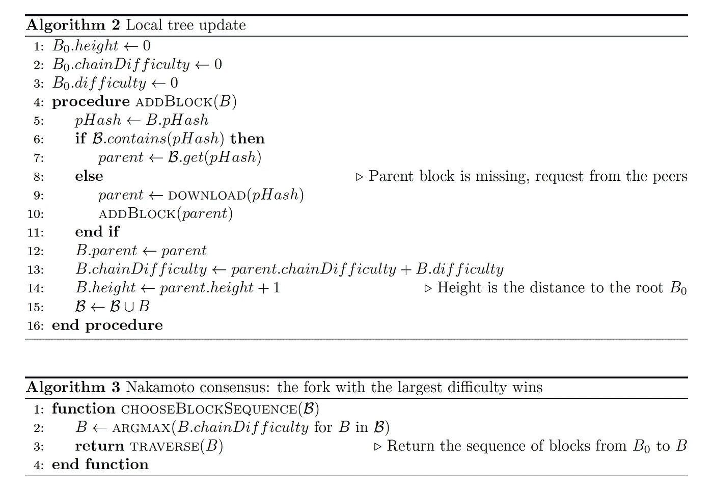
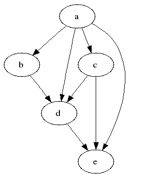

# PoW、PoS 和 Dag 不是一致协议

> 原文：<https://medium.com/coinmonks/a-primer-on-blockchain-design-89605b287a5a?source=collection_archive---------0----------------------->

## 被大肆宣传的工作证明、利害关系证明和有向无环图的概念经常被错误地宣传为“共识协议”。它们都不是，而是解决健壮的区块链设计的关键挑战:Sybil 抵抗性和异步性。

# 前言

尽管区块链到处都是流言蜚语，但似乎连最基本的想法都不断被混淆，即使是看似有信誉的来源也是如此。Emin Gün Sirer 指出了最近的一个例子:

事实上，他的#microlecture 是灵感的主要来源，早些时候在推特上引起了轰动。

我决定写一份更详细的说明，不仅解释*什么是*实际上是 PoW、PoS 和 DAGs，还解释*为什么*我们需要这些设备来建立一个安全的区块链。是的，它们不是共识协议。

在这里我提供一个简短的摘录，完整的文章可以在 [GitHub](https://github.com/dzhelezov/blockchain-design-primer) 上找到。完整版包含了我在 Medium 文章中省略的许多细节，以及用于进一步深入研究的大量参考资料。

# TL；速度三角形定位法(dead reckoning)

1.  由于每个参与者对世界的看法略有不同，因此需要达成共识。
2.  为了防止重复支出，最终是必要的。
3.  如果你能在网络中充斥许多支持你的克隆人(女巫)，你就能恢复共识。终结性与西比尔攻击不兼容，因此西比尔攻击应该很难。
4.  PoW 是一种 Sybil 抵抗方案(不是一致协议):一个人必须花费大量资源来提出一个 block，因此 Sybil 攻击是昂贵的。
5.  中本聪共识是一个静态规则:取难度最高的链。不需要网络通信。
6.  PoS 是另一个 Sybil 抵抗计划:块生产者是预先定义的，一个人必须花费内部货币才能有机会成为块生产者。因此，为 Sybil 攻击生成许多块是很昂贵的。
7.  通过使用 PoW 或 PoS，如果平均块建议时间大于网络延迟，则可以使网络同步。
8.  高块建议率仅在具有许多分叉的异步网络中是可能的。DAG 是一种数据结构，它允许一个块有许多父块，有效地跟踪许多交织的分支。一般来说，如果两个块是冲突的，那么包含在更多(加权)分支中的那个块将成为规范的。
9.  构建一个具有快速事务确认(终结时间)的抗 Sybil 的分散式异步系统是很困难的。

# 本地视图与全局状态

区块链是一个分布式系统，其状态随时间而演变。状态的一个经典示例是具有账户余额的分类账，但它实际上可以是任何东西(例如，在以太坊中，它是 EVM 的状态，因此特别地，它包含网络中所有智能合约的所有状态)。然而，为一个分布式系统定义一个全局状态是很棘手的，原因如下。

参与网络的每个节点都有自己的状态视图，因此状态的版本实际上与网络中节点的数量一样多。为了定义区块链的*全局状态*，我们需要一个有效的协议，允许所有参与节点同意相同的状态，并相应地更新它们的本地视图。换句话说，全球国家是每个人都认同的观点。

# 状态是一串区块

大多数区块链将传入的事务成批处理成块，这些块堆叠在一起。在最简单的情况下，网络中的每个完整节点保存网络曾经产生的所有块，但是只使用其中的一些来构建其本地视图。

每个节点的算法都是相同的，基本如下。

1.  保留集合中的所有块 ***B*** 包含的所有块
2.  选择一连串的积木形式 ***B***
3.  通过应用来自(2)的块中的事务，构建本地视图 *S*

# 双重花费

设计区块链最重要的两件事是如何避免双重花费和西比尔攻击。

双重花费可能看起来是这样的:你买了一杯咖啡，在柜台付款，交易看起来有效并被接受，但最终发现你的交易没有被包括在分类账中。虽然你很高兴因为你免费得到了你的咖啡，但咖啡师不会再使用如此糟糕的支付系统了。

虽然在像 Visa 这样的集中系统中，商家可以向处理机构申诉，但在分散系统中就没有什么可要求的了。这就是为什么应该保证一旦你的付款被接受，它总是包含在分类帐的全局状态中。但这意味着每个网络节点(至少是那些忠实遵守网络规则的节点)都将把你的事务包含在本地视图中，不管以后会发生什么。换句话说，**choose block sequence**(***B***)应该总是将块包含在您的事务中。保证出现在全局状态的事务被称为*最终*。一个人必须等到交易结束的时间称为确认时间，或结束时间。

# 西比尔攻击

Sybil 攻击是一种阻止终结的攻击。匿名分散系统的根本弱点是它们没有代表基本事实的仲裁者(像宪法、最高法院等)。).网络真相(全局状态)完全基于每个节点构建其本地视图的方式，即由**chooseBlockSequence**(***B***)选择哪些块。

现在，假设 Alice 有能力生成许多与用于构建全局状态的块无法区分的块。特别是，Alice 可以瞬间向网络发送大量数据块，以至于 ***B*** 被它们所控制。然后，**choose block sequence**(***B***)将不可避免地捡起 Alice 的块，所有全局状态将被完全重写，连同历史。

这当然与终结性保证和大肆宣传的“分布式分类账不可更改”不相容。

# 中本聪共识和权力

那么，为什么比特币交易*是*不可改变的呢？嗯，因为有一个聪明的机制，称为工作证明，这使得很难产生与网络已经接受的块没有区别的块。难度这一属性非常有用，因为:

1.  任何人都可以查一个块 X 的难度比 y 高。
2.  制作一个难度很高的区块需要大量的资源。这就是为什么它被称为工作证明:任何人都可以检查出产生 X 比产生 y 需要更多的计算资源(因此也需要更多的钱)

因此，虽然爱丽丝可以用正式有效的块淹没比特币，但他们没有机会改写全球状态，因为只有非常强大的矿池才能生产难度足够高的块。

反过来，中本聪共识只是一个非常具体的实现**choose block sequence**(***B***):选择那些难度最高的形成有效链的区块。

因此，工作证明是一种防止 Sybil 攻击从而提供终结性的机制(著名的经验法则“等到 6 次阻塞确认”仅仅意味着恢复事务所需的难度足够高)。中本聪共识是如何解决分叉的规则。

# 利害关系证明

证明利害关系是另一种机制，防止西比尔攻击。虽然可以说是唯一真正经过战斗考验的解决方案，但 PoW 占用了太多的资源，而且采矿权力过于集中在少数几个大型企业手中。PoS 的前提是用内部资源(底层加密货币)替代外部资源(PoW 中挖矿所需的硬件和电力)。

PoS 有多种风格(参见主文章中的参考资料)，但基本思想如下:为了产生一个块，必须获得一定量的密码。特别是，如果爱丽丝想改写历史，她将投资相当多的加密技术，以便大规模生产足够多的区块，并将全球共识转移到她这边。

然而，邮政易受一个被称为无关紧要的问题。在哲学层面上，问题在于用于防止 Sybil 攻击的加密货币分类帐本身编码在底层区块链中。特别是，如果发生分叉，块生产者可以免费将她的钱投资到全局状态的两个版本中。例如，当比特币/比特币现金分叉发生时，所有 BTC 持有者凭空获得了他们的 BCH，同时仍然持有等量的 BTC。特别是，以前的铁杆比特币玩家有充分的理由支持这两种分叉，因为他们从 BTC 和 BCH 的价格飙升中获利。

# 熟练的技艺

PoW 和 PoS 都有另一个到目前为止还没有提到的重要特性:新块很少出现，所以新的有效块产生的时间充当网络时钟。尽管确切的时间是随机的，但难度是以这样的方式调整的:当在许多连续块上求平均时，规范链中两个连续块之间的平均时间是稳定和准确的(对于比特币是 10 分钟)。由于 10 分钟超过了网络延迟，因此可以相当安全地假设在挖掘新数据块之前，数据块已到达所有网络节点。这意味着网络本质上是同步的。

同步性对于 Nakamoto consensus 是必不可少的:大多数节点应该有相同的块集合 **B** ，这样**选择块序列** ( ***B*** )返回相同的链，这样每个人都同意一个唯一的规范分支。这是有代价的:同步单链系统中的事务吞吐量不可避免地受到块中事务数量除以网络延迟的限制。这是一个严峻的挑战，因为增加最大块大小会增加延迟，并可能危及协议安全性。简单来说，同步区块链不要缩放。

因此，为了扩展，必须处理许多分支，不再只有一个分支是规范的。相反，例程**choose block sequence**(***B***)，它从所有块 **B、**的集合中构建本地视图，应该以最有效的方式合并分叉。这里 Dag(有向无环图)就派上了用场:如果经典区块链本质上是树，其中一个块只有一个双亲，dag 允许多个双亲。所以 DAG 只是一个用于存储块的数据结构。

A DAG. Source: Wikimedia

DAG 方法背后的理念是，由于有多个父块，每个块都包含在大量小型互连分支中。这样一个复杂的纠缠系统，被独立的理性行动者不断更新，在下面的意义上被期望是亚稳态的。如果两个块 *X* 和 *Y* 冲突，并且，比方说， *X* 恰好包含在比 *Y* 多的几个分支中，那么最终*所有的*未来分支将包含 *X* ，而 *Y* 将被放弃。这里重要的是，尽管网络中的每个节点都有其自己的本地 DAG，并且更新以随机顺序到达，但是 *X* 相对于 *Y* 的偏好在所有本地视图中都变得可见，因此全球一致认为 *X* 是规范的，而 *Y* 被放弃。

理论上，DAGs 可以适应非常高的吞吐量和快速的确认时间。问题是在异步系统中处理双重花费和 Sybil 攻击要困难得多，尤其是在交易成本很低的情况下。事实上，在极端情况下，当每个人都可以免费快速提交和确认交易时，没有什么可以阻止 Sybil 用交易淹没系统。在短时间内向网络注入大量事务本质上等同于网络在分区后恢复的情况，因此，无成本事务注意防止对手为她的“替代真理”建立令人信服的支持。

现有的 DAG 解决方案采用各种特别的解决方案，通过将本地视图锚定到地面事实的全局源来实施终结。ByteBall 使用特殊的见证，Vite 有一个单独的基于 PoW 的链来保存快照，IOTA 有一个特殊的协调器，其事务总是被认为是有效的。

免责声明:整个事情应该采取一粒盐，所有不准确的是我的。我强烈建议参考全文中引用的其他来源。

*反正喜欢文章就不要记得鼓掌了。你也可以在 Twitter 上关注我:@dizhel，我偶尔会在那里发布加密的东西。*

> [直接在您的收件箱中获得最佳软件交易](https://coincodecap.com/?utm_source=coinmonks)

