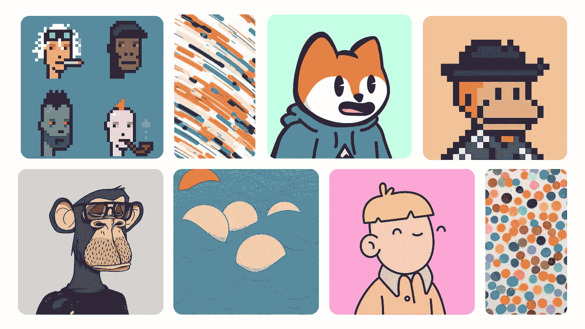
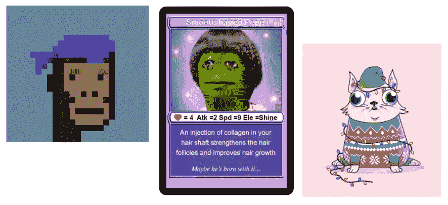
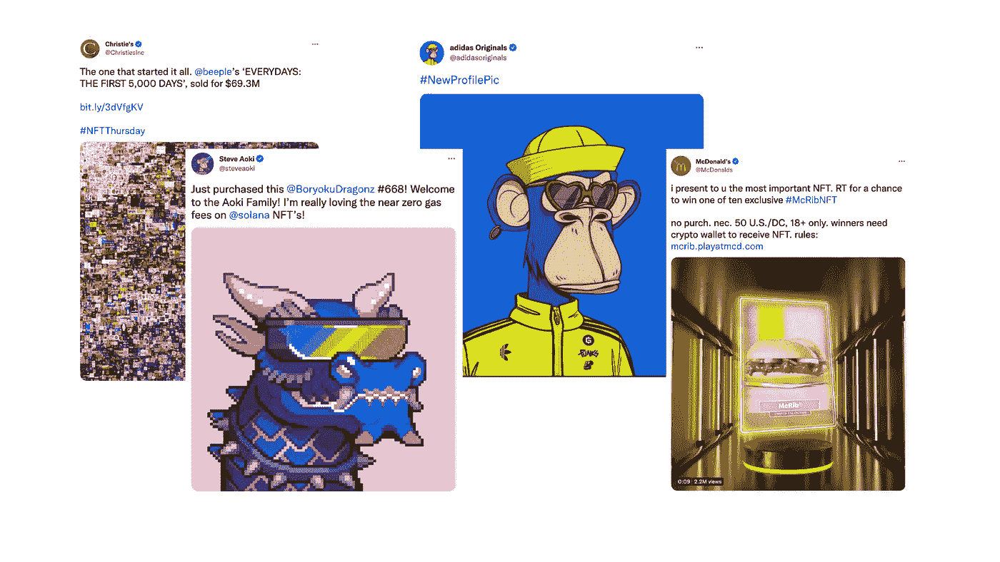
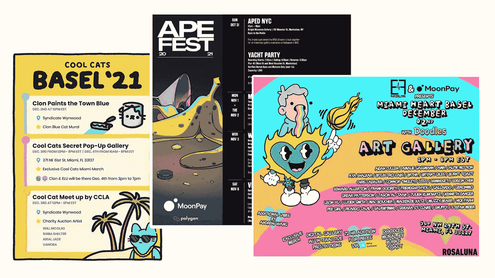

# 非功能性测试入门

> 原文：<https://medium.com/coinmonks/a-primer-to-nfts-be578540dec5?source=collection_archive---------1----------------------->

## 阿迪达斯、麦当劳、百威有什么共同点？

Top: Crypto Punks, Wavelength by Kaleb Johnston, Famous Fox Federation, and Solana Monkey Business. Bottom: Bored Ape Yatch Club, Getijde by Bart Simons, Doodles, and The Currency by Damian Hirst

这个世界上发生了一些事情，让你想知道到底发生了什么。

今年最后一次，NFT 被视为利基，但 2021 年已被证明是 NFT 的丰收年。随着一些大品牌和名人开始进入这个领域并成为它的支持者，它正慢慢成为一个更广为人知的概念。

正如每一项新技术或宣传一样，有支持者也有反对者。你可能会意识到，这种两极分化可能与加密技术刚刚起步时没有太大区别。

取决于你站在等式的哪一边，你可能会听说 NFTs 可能会彻底改变世界并颠覆许多行业。或者反对的人可能会说“这是泡沫！”，或者“这对环境不好”和臭名昭著的“兄弟，我只是右击保存了你的 jpeg，你要做什么？”。

那么什么是 NFT 呢？

可以用作个人资料图片的 ape JPEG 只是该技术的一种实现方式，在本文中，我们将探讨为什么 NFT 在 2021 年受到大肆宣传和曝光。

我的希望在这篇文章的最后，甚至我的奶奶也能来欣赏和理解这种疯狂是怎么回事！

# NFTs 101

NFT 是不可替换令牌的缩写。这些是存储在区块链上的加密令牌，可以有多种形式。最值得注意的是，NFT 被认为代表艺术品，它们也可以被表示为域名、收藏品、身份证明、虚拟通行证、音乐，甚至是迷因！

当一个东西是可替代的，这意味着两个东西的价值是相同的，可以分割，可以交换，就像一美元的钞票和另一美元的价值一样。同样，比特币是一种可替代的代币，无论你发送多少次，你都可以得到 1 BTC = 1 BTC。像法定货币一样，你也可以发送和接收更少量的比特币。

NFTs 中的不可替代性意味着没有两件事情是相同的。一幅毕加索的画与另一幅不一样。就像一个域名(如 Medium.com！)不能作为两个独立的站点存在。它们也是不可分割的，就像你不能把一件艺术品的一部分送给另一个人一样。尽管分裂的 NFT 在最近已经成为一件事——稍后再详细说明。

从本质上来说，NFT 代表了一个不可替代的东西，无论是有形的还是无形的，它的唯一性可以在区块链上公开验证。

# 时间简史

自 2012 年以来，NFT 就一直存在，但直到 2017 年，一款名为 Crypto Kitties 的猫交易游戏开始流行，NFT 才开始引起人们的注意。

注意:这些天你可能听说过 NFTs 中的一个叫做密码朋克的怪物，他统治了整个 NFT。它们比 Crypto Kitties 早了几个月，最初是免费发布的，但即使这样，它们在首次推出时也没有下架！Crypto Kitties 是第一个真正获得关注的项目。

The OG of NFTs: Crypto Punks, Rare Pepes, Crypto Kitties

在 2018 年之前，NFT 在区块链(主要在以太坊)被铸造为 ERC-20 智能合约，尽管该标准因引入许多加密项目而受欢迎，如金恩、Uniswap 等，但它并不是创建唯一令牌的最佳选择，因为它缺乏某些功能。

因此，当 ERC-721 令牌标准在 2018 年推出时，它允许 NFTs 得到更广泛的采用。ERC-721 本来是以太坊区块链上的 NFT 的技术标准，它允许跟踪钱包所有权和个人令牌。

从那以后，以太坊区块链见证了 NFT 宇宙的寒武纪大爆发。像 Rarible、SuperRare 和 OpenSea 这样的市场率先允许 NFT 被容易地交易。以 NFT 为主题的新闻机构开始报道最新的事件。

快进到 2021 年，杰克·多西正在出售他作为 NFT 的第一条推文，而 Nyan Cat 被标记为 60 万美元！像格里姆斯和迪德莫这样的名人发行了 NFTs 的歌曲，像达米安·赫斯特和巴特·西蒙斯这样的著名艺术家也以同样的方式出售他们的作品。

然而，锦上添花的是比普尔，他与佳士得拍卖行合作，以 6900 万美元的天价出售了《每一天:前 5000 天》。

我还可以补充说，阿迪达斯、耐克和麦当劳都加入了 NFT 的竞争，但你现在明白了。

Some prolific names getting into NFTs!

# 炒作是怎么回事？

> 自从有了互联网，我们就习惯于知道我们不拥有数字化的东西。今天，我们要走相反的路。在 2000 年代，百科全书是一种东西。网上约会很奇怪。看看我们现在在哪里。—加里·维纳查克

很长一段时间以来，拥有数字产品的概念从未出现在书本上。不难看出为什么。

如果无法证明某样东西是你的，你怎么能以数字方式拥有它呢*？当一件东西如此容易被复制时，你如何拥有它？你怎么能证明你已经创建了那个文件或资产呢？你能在哪里以及如何追溯某事的起源？*

那么，鼠标右键保存的愤世嫉俗者是对的吗？还是另有隐情？

问题是，NFT 不是设计来阻止右键点击保存程序的。它们被设计来给你一些不可复制的东西——资产的所有权(尽管资产的创造者仍然可以保留版权和实际所有权)。

这是一件大事，因为现在的用例不仅仅是一张你可以使用的看起来很酷的动物简介图片。对于真正成功的 NFTs，它需要有 JPEGs 之外的效用。

品牌开始关注 NFTs 的效用，允许代币门禁进入一些普通公众不会拥有的 merch drops。可以把它想象成限量版商品的白名单。阿迪达斯(与 Bored Ape Yatch Club 合作)、百威和百威啤酒(Budweiser)等品牌都放弃了使用 NFTs 的某种形式的 merch/access。

NFTs 也可以成为“俱乐部”的会员。在这种情况下，NFT 社区本身就是俱乐部。许多社区为他们的 NFT 持有者举办了面对面的活动，如 yatch 派对、秘密画廊、艺术家现场表演和限量版商品销售。

Some of the events held by Cools Cats, Bored Ape Yatch Club, and Doodles.

# 超越宣传

作为一个思想实验，想象一下如果你在以下行业拥有的东西可以被制成 NFT，这些行业会受到什么影响？

1.  身份证、执照、成绩单和证书
2.  活动、票务和销售
3.  财产契约、艺术品和收藏品
4.  医病案
5.  供应链认证

你可以肯定地说，你从 pre-loved marketplace 买到的古驰包是真的。或者，如果你要申请工作/大学录取，你可以发送一个经过验证的链接到存储你成绩单的区块链。你不会在 YouTube 上看到这样的视频，人们只需制作假通行证就可以漫步进入纽约时装周。

这些只是所谓的改变世界、颠覆行业的非功能性技术可以付诸实践的部分场景。

这些听起来都很棒，但是我们还有很长的路要走。

# 我们将何去何从？

今天我们从收藏品和个人资料图片开始。

然而，就像人们不理解收集口袋妖怪卡片、瓶盖、邮票、酒或任何相关物品的价值一样。并非所有人都会理解并接受非功能性翻译。

如果 NFT 是下一代互联网的基石，我们所有人都需要有更大的想法。对于一项像互联网一样无处不在的技术，它必须易于使用，最终会有令人厌烦的用例。

所有的技术都需要被采用，否则它只是一个科学实验。就像 DeFi 如何将资本引入加密，NFT 如何将人们引入加密。

随着越来越多的人加入这个领域，我们将吸引更聪明的头脑和那些热衷于站在巨人肩膀上建设的人。

最终的目标是将这项奇妙的技术融入我们的日常生活，让这项技术变得显而易见。就像你现在会用谷歌来寻求帮助，而不是搜索百科全书。

如果您在早期错过了 crypto，请花些时间尝试一下 NFTs！如果能跳进黑洞就更好了。我们仍然处于早期，我提到的这些无处不在的工具现在可能已经被构思出来了！

# 最后

非功能性测试将会继续存在——这是毫无疑问的。

这项技术的使用案例和想象的效用是不可否认的，它可以帮助改变我们所理解的许多东西。然而，比特币花了十多年才走到今天。很难说还需要多长时间。

也就是说，NFT 目前所处的位置仍然是 crypto 的西部荒原(crypto 已经相当荒凉了！所以，当你决定投资一个 NFT 项目时，你必须始终保持谨慎。

> 加入 Coinmonks [电报频道](https://t.me/coincodecap)和 [Youtube 频道](https://www.youtube.com/c/coinmonks/videos)了解加密交易和投资

## 另外，阅读

*   [购买 Dogecoin 的 7 种最佳方式](https://blog.coincodecap.com/ways-to-buy-dogecoin) | [ZebPay 评论](https://blog.coincodecap.com/zebpay-review)
*   [最佳期货交易信号](https://blog.coincodecap.com/futures-trading-signals) | [流动性交易所评论](https://blog.coincodecap.com/liquid-exchange-review)
*   [3 商业评论](/coinmonks/3commas-review-an-excellent-crypto-trading-bot-2020-1313a58bec92) | [Pionex 评论](https://blog.coincodecap.com/pionex-review-exchange-with-crypto-trading-bot) | [Coinrule 评论](/coinmonks/coinrule-review-2021-a-beginner-friendly-crypto-trading-bot-daf0504848ba)
*   [莱杰 vs Ngrave](/coinmonks/ledger-vs-ngrave-zero-7e40f0c1d694) | [莱杰 nano s vs x](/coinmonks/ledger-nano-s-vs-x-battery-hardware-price-storage-59a6663fe3b0) | [币安评论](/coinmonks/binance-review-ee10d3bf3b6e)
*   [Bybit Exchange 审查](/coinmonks/bybit-exchange-review-dbd570019b71) | [Bityard 审查](https://blog.coincodecap.com/bityard-reivew) | [CoinSpot 审查](https://blog.coincodecap.com/coinspot-review)
*   [3 commas vs crypto hopper](/coinmonks/3commas-vs-pionex-vs-cryptohopper-best-crypto-bot-6a98d2baa203)|[赚取加密利息](/coinmonks/earn-crypto-interest-b10b810fdda3)
*   最好的比特币[硬件钱包](/coinmonks/hardware-wallets-dfa1211730c6) | [BitBox02 回顾](/coinmonks/bitbox02-review-your-swiss-bitcoin-hardware-wallet-c36c88fff29)
*   [BlockFi vs Celsius](/coinmonks/blockfi-vs-celsius-vs-hodlnaut-8a1cc8c26630)|[Hodlnaut 点评](/coinmonks/hodlnaut-review-best-way-to-hodl-is-to-earn-interest-on-your-bitcoin-6658a8c19edf) | [KuCoin 点评](https://blog.coincodecap.com/kucoin-review)
*   [Bitsgap 审查](/coinmonks/bitsgap-review-a-crypto-trading-bot-that-makes-easy-money-a5d88a336df2) | [Quadency 审查](/coinmonks/quadency-review-a-crypto-trading-automation-platform-3068eaa374e1) | [Bitbns 审查](/coinmonks/bitbns-review-38256a07e161)
*   [密码本交易平台](/coinmonks/top-10-crypto-copy-trading-platforms-for-beginners-d0c37c7d698c) | [Coinmama 审核](/coinmonks/coinmama-review-ace5641bde6e)