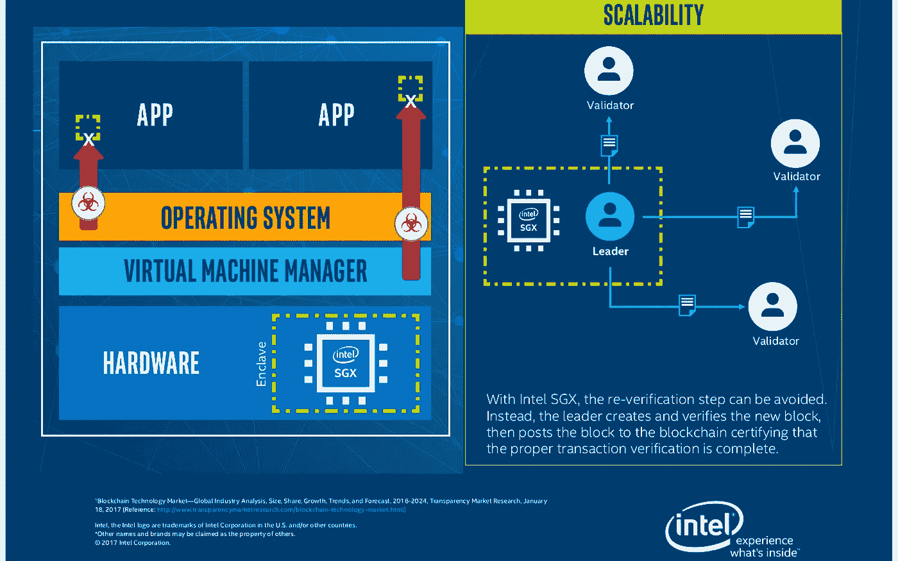

# Hyperledger 锯齿处理器的核心

> 原文：<https://medium.com/coinmonks/a-processor-at-the-heart-of-hyperledger-sawtooth-eng-763900f204f2?source=collection_archive---------3----------------------->

英特尔公司已经在 2014 年开始与一个名为锯齿湖的开源分布式注册技术(DLT)项目合作，这是一个用 Python 实现的模块化平台。2016 年 4 月，他和 R3cev(Corda 的创造者)将他介绍给 Hyperledger，让其加入孵化器。 **Hyperledger 锯齿**，现在的称呼，从 2017 年 5 月开始活跃。

# 主要特点:

*   允许在同一个区块链达成不同类型的共识
*   默认包含**耗时证明**(诗人)共识
*   智能合约几乎可以用任何语言编写(Python、JavaScript、Go、C++、Java 和 Rust)
*   通过与**总账钻取**集成，实现智能**以太坊**合约
*   支持有权限和无权限部署
*   它有一个模块化架构
*   高可扩展性
*   如果可能，事务并行执行，从而提供更高的性能。

# 经过时间的证明

在 [Hyperledger 锯齿](https://www.hyperledger.org/projects/sawtooth)的主要功能中，对我来说最引人注目的是其被称为**耗时证明** (PoET)的共识算法，因为这种涉及领导者选择的算法是在集成了 [SGX](https://software.intel.com/sgx) (软件保护扩展)的英特尔处理器中实现的。

[Securing Enterprise Blockchains with Intel® Technology](https://www.intel.com/content/www/us/en/security/securing-enterprise-blockchains-infographic.html)

PoET consensus 算法运行在支持 SGX 的英特尔处理器上的可信运行时环境中。 **SGX** 是一组处理器指令，允许代码在 Enclave(内存中受保护的执行区域)内执行。这一部分尤其重要，因为它是唯一允许运行时间证明作为共识算法正确运行并且结果可由外部实体验证的东西。

该算法模拟比特币工作证明，但不是竞争解决加密挑战和提取下一个块，每个**验证器**接收随机超时，对于特定块具有最短超时的验证器被命名为**领导者**，并负责创建和验证新块，并将其发送到区块链，证明交易验证已正确完成。PoET 共识算法是随机抽奖和到达顺序的混合。

像工作证明一样，这种算法没有很好的终结性，因为在添加了一个块之后，客户端必须等待几分钟，以确保链中没有比包含其事务的分支更长的分支。

锯齿被设计成使得共识机制可以被动态地改变，它可以发送新共识的提议作为事务，然后在其网络中有一个策略来接受这个新共识。

如果您的网络没有采用 SGX 的英特尔处理器，您也可以实施 Hyperldeger 锯齿框架，因为它提供了一个诗人模拟器，可在任何类型的硬件上提供诗人风格的一致意见，包括虚拟化云环境。

为了开发和试验区块链技术，Hyperledger 锯齿功能开发模式，一个简化的随机领导人算法。

# 真实世界的应用示例

*   [**XO**](https://sawtooth.hyperledger.org/docs/core/releases/1.0/app_developers_guide/intro_xo_transaction_family.html) :是锯齿 SDK 中包含的一个样本事务族。这是流行的井字游戏的实现。
*   [**锯齿供应链**](https://github.com/hyperledger/sawtooth-supply-chain) :是一个帮助你追踪任何资产的来源和其他上下文信息的应用。您可以直接使用它，也可以根据不同的使用情况进行定制。
*   [**锯齿市场**](https://github.com/hyperledger/sawtooth-marketplace) :是一个应用程序，允许用户与区块链的其他用户交换定制数量的“资产”。
*   [**锯齿私有 UTXO**](https://github.com/hyperledger/sawtooth-private-utxo) :演示如何创建和营销资产。它显示了如何使用 SGX 允许资产转移到总分类账和私下交易，只有参与方知道交易的细节。

具有简单架构的 Hyperledger 锯齿框架不仅允许非常小的学习曲线，还使得建立网络和部署定制应用程序(如一系列交易)变得容易，并且在几分钟内就可以在可扩展的 DLT 网络上运行。

更多信息，
[Docs](https://sawtooth.hyperledger.org/docs/core/releases/latest/)
[GitHub](https://github.com/hyperledger/sawtooth-core)

*软件开发工具包(SDK 或 devkit)通常是一组软件开发工具，允许为某个软件包、软件框架、硬件平台、计算机系统、视频游戏控制台、操作系统或类似的开发平台创建应用程序。(维基百科)*