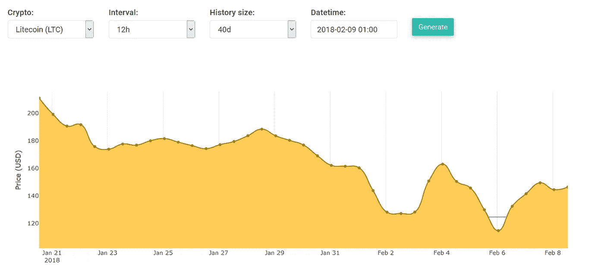

# 有利可图的莱特币交易策略

> 原文：<https://medium.com/coinmonks/a-profitable-litecoin-trading-strategy-dd044a39b521?source=collection_archive---------4----------------------->

交易加密货币是一项风险相对较高的业务。由于其不稳定性和高波动性，人们认为交易加密更像是一场赌博，而不是投资。实际上这里面有很多科学，但是如果不运用一些数学和统计学，你的交易就和扔硬币没什么区别。

## 为什么是莱特币？

在本文中，我将特别关注莱特币加密货币。你可能会问为什么莱特币？原因是我不想在这里分析和讨论一个以上的硬币，否则会变得相当混乱。但是还有第二个动机，可以通过下面的图表来解释:

Litecoin’s average price (21 Jan. to 08 Feb.)

这张图表显示了莱特币从一月底到二月中旬的价格。我们看到，莱特币的最高价格略高于 200 美元，最低价格约为 120 美元。现在让我们跳到 4 月:

Litecoin’s average price (27 Feb. to 08 Apr.)

这一次我们看到了一个非常相似的情况，当它下降到莱特币的最高和最低价格时:它的最高价格略高于 200 美元，而它的最低价格目前约为 120 美元。看来历史重演了。但是这张图表看起来完全不同，它看起来比前一张更呈下降趋势。尽管存在这些差异，在 LTC/USDT 市场上交易还是能赚很多钱。

> 另请阅读:[最佳加密交易机器人](/coinmonks/crypto-trading-bot-c2ffce8acb2a)

# 买卖莱特币的最佳时机

规避风险的业余投资者/交易者可能会看这些图表，并远离这个市场，因为它的高波动性和不可预测性。但对更了解的人来说，这是一个充满机遇的黄金时代。

我计算了过去三个月(2018 年 1 月 1 日至 3 月 31 日)Litecoin 每小时的平均价格。我的计算结果显示在下面的雷达图上:

Average price of LTC per hour (price data from Binance exchange).

注意:外径上的标签是一天中的小时数(0 到 23)。小时源自 UTC/GMT 时区。最内半径显示最低价格，最外半径显示最高价格。

这是我们从上面的图表中了解到的情况:

*   人们应该在 LTC 价格最低的时候买入:上午 10 点(10:00)平均价格在 187.50 到 188.00 之间。
*   那么你应该在价格最高的时候卖出:凌晨 1 点或 2 点，价格在 190.50 到 191 美元之间。

给定这两个最低和最高价格在各自的时间，我们可以通过以下数据计算平均回报率(ROI):

> **投资回报率=(191–188)/188 = 1.596%**

这是一个很好的投资回报率，一个人每天都可以赚到，因为他会在最低价(即上午 10 点)买入，然后在最高价(即凌晨 1 点或 2 点)卖出。如果一个人连续 60 天每天都做这些交易(从 1 月开始)，复合投资回报率将是:154%。换句话说，1000 美元的投资将在短短 60 天内变成 2540 美元。

但不要全押，现在就开始交易莱特币。在这个基本计算中，我们假设我们有一个每日固定/有保证的投资回报。事实上从来不是这样，人们在交易中经常会赔钱。这有两个主要原因:

## 1.不断变化的市场

首先，市场总是在变化，我们的小时价格图只是一个“平均值”，过去 3 个月如此，但明天或下周不一定会如此。为了说明这一点，让我们为每个给定月份计算相同的小时-价格映射雷达图:

January

February

March

从这三个独立的图表中，我们看到最高价格并不总是在凌晨 1 点(或 2 点)，1 月份是凌晨 3 点，2 月份有几个点(2 点到 7 点)，3 月份主要是凌晨 1 点和 2 点。而且对于最低价格也是如此:在 1 月和 2 月，这主要是由上午 10 点决定的，而在 3 月，选择一个特定的最低点要困难得多。

> 这就是在交易中使用“均线”的危险。它们确实能让我们很好地解释和可视化数据，但是用它们来交易并不总是一个好主意。

## 2.利润率低？

日内交易的日平均投资回报率为 1.59%，比许多其他投资策略好得多，但这仍然是一个有风险的策略。在我们最初的计算中，我们假设了一个乌托邦式的场景，而在现实中，交易所对你的每一笔交易(买和卖)都收取费用。这不是一笔很大的费用，通常约为 0.1%，但相对于投资回报率来说，这仍然是 15.9%的削减——这意味着交易所将保留你所有回报(无论是正还是负)的约 16%。

## 回溯测试

让我们通过回溯测试策略来重新运行我们的实验，这次包括每笔买卖交易的 0.1%的费用。在这个实验中，我们将在上午 10 点买入，在凌晨 1 点卖出，根据我们的 3 个月平均图表，这是最佳点——我们将在 3 个月内(1 月、2 月和 3 月)进行这个实验。

回溯测试的投资回报率为 13.046%(总共 89 笔交易)，这一点都不差，但只相当于每天 0.217%的投资回报率。我们能做得更好吗？我们当然可以！在这个实验中，我们让我们的系统使用 100%的美元金额买入，这意味着当执行买入交易时，它使用全部金额买入 LTC。所以很有可能它买的价格太高了。为了最小化这种风险并提高投资回报率，我们将使用较低的购买百分比，这样它将只使用美元价值的 X%来购买 LTC。我们的实验使用 10 分钟的时间间隔，所以在每个新的时间间隔，只要还有现金，它就会进行一次买入交易。但是我们应该为 X 选择哪个值呢？1%?25%?我们真的不知道，所以找出答案的最好方法是尝试许多 X 值，并绘制出来:

ROI % vs. buy %

在上面，我在水平的 X 轴上画出了 X 值，在垂直的 y 轴上画出了从后面测试得到的相应 ROI。5%的买入率是一个非常保守/安全的策略，60 天的回报率约为 1%，因此这是一个非常规避风险、低投资回报率的策略。虽然使用超过 45%的买入比例可以在 60 天内获得至少 10%的投资回报率，但这也是一种风险更高的策略。尽管有风险，这仍然是一个很好的投资回报。

## 有什么风险？

我几次提到“风险”，买莱特币风险有多大？在过去的 3 个月中，风险已经相当低了，因为 1 月份的最低和最高价格与今天(3 月到 4 月)在同一范围内。因此，如果你仔细考虑这些极端情况，你所要做的就是等待一个好的进场位置，通常是上午 10 点左右，或者格林威治时间晚上 9 点到 11 点，然后在最高点卖出，通常是凌晨 1 点到 7 点。

然而，请记住我们的第一点，即**市场总是在变化**。这些雷达图对它们各自的日期/月份来说是正确的，但是你可能想知道它们在四月、五月和以后是否也有效？是的，但是它们需要以滑动窗口的方式每分钟更新一次。这样一个系统在理论上应该有更高的准确性和投资回报率，但我还没有建立这样一个东西，然后测试和验证其性能。

在接下来的文章中，我们将对以太坊和比特币进行类似的分析。感谢您的阅读，敬请关注！
——伊利亚·内沃林

## 另外，阅读

*   最好的加密交易机器人
*   最好的比特币[硬件钱包](/coinmonks/the-best-cryptocurrency-hardware-wallets-of-2020-e28b1c124069?source=friends_link&sk=324dd9ff8556ab578d71e7ad7658ad7c)
*   最好的[加密税务软件](/coinmonks/best-crypto-tax-tool-for-my-money-72d4b430816b)
*   [最佳加密交易平台](/coinmonks/the-best-crypto-trading-platforms-in-2020-the-definitive-guide-updated-c72f8b874555)
*   [unis WAP 最佳钱包](/coinmonks/best-wallets-to-use-uniswap-e91a6385d9e8)
*   最佳[加密贷款平台](/coinmonks/top-5-crypto-lending-platforms-in-2020-that-you-need-to-know-a1b675cec3fa)
*   [顶级 DeFi 项目](/coinmonks/defi-future-10-promising-projects-in-the-defi-world-ff2b697ab006)
*   [bits gap review](https://blog.coincodecap.com/bitsgap-review)——一个轻松赚钱的加密交易机器人
*   为专业人士设计的加密交易机器人
*   [3commas Review](https://blog.coincodecap.com/3commas-review-an-excellent-crypto-trading-bot) |一款优秀的密码交易机器人
*   [3Commas vs Cryptohopper](/coinmonks/cryptohopper-vs-3commas-vs-shrimpy-a2c16095b8fe)
*   Bitmex 上的[保证金交易的白痴指南](/coinmonks/the-idiots-guide-to-margin-trading-on-bitmex-dbbd7742c6fc?source=friends_link&sk=7bfa99d2a181142510c8442c8ddb0786)
*   加密摇摆交易的权威指南
*   [Bitmex 高级保证金交易指南](/coinmonks/bitmex-advanced-margin-trading-guide-2270c195ce25?source=friends_link&sk=1d986cca731f5084b9a2db4a4bc4a7ad)
*   [面向开发人员的最佳加密 API](/coinmonks/best-crypto-apis-for-developers-5efe3a597a9f)
*   [加密套利](/coinmonks/crypto-arbitrage-guide-how-to-make-money-as-a-beginner-62bfe5c868f6)指南:新手如何赚钱
*   顶级[比特币节点](https://blog.coincodecap.com/bitcoin-node-solutions)提供商
*   最佳[加密制图工具](/coinmonks/what-are-the-best-charting-platforms-for-cryptocurrency-trading-85aade584d80)

> [直接在您的收件箱中获得最佳软件交易](https://coincodecap.com?utm_source=coinmonks)

