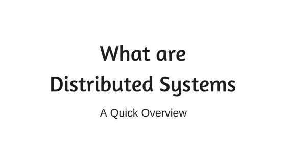

# 分布式系统快速介绍

> 原文：<https://medium.com/coinmonks/a-quick-introduction-to-distributed-systems-33868c85858e?source=collection_archive---------3----------------------->

**分布式系统**

*   是一组独立的计算机，它们相互连接以完成某项工作。
*   它们可以连接以提供一些服务、共享数据或仅仅存储数据。
*   这些计算机在物理上不共享内存或处理器。

**好的，但是这些系统是如何通信的呢？**

*   他们用信息互相交流。
*   在分布式系统中，发送方和接收方必须显式编码在消息中。
*   消息是模块化组件通信的一种很好的方式。为了一致性，消息应该遵循某种协议。就像在 WWW 中，我们有 HTTP 协议。

**举例**

*   假设我们有两台可以交换消息的计算机 A 和 B。
*   计算机 A 可以要求 B 计算两个数的和，并发回结果。同样，计算机 B 可以要求 A 对一系列数字进行排序。
*   A 和 B 可以根据其硬件和软件能力扮演不同的角色。

如何组织计算机？

我们可以有客户端服务器或对等架构。

**客户端服务器**

这里我们有一个服务器，它为多个客户端提供服务。

不仅仅局限于互联网。即使在单台机器上，该模型也是适用的。比如一个程序可能需要用户的输入。所以 I/O 模块的功能相当于程序的服务器。

这里的一个问题是，如果服务器关闭，那么请求将无法得到服务。因此，在这里，我们的服务器成为了单点故障。

另一个问题是，如果客户端数量增加，性能将会下降。

客户服务器模式适合面向服务的架构。但是，当我们希望一组计算机在它们之间分配负载时，点对点模式更好。

**点对点**

这更像是一个分布式系统，工作负载分布在计算机之间。

所有的计算机都参与计算，它们发送和接收数据。

**示例**

如果系统需要存储大量数据，它可以在参与此设置的计算机之间分配这些数据。

伴随视频[https://youtu.be/jhqk8m6kb4U](https://youtu.be/jhqk8m6kb4U)