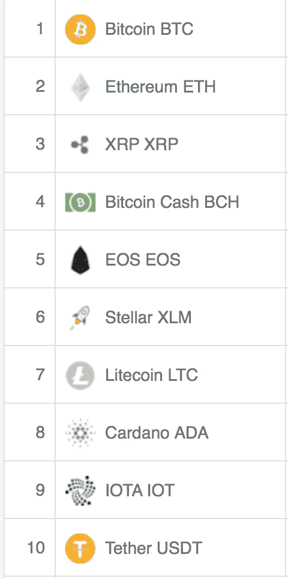
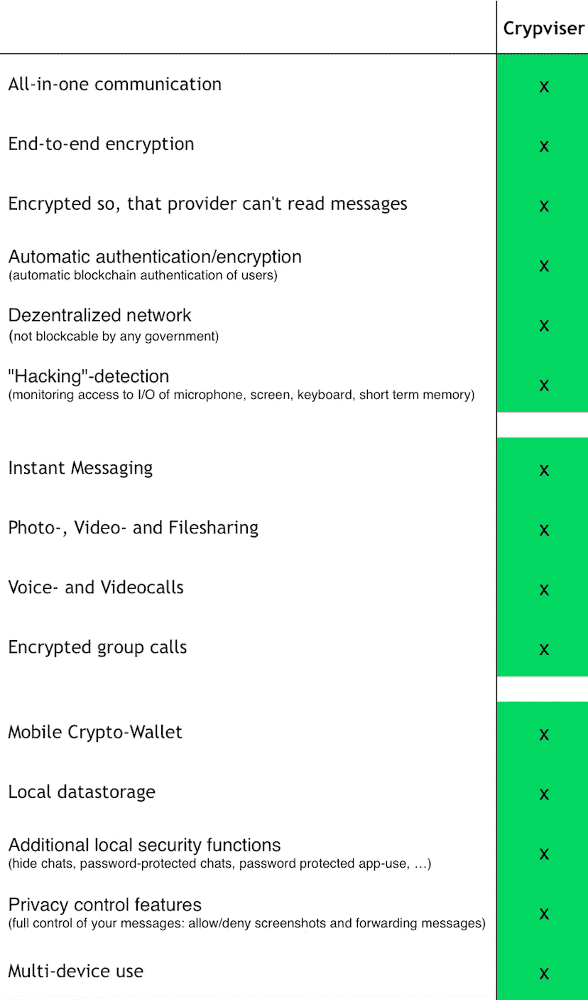

# 真正有价值的加密货币。

> 原文：<https://medium.com/coinmonks/a-real-cryptocurrency-with-real-value-5a7490a04547?source=collection_archive---------4----------------------->

加密货币。

在编写本报告时，共有 1，434 人。

前 10 名是:

毫无疑问，比特币会在可预见的未来占据第一的位置。

**以太坊**，见鬼，我在以太坊 17 美元的时候买的。应该拿着它的。

**Ripple** ，加密货币之外的一切，排在第三位。我在 08 年进入 Ripple，然后我让我的朋友买了它。我告诉他们当它达到 1.99 时卖出，他们没有。

**比特币现金**，有人说这对于比特币来说比比特币更真实。

**EOS** ，EOS 是什么鬼？这是为了什么？拥有 EOS 硬币是对服务器资源的要求。开发者需要有 **EOS** 硬币才能使用 **EOS** 区块链。EOS 区块链可以用来构建 DApps，分散的应用程序。

**恒星**，XLM。一流明( **XLM** )是数字货币的单位，就像比特币一样。流明是恒星网络的固有资产。别纠结这个了，这是浪费。为什么在 6 号？谁知道呢。！这是一种毫无价值的加密货币。句号，后面没有，后面没有。一个山寨，一个曾经，一个不曾。

**莱特币**。啊莱特币。我喜欢莱特币。我认为这是因为它的长寿和被世界广泛接受。

**卡达诺**？什么？！？！这是什么鬼东西？Cardano 是一个分散的公共区块链和加密货币项目，并且是完全开源的。好吧，那么为什么需要加密货币，它需要使用*“公共区块链”*？啊，他们有自己的钱包。好的。那么，为什么是 8 号？

**IOTA** 是一种专为物联网设计的加密货币。这越来越有趣了。这到底是怎么回事？*设计用于物联网？！那么，IOTA，你是在设计和制造 IOT 设备吗？没有吗？！那你到底在干什么，声称你的 Crpytocurrency 会用于这些设备？还有为什么会有那么多无知的人投资这个？AHHRRGGG！！！！！*

**Tether** 是一种加密货币，代表区块链市场中的真实货币。什么？！WTF？！为什么我们需要一种代表法定货币的加密货币，这个世界已经疯了吗？！

我购买和交易过加密货币。从比特币到 Monero 到以太坊到 Ripple 到 Litecoin 到 Augar 到以太坊经典。见鬼，我甚至曾经买过一些硬币，但是在考虑了一天半之后，我又把它换成了莱特币。那么，为什么这些加密货币的交易量如此之大呢？影子联盟的数字这就是原因。

# 那么，一个人能做什么呢？

有这么多关于拥有加密货币的荒谬想法和理由，我们应该投资哪一种呢？

并不是说我的观点有什么价值，因为我没有经济学硕士学位，也没有在股票交易所交易过，但是我有直觉。

我在 8 年前就知道比特币，我知道它会是个大东西。我知道以太坊，我知道莱特币，我甚至知道什么时候在 0.08 买入瑞波，什么时候在 1.99 卖出。是的，我知道这些。我对加密货币有第六感，这比任何经济学硕士学位都强，因为加密货币和法定货币没有任何关系，我的朋友们，这是一个全新的游戏。

# 寻找与现实世界资产相关的加密货币。

有吗？如果网飞有加密货币，那将是板上钉钉的事。AmaCoin 说，如果亚马逊只接受他们自己的加密货币支付，他们就会大赚一笔。那么现实世界中有什么产品接受加密货币形式的支付呢？

诚然，产品必须具有真正的价值，必须是人们需要的、想要的和好的。我的意思是，让我们面对现实，如果你有一种产品，如*速溶番茄酱*，你只能用公司的加密货币购买这种产品，嗯，我不相信会有人敲门购买它，我真的不相信会有一个全国性的需求*粉状番茄酱。*还是我遗漏了什么？

嗯，一个 100%匿名的即时通讯软件怎么样。

会有这样的呼吁吗？匿名有市场吗？鉴于最近的新闻，脸书，WhatsApp 等。

或者一个 100%匿名的无限数据传输的即时通讯软件怎么样？使用 Skype 时，您和所有其他信使一样，都受到发送数据量的限制。

更好的是，一个 100%匿名的信使，无限的数据传输和区块链认证如何？这将会击败任何一个处于攻击中的人的能力。

等等，等等，我想到了。来一个怎么样:

100%匿名，区块链认证，无限数据传输，加密货币钱包，去中心化，自毁消息，军用级加密即时消息？怎么样？如果像这样的产品背后有一种加密货币，这种加密货币的价值会是多少？0.60?$1.00?$10.00?$50.00?$500.00?如果这个即时信使背后的技术，区块链认证模型，可以用于 IOT 设备，如自动驾驶汽车，医疗产品，儿童跟踪设备等，会怎么样？那种加密货币值多少钱？$100.00?$200.00?$1,000?！

如果一种加密货币，如 Dash，目前的交易价格为 241.00 美元，它只提供一种发送加密货币的方式，没有真实世界的资产支持它，只是一个空洞的空气，那么我刚才描述的加密货币必须价值两倍。没有吗？

# 真正有价值的加密货币。

比特币，我就知道会大。尽管比特币之后，加密货币像野草一样疯长。只有 195 个国家和 1400 多种加密货币，这里有些东西不太对劲。即时信使背后的 Crpytocurrency，T2 背后的 Crpytocurrency，现在的交易价格是 0.67。

不要被落下。这是一种背后有真实价值的加密货币，一种真实世界的产品。 [Crypviser](https://crypviser.network) ，世界上第一个去中心化、区块链认证、100%匿名、不可封锁的即时通讯工具。

现在交易于 [http://Openledger.io](http://Openledger.io)

[http://HitBTC.com](http://HitBTC.com)

 [## sistemkoin-türkiye ' nin in büyük bit coin ve Altcoin borsas

### 编辑描述

sistemkoin.com](http://Sistemkoin.com) 

你也可以在这里下载 IOS 版的[应用。](https://itunes.apple.com/us/app/crypviser-secure-messenger/id1282141716?ls=1&mt=8)

或者点击此处参与 [Android 测试版发布。](/@crypviser/android-beta-release-distribution-of-crypviser-secure-communication-app-88cb33f8db59)

 [## Crypviser 安全通信应用程序的 Android Beta 发行版

### Crypviser 很自豪地通知开始 Android 测试版发行的最安全的分散…

medium.com](/@crypviser/android-beta-release-distribution-of-crypviser-secure-communication-app-88cb33f8db59)  [## App Store 上的 Crypviser 安全信使

### 阅读评论、比较客户评级、查看屏幕截图，并了解有关 Crypviser Secure Messenger 的更多信息。下载…

itunes.apple.com](https://itunes.apple.com/us/app/crypviser-secure-messenger/id1282141716?ls=1&mt=8)