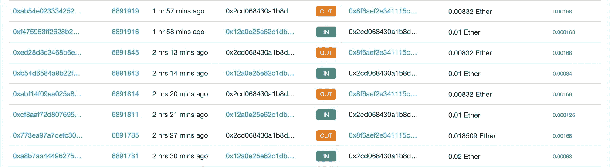
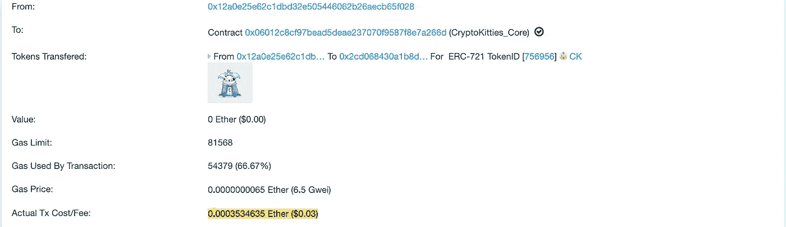
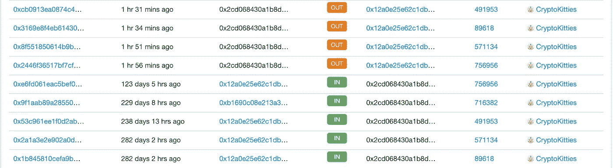
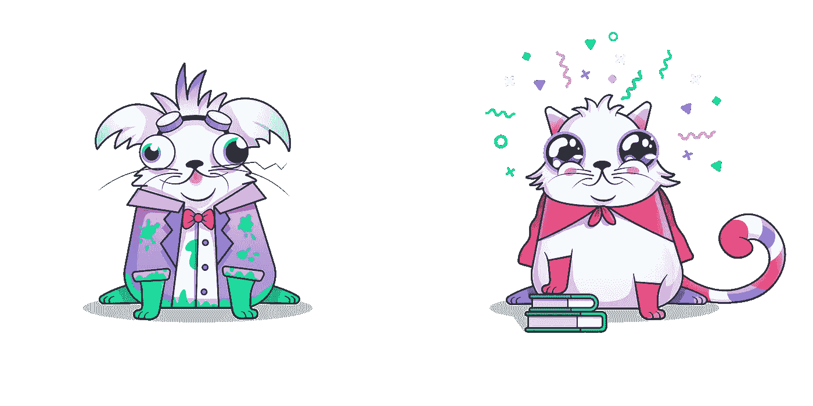
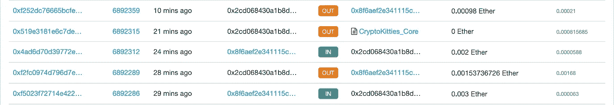

# 一个真实的故事:无望的秘密小猫救援

> 原文：<https://medium.com/coinmonks/a-real-story-hopeless-crypto-kitty-rescue-c465e65ebbf5?source=collection_archive---------2----------------------->

## 私钥被泄露；任何乙醚都会立即排出。然而，五只小猫无助地离开了。

今天下午，我的教授给我发消息说他的无人看管的 Github repo 不小心把私钥泄露给了公众。一个恶意的扫描仪捕获了密钥，现在正在耗尽所有的资金。

# 它发生了

钱包里的乙醚会在此刻被吸干…

Figure 1: Ethers are being drained…

# 钱不是问题，但小猫很重要

虽然钱包里没有更多的乙醚，我们可以节省，五个加密小猫卡住了。没有任何可用的气体，我们似乎不可能从悲剧中救出小猫。

# 两种选择

我们很快想到了两个选择:

1.  “造一个 bot 跟黑客的 bot 比，看谁有福气。”—李婷婷
2.  "想办法绕过黑客机器人的以太检测门槛."—杰夫·胡(我)

# 考虑

方法(1)听起来很有趣，但是要赢得竞争需要时间和机会。方法(2)看起来很直观，但可能行得通。

# 衡量

由于黑客行为的气体使用量不断为 **0.00168 乙醚**(图 1)，我们大胆地预计，一个小于 0.00168 乙醚的量的转移对黑客是不可见的。通过查看该账户最近一次成功的加密 kitties 转账，使用的气体在 **0.00035 乙醚**左右。

Figure 2: The gas usage of crypto kitties transferral

> 我们认为营救小猫的行动可能会成功！

# 侦察

**0.00033 乙醚**被转入账户，由此我们猜测现在的油价低于四个月前。omg 没有乙醚排出！第一批救援资金已经到达大门口。:)

# 从事

通过这种方法，我们成功绕过了黑客的 bot，最终救出了四只最值钱的小猫。等等？最后一个呢。对于最后一只可怜的小猫，我们决定把它留在那里，因为我们很好奇黑客会如何拯救它。

Figure 3: Four kitties are rescued.

这些是获救者中最罕见的:

Figure 4: Cuties rescued!

# 黑客勃然大怒

令我们惊讶的是，黑客这么快就注意到了问题，并试图将钱包榨干到最后一滴。但可悲的是，这得不偿失。随后，他将 0.003 乙醚转入钱包，取出扣除 0.00168 乙醚费后的钱。后来，他又注入了 0.002 乙醚，偷走了最后一只可怜的小猫，换了 0.00098 英镑。

Figure 5: The attacker’s final plunge

最后，这只小猫总共花了黑客将近 0.0025 以太，这仍然是有利的，因为市场上的加密小猫的最低价格是 0.003 以太。不过，很划算。

# 结论

尽管分享损失的悲伤和成功救援的兴奋，但没有太多的结论。最后一个提醒是，永远不要把你的任何钥匙放在 Github 或公共回购上。否则，你很快就会需要这个教程。:D

## 作者之外的贡献者

*   [寶博士（dAb）葛如鈞](https://medium.com/u/5aa5067cc9c5?source=post_page-----c465e65ebbf5--------------------------------)
*   [李婷婷 Lee Ting Ting](https://medium.com/u/f939717fd7fb?source=post_page-----c465e65ebbf5--------------------------------)

> 你可以在这个地址跟踪所有的历史:***0x2cd 068430 a1b 8d 515753 F2 DD 07d 02 f 93 a2 e 99 a 80***，因为它是区块链。

Also check out the Mandarin version written by Professor [寶博士（dAb）葛如鈞](https://medium.com/u/5aa5067cc9c5?source=post_page-----c465e65ebbf5--------------------------------)!

 [## 以太貓咪搶救大作戰 — 0x1 團隊區塊鏈錢包駭客暗夜攻防實錄（真實故事）

### 楔子 — 深夜的熱錢包通知

medium.com](/@daaab/以太貓咪搶救大作戰-0x1-團隊區塊鏈錢包駭客攻防實錄-真實故事-528a1095ff71) 

> [在您的收件箱中直接获得最佳软件交易](https://coincodecap.com/?utm_source=coinmonks)

[**Click to read today’s top story**](http://bit.ly/2G71Sp7)