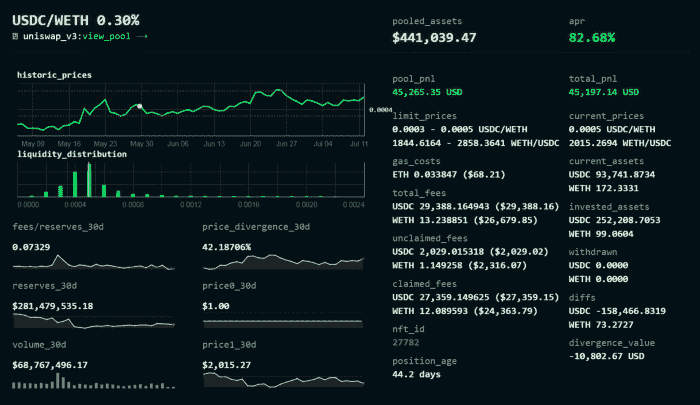
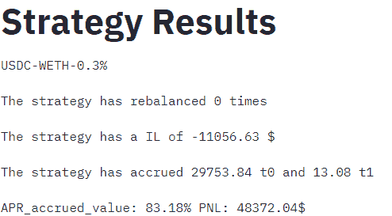
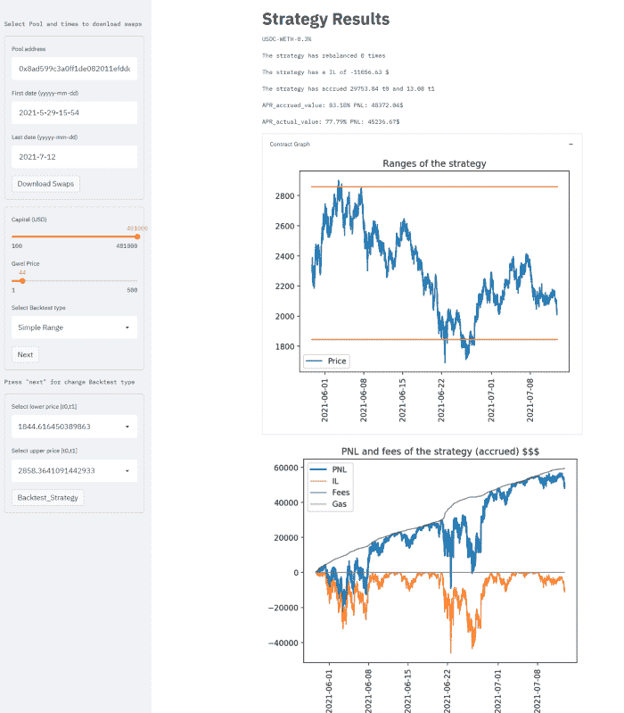
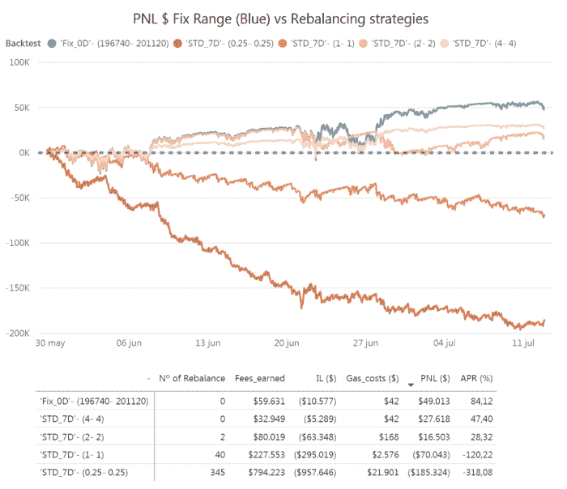
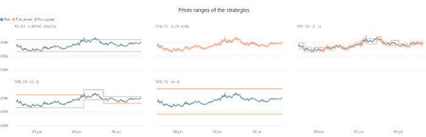
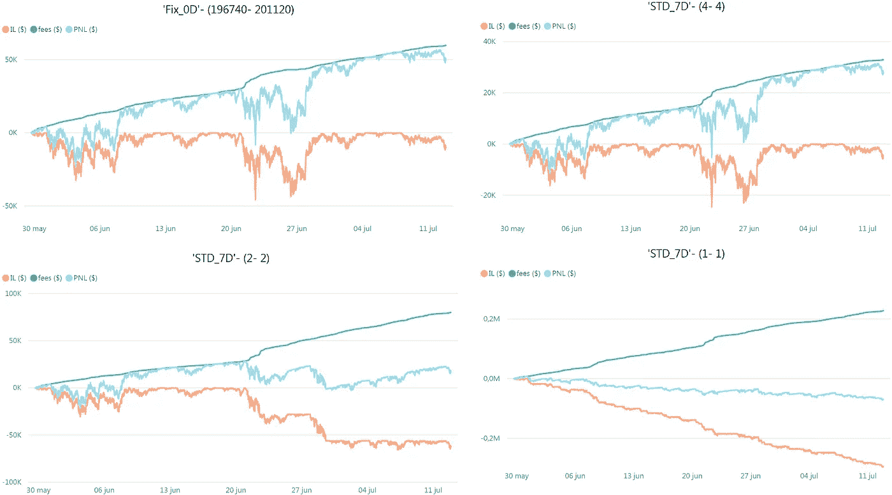

# 用于回溯测试 Uniswap V3 策略的“真实世界”框架

> 原文：<https://medium.com/coinmonks/a-real-world-framework-for-backtesting-uniswap-v3-strategies-88825abdcd17?source=collection_archive---------0----------------------->

## 为回测 Uni_V3 职位提供简单快捷的工作流程和 webapp

随着 Uniswap v3 的推出，流动性提供者缺乏一种好的方法来评估任意范围内的头寸表现。在下面的文章中，我将描述一个简单的工作流程来计算动态和被动头寸的回报。我还将展示一个运行 ETH/USDC 0.30%费用池的例子。下面描述的工作流程已经在下面的[公众 webapp 中实现。](https://backtesting.credmark.com/)

# 第一部分:一个“真实世界”的回溯测试框架

与其他 LP 选项相比，Uniswap V3 的主要区别在于可以设置自定义价格范围来提供流动性。这导致流动性的动态分布，每次 LPs 建立或烧毁头寸时都会发生变化，因此为了计算头寸的应计费用(定义为价格范围(pa，pb)和提供的总流动性),我们必须计算该头寸在每次互换中拥有的活跃流动性份额。鉴于上述情况，我建议采用以下工作流程对 Uniswap V3 职位的绩效进行回溯测试:

***1*******下载给定数据帧的池的所有交换*** *。**

**工具:图表**

> ***2 下载池流动性历史数据**。*
> 
> *为了获得最准确的结果，建议使用 web3 客户端查询归档节点或 Uniswap v3 Oracle，并获取每个数据块中的历史活跃流动性，但为了加快计算速度并将其公之于众，我在图中使用了当前可用的最大粒度(每小时数据)。使用 revert.finance 数据进行的一些交叉检查显示，当使用每小时数据和简单头寸(没有重新平衡)进行测试时，精确度约为+/-5%。*
> 
> *工具:带归档节点访问或图形的 Web3 客户端*
> 
> ***3 将互换数据与流动性数据**、*合并，以了解互换发生时的活跃流动性。对于这个例子，我们假设全天的流动性保持不变。**
> 
> ***4 定义一个模拟位置**。*头寸被定义为(流动性，分笔成交点 _ 下限，分笔成交点 _ 上限)的组合。流动性是使用“liquidityforamounts”公式和以下参数计算的:初始资本金额($)、铸币价格和头寸范围(tick_lower，tick_upper)。流动性将保持不变，直到执行额外的添加或刻录。**
> 
> **工具:liquidityformounts @ liquidity amounts . sol 或者我自己的*[*python 的*](https://github.com/JNP777/UNI_V3-Liquitidy-amounts-calcs/blob/main/UNI_v3_funcs.py) *包装器。**
> 
> ***5 计算职位的 PNL。**对于回溯测试池中执行的每个互换，我们计算头寸产生的费用和头寸的实际非永久性损失(IL)。*
> 
> *-应计费用=Swap_amountIn*fee_tier*(头寸 _ 流动性/活跃 _ 流动性)*
> 
> *-IL = LP 代币的价值-持有初始流动性的价值*
> 
> *-天然气成本薄荷= 500000 gwei *天然气价格*
> 
> *-PNL =累计费用 _ 应计(发电时的美元值)- IL -Gas_costs_mint*

*-APR=PNL/Initial_capital*(职位年龄/年时间)*

> *工具:*amountsforliquidity @ liquidity amounts . sol 或者我自己的*[*python 的*](https://github.com/JNP777/UNI_V3-Liquitidy-amounts-calcs/blob/main/UNI_v3_funcs.py) *包装器。**

# *第二部分:工作流的真实测试*

*我已经在一个简单但强大的 [webapp](http://34.241.148.133:8501/) 中实现了所描述的工作流程，我将在一个由 [ameen.eth](https://revert.finance/#/uniswap-position/27782) 创建并在 [twitter](https://twitter.com/ameensol/status/1403727891217584130) 上广泛讨论的真实职位上对其进行测试。*

**

*[Example of a real not rebalanced position for the UTH/USDC 0,3 % pool](https://revert.finance/#/uniswap-position/27782)*

*该职位只有一个 mint 事务，我可以从中获取所需的参数，以便在 web 应用程序中进行测试:*

***-铸币厂的日期时间**:2021 年 5 月 29 日下午 3 点 56 分*

***-初始资本(造币时)** : 251.271，59 美元 USDC + 229696，3 美元 ETH = 480967，89 美元=481.000 美元*

***-价格范围:** 1844，6164–2858，3641 瑞士联邦理工学院/USDC*

***-汽油费用(在造币厂的时候)**:17.01 美元(44 克威)*

*该应用程序将执行上述回溯测试，并将显示自该头寸创建以来的应计费用、非永久性损失、gas_costs 和 PNL 的变化:*

**

****我们可以看到结果非常接近***[***revert . finance***](http://revert.finance)***数据，预测的 APR*** *与* *偏差仅为 0.5%，应计费用为-1%，IL 为+2%(主要是因为用于计算的价格差异很小)。**

**

*Screenshot of the webapp for backtesting Uniswap v3 positions*

# *第三部分:使用动态流动性准备金进行回溯测试*

*那么，如果 ameen.eth 决定成为一个积极的流动性提供者会怎么样呢？为了回答这个问题，在本节中，我将测试从窄到宽的布林线的四种动态策略，并看看与被动策略相比会有什么结果(尽管肯定会有所不同，因为 ameen.eth 的参数范围选择表现得非常好，他大部分时间都在范围内)。*

*选择的 4 个测试布林线策略是:*

*1-范围+/-0.25 * STD _ 7D*

*双量程+/- 1*STD_7D*

*3 量程+/- 2*STD_7D*

*4 档+/- 4*STD_7D*

## *重新平衡方法:*

*只要我们的头寸超出范围，并且仅持有池中的一个令牌，就会触发重新平衡。*

*一旦触发了重新平衡:*

*   *该算法将采取一个新的立场，重新部署正是初始资本。*
*   *新头寸的价格范围相当于实际价格+/-策略的相应布林线。*
*   *考虑到要部署的资本和新的价格范围，计算所需令牌的数量。因为将需要互换来调整代币之间的数量关系，所以增加了汽油成本(120000 汽油)。*
*   *增加了造币厂位置的气体成本(500000 气体)*
*   *当我们交换剩余令牌来调整它们之间的关系并建立新的头寸而不是等待反转时，非永久性损失就会累积。*

## *结果*

*尽管本分析并非试图对潜在的做市策略进行详尽的分析，但其结果对于理解 Uniswap v3 中不同流动性提供方法的动态非常有用。*

> *该分析的主要目的之一是用图表显示积极流动性提供者的主要敌人是非永久性损失的积累，而不是天然气成本的积累。*

*首先，对 5 次回测的 PNL 进行比较:*

**

*PNL comparison of a passive strategy vs 4 dynamic strategies*

*尽管结果不一定适用于其他组合，但我们可以看到，在 ETH/USDC 0.30%组合中，采用动态策略导致的损失随着范围变窄而增加。*

*为了详细分析这种策略是如何演变的，让我们来详细了解一下:*

*— 1 头寸的价格范围*

**

*— 2 四大战略的 PNL 详细结果*

**

*从上面的图表中可以看出，获胜策略(固定范围)在分析期内非常接近最低和最高价格，虽然在短时间内超出范围，但它通过赚取更多费用击败了范围更大的策略(+/- 4*STD_7D)。*

> *最后，值得注意的是固定范围策略和+/- 2*STD_7D 策略这两种类似策略的非永久性损失曲线之间的差异。最后提到的将执行两次再平衡，导致非永久性损失增加 x5，与固定策略相比，费用仅增加 x1，5。*

# *关于 webapp*

*在[下一个链接](https://backtesting.credmark.com/)中有一个简单版本的回溯测试器，里面有使用指南。*

***联系我** [**推特**](https://twitter.com/JNP7771) **或者加入** [**LP 咖啡馆**](https://discord.gg/HwX5a6uSGB) **不和继续讨论***