# 一个非常简单的智能合同，说明如何将价值插入以太坊区块链并显示在网页上

> 原文：<https://medium.com/coinmonks/a-really-simple-smart-contract-on-how-to-insert-value-into-the-ethereum-blockchain-and-display-it-62c455610e98?source=collection_archive---------0----------------------->

在本教程中，我将向您介绍在以太坊区块链上创建和部署智能合约的步骤。

本教程的目的是教你

一.创建智能合同所需的工具

二。如何创建基本智能合同

三。如何将您的智能合约部署到以太坊区块链

四。如何通过网页与智能合同进行交互

动词 （verb 的缩写）如何通过智能合约从网页调用函数将值存储到区块链

不及物动词如何通过智能合约调用函数来显示存储在区块链上的值

> [发现并回顾最佳以太坊开发工具](https://coincodecap.com/category/blockchain-node-and-api)

在本教程结束时，我们将会有一个类似这样的网络界面。

你可以在我的 github 页面这里找到完整的源代码【https://github.com/yubzee/SimpleStorage[](https://github.com/yubzee/simplestorage)

*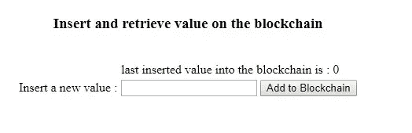*

***假设***

*假设你知道区块链和智能合同，你也知道 html 和 javascript 的基础知识。*

*所以让我们把手弄脏吧*

# *创建智能合同所需的工具*

*   *Remix IDE :- Remix 是以太坊 IDE，用于名为 **Solidity** 的智能合约编程语言，具有集成的调试器和测试环境。最新的在线版本可在【remix . ether eum . org】([http://remix.ethereum.org](http://remix.ethereum.org/))获得。*

*如果你想的话，混音是一个很好的解决方案*

*a.开发智能合同(remix 集成了一个可靠性编辑器)。*

*b.调试智能合同的执行。*

*c.访问已部署的智能合约的状态和属性。*

*d.调试已经提交的事务。*

*e.分析可靠性代码以减少编码错误并实施最佳实践*

*f.与 Mist 或 Metamask(或任何注入 web3 的工具)一起，Remix 可用于测试和调试 dApp*

*   *元掩码(meta mask):-元掩码是一座桥梁，让你今天就能在浏览器中访问未来的分布式网络。它允许您在浏览器中运行以太坊 dApps，而无需运行完整的以太坊节点。MetaMask 包括一个安全的身份库，提供了一个用户界面来管理您在不同网站上的身份和签署区块链交易。你可以在 Chrome、Firefox、Opera 以及新的 [**勇敢浏览器**](https://brave.com/) 中安装 MetaMask 插件。如果你是一名开发者，你可以从今天开始使用 MetaMask 进行开发。*

*在此安装[的 Metamask 插件，并按照步骤创建一个帐户。请务必保存 12 个单词的密码，因为这是在您忘记密码或私人密钥时找回帐户的唯一方法。你应该有这样的东西](https://www.metamask.io)*

*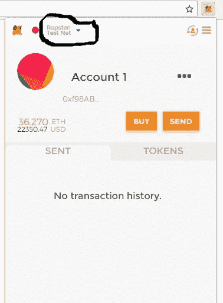*

*您现在在 metamask 上拥有一个帐户，可以使用它与 dApps 和智能合约进行交互。*

*确保您将帐户切换到 Ropsten 测试网络(Ropsten 测试网络上的醚是没有价值的，我们将需要它们用于开发目的)。*

*点击**购买按钮> Ropsten 测试水龙头**并请求尽可能多的水龙头乙醚。*

# *如何创建基本智能合同*

*我们将创建一个非常简单但非常强大的 dApp。我们的 dApp 将使用户能够修改区块链中整数值的状态。我们 dApp 的用户将通过一个简单的 html 页面和元掩码与我们的智能合约进行交互。*

*现在去[http://remix.ethereum.org](http://remix.ethereum.org)启动你的混音 IDE。记得用 Chrome，Firefox，Opera 或者 Brave 浏览器。*

*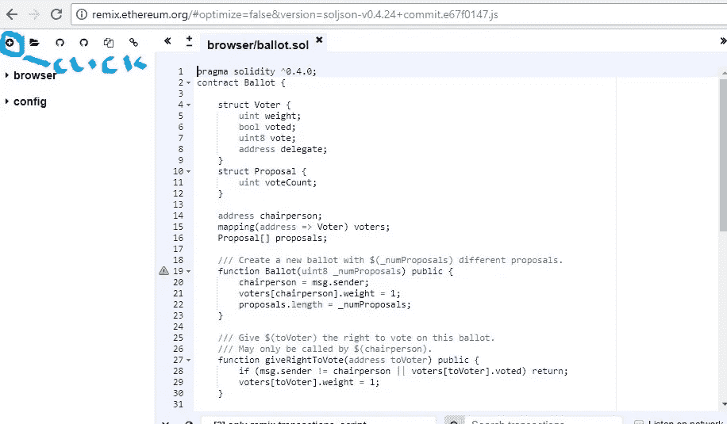*

*RemixIDE 为您创建了一个名为 **Ballot.sol** 的投票合同样本。但是我们想从头开始创建一个我们自己的简单契约。单击左上角的+(加号)按钮创建一个新文件。*

***注意:使用 RemixIDE 创建的文件存储在浏览器的内部存储器中***

*将文件命名为 **SimpleStorage.sol***

*在 IDE 中复制并粘贴以下代码*

```
***pragma solidity ^0.4.4;****contract SimpleStorage{****uint storeddata;****function set(uint x) public{****storeddata = x;****}****function get() public view returns(uint){****return storeddata;****}****}***
```

*让我解释每一行代码。*

*   *第一行简单地告诉我们源代码是为 Solidity 版本 0.4.0 或任何不破坏功能的更新版本(直到但不包括版本 0.5.0)编写的。这是为了确保新的编译器版本不会突然改变契约的行为。关键字 **pragma** 之所以这样叫是因为，一般来说，pragma 是编译器关于如何处理源代码的指令(例如，pragma once)。*
*   *第二行**契约 SimpleStorage** 告诉 solidity 编译器我们正在创建一个名为 SimpleStorage 的新契约。为了在 solidity 中创建新合同，我们使用关键字**合同。**从可靠的意义上来说，契约是代码(其功能)和数据(其状态)的集合，驻留在以太坊区块链上的特定**地址**(是的，每个契约都必须驻留在特定地址)。*
*   *行 **uint 存储数据**；声明一个名为**的状态变量，其类型为**uint**(256 位无符号整数)。您可以将它视为数据库中的一个插槽，可以通过调用管理数据库的代码的函数来查询和修改它。在以太坊的情况下，这总是拥有契约(它当然有一个地址)。在这种情况下，函数 **set** 和 **get** 可以用来修改或检索变量的值。***

*除了允许任何人存储一个世界上任何人都可以访问的数字，而没有(可行的)方法阻止你发布这个数字之外，这个合同没有做太多事情(由于以太坊建立的基础设施)。当然，任何人都可以用不同的值再次调用 **set** 并覆盖您的号码，但该号码仍将永远保存在区块链的历史中。*

*稍后，在下一课中，我将向您展示如何施加访问限制，以便只有您可以更改该数字。*

*一切都应该是这样的*

*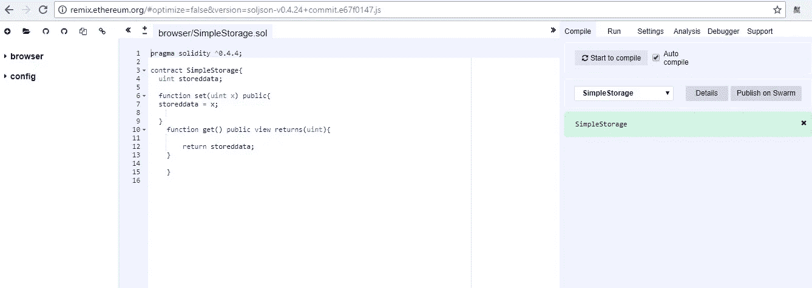*

# *如何将您的智能合约部署到以太坊区块链*

*为了将我们的智能合约部署到以太坊区块链，我们需要通过 metamask 经由**注入的 web3** 进行部署，在我们的例子中运行在 Ropsten TestNetwork 上。*

*因此，让我们来编制我们的智能合同。点击右上角的**编译**选项卡，然后点击**开始编译**按钮，编译智能合同。*

*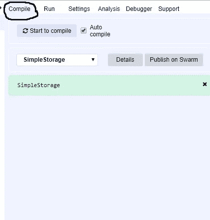*

*希望它编译时没有任何错误。*

*接下来点击**运行**选项卡，将智能合约部署到以太坊区块链。*

*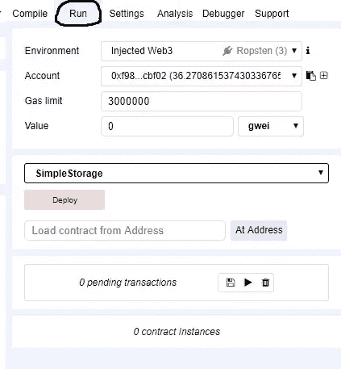*

*让我解释一下这里发生了什么*

*   *第一行名为**环境**显示了我们所连接的网络节点。因为我们正在使用 Metamask，从列表中选择**注射网 3** 并且记住在你的 metamask 上确保你在 Ropsten 测试网络上并且你的帐户有足够的乙醚支付汽油。*
*   *下一行叫做**账户**显示你的以太坊地址和你的以太余额。这种账户被称为**外部所有账户(EOS)***
*   *剩下的两行显示了气体限制和我们愿意为智能合同的部署支付的价值。跳过这几行，继续部署合同。*

*点击**部署**按钮，将合同部署到区块链。*

*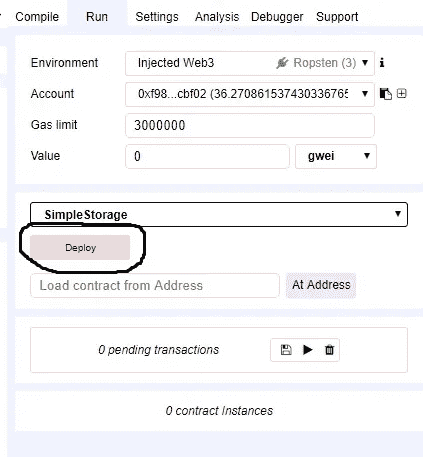*

*这个动作将通过注入的 web3 调用元掩码*

*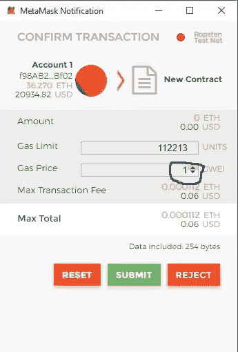*

*你可以将天然气价格提高到 3 或 4 GWEI，以加快交易开采。*

*最后点击**提交**按钮将合同添加到区块链。*

*之后，点击 metamask 上的**已发送**选项卡，查看您的合同状态*

*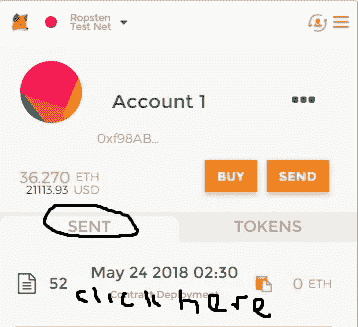*

*然后点击新创建的合同，在 Etherscan 上查看您的合同信息*

*复制合同地址，并将其保存在我们以后需要的地方。*

*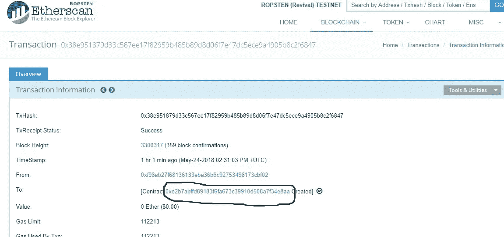*

***恭喜**您已经成功创建并部署了区块链以太坊的智能合约。*

*如果你已经走了这么远，深呼吸。你现在是一名 Solidity smart 合同开发人员。*

# *如何通过网页与智能合同进行交互*

*为了让用户与我们的智能合约进行交互，他们需要一个界面。我们将建立一个简单的网页，使用户能够调用我们的智能合同和访问其公共功能。*

*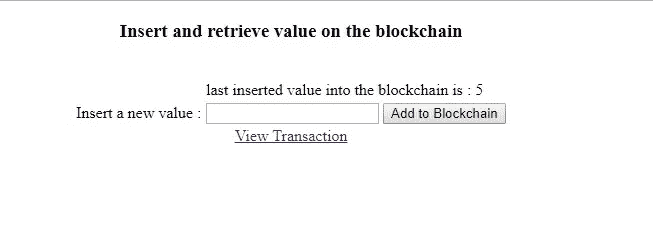*

*将以下 HTML 代码复制并粘贴到您喜欢的代码编辑器中*

```
*<!DOCTYPE html><html><head><title></title><meta charset=”utf-8" /></head><body><center><div id=”metamask”></div><h3>Insert and retrieve value on the blockchain</h3><br /><table><tr><td></td><td><div id=”xbalance”></div></td></tr><tr><td>Insert a new value :</td><td><input id=”xvalue” type=”text” /><input id=”Button1" type=”button” onclick=”setvalue()” value=”Add to Blockchain” /></td></tr></table></center></body></html>*
```

*这里的 html 代码非常简单*

*现在，将下面的 javascript 代码添加到 HTML 页面的 body 标记的下面和 center 标记的前面。*

```
*<script>window.onload = function () {// check to see if user has metamask addon installed on his browser. check to make sure web3 is definedif (typeof web3 === ‘undefined’) {document.getElementById(‘metamask’).innerHTML = ‘You need <a href=”https://metamask.io/">MetaMask</a> browser plugin to run this example’}// call the getvalue function heregetvalue();}</script>*
```

*我们通过 web3 从我们的元面具与以太坊区块链交流。上面这段 javascript 代码检查用户的浏览器上是否安装了 metamask 插件，如果没有，则显示一条消息，指示用户安装 metamask*

# *如何通过智能合约调用函数来显示存储在区块链上的值*

*来自上面注释行下面的脚本*

***//在这里调用 getvalue 函数***

*我们调用智能合约的 **get** 函数来检索通过智能合约插入到区块链中的最后一个整数值。*

*现在让我们创建获取值函数。*

*在最后一个右括号 **}** 后添加以下代码*

```
*//function to retrieve the last inserted value on the blockchainfunction getvalue() {try {// contract Abi defines all the variables,constants and functions of the smart contract. replace with your own abivar abi = [{“constant”: false,“inputs”: [{“name”: “x”,“type”: “uint256”}],“name”: “set”,“outputs”: [],“payable”: false,“stateMutability”: “nonpayable”,“type”: “function”},{“constant”: true,“inputs”: [],“name”: “get”,“outputs”: [{“name”: “”,“type”: “uint256”}],“payable”: false,“stateMutability”: “view”,“type”: “function”}]//contract address. please change the address to your ownvar contractaddress = ‘0x9b5bb96009bf3562a53bbbc491fe1e12338778a7’;//instantiate and connect to contract address via Abivar myAbi = web3.eth.contract(abi);var myfunction = myAbi.at(contractaddress);//call the get function of our SimpleStorage contractmyfunction.get.call(function (err, xname) {if (err) { console.log(err) }if (xname) {//display value on the webpagedocument.getElementById(“xbalance”).innerHTML = “last inserted value into the blockchain is : “ + xname;}});}catch (err) {document.getElementById(“xbalance”).innerHTML = err;}}*
```

*注意这条线*

*var abi=(“我们这里的 ABI…请用你自己的替换”)*

*ABI 代表 ***应用二进制接口*** 。*

*一般来说，ABI 基本上就是你如何在契约中调用函数并获取数据的方式*

*以太坊智能合约是部署在以太坊区块链上的字节码。在一个合同中可能有几个功能。ABI 是必要的，这样您就可以指定调用契约中的哪个函数，并保证该函数将以您期望的格式返回数据。*

*要得到你的合同 ABI，切换回混音 IDE，点击右上角的**编译**标签，然后点击**细节**按钮*

*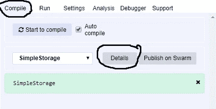*

*复制 ABI 代码(您需要向下滚动才能看到)*

*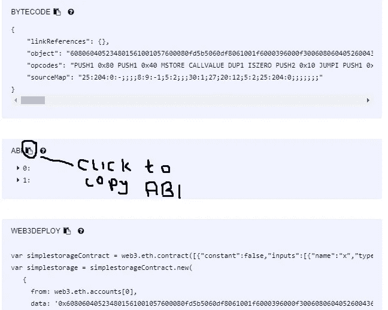*

*并在生产线上替换它*

*var abi=(“请在此处重复您的 ABI…”)*

*切换回您的 HTML 页面，并用您自己的地址替换合同地址。*

*var contractaddress = '在此处替换为您自己的..'；*

*完成后，您可以预览 HTML 页面，查看通过智能合约存储在区块链上的最后一个整数值。*

*如果这是第一次，该值将返回零(0)*

**

# *如何通过智能合约从网页调用函数将值存储到区块链*

*在我们的智能合约上调用 **set** 函数来增加区块链的值也很容易，类似于 **get** 函数的过程*

*将以下代码行复制并粘贴到 HTML 页面中 **getvalue** 函数的最后一个右括号之后*

```
*// function to add a new integer value to the blockchainfunction setvalue() {try {// contract Abi defines all the variables,constants and functions of the smart contract. replace with your own abivar abi = [{“constant”: false,“inputs”: [{“name”: “x”,“type”: “uint256”}],“name”: “set”,“outputs”: [],“payable”: false,“stateMutability”: “nonpayable”,“type”: “function”},{“constant”: true,“inputs”: [],“name”: “get”,“outputs”: [{“name”: “”,“type”: “uint256”}],“payable”: false,“stateMutability”: “view”,“type”: “function”}]//contract address. please change the address to your ownvar contractaddress = ‘0x9b5bb96009bf3562a53bbbc491fe1e12338778a7’;//instantiate and connect to contract address via Abivar myAbi = web3.eth.contract(abi);var myFunction= myAbi.at(contractaddress);//call the set function of our SimpleStorage contractmyFunction.set.sendTransaction(document.getElementById(“xvalue”).value, { from: web3.eth.accounts[0], gas: 4000000 }, function (error, result) {if (!error) {console.log(result);} else {console.log(error);}})} catch (err) {document.getElementById(“xvalue”).innerHTML = err;}}*
```

*记得把合同 ABI 改成你自己的。*

*这是你可以复制粘贴的完整代码*

```
*<!DOCTYPE html><html><head><title></title><meta charset="utf-8" /></head><body><script>window.onload = function () {// check to see if user has metamask addon installed on his browser. check to make sure web3 is definedif (typeof web3 === 'undefined') {document.getElementById('metamask').innerHTML = 'You need <a href="https://metamask.io/">MetaMask</a> browser plugin to run this example'}// call the getvalue function heregetvalue();}//function to retrieve the last inserted value on the blockchainfunction getvalue() {try {// contract Abi defines all the variables,constants and functions of the smart contract. replace with your own abivar abi = [{"constant": false,"inputs": [{"name": "x","type": "uint256"}],"name": "set","outputs": [],"payable": false,"stateMutability": "nonpayable","type": "function"},{"constant": true,"inputs": [],"name": "get","outputs": [{"name": "","type": "uint256"}],"payable": false,"stateMutability": "view","type": "function"}]//contract address. please change the address to your ownvar contractaddress = '0xc80cae7c51f27bc25b3862d072d56fa84965f5c1';//instantiate and connect to contract address via Abivar myAbi = web3.eth.contract(abi);var myfunction = myAbi.at(contractaddress);//call the get function of our SimpleStorage contractmyfunction.get.call(function (err, xname) {if (err) { console.log(err) }if (xname) {//display value on the webpagedocument.getElementById("xbalance").innerHTML = "last inserted value into the blockchain is : " + xname;}});}catch (err) {document.getElementById("xbalance").innerHTML = err;}}// function to add a new integer value to the blockchainfunction setvalue() {try {// contract Abi defines all the variables,constants and functions of the smart contract. replace with your own abivar abi = [{"constant": false,"inputs": [{"name": "x","type": "uint256"}],"name": "set","outputs": [],"payable": false,"stateMutability": "nonpayable","type": "function"},{"constant": true,"inputs": [],"name": "get","outputs": [{"name": "","type": "uint256"}],"payable": false,"stateMutability": "view","type": "function"}]//contract address. please change the address to your ownvar contractaddress = '0xc80cae7c51f27bc25b3862d072d56fa84965f5c1';//instantiate and connect to contract address via Abivar myAbi = web3.eth.contract(abi);var myfunction = myAbi.at(contractaddress);//call the set function of our SimpleStorage contractmyfunction.set.sendTransaction(document.getElementById("xvalue").value, { from: web3.eth.accounts[0], gas: 4000000 }, function (error, result) {if (!error) {console.log(result);} else {console.log(error);}})} catch (err) {document.getElementById("xvalue").innerHTML = err;}}</script><center><div id="metamask"></div><h3>Insert and retrieve value on the blockchain</h3><br /><table><tr><td></td><td><div id="xbalance"></div></td></tr><tr><td>Insert a new value :</td><td><input id="xvalue" type="text" /><input id="Button1" type="button" onclick="setvalue()" value="Add to Blockchain" /></td></tr></table></center></body></html>*
```

# *测试我们的 dAPP*

*每当我们为以太坊区块链增加价值时，我们都需要支付汽油费。*

*因此，在文本框中输入一个整数值，然后单击**添加到区块链**按钮。*

*支付气价，等待你的交易被处理和开采。*

*刷新浏览器以检索您添加的新值。*

***如果你已经做到了这一步，那么祝贺你成为 dApp 开发者。***

*如果你面临任何挑战或建议，我欢迎提问*

*古德勒克*

***捐赠总是令人感激的***

****以太坊地址:*0x f 98 ab 27 f 68136133 EBA 36 b 6 c 92753496173 CBF 02***

> *加入 Coinmonks [电报频道](https://t.me/coincodecap)和 [Youtube 频道](https://www.youtube.com/c/coinmonks/videos)获取每日[加密新闻](http://coincodecap.com/)*

## *另外，阅读*

*   *[复制交易](/coinmonks/top-10-crypto-copy-trading-platforms-for-beginners-d0c37c7d698c) | [加密税务软件](/coinmonks/crypto-tax-software-ed4b4810e338)*
*   *[电网交易](https://coincodecap.com/grid-trading) | [加密硬件钱包](/coinmonks/the-best-cryptocurrency-hardware-wallets-of-2020-e28b1c124069)*
*   *[密码电报信号](http://Top 4 Telegram Channels for Crypto Traders) | [密码交易机器人](/coinmonks/crypto-trading-bot-c2ffce8acb2a)*
*   *[有哪些交易信号？](https://coincodecap.com/trading-signal) | [比特斯坦普 vs 比特币基地](https://coincodecap.com/bitstamp-coinbase)*
*   *[ProfitFarmers 回顾](https://coincodecap.com/profitfarmers-review) | [如何使用 Cornix Trading Bot](https://coincodecap.com/cornix-trading-bot)*
*   *[如何在势不可挡的域名上购买域名？](https://coincodecap.com/buy-domain-on-unstoppable-domains)*
*   *[印度的秘密税](https://coincodecap.com/crypto-tax-india) | [altFINS 审查](https://coincodecap.com/altfins-review) | [Prokey 审查](/coinmonks/prokey-review-26611173c13c)*
*   *[最佳加密交易所](/coinmonks/crypto-exchange-dd2f9d6f3769) | [印度最佳加密交易所](/coinmonks/bitcoin-exchange-in-india-7f1fe79715c9)*
*   *开发人员的最佳加密 API*
*   *最佳[密码借贷平台](/coinmonks/top-5-crypto-lending-platforms-in-2020-that-you-need-to-know-a1b675cec3fa)*
*   *[杠杆代币](/coinmonks/leveraged-token-3f5257808b22)终极指南*