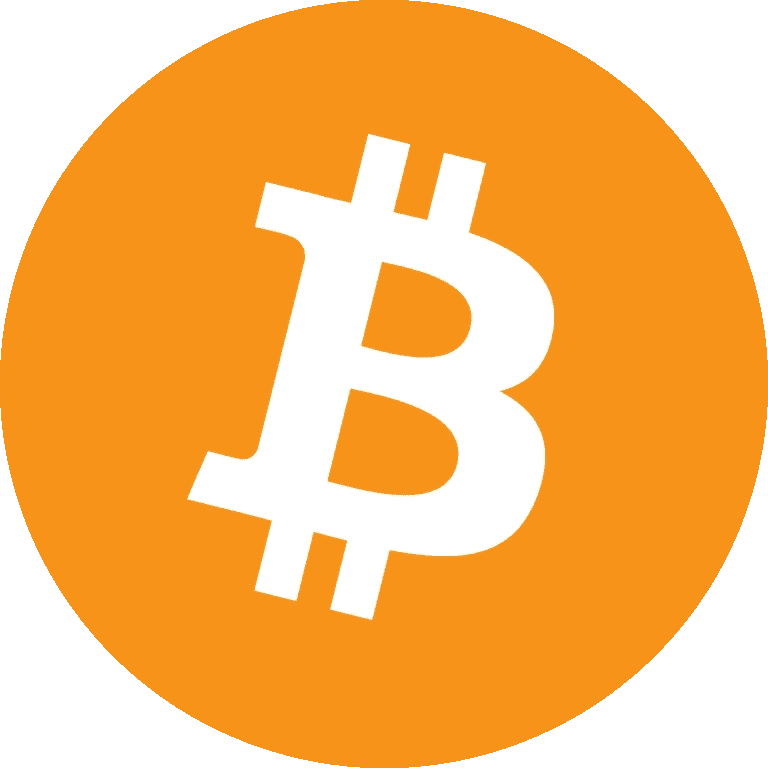

# 对“比特币的生存危机”的回应

> 原文：<https://medium.com/coinmonks/a-response-to-bitcoins-existential-crisis-a36cd2b859db?source=collection_archive---------3----------------------->

 [## 比特币的生存危机

### 加密货币缺乏领导者——它们没有单一的真实来源。从哲学上讲，这可能会变得复杂。

medium.com](/@nic__carter/what-is-it-like-to-be-a-bitcoin-56109f3e6753) 

Nic Carter 是 Castle Island Ventures 的普通合伙人之一(前一版本错误地识别了该基金)，该风险投资基金因投资 Flipside Crypto 而臭名昭著，出售了一篮子 shitcoins，他最近写了一篇文章，描述了他所谓的比特币的[存在危机。](/s/story/what-is-it-like-to-be-a-bitcoin-56109f3e6753)如果你没有 12 分钟来读它，它可以被总结为“比特币没有领导者，因此它有时会分叉。”然而，在这篇文章中，一些加密媒体将 Nic 称为 Satoshi 2.0，他有几个有缺陷或不完整的想法。

这篇文章的前三段是经过深思熟虑的，如果你忽略像“主体间共识”这样的短语的用法(对于那些不知道主体间共识的人来说，主体间共识是一种在认知和哲学期刊中出现的想法，用于描述人们如何创建共享的现实概念)，这是对加密货币身份中一些问题的有用介绍。

> “第一种也是最常见的方法是授予一个公司或基金会商标权，就像 [Tezos](https://trademarks.justia.com/870/79/tezos-87079454.html) 或 [EOS 那样。IO](https://trademarks.justia.com/874/93/eos-87493053.html) 。这是非比特币区块链的默认设置，并赋予实体指定和批准单链的法律效力。当然，没有人一定要遵循这一点，可能会有一个每个人都同意使用的 Tezos 分支。
> 
> 然而，商标带有某些法律保护，如果 fork 试图保留该名称，商标所有者将有追索权，至少在 fork 试图与受监管机构互动的情况下。在这种情况下，商标只是核心问题的一种表现形式，它证实了区块链的领导层正在寻求对其控制的权威认可。该实体可能参与的其他活动包括迫使交易所使用一个报价器而非另一个报价器，或支持一个报价器而非另一个报价器，以及向媒体传播一致的信息。所有这些都给了实体在争议中选择哪一个分支的实际控制权。"

这一节对我来说很幽默，因为人们已经试图将比特币注册商标。见[此处](http://tmsearch.uspto.gov/bin/showfield?f=doc&state=4807:w5goq0.2.11)、[此处](http://tmsearch.uspto.gov/bin/showfield?f=doc&state=4807:w5goq0.2.7)、[此处](http://tmsearch.uspto.gov/bin/showfield?f=doc&state=4807:w5goq0.2.14)、[此处(现金)](http://tmsearch.uspto.gov/bin/showfield?f=doc&state=4807:w5goq0.2.35)、[此处](http://tmsearch.uspto.gov/bin/showfield?f=doc&state=4807:w5goq0.2.59)、[此处](http://tmsearch.uspto.gov/bin/showfield?f=doc&state=4807:w5goq0.2.119)、[此处](http://tmsearch.uspto.gov/bin/showfield?f=doc&state=4807:w5goq0.2.144)、[此处](http://tmsearch.uspto.gov/bin/showfield?f=doc&state=4807:w5goq0.2.149)、[此处](http://tmsearch.uspto.gov/bin/showfield?f=doc&state=4807:w5goq0.2.151)。(注意，其中许多是针对不同的产品，而不是实际的比特币。)然而，Nic 提出了一个好观点。也就是说，你可以用法律结构来抵御身份危机，这通常与这个领域的既定目标背道而驰，或者你可以拥抱困难。

> 另一种方法是将谨慎抛到九霄云外，摒弃任何外部身份标志，转而依赖主体间共识，这样系统可以随着时间的推移而改变，同时保持对其最初目标的忠诚。这是像比特币和 Monero 这样的无领袖(或者更准确地说，领袖最小化)系统所追求的方法。当然，在这两个体系中都有有影响力的个人，但都没有控制商标的基金会或公司，也没有明确的决策机构。许多批评者会说，作为比特币主要实现的作者，比特币核心拥有不成比例的控制权，但这是一种简化的解读。它不是一个官方机构，他们创建的主要实现并没有定义比特币的本质，而是定义了它的实例化。

这里是我们进入争论的一些有趣部分的地方。比特币核心的想法仅仅是围绕定义比特币的规则达成共识的一个例子。这表面上是对的，但重要的是要记住，比特币是其核心节点运行的软件。最近有一个例子，比特币核心有一个大规模的拒绝服务和通货膨胀的错误。任何这样的通货膨胀错误本质上都违反了控制比特币发行时间表的社会共识，但它仍然存在于实例中，这表明比特币核心在这里的影响比 Nic 试图暗示的要大得多。我确实同意比特币没有单一的领导者，但否认 Core 的影响力是短视的。他试图用皮埃尔·罗查德(Pierre Rochard)的一句话来掩盖这一点，他说，当软件和共识发生冲突时，软件就是错误的，然而，既然我们已经确定软件是规则的实例化，那么实际的现实就是比特币依赖于软件。没有实例化网络的代码，有一个简短的论文流行量 cypherpunks。此外，由于比特币完全由社会共识决定，并且由于主要软件是由一个机构编写的，我们实际上看到当核心的激励与持有人或用户的激励不一致时，分叉出现的可能性增加。

> 对稳健货币政策的绝对承诺(2100 万英镑的硬上限)是比特币的核心优势，但如果费用市场不起作用，则会限制其设计空间和转向能力。但这是比特币选择的权衡。

好吧，这里有个小问题:有限的供应并不是赚钱的唯一途径。即使是黄金也有随着时间推移而膨胀的弹性供给。此外，为了接受比特币有上限供应，我们必须接受分叉并不代表供应增加。这在一定程度上是正确的，因为比特币可能会一直保持上限。然而，仍然有增加供应的动机，这意味着未来围绕比特币的社会共识可能会改变，供应可能会增加。声称比特币将永远有上限供应，是忽视了决定网络安全的激励模式的实际现实。正如前比特币基金会成员布洛克·皮尔斯(Brock Pierce)曾经说过的那样，“如果我需要钱，我只是制造一个代币。”确定价值，并获得最大份额的回报的吸引力是巨大的，难以避免的，即使对于像布洛克这样多年来与比特币密切相关的人来说也是如此。

此外，当分叉因社区中的争议问题而发生时，它们可能会分裂社区，破坏比特币周围的网络效应，因此可能代表供应的增加，与它们分裂社区的程度成比例。这一点有点难以立即理解，所以我想把它分解一下，试图让它更清楚。

1.  比特币价值的很大一部分来自网络效应和社区的不断壮大。
2.  “真正的”比特币是由社会共识决定的。
3.  有争议的分歧分裂了社区，削弱了达成统一共识的能力。
4.  因此，有争议的叉子通过稀释任何叉子明确声称是比特币的能力，增加了“有效”比特币的数量。

Nic 声称解决这种分裂的方法是致力于一些非常稳定的价值观。然而，我们已经认识到很难让这个群体保持一致。

文章的剩余部分将对比特币的观点分成了不同的哲学阵营。实际上，我相信他可能已经指出了意识形态的差异。然而，我认为这些不同阵营的存在证明，比特币可能永远不会实现这些不同立场之间的一致，因此可能会随着各种问题的出现而继续分化。每出现一个有争议的分叉，都意味着比特币实现其有效性所需的网络效应的难度增加。

感谢凯尔·吉布森和约书亚·戴维斯帮助编辑这个视频

> [在您的收件箱中直接获得最佳软件交易](https://coincodecap.com/?utm_source=coinmonks)

