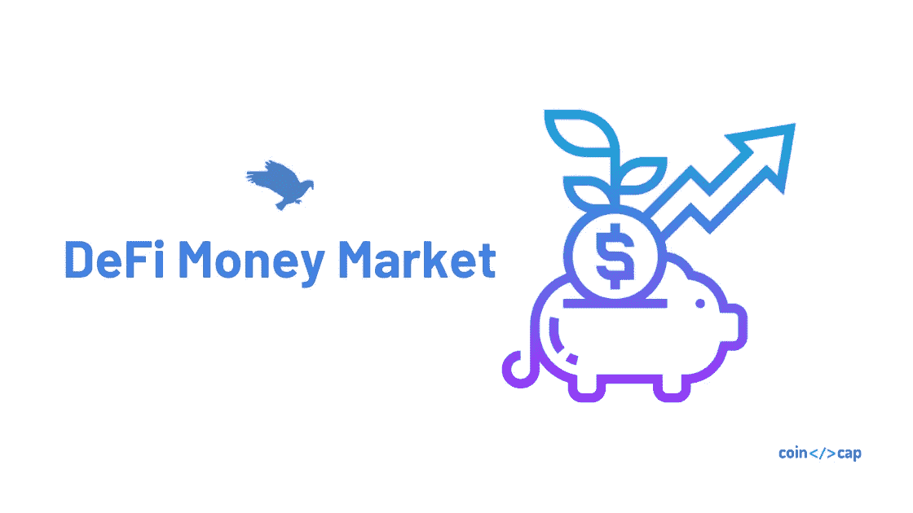
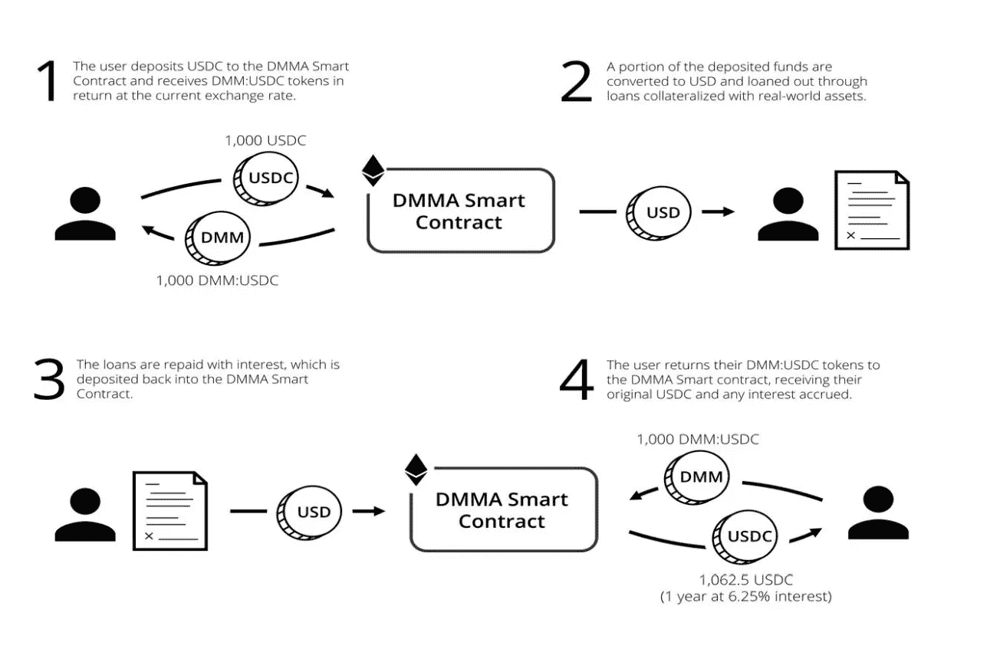

# DeFi 货币市场项目(DMM)述评

> 原文：<https://medium.com/coinmonks/a-review-of-defi-money-market-project-dmm-5a68c10b36e3?source=collection_archive---------2----------------------->

## 持续以太坊收益的愿景

在本文中，我们将回顾一下 [DeFi 货币市场项目](https://defimoneymarket.com/) (DMM)。根据[白皮书](https://defimoneymarket.com/DMM-Ecosystem.pdf)，该团队旨在打造

> *“一个无需许可且完全去中心化的协议，可以从任何以太坊数字资产上赚取利息，这些资产由链上代表的真实世界资产支持。”*

我们将首先解释 DMM 项目，然后强调围绕它的一些注意事项和挑战。最后，我们将分享我们对这个项目的看法。但是首先，让我们深入研究 DMM 试图解决的问题。

# 问题是

如今，数字资产的总市值超过 2000 亿美元。有两种领先的加密货币[比特币](https://blog.coincodecap.com/a-candid-explanation-of-bitcoin/)和以太坊，市值分别超过 1200 亿美元和 180 亿美元。

然而，大多数数字资产都处于理想状态，没有产生任何收益。因此，想象一下价值 2000 亿美元、没有回报、不出售就无法脱离数字生态系统的资产。

在过去的几年里， [DeFi 生态系统](https://blog.coincodecap.com/the-ultimate-guide-to-defi-decentralized-finance/)在以太坊上迅速发展，我们看到货币市场协议为以太坊和其他代币产生收益，如 [Aave](https://aave.com/) 、[复利](https://compound.finance/)等。

所有这些[货币市场](https://en.wikipedia.org/wiki/Money_market)协议都使用 Eth 和其他以太币令牌作为抵押品来产生收益。尽管数字资产价值的波动给普通投资者带来了两个主要问题

*   浮动利率——频繁调整利率以维持抵押比率的协议。
*   资产清算的高风险——高价格波动会产生资产清算的[风险](https://news.bitcoin.com/eth-price-dai-collateral-loans-makerdao/)。

我们需要更稳健的方式来为以太坊或比特币等数字资产创造收益。

# 持续的产量和增长

[负利率](https://www.investing.com/central-banks/)倒推了[货币的时间价值](https://www.investopedia.com/terms/t/timevalueofmoney.asp)。银行开始向把钱存入银行的人收费，如果你借钱，你会得到利息。

随着法定货币走向负收益率，世界各地的投资者正在寻找新的资产类别，以获得持续的正回报。

具有稳定收益和正时间价值的数字资产将吸引新的投资者进入加密生态系统，他们希望保护自己的资金。

> *“持续的利率和资产的正时间价值会让新的投资者蜂拥而至，他们是来保护自己的钱，而不是投资于一个快速致富的计划。这将是投资者对数字资产认知的根本性转变”。*

# DeFi 货币市场

那么，DeFi 货币市场是如何出现的呢？DMM 旨在建立一个去中心化的协议，通过将以太坊数字资产借给现实世界的资产(车辆、房地产等)来赚取利息(收益)..)作为抵押。

因此，投资者可以将他们的基金(ETH、戴、)锁定在 DMM 协议中，DMM 将把它们借给借款人，以获得真实资产作为抵押，产生的利润将分配给投资者。

我知道你现在有很多问题，但是让我们先深入研究一下 DMM 协议，了解它是如何工作的。

# 数字万用表的组件

所以 DMM 引入了一些新的东西，DMME，DMMA，DMMW，mAssets 等等。让我们一个一个去挖掘。

**DMME (DeFi 货币市场生态系统)** —简单地说，DMME 是 DMM 的代理人。正如白皮书解释的那样，

> *“DMME 是一种基于以太坊的分散式协议，允许创建 DeFi 货币市场账户(DMMA)。”*

**DMMA (DeFi 货币市场账户)**—dmma 是 ERC20 令牌，它是在我们使用智能合约将 DAI(或任何其他支持的以太坊令牌)交换为相应的 DMM 令牌 DMM: DAI 时创建的。

DMM: DAI 将由 mDAI 符号表示(小 m 字母作为基础资产的前缀)。

对于 DMME 支持的每一个以太坊令牌都是如此，比如 mUSDC、mETH 等等。我们将这些资产称为**群体**。

根据白皮书，DMMA 是

> *“一种新的 DeFi 原生资产类别，允许任何基于以太坊的数字资产的持有者赚取利息，并由链上代表的真实世界资产支持。”*

所以基本上，DMMA =大众= DMM 代币。

**DeFi 货币市场包装器(DMMW)** — DMMW 是一种 ERC20 智能合约包装器，可以放在任何以太坊令牌上，通过链上代表的真实世界资产的支持来产生收入并提供额外的多样化和安全性。

**神谕**——区块链没有通往外界的通道。因此，Oracles 以安全的方式向区块链提供外部数据。这些 oracles 是分散的网络，对同一类型的数据使用多个数据源。DMM 利用 Chainlink oracle 网络将真实世界的信息拉入区块链。

这里涉及到更多的东西，但是让我们在睡觉之前停下来，了解一下 DMM 协议一般是如何工作的。

# DMM 协议是如何工作的？

让我们来了解一下 DMM 协议。为简便起见，我们以 USDC 为例。

*   用户将存款 USDC 和薄荷 mUSDC
*   存入的资金将被转换成法定货币(美元)
*   美元将用于提供以真实资产为抵押的贷款
*   随着贷款的偿还，利息将被存回协议中
*   用户可以感兴趣地将 mUSDC 转换为 USDC

How DeFi Money Market Works?

现在，让我们以 USDC 为例深入探讨一下。

*   最初，用户需要薄荷 mUSDC
*   一旦铸造，你将获得 mUSDC 取决于当前的汇率
*   白皮书建议你可以随时将这个 mUSDC 转换成 USDC，没有锁定期
*   因此，现在 DMM 基金会将提取部分存款 USDC，将其转换为菲亚特
*   利用这一法令，DMM 基金会以特定的利率向借款人提供贷款。目前，它将在汽车领域提供贷款，因为其背后的团队必须在该市场经历过。
*   每当 DMM 基金会提供任何贷款时，它都会使用 Chainlink oracle 将法律合同和其他数据点推送到 DMM 协议。
*   另一方面，车辆估价将通过使用[黑本](https://www.blackbook.com/)的 chainlink 持续反馈给 DMM procotol。
*   通过这种方式，协议(DMM 基金会)可以在不付款或[抵押品覆盖率](https://bizfluent.com/info-8625873-collateral-coverage-ratio.html)下降到某个点以下的情况下拍卖这些车辆。
*   菲亚特收取的利息和付款将被转换为数字资产，并存入智能合同。

要更详细地理解该协议，请阅读[白皮书](https://defimoneymarket.com/DMM-Ecosystem.pdf)。

但是这里有许多移动部件和警告。将现实世界的资产引入区块链带来了几个挑战。

# 挑战、风险和缓解措施

DMM 是第一个试图在现实世界和区块链之间架起桥梁的项目。我说的认真，是指“认真一千万美元”。DMM 基金会通过锁定 1000 万美元来启动该协议。

**追踪菲亚特运营** —一旦 crypto 被转化为菲亚特用于借贷，追踪它将是最具挑战性的部分。在这种情况下，我们需要信任 DMM 基金会。

**集中化** —最初，DMM 基金会坐在前台，将负责贷款业务和其他法定和加密基金。所以投资者必须信任基金会。虽然为了解决这个问题，DMM 基金会正在创建一个 DMM Dao，它将对与协议和基金会相关的关键决策进行投票。为此，DMM 基金会创建了一个 DMM 治理令牌 DMG，通过荷兰式拍卖进行分发。

**抵押品估价**——真实世界的资产变坏或无法收回的风险总是存在的。为了解决这一问题，该协议将通过保持低 LTV(贷款价值比)和在全美不同的流动性市场中分散贷款来实现超额抵押。

**数据损坏和可用性** —团队将使用 [Blackbook](https://www.blackbook.com/) 进行估价，这是一个公认的来源，但需要更多的估价来源来消除串通风险。此外，fiat 数据和其他 DMM 基金会运营数据将由基金会提供。所以，所以在这种情况下，我们需要信任基金会。

**资产没收或法律问题** —与数字资产不同，现实世界的资产可以被没收；在这种情况下，由于 XYZ 的原因，资产总是有被国家没收的风险。此外，这些资产还可能引发法律问题。

**ETH 波动率模型** — DMM 的主要价值主张是为 ETH 提供一致的收益率。但 ETH 是一种不稳定的资产，DMM 希望利用期权交易对冲 Eth 的波动性。我们认为基金会在进入像 ETH 这样高度不稳定的资产之前，需要使用和戴的稳定资产来扩展协议和建立其他必要的工具。我们认为在解决现有问题之前增加复杂性还为时过早。

其他软件和智能合约漏洞也可能危及 procotol，但可以通过遵循最佳工程实践来避免。在 DMM 的情况下，攻击面是巨大的，因为它涉及真实世界的资产。

# 结论

将真实世界的资产引入区块链是一个巨大的挑战，DMM 正试图通过选择正确的工具和市场来解决这个问题。

减轻上述风险需要付出巨大的努力，但是团队有能力、有经验并且致力于解决这些问题。

我们还认为，如果 crypto 使用硬现实世界的资产以更透明的方式实现一致的兴趣，这将是一个巨大的机会。然而，该项目的最大问题是在未来分散协议的所有方面。

> [在您的收件箱中直接获得最佳软件交易](https://coincodecap.com/?utm_source=coinmonks)

