# 流动性峰会 2018 综述

> 原文：<https://medium.com/coinmonks/a-review-of-fluidity-summit-2018-d5bf1bf9f246?source=collection_archive---------3----------------------->

流动性峰会拉开了 2018 年纽约区块链周的序幕，汇集了来自许多学科的思想领袖，描绘了金融的未来。流动性在美丽的韦林，前威廉斯堡储蓄银行(“人民的银行”)举行，寻求连接新旧金融世界。在观众中，软件工程师、投资者、律师、交易员、设计师和作家聚集在 Weylin 令人惊叹的壁画圆顶下，一起吃喝，最重要的是了解 2018 年分散化金融的状况。

The Weylin Dome

我们可以简单地将 2008-2017 年的区块链时代归类为分散分布式分类帐概念验证阶段:令牌化生态系统需要足够数量的网络参与者来充分实现实施真正分散安全所必需的网络效应。2017 年底表明，人们有足够的兴趣支持这些加密经济协议。展望 2018 年剩余时间及以后，我们正处于一个新时代，机构资本现在对将资金投入分散技术并为其创新提供动力的前景垂涎三尺。然而，有一些关键挑战需要技术专家、金融家、律师和艺术家共同解决，以跨越鸿沟并让机构投资者参与进来。流动性、托管和遵守现有的金融法规是分散化未来的下一个转折点之前的障碍。据此，流动性峰会 2018 的非官方主题为:BUIDL + COMPYL。

Biofuel

# **设置舞台**

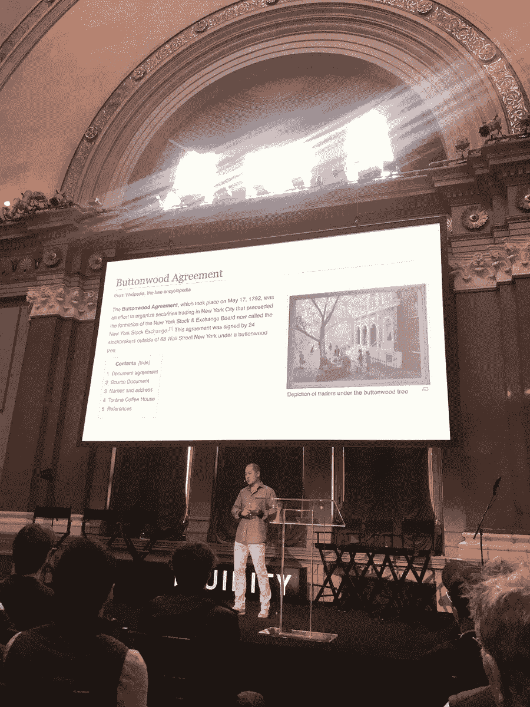

Master of Ceremony: Bill Tai

传奇的现实世界的尤达(穿着清爽的白色九分裤)，风险投资家，教育家比尔·泰作为我们的主人给我们上了一堂关于证券交易的快速历史课。大约在 1792 年的这个时候，24 名股票经纪人签署了[梧桐树协议](https://en.wikipedia.org/wiki/Buttonwood_Agreement)，试图组织一个证券交易所。这份在一棵梧桐树下签署的协议，标志着“华尔街”的开始，并先于纽约证券交易所的成立。今天，我们见证了第一个由分布式账本技术驱动的证券交易虚拟交易所的诞生。

为了进一步强调这一天的主题，[基石资本](https://cornerstonecapinc.com/bios/erika-karp/)的首席执行官埃里卡·卡普强调了区块链支持资本主义的潜在力量。埃里卡观察到，我们的社会太过频繁地将“金钱视为宗教”，而忘记了它只是一种交易工具。金融已经崩溃，我们在这里回顾过去，共同期待一个更具流动性的金融体系。

接下来，AirSwap 的联合创始人 Michael Oved 简要介绍了贸易的历史。在集中交易大厅，交易者在一个名为“公开喊价”的系统中互相喊着买价和卖价，这种系统演变成了集中限价指令簿，汇总了买价和卖价的清单。最终，计算机自动化了订单簿的创建，并成倍地加快了匹配订单的过程。但是电子订单没有很好地扩展，因为不同的经济区域需要具有不同报价和要价列表的单独订单。跨多个订单簿套利是可能的，此外，这些订单簿中的每一个都存在集中化风险。因此，加密资产代表了第一个真正全球化和可扩展的资产类别，接受分散的交换、清算和托管。

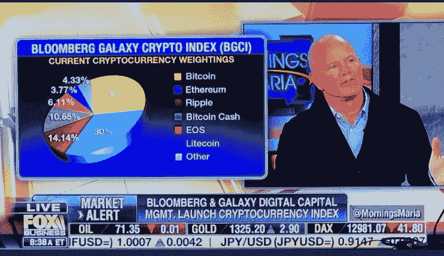

Novogratz publicly presenting BGCI crypto index the day after Fluidity

Galaxy Digital 的 Mike Novogratz 介绍了他对货币革命现状的看法，但首先介绍了彭博银河加密指数(BGCI)，这是一个由银河和彭博创建的基准指数，用于跟踪按市值加权的十大美元交易加密货币。跟踪更广泛市场表现的透明基准指数对于提高加密市场的流动性和参与率至关重要。作为证据，Novogratz 引用了标准普尔 500 指数(1957 年)、雷曼综合债券指数(1986 年)和高盛商品指数(1991 年)作为有效股票、公司债券和商品市场形成的重要里程碑。到目前为止，加密货币运动是一场“人民革命”，大部分交易量来自零售消费者。诺沃格拉茨问道:是什么吓退了机构投资者，让他们不敢涉水？**流动性、托管和对监管的恐惧**。

诺沃格拉茨认为，因为监管机构的工作是保护消费者利益，而消费者已经参与了这场游戏，监管机构必须并且*将*迅速赶上。此外，没有哪个政府会让自己对货币的垄断消失。我们可以从历史中看到，监管者经常与机构资金并肩跳舞，这意味着随着数字资产监管的实现，机构资金将开始涓涓细流，然后涌入。兴奋起来。

Novogratz wrote his presentation notes on a paper plate

Novogratz 最后为加密投资者提出了一些实用的建议，分为三大支柱:(1)计算机科学，(2)加密经济学，以及(3)机构采用。

1.  作为一名金融家和风险承担专家，诺沃格拉茨承认他不知道区块链技术实际上是如何工作的，但他重申“可扩展性的技术问题将会得到解决”。分散化、安全性和可伸缩性的[可伸缩性三难困境](https://github.com/ethereum/wiki/wiki/Sharding-FAQ)将通过不同设计的区块链的组合来解决，市场将用他们的钱来投票。投资者必须“大胆相信”可扩展性问题将会得到解决。
2.  **Cryptoeconomics** :投资者有个人责任去识别合适的消费代币。分散式分类账背后的区块链技术是卓越的，但 Satoshi 真正的天才是使用代币来建立一个网络，这个网络保护了自己并奇迹般地保持了活力。正确设计的令牌在功能上是访问网络资源所必需的，它们的价值随着网络的增长而增长，并且它们最终会吸引消费者为网络的增长做出贡献。
3.  **机构采用**:诺沃格拉茨强调，金融领域的“老巨人”(如投资银行、机构资产管理公司和中央交易所)并没有沉睡。事实上，“他们来的很快”，他预测他们将在未来 3-9 个月内进入。阻止机构参与者达到临界点的障碍是监管解决方案和监管。关于托管，尽管我们可能信任 Ledger 和 Xapo 等加密钱包解决方案，但具有讽刺意味的是，机构参与者需要更大的品牌(如 BNY 梅隆、JP 摩根、巴克莱等。)在他们跳进去之前先把抚养权拿下来。此外，诺沃格拉茨观察到，这些“老巨人”实际上在区块链技术方面非常流利。例如，他说约翰·克莱恩(德意志银行前首席执行官)“比我更了解区块链！”

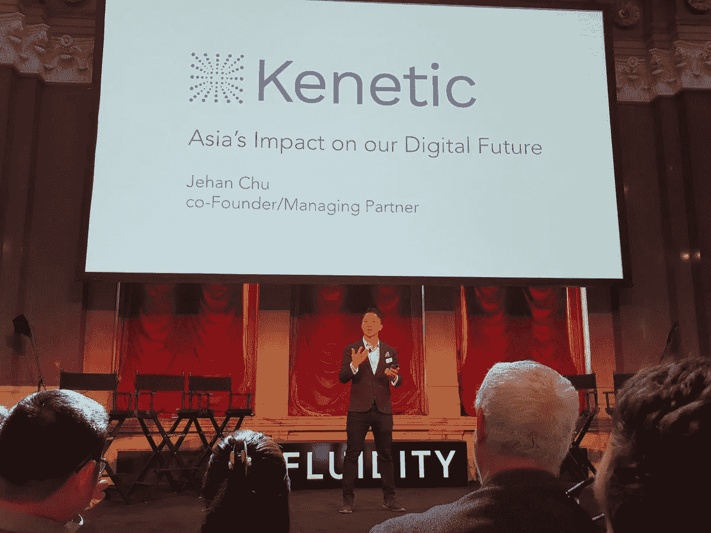

接下来，Kenetic Capita 的 Jehan Chu 强调了亚洲在去中心化未来的重要性。大多数观众来自美国，也有一小部分人去年去过亚洲出差(朱棣文让我们举起手来进行民意测验)。朱棣文看好亚洲的分散化项目，因为亚洲有着友好的监管环境和社区，以大型聚会为特征。与传统产品不同，加密经济协议是需要大规模采用的网络，并受到大型网络效应的保护，因此社区就是一切。这就是为什么市值最高的 20 种硬币中有 10 种是亚洲产品。朱棣文敦促我们大家亲自去亚洲不同的地区，了解他们的文化和经济机会。

# **解决流动性问题**

DEX representatives panel

Cryptotwitter 名人和 AirSwap 顾问 Crypto Bobby(据称他的真名是“Rob Paone”)主持了一场关于可访问性和去中心化交换的辩论。Alex Wearn (IDEX)、Stefan George(灵知)、Thomas France (Ledger)和 Dan Mosites (AirSwap)讨论了为非技术人员创建平易近人的用户体验以交换数字资产的必要性。这个小组的有趣之处在于，每个 DEX 项目都采用了不同的方法来开发 exchange 生态系统。IDEX 是一个离线订单簿/在线结算交易所， [Gnosis](https://blog.gnosis.pm/building-a-decentralized-exchange-in-ethereum-eea4e7452d6e) 正试图建立一个完全在线的交易所，以支持其预测市场，AirSwap 已经建立了一个在线点对点结算层，外包价格谈判。更多关于分散交易分类的信息，请阅读[这篇](/@mansiprakash/ecosystem-of-decentralized-exchanges-88ba89f10d64)。为了给分散的交易所带来流动性，这些项目旨在改善产品设计、做市商的功能、结构良好的 API 以及与托管解决方案的合作关系。

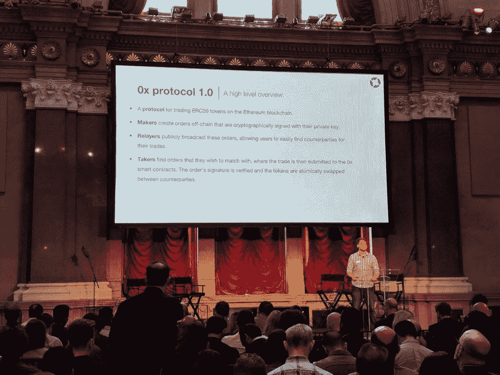

0x Protocol: Tokenize Everything

0x 的 Amir Bandeali 展示了在分散式交换机下工作一层的潜力:0x 是一个开放的协议，它使任何人都能够在其上构建中继或分散式交换机。超过 10 家中继站的 0x 交易量(每天约 900 万美元，总计约 1.6 亿美元和 90，000 笔交易)之大令人震惊。

简而言之，0x 和 AirSwap 的区别在于，0x 依赖于链外订单簿来匹配出价和要价订单，而 AirSwap 智能合约有助于发现交易对手，并离线进行出口价格谈判。在这两种情况下，订单都在链上结算。这种差异的最初含义是，0x 将吸引价格发现不是瓶颈的更具流动性的资产的交换。相反，AirSwap 在执行速度方面的不足将通过做市商和接受者的零交易费来弥补(0x relayers 可能会提取交易费，而 AirSwap 做市商需要有效锁定 AST 令牌作为会员资格的证明)。寻找更大的大宗交易，以利用 AirSwap 的暗池功能(在交易对手匹配之前，交易规模是隐藏的)。AirSwap 将自己定位为数字货币经济的首要[场外](https://en.wikipedia.org/wiki/Over-the-counter_(finance))交易所。

展望未来，Amir 看到了通过 ERC-721 交换不可替代代币以及添加可加强 KYC/反洗钱证券监管合规性的功能的巨大潜力。0x 提出的一个解决方案被称为“许可流动性池”，在交换之前，资产基本上根据白名单进行检查。关于这方面的更多信息，请阅读 [0x 博客](https://blog.0xproject.com/compliant-peer-to-peer-trading-4dab8e5c3162)。

所有人都在甲板上是分权下放的战斗口号，我喜欢 AirSwap 团队邀请他们的直接 DEX 竞争对手分享舞台。

# **可扩展性解决方案**

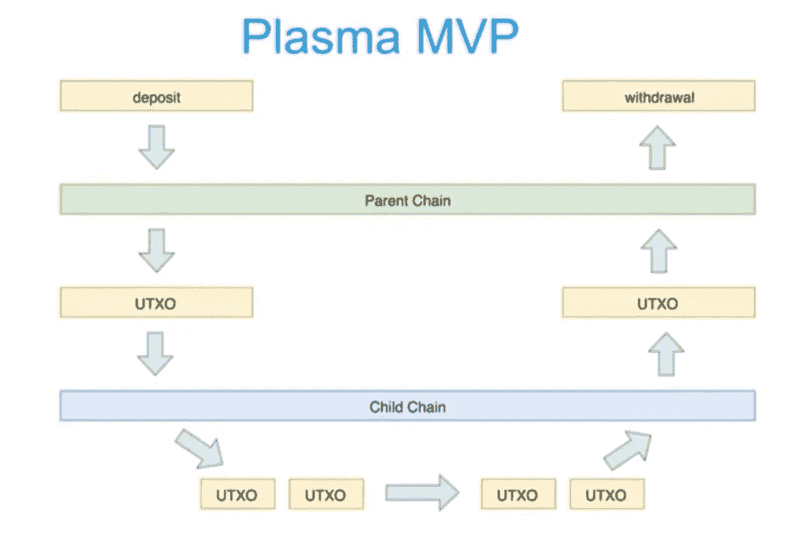

The Plasma root chain/child chain model

奥米赛哥的大卫·克诺特描述了通过等离子体对以太坊进行缩放的最新研究。(顺便提一下，克诺特穿着一件独角兽衬衫，他的言谈举止、幽默感，甚至抑扬顿挫都与维塔利克惊人地相似。)克诺特承认，以太坊的一个主要限制是它的易用性，特别是它的低吞吐量:用户将选择使用像 VISA 和 PayPal 这样的高速集中支付网络，直到可扩展性得到解决。幸运的是，他正在研究等离子体。等离子体包括将区块链分成两种具有不同共识机制的网络:子链和根链。根链可以是任何区块链，但他用以太坊作为例子。大多数事务可以在私有或“链外”子链上处理，只有少量的承诺被“链上”发布到根链。受损的子链总是可以恢复到先前的根链状态，并且子链本身可以是自我实施安全性的令牌生态系统。关于等离子体的最新研究正在解决所有子链对根链的承诺都必须确认的问题，这影响了用户体验。

David Knott, a Vitalik disciple

克诺特简要地提到了“资产检查点”的概念，作为根链定期确认子链状态的一种方式。不是在使用结束时确认整个子链，根链只需要确认自最后一个检查点以来的改变历史。从克诺特极具娱乐性的演讲中可以看出，正如 Novogratz 预测的那样，可伸缩性肯定会得到解决，但更高性能的代价是引入了私有的、不太安全的子链，这会损害纯粹的去中心化。

在上午的最后一场演讲中，Hashgraph 的 Tom Trowbridge 提出了一种可伸缩分布式分类账的替代方案。Hashgraph 与 Plasma 不同，它不是对区块链技术核心特性的编辑。取而代之的是，Hashgraph 被重新设计成一个分布式的分类帐。Hashgraph 是一种替代区块链的基本层一致性算法，其核心结构是一个有向无环图，其中每个节点运行一个 gossip 协议。节点互相八卦分享信息，八卦八卦。Hashgraph 声称可以实施异步拜占庭容错(意味着它以分散的方式达到一致的状态)，并防御分布式拒绝服务攻击。此外，它声称在设计上比区块链更快，后者强调去中心化和安全性，被设计得很慢。我对 Hashgraph 有所怀疑，因为它的治理似乎是集中的(依赖于一个由 39 名成员组成的委员会，委员会的三分之一每年轮换一次)，但它提醒我们，区块链并不是唯一创建分布式、去中心化账本的技术。关于 Hashgraph 的更多信息，请阅读白皮书的详细评论。

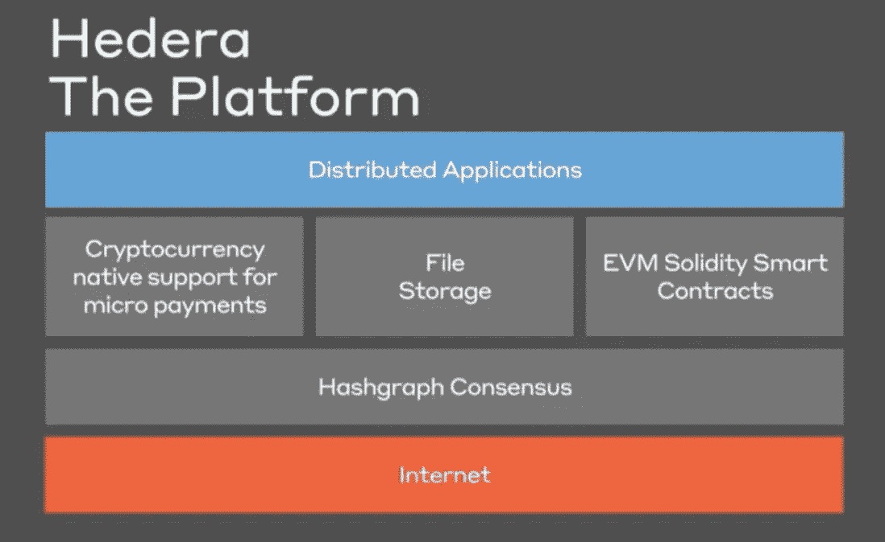

Hashgraph is a blockchain alternative

# **分权金融的法律前景**

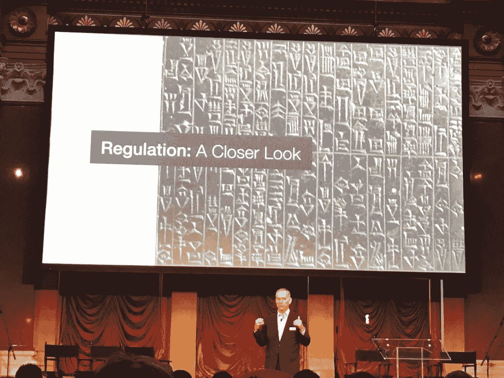

From Cuneiform to Solidity

前美国外交官、AirSwap 的另一位顾问、总领事福特·哈特(Ford Hart)为区块链对话的法律前景搭建了舞台。首先也是最重要的一点是，哈特宣称“不管有没有我们，对(数字资产)的监管都会发生”，从而打破了所有的梦想。回顾历史，最古老的语言形式主要是为了处理贸易和会计，需要监管来为消费者创造公平的竞争环境和可预测性(即，没有内幕交易、抢先交易或销售不符合承诺的代币)。“这个房间里没有人生活在‘正常时代’；每个人都生活在一个‘翻天覆地变化’的时代，而变化的速度本身也在加快。”最终，区块链项目将面临 web 2.0 巨头最近面临的同样的监管审查，建议我们从一开始就与监管机构合作。

紧随哈特之后的是一个主要由律师和法律专家组成的小组，还有另一位 cryptotwitter 名人 Ryan Selkis，他正在 Messari 为加密项目开发一个开源研究库。该小组的一些重要见解:

*   **代币！=安全:**如果一个设计良好的令牌具有可消费的、实用的访问网络资源的功能，那么它就不是安全的。这些消费代币是“产品”。另一方面，如果你是通过数字代币筹资，那么你就不能神奇地免受证券法的约束。SEC 没有关闭所有加密项目的唯一原因是，它认识到存在一些合法的消费者令牌。销售受安全法约束的云存储毫无意义。
*   **美国可以成为区块链监管的领导者:**所有的眼睛都盯着证交会:随着证交会的发展，其他监管机构也在发展。美国向世界证明了受监管的去中心化治理可以非常有效，如果美国不领导走向受监管的去中心化数字经济的运动，那将是一种耻辱。
*   监管者不是敌人:普通监管者比普通银行家更了解区块链，但监管是一项吃力不讨好的任务，没有好处，有很多坏处。事实上，我们应该对美国监管机构印象深刻:他们正以最快的速度监管一个极其复杂的领域。深谙平台的技术专家需要与仅仅寻求理解的监管者友好相处。
*   **倒计时已经开始:**在 2008 年金融危机或脸书数据隐私史诗般的可怕事件发生之前，我们有一个独特的机会进行自我监管，但我们需要正确的监管……而且要快
*   教育就是一切。证券法旨在保护消费者，而非中介机构，并要求消费者拥有做出客观投资决策所需的所有信息。

随着 web 3.0 的出现，我们应该对监管感到乐观，但我们也应该保持谦逊，并为颠簸的旅程做好准备。

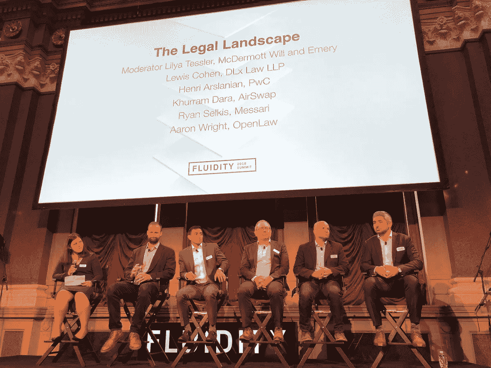

Bill Tai 巧妙地总结了法律讨论，指出民主/分散网络只有在公民/端点知情的情况下才能发挥作用。这是安全法的基础，而且直觉上是有意义的，因为令牌激励的生态系统的构建假设自利行为者对激励做出理性反应。如果没有关于代币的透明信息，行为者将做出非理性和不可预测的反应，这对社会是危险的。

继续消费者教育的主题，Pat Berarducci 和 Aaron Wright (OpenLaw)介绍了 [Brooklyn Projec](http://thebkp.com/) t 并宣布了其消费者令牌框架草案。布鲁克林项目是一个令人兴奋的计划，旨在创建一个令牌分类体系(即支付/货币令牌、消费令牌和投资令牌)，每个令牌都应受到适当的监管。此外，布鲁克林项目的消费者令牌框架试图在消费者保护和透明度方面建立一个标准，并计划设计工具来强制遵守该框架。这个领域最好的部分是分散的项目本质上是合作的:Brooklyn 项目表示，它打算使用[令牌管理的注册表](/@ilovebagels/token-curated-registries-1-0-61a232f8dac7) cryptoeconomic 原语将符合其框架的项目列入白名单。

> [Brooklyn 项目的消费令牌框架草案](https://docs.google.com/document/d/1DkAN3p7t0qefUOnvIkKS3PxgU6tCYEmCYxv2wBAeLng/mobilebasic)

# **历史非流动性资产的标记化**

Genesis Blockchain 的 Lee Schneider 主持了一个由项目代表组成的小组，这些项目致力于将传统金融证券标记为具有替代交易系统(ATS)的注册经纪交易商:(Templum，Satis Group)。与会的还有来自纪录片《摇摆杀手 t 恤》(Satoshi 是女性)的 Samantha Radocchia，她正致力于利用区块链为智能供应链解决方案提供动力。这个小组看好黄金、艺术品和房地产等历史上缺乏流动性的资产的符号化:想象一下，如果你可以拥有一幅毕加索画作的流动份额！

*   真实世界的符号化会导致物物交换经济的重现吗？
*   分散式分类帐的一个核心特性是不变性，但这也是潜在的问题。当身份可以存储在链上时，隐私成为一个问题。我的身份有流动性吗？(注:关于奴隶制影响的可怕想法)。如果我不想让我的年龄成为公共知识，但我需要证明我至少 X 岁才能点一杯饮料怎么办？(零知识证明在这里可能是一个潜在的解决方案)。

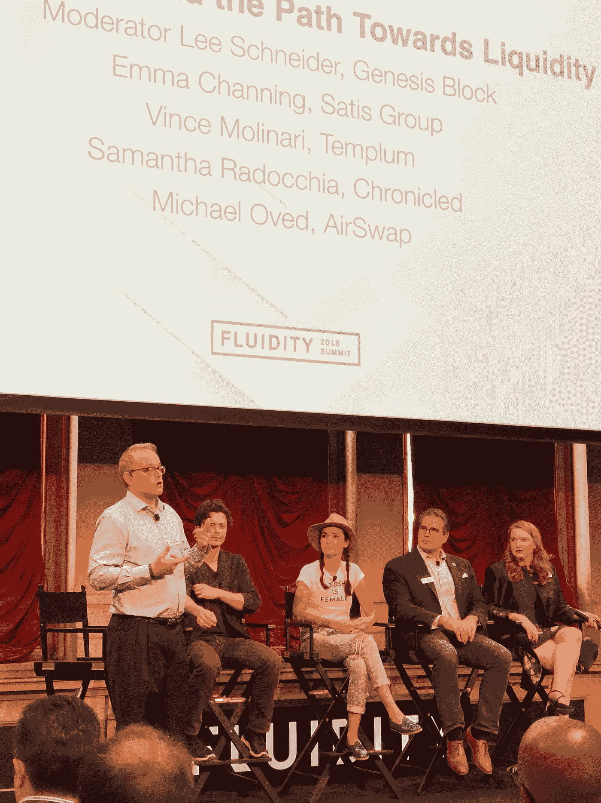

发人深省的观点:如果你违反了安全法，那么你就得去坐牢。我们必须认真对待监管。

# **流动性的诞生**

最后，AirSwap 的 Don Mosites 回答了为什么我们都聚集在一个地方:流动性的引入。流动性将是一个全栈数字投资银行，将处理数字资产的来源/发起、构建、推出/销售和二级市场交易。每个阶段将由一个特定的团队领导:

*   采购:[迪克森咨询公司](https://www.dixonadvisoryusa.com/)(一家总部位于纽约的房地产投资信托公司)
*   结构化:[创世街区](https://genesisblockchain.io/)(一家区块链咨询顾问公司)
*   发布:[代币铸造](https://tokenfoundry.com/)(一个专注于合法消费者代币发行的 ConsenSys 网状团队)
*   交易:AirSwap(展会的明星:一个 P2P 分散式交易所)

由于 AirSwap 是一个 P2P DEX，它需要开发人员在其上构建 relayer 解决方案。因此，它宣布了一个面向 AirSwap 开发者的交易 API 和小部件 API(以及一个电报组:t.me/airswapdevs)。

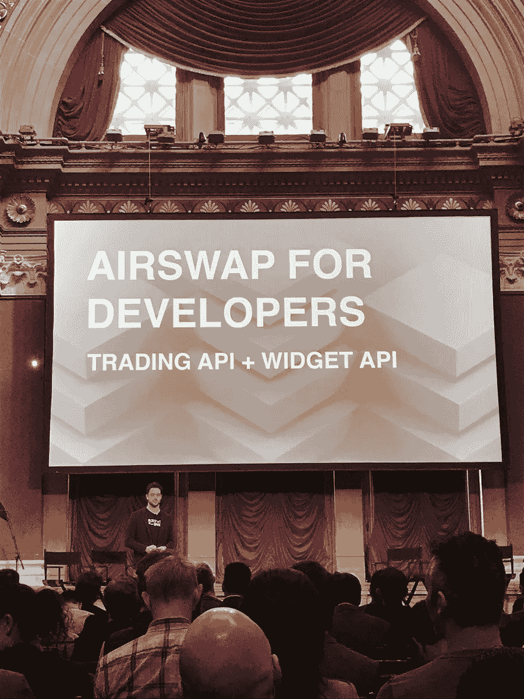

AirSwap: calling all developers!

对 AirSwap 的押注含蓄地承认，商业是社区、社会和经济的社会可扩展性的基础。我们正处于一场变革的最前沿，在这场变革中，每一项资产都可以用数字来表示——就像信息是由谷歌组织的，人是由脸书在网络中用数字来表示的一样。当所有资产通过商业层“数字化和互联”时，将会产生大量价值，Airswap 拥有合适的团队和方法来帮助定义这一类别。

# **辩论时间:鲁宾 vs 鲁比尼**

当晚的高潮是乔·卢宾(以太坊的联合创始人和 ConsenSys 的首席执行官)和努里埃尔·鲁比尼(宏观经济学家，曾著名地预测了 2007—2008 年的房地产泡沫崩溃，也是加密货币的著名评论家)之间引人入胜、发人深省的辩论。这场辩论充满活力，相对友好，鲁比尼向满是密码爱好者的听众提出了许多合理的反驳。

> “今天很高兴来到这里，这里的每个人都像我一样，是一个密码怀疑论者。”——鲁比尼

(3:09) Lubin versus Roubini

鲁比尼承认，一场对金融系统的重大颠覆即将到来，但机器学习、数据科学和 IOT 将彻底改变支付、保险和资产管理。因此，他的假设是加密货币和区块链技术对这场革命来说不是必要的。

争论的核心围绕着金融革命是否需要权力下放。Lubin 认为，区块链是下一代数据库技术，可以协调自利的经济行为体的行动，而不依赖于中央集权。因此，区块链技术将实现自我主权身份和货币，这些问题是当今“破碎”的互联网无法解决的，卢宾认为这一定是金融革命的特征。

鲁比尼质疑去中心化的核心原则，指出风险中心化已经有机地出现在采矿、交易所、开发商和加密货币财富中。Lubin 承认完全去中心化是一种夸张的说法，但是向利益相关者共识机制的过渡将会补救我们今天看到的混乱的权力集中。此外，采矿集中化不一定是一个错误:适度的矿工集中化通过增加网络的整体哈希码来增强网络安全性，使外部攻击更加昂贵。作为最后一招，网络开发人员可以更改 POW 哈希函数，从本质上消除最有效的 ASIC 挖掘器。

Lubin 观察到，股权证明降低了矿工的准入门槛，并且最终可以获得分叉开源网络的能力。关于集中交流，Lubin 补充说分散交流(这是这次会议存在的理由！)最终会主导市场份额。

接下来，鲁比尼指出，没有一种加密货币是可靠的记账单位、交易媒介或价值储存手段。虽然这些观点目前是正确的，但比特币有潜力发展成为历史上最伟大的健全货币技术，因为它是可验证的、耐用的、可替代的，比黄金更容易携带和分割，比法定货币更稀缺和抗审查。比特币最重要的特点是，它的价值不会因供应量增加而被无形地侵蚀，这对任何价值储存手段来说都是一种诱惑。根据设计，如果你今天拥有 BTC 网络 1%的股份，那么 20 年后你将拥有网络的 1%。此外，一枚比特币被认为有价值的时间越长，它在未来就越有可能有价值。随着比特币让人们相信其储存价值的能力，它将被更热切地接受为一种交易媒介。要实现这一点，它作为交易媒介的机会成本必须稳定下来——这可能需要一段时间，因为比特币不断增长的购买力是其价值储存质量的关键。与此同时，另一种为价格稳定而设计的加密货币可能会发挥交换媒介的作用。进一步阅读加密货币理论作为健全货币的创新[在此](/@vijayboyapati/the-bullish-case-for-bitcoin-6ecc8bdecc1)和[在此](https://hackernoon.com/the-many-faces-of-bitcoin-1c298570d191)(引自[塞弗迪安·阿摩斯的比特币标准](https://www.amazon.com/Bitcoin-Standard-Decentralized-Alternative-Central/dp/1119473861))

Roubini 问什么时候能证明利害关系(答案是:很快)，批评可扩展性(第 2 层解决方案也即将推出，将增强交换媒介的生存能力)，并声称大多数 ICO 都是几乎不加掩饰的筹款骗局(公平点，Token Foundry 等公司正试图将适当的消费者令牌生态系统列入白名单)。最重要的是，他认为“把一切都象征化”的努力将使低效的“物物交换的石器时代”重新焕发活力。这是 web 3.0 项目不可避免要面对的合理问题。我欣赏鲁比尼有勇气在我们的空间里大声说出一些伪善，我真希望鲁宾能更透明地回应区块链推动的革命可能会出什么问题。

**总结想法和收获**

流动性参与者获得了免费的钱包，这引起了幽默的困惑，因为每个人都很兴奋地收到免费的账簿和 AirSwap 恤:

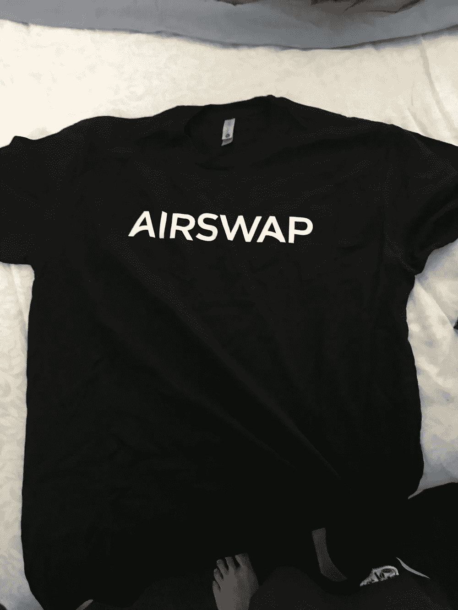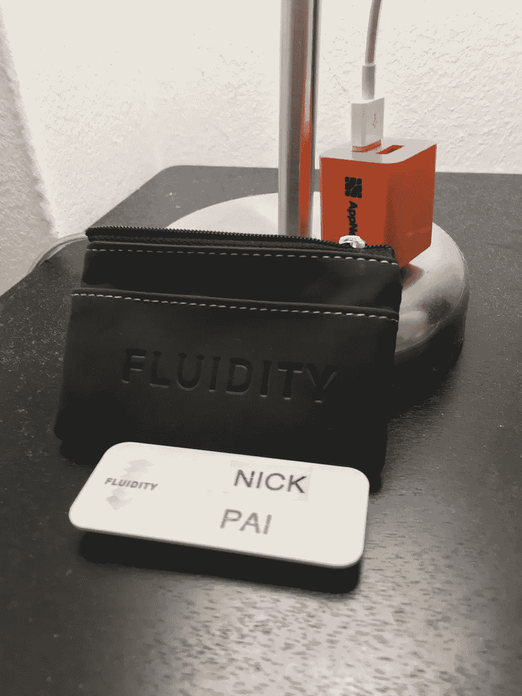

I wish they gave out “Satoshi is Female” shirts instead

与会者的多样性令人震惊，这次会议展示了纽约的力量，将精心打扮的银行家和交易员、艺术家、设计师和戴头巾的技术专家聚集在一起。一些与会者自 2009 年以来一直是密码信徒，我发现至少有一名与会者在谷歌上搜索“ICO 和 IPO 的区别”。

不出所料，这次活动的主题是，区块链技术刚刚起步，要实现真正的去中心化革命，我们还有很长的路要走。巨大的障碍包括可用性(托管、流动性、应用程序 UI)和与监管机构的合作，这阻止了“普通人”和机构参与者加入竞争。但是不要搞错，未来将是分散的。

我们需要对饮用自己的“kool-aid”保持谦逊和自我意识，因此我赞扬 Fluidity 团队汇集了一个全面的演讲者和与会者阵容。在这样一个新的舞台上，我们大多数人一无所知，也没有人知道在更大范围内会发生什么问题。

