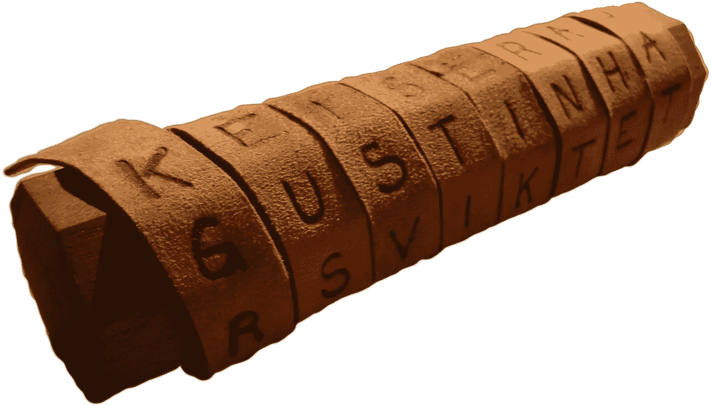

# 一条丝带，一条密码信息和一个圆筒——长柄大镰刀

> 原文：<https://medium.com/coinmonks/a-ribbon-a-cipher-message-and-a-cylinder-scytale-c270f11cff0b?source=collection_archive---------1----------------------->

[https://upload.wikimedia.org/wikipedia/commons/5/51/Skytale.png](https://upload.wikimedia.org/wikipedia/commons/5/51/Skytale.png)

我喜欢密码，Scytale 密码是最古老的密码之一。在古代，密码通常用于爱情和战争，两个人可以传递秘密信息，而其他人不知道其内容。例如，苏格兰的玛丽女王使用许多密码与她信任的实体进行通信: