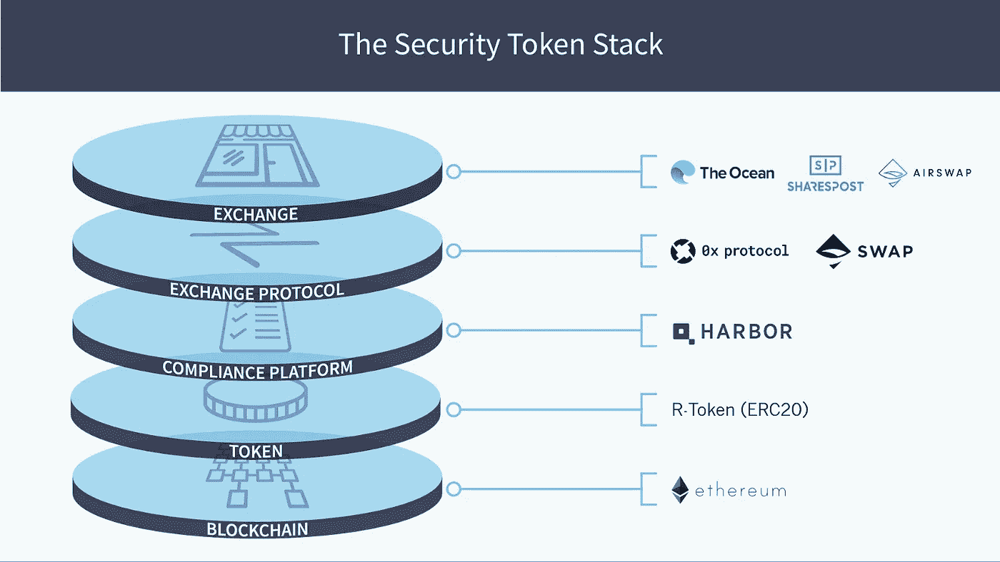
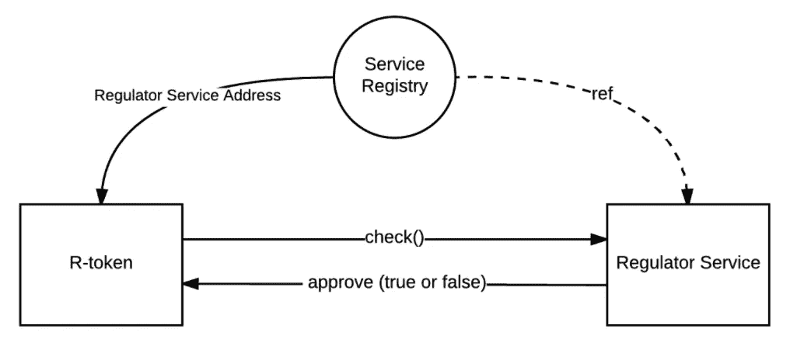

# 一种安全令牌——Harbor 的 R 令牌

> 原文：<https://medium.com/coinmonks/a-security-token-harbors-r-token-c147ba9557b4?source=collection_archive---------0----------------------->

在本文中，我们将研究 Harbor 的安全令牌实现，R-Token。我们将看看他们产品的高层架构，然后深入一些代码，以了解底层实现的具体细节。

## 三万英尺

Harbor 有一个很棒的信息图，它有助于划分从交换到链的安全令牌的责任区域。

Credit — Harbor

*   **Exchange** —这不在本文讨论范围之内，但是 Harbor 需要将参与其 R-Token 生态系统的每个 Exchange 列入白名单。
*   **协议**——不在范围内，但我确实希望 Harbor 包括像 0x 和 Airswap 这样的流动性提供商。这是一种前瞻性思维，对他们的客户来说是一种好处，可以让他们的投资避免陷入流动性孤岛。
*   **合规** —这是 Harbor 价值主张的核心，值得注意的是他们如何将合规逻辑与令牌本身分离开来。至少可以说，安全令牌行业正准备进行监管改革，因此这是一个非常好的主意。在本文的后面，我们将看看他们是如何在技术上实现这一点的。
*   **令牌** — Harbor 拥有他们的 R-令牌，这是一种自定义的 ERC-20 令牌，支持他们的合规协议。它们覆盖了几个将成功/失败推迟到它们的法规遵从性服务的事务性方法。即。如果用户
*   **区块链** — Harbor 希望成为区块链不可知论者，这很有趣。安全令牌的价值不是来自于它所部署的链，而是来自于它的底层资产。虽然区块链是不可改变的，但这并不意味着它会永远保持下去，更好的链会出现。Harbor 的愿景是允许客户将令牌迁移到不同的链，这在我看来是该平台的另一个优势。

## 再深一点

Harbor 的核心是一个协议或协议层，它提供了遵从性的“要求”,正如他们的首席技术官和联合创始人 Bob Remeika 在本文中所引用的那样。

> 我们将这些要求概括为符合性的*谁*、*什么*和*哪里*:
> 
> ***谁是*** 买方和卖方
> 
> ***什么是*** 贸易
> 
> *交易发生在哪里*

*Harbor 使用“谁、什么、为什么”输入来批准或拒绝请求的交易。这个逻辑包含在一个链外解决方案中，由 Harbor 自己集中和维护。请务必注意这一区别以及潜在的明显原因，即美国的安全令牌受 SEC 监管。也就是说，R-token 被锁定在海港平台上，如果您决定离开海港生态系统，您需要重新发行新的 token。这是新兴的 EIP-1400 标准希望解决的部分问题，因为这些令牌及其底层合规功能将有一个开放的标准。*

*我真的很希望看到 R-Token 成为符合 EIP-1400 提案，如果它曾经看到了白天。在这一点上，Harbor 在提供合规性逻辑的同时，允许代币客户来来去去，这仍然是一项了不起的业务。*

*如果你读了我的文章[一个安全令牌-透露](/coinmonks/a-security-token-revealed-5da9de3345bb)，有一些安全令牌的其他属性，我们也应该回顾一下 Harbor 的处理*

*   *持有期——我假设 Harbor 的中央 oracle 正在从代币本身混淆这一点，并且正在管理投资者持有的代币“份额”,并在适当的时候释放它们。*
*   *股息——基于所有权上限表的股息支付更像是一个链外功能，但如果 Harbor 处理或允许第三方提供相关信息，我会很感兴趣。我看到有人提到了用于投资组合管理和税务服务的 Lumina，但现在还不清楚它是否已经集成。*
*   *文档/托管—这是一个大问题，我很高兴听到 Harbor 提到 [Bitgo](https://www.bitgo.com/) 作为托管解决方案，但我不清楚通过 Harbor 平台部署令牌的客户是否可以访问这些服务。除了令牌的保管之外，底层的安全文档应该存储在某个地方，作为另一种形式的所有权证明。我假设 Harbor 充当了此类服务的中介，以便于证明基础资产的所有权。像 EIP-1400 引用的那样，有一种将文档与 onchain 令牌链接起来的方法是很好的，但是我在 R-Token 实现中没有看到这种方法。*

## *具体细节*

*Harbor 的*受管制令牌*或 *R-Token* 在其 github 库[自述文件](https://github.com/harborhq/r-token/blob/master/README.md)中有很好的记录，如果您有任何进一步的问题，我建议您浏览一下。*

*Harbor 设计的根本是将合规逻辑与 R-Token 功能分离。这是通过部署三个独立的契约来提供间接层来实现的。*

*   *监管机构服务—该智能合约与链外合规 oracle 接口，以获得交易的最终发言权。*
*   *服务注册中心—此智能合同包含对监管机构服务的可更新引用。这允许我们在合规逻辑发生变化时部署新的监管机构服务，并更新其在本合同中的引用。*
*   *R-Token —此令牌智能合约包含对服务注册中心的不可变引用，该注册中心通过允许监管者服务可更新而面向未来。*

**

*[https://github.com/harborhq/r-token](https://github.com/harborhq/r-token)*

*总的流程是*

*   *用户尝试将令牌转移到特定地址(用户或合同)*
*   *R-Token 通过给定的地址检索对服务注册契约的引用，并请求调节器服务。*
*   *服务注册中心返回注册到它的 Regulator 服务，RToken 通过其覆盖的传输方法运行符合性检查。*
*   *如果监管机构允许转让，那么交易应该很快就会出现在交易链上*
*   *如果传输被调节器服务拒绝，调节器服务应该返回某种类型的状态，指出原因。*
*   *如果拒绝的原因已被纠正，则必须再次执行转移。我不相信有任何默认的“重试”逻辑，所以如果你需要，这将内置到你的应用程序中。*

## *调节器服务*

*RegulatorService 通常不会像这个示例所示的那样在链上具有其遵从性逻辑，但作为一个简单的示例来说，这是一个不错的例子。通常， *RegulatorService* 会查询一个 oracle。请注意， [TestRegulatorService.sol](https://github.com/harborhq/r-token/blob/master/contracts/TestRegulatorService.sol) 中的逻辑完全由交易量驱动。*

## *服务注册表*

*[*service registry . sol*](https://github.com/harborhq/r-token/blob/master/contracts/ServiceRegistry.sol)有一个构造函数，你可以在其中设置已部署的 *RegulatorService* 或者替换它，如下图所示。*

## *受管制令牌*

*[*regulated token . sol*](https://github.com/harborhq/r-token/blob/master/contracts/RegulatedToken.sol)有一个接受典型的 ERC-20 属性和 *ServiceRegistry* 地址的构造函数*

*它还重写了 transfer 和 transferFrom 方法来处理符合性检查*

*正如我之前说过的，Harbor 的 R-Token 在它的 github 知识库 [README](https://github.com/harborhq/r-token/blob/master/README.md) 中有很好的文档记录，它们比我在实际的开发者文档和相关的 truffle 项目中做得更好。这是下一步的必读书目。*

## *摘要*

*希望这篇文章能够提供丰富的信息，让您大致了解 Harbor 在 R-Token 和相关合规协议方面的尝试。作为安全令牌生态系统的领导者，我对这个项目的成功寄予厚望。似乎 Harbor 已经为他们的成功和不可避免的变化设计了他们的软件，这些变化将在不久的将来在这个领域传播开来。如果任何人对本文的内容有任何问题、澄清或错误/遗漏，请告诉我！*

**

> *[在您的收件箱中直接获得最佳软件交易](https://coincodecap.com/?utm_source=coinmonks)*

**