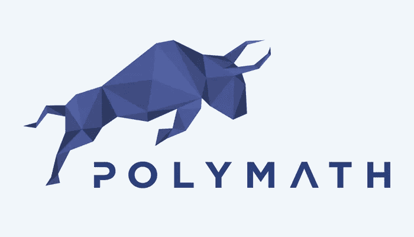

# 安全令牌——已披露

> 原文：<https://medium.com/coinmonks/a-security-token-revealed-5da9de3345bb?source=collection_archive---------3----------------------->

安全令牌所需关键功能的介绍和基本分析。这是系列文章的第一部分，我们将探讨安全令牌的概念、现状和未来。我们将留在以太坊生态系统中，因为它目前被大多数人采用。

Credit: [https://polymath.network/](https://polymath.network/)

## 介绍

鉴于*实用令牌*范式的崩溃，安全令牌应运而生。美国证券交易委员会和其他监管机构对“T4 代币销售”的融资模式提出了质疑，在这种模式下，数百万散户投资者可以投资区块链的项目。他们的主要问题是，购买的令牌不能用作实用令牌，因为在大多数情况下，平台尚未构建。这些代币实际上是投机性购买，希望它们的价值会随着时间的推移而上升。证券交易委员会试图通过禁止散户投资者投资其认为风险过高的产品来保护散户投资者——比如前面提到的公用事业代币。不管你是否同意这个前提，如果你住在美国，你必须遵守证券法——输入*安全令牌。*虽然安全令牌有多种表现形式，但它们都需要满足美国证券的监管要求。

## 属性

以下各项是任何平台上的安全令牌都应该能够支持的基本任务。

*   **持有期** —由证券法确定的一段时间，投资者必须在购买资产后，在通过转让或出售转移资产之前保留该资产。即。在购买 100 枚 *SECToken* 代币后，投资者需要持有购买的代币 9 个月。
*   **投资者认证** —由于散户投资者(也就是你和我)不能投资证券或代表证券的代币，所以证券代币需要能够验证购买者。合格投资者是一个术语，通常用来识别那些被允许购买美国证券的人。证交会对他们的认证是基于个人拥有多少钱，而不是基于他们对任何与投资或财务能力相关的事情的理解。美国证券交易委员会说，这保护了那些在不良投资中承受不起任何损失的人，但在我看来，这意味着富人越来越富。现在从我的肥皂箱里走下来。
*   **文档** —仅仅因为我们对区块链上的证券进行令牌化并不意味着我们不必遵守适当的保管协议。证券仍然需要披露、所有权、条款等的硬拷贝。我们应该能够提供这些文档的电子表示、数字签名或可以审计的任何其他安全方面。

**保管职能**

*   **发行资产** —证券需要能够向投资者发行所购买的代币，并保持资产分配的 cap 表的记账。
*   **重新发行资产** —在投资者丢失其私钥的情况下，证券将需要拥有燃烧和重新发行代币的选项。我们还需要能够在非法活动或法院命令的情况下冻结/扣押资产。
*   **股息** —大多数证券在持有证券令牌的同时，会在特定的时间间隔支付股息。我们需要一种方法来生成 cap 表，以便根据证券的总所有权来计算股息金额。
*   **结束** —万一证券的生命周期结束或被关闭，我们需要一种方法来关闭代币，并在出售后从基础资产中支付资金。一个安全令牌可能想要切换到另一个链或者完全脱离区块链，我们需要为这样的事件做好准备。

这些只是真实世界中安全令牌所需的一些特性。其中相当一部分可以通过标准的令牌函数来处理，比如`mint, transfer, burn, pause`、定制智能契约逻辑、oracles 等等。这里真正的希望是出现一个通用标准，并成为一种有效的采用方式。

## 初速电流状态

安全令牌本质上有助于区块链，因此大部分(如果不是全部的话)区块链在一定程度上可以支持安全令牌。以太坊、卡达诺、EOS、NEO 等。—这些都是有能力的，并且在平台上具有某种安全令牌的外观。然而，只有以太坊在投资的空间和产品中具有真正的吸引力。*证券化即服务*的最大产品如下:

**基于以太坊的安全令牌平台**

*   [博学者](https://polymath.network/)—ERC 安全令牌领域的领军人物。他们已经开发了一个`ST-20`令牌标准，但是他们的几个开发者也是开放安全令牌标准的 EIP(以太坊改进提案)规范的积极贡献者。这个标准的最新演变是 [ERC-1400](https://github.com/ethereum/EIPs/issues/1411) 。我们将在下一篇文章中详细讨论这个规范。
*   安全化——这个平台使用自己的 ERC 令牌，与自己创建的专有协议协同工作。
*   [Harbor](https://harbor.com/) —与上述平台类似，Harbor 使用自己的令牌`R-Token`以及 Harbor 维护的监管服务来批准和拒绝交易。

*注意:需要注意的是，对于安全令牌平台，除了标准的 ERC20 之外，没有标准化的令牌或共享接口。作为行业领导者，博学者应该为他们在*[*【ERC-1400*](https://github.com/ethereum/EIPs/issues/1411)*开放标准中为统一接口所做的工作而受到称赞。*

## 摘要

我希望你喜欢阅读这篇关于我对安全令牌市场的分析的文章。我们了解了安全令牌所需的关键属性和功能，一些当前的产品，并在我们的下一篇文章中给出了与 [ERC-1400 规范](https://github.com/ethereum/EIPs/issues/1411)相关的提示。请关注我，下一篇文章出来时我会告诉你的——谢谢！

> [直接在您的收件箱中获得最佳软件交易](https://coincodecap.com/?utm_source=coinmonks)

[**Click to read today’s top story**](http://bit.ly/2G71Sp7)